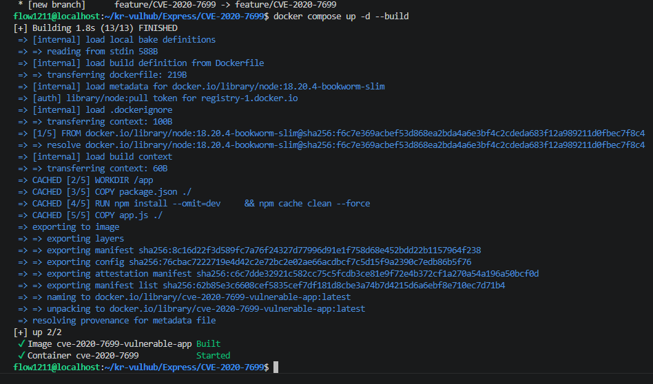
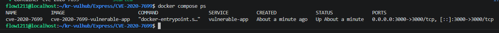
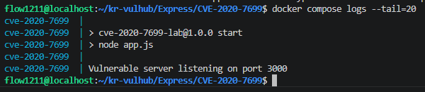
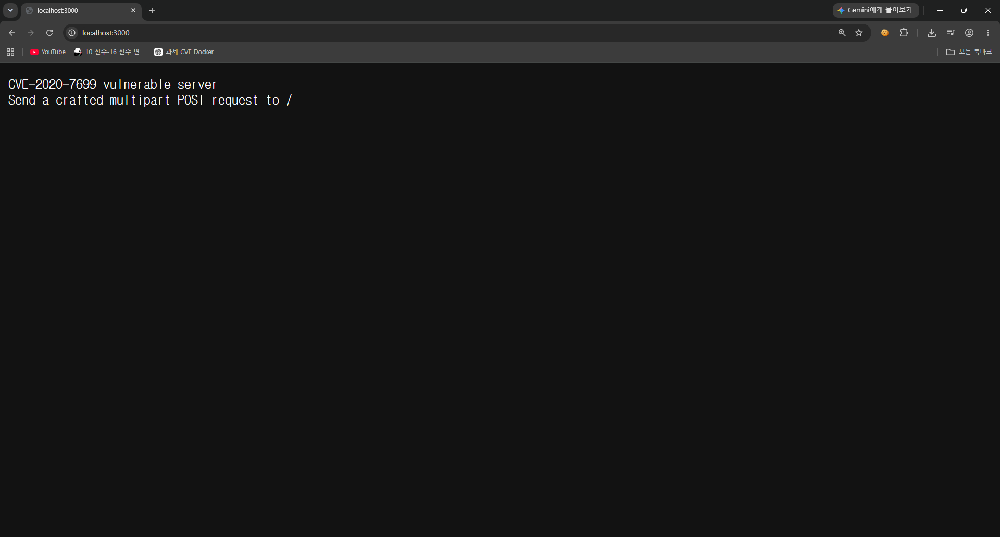
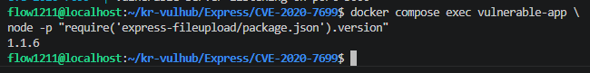
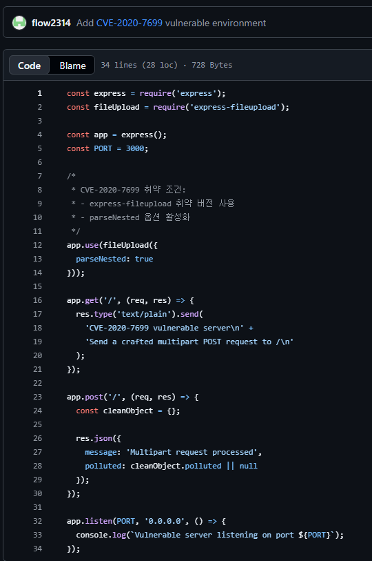
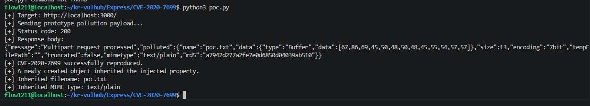
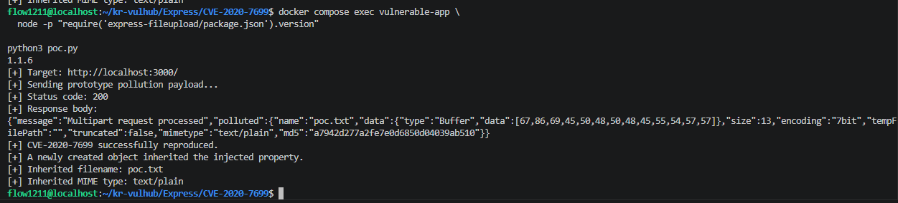

# CVE-2020-7699 - express-fileupload Prototype Pollution Vulnerability

> Docker Compose 환경에서 CVE-2020-7699 취약점을 재현하고 분석한 실습 보고서

---

# 목차

- 1. 취약점 요약
- 2. 취약점 개요
- 3. Prototype Pollution이란?
- 4. 취약점 발생 원인
- 5. 영향 범위
- 6. 실습 환경
- 7. 프로젝트 구조
- 8. Docker 환경 구성
- 9. 환경 구축
- 10. 취약 조건
- 11. 재현 절차
- 12. PoC 코드
- 13. 실행 결과
- 14. 대응 방안
- 15. Risk Score
- 16. 실습 후기
- 17. 참고문헌

---

# 1. 취약점 요약

## CVE 번호

```
CVE-2020-7699
```

---

## 취약한 라이브러리

```
express-fileupload
```

---

## 취약 버전

```
1.1.6 이하
```

---

## 수정 버전

```
1.1.7 이상
```

---

## 취약점 종류

```
Prototype Pollution
```

---

## 공격 난이도

낮음(Low)

---

## 공격 방식

HTTP POST 요청을 이용하여 multipart/form-data 형식으로
악성 객체를 전송한다.

---

## 영향

- 객체 오염
- 서비스 동작 변경
- 권한 우회 가능성
- 예기치 않은 속성 생성
- 애플리케이션 로직 변경

---

## CVE 설명

CVE-2020-7699는 Node.js의 express-fileupload 라이브러리에서
발생한 Prototype Pollution 취약점이다.

사용자가 업로드하는 multipart/form-data를
객체로 변환하는 과정에서

```
__proto__
constructor
prototype
```

등의 특수 키에 대한 검증이 이루어지지 않아
Object Prototype이 오염될 수 있다.

Prototype이 오염되면
애플리케이션 전체 객체에 새로운 속성이 추가되거나
기존 속성이 변경될 수 있다.

이는 서비스 로직 변경,
권한 우회,
보안 우회 등으로 이어질 수 있다.

---

# 2. 취약점 개요

Prototype Pollution은

JavaScript의 Prototype Chain을 악용하는 공격이다.

JavaScript에서는

모든 객체가 Prototype을 상속받는다.

예를 들어

```javascript
const user = {};
```

를 생성하면

user는 Object.prototype을 상속받는다.

따라서

```javascript
user.toString()
```

과 같은 메서드를 사용할 수 있다.

이러한 특징 때문에

Prototype이 오염되면

새로운 객체도 모두 영향을 받는다.

예시

```javascript
Object.prototype.isAdmin = true;
```

이후

```javascript
const user = {};
```

를 생성하면

```javascript
user.isAdmin
```

의 결과는

```
true
```

가 된다.

즉,

객체를 생성하지 않았음에도

Prototype을 통해 값을 상속받는다.

이러한 특성이 공격에 이용된다.

---

# 3. Prototype Pollution이란?

Prototype Pollution은

공격자가 Prototype 객체에
임의의 속성을 추가하는 공격이다.

대표적인 공격 키는

```
__proto__
```

```
constructor
```

```
prototype
```

이다.

예를 들어

```javascript
{
 "__proto__": {
   "admin": true
 }
}
```

와 같은 데이터를

검증 없이 병합하면

Object.prototype.admin

속성이 생성된다.

결과적으로

```javascript
const a = {};
const b = {};
```

두 객체 모두

```javascript
a.admin
```

```
b.admin
```

의 값이

```
true
```

가 된다.

---

## Prototype Chain

Prototype Chain은

객체가 자신에게 없는 속성을

Prototype에서 찾는 구조이다.

예를 들어

```javascript
const obj = {};
```

obj에는

name이라는 속성이 없다.

하지만

```javascript
obj.toString()
```

은 정상적으로 동작한다.

이는

Object.prototype에

toString이 존재하기 때문이다.

검색 순서는

```
obj

↓

Object.prototype

↓

null
```

이다.

Prototype Pollution은

중간에 존재하는

Object.prototype을

오염시키는 공격이다.

---

# 4. 취약점 발생 원인

express-fileupload는

multipart/form-data를

JavaScript 객체로 변환한다.

문제는

객체를 병합하는 과정에서

특수 키를

필터링하지 않았다는 점이다.

예를 들어

```json
{
 "__proto__": {
   "polluted": "yes"
 }
}
```

를 전달하면

Object.prototype.polluted가

생성된다.

이후

모든 객체는

```javascript
{}.polluted
```

를 호출할 수 있다.

즉

객체 생성과 동시에

Prototype이 오염된다.

---

# 5. 영향 범위

취약한 버전

- express-fileupload 1.1.6
- express-fileupload 1.1.5
- express-fileupload 1.1.4
- express-fileupload 1.1.3
- express-fileupload 1.1.2
- express-fileupload 1.1.1
- express-fileupload 1.1.0

안전한 버전

- 1.1.7
- 최신 버전

---

# 공격자가 얻을 수 있는 효과

- Prototype 오염
- 객체 속성 변조
- 인증 우회 가능성
- 권한 우회 가능성
- 애플리케이션 오류 유발
- 예기치 않은 동작
- DoS 가능성

---

# 실습 목표

이번 실습에서는

Docker Compose 환경을 이용하여

취약한 express-fileupload 1.1.6 환경을 구축하였다.

이후

Python PoC를 이용하여

Prototype Pollution이 실제 발생하는지 확인하였다.

실습 목표는 다음과 같다.

- 취약 환경 구축
- Docker Compose 사용
- 취약 버전 확인
- 공격 코드 실행
- 취약점 재현 성공 확인
- 동작 원리 분석
- 대응 방법 확인

---

# 6. 실습 환경

| 항목 | 내용 |
|------|------|
| OS | Ubuntu 22.04 (Docker Host) |
| Docker | Docker Engine |
| Docker Compose | Compose v2 |
| Language | JavaScript |
| Runtime | Node.js |
| Framework | Express |
| Library | express-fileupload 1.1.6 |
| 공격 코드 | Python |
| 취약점 | CVE-2020-7699 |

---

# Docker Compose 환경

본 실습은 Docker Compose를 이용하였다.

Docker Compose를 사용하면

취약한 환경을

동일한 상태로

언제든지 다시 생성할 수 있다.

이는

보안 실습에서

매우 중요한 장점이다.

---

# 환경 구축 결과

프로젝트를 빌드한 후

다음과 같이

Docker Image가 생성되었다.

## Docker Build



---

Docker Container가

정상적으로 실행되는 것을 확인하였다.

## Docker Container



---

---

# 7. 프로젝트 구조

실습에 사용한 프로젝트의 디렉터리 구조는 다음과 같다.

```text
CVE-2020-7699/
│
├── docker-compose.yml
├── Dockerfile
├── package.json
├── package-lock.json
├── app.js
├── uploads/
│
├── poc.py
│
├── README.md
│
└── images/
    ├── build.png
    ├── docker-ps.png
    ├── logs.png
    ├── browser.png
    ├── version.png
    ├── appjs.png
    ├── poc-code.png
    └── poc-success.png
```

각 파일의 역할은 다음과 같다.

| 파일 | 설명 |
|-------|------|
| Dockerfile | 취약한 Node.js 환경 생성 |
| docker-compose.yml | 컨테이너 실행 |
| package.json | 의존성 관리 |
| app.js | Express 서버 |
| poc.py | 공격 코드 |
| README.md | 실습 보고서 |

---

# 8. 환경 구축

## 8.1 Docker Image 생성

먼저 프로젝트 디렉터리로 이동한다.

```bash
cd CVE-2020-7699
```

Docker Image를 생성한다.

```bash
docker compose build
```

빌드 과정에서는

- package.json 복사
- npm install
- express 설치
- express-fileupload 설치
- app.js 복사

순서대로 진행된다.

빌드가 완료되면 정상적으로 Image가 생성된다.

빌드 성공 화면은 아래와 같다.


---

## 8.2 Container 실행

이미지를 생성한 후

다음 명령어를 실행한다.

```bash
docker compose up -d
```

옵션 설명

| 옵션 | 의미 |
|------|------|
| up | 컨테이너 실행 |
| -d | 백그라운드 실행 |

정상적으로 실행되면

```text
Creating network...

Creating vulnerable-app...

Started vulnerable-app
```

와 같은 메시지가 출력된다.

---

## 8.3 실행 확인

현재 실행 중인 컨테이너를 확인한다.

```bash
docker ps
```

실행 결과

```text
CONTAINER ID

IMAGE

STATUS

PORTS
```

실습에서는

vulnerable-app 컨테이너가 정상적으로 실행되었다.

확인 화면


---

## 8.4 로그 확인

애플리케이션 로그를 확인한다.

```bash
docker compose logs
```

또는

```bash
docker compose logs vulnerable-app
```

정상적으로 실행되면

Node.js 서버가

포트 3000에서 대기 중이라는 메시지가 출력된다.

실습 로그



---

## 8.5 웹 접속

브라우저에서

```
http://localhost:3000
```

으로 접속한다.

정상적으로 접속되면

애플리케이션 화면이 출력된다.

실습 화면



---

# 9. 취약 조건

CVE-2020-7699가 발생하기 위해서는

다음 조건이 만족되어야 한다.

## 조건 1

express-fileupload가 설치되어 있어야 한다.

---

## 조건 2

취약 버전이어야 한다.

실습에서는

```
1.1.6
```

버전을 사용하였다.

---

## 조건 3

multipart/form-data를 처리해야 한다.

---

## 조건 4

사용자 입력을 객체로 병합해야 한다.

---

## 조건 5

__proto__에 대한 검증이 없어야 한다.

---

## 조건 6

constructor 키를 차단하지 않아야 한다.

---

## 조건 7

prototype 키를 차단하지 않아야 한다.

---

위 조건이 모두 만족되면

Prototype Pollution이 발생할 수 있다.

---

# 10. 취약 버전 확인

설치된 라이브러리 버전을 확인한다.

```bash
docker compose exec vulnerable-app \
node -p "require('express-fileupload/package.json').version"
```

실행 결과

```text
1.1.6
```

취약한 버전임을 확인하였다.

실행 화면



---

# 11. 애플리케이션 분석

실습에서는

Express 서버를 직접 분석하였다.

핵심 코드는

app.js이다.

---

## app.js 역할

- Express 서버 생성
- express-fileupload 등록
- 업로드 처리
- 요청 수신
- 응답 반환

---

취약한 라이브러리가

다음과 같이 등록되어 있다.

```javascript
app.use(fileUpload());
```

사용자 업로드 요청은

fileUpload() 미들웨어를 통해 처리된다.

이 과정에서

객체 병합이 발생한다.

취약 버전에서는

__proto__ 검증이 수행되지 않는다.

따라서

Prototype Pollution이 발생할 수 있다.

---

실습에 사용한 app.js는 다음과 같다.



---

# Prototype Pollution 발생 과정

사용자가

multipart/form-data 요청을 전송한다.

↓

express-fileupload가

객체를 생성한다.

↓

객체 병합 수행

↓

__proto__가 포함되어 있음

↓

Object.prototype 오염

↓

새로운 객체 생성

↓

오염된 속성 상속

↓

취약점 재현 성공

---

이러한 흐름으로

취약점이 발생한다.

---

---

# 12. 재현 절차

본 실습에서는 Docker Compose로 구축한 취약 환경에서 Python으로 작성한 PoC를 이용하여 CVE-2020-7699 취약점을 재현하였다.

전체 재현 과정은 아래와 같다.

```text
Docker Build
      │
      ▼
Container 실행
      │
      ▼
브라우저 정상 접속 확인
      │
      ▼
express-fileupload 버전 확인
      │
      ▼
PoC 실행
      │
      ▼
Prototype Pollution 발생
      │
      ▼
취약점 재현 성공
```

---

## Step 1. 프로젝트 디렉터리 이동

```bash
cd CVE-2020-7699
```

---

## Step 2. Docker Image 생성

```bash
docker compose build
```

빌드가 완료되면 필요한 의존성이 모두 설치된다.

---

## Step 3. 컨테이너 실행

```bash
docker compose up -d
```

---

## Step 4. 실행 여부 확인

```bash
docker ps
```

정상적으로 실행되었다면 `vulnerable-app` 컨테이너가 표시된다.

---

## Step 5. 웹 서버 접속

브라우저에서 아래 주소에 접속한다.

```
http://localhost:3000
```

애플리케이션이 정상적으로 실행되는 것을 확인하였다.

---

## Step 6. 취약 버전 확인

```bash
docker compose exec vulnerable-app \
node -p "require('express-fileupload/package.json').version"
```

출력 결과

```text
1.1.6
```

이는 CVE-2020-7699의 영향을 받는 버전이다.

---

## Step 7. PoC 실행

```bash
python3 poc.py
```

PoC는 취약 서버로 악의적인 multipart/form-data 요청을 전송한다.

---

# 13. PoC 코드 분석

실습에 사용한 PoC는 Python으로 작성하였다.

실행 화면은 다음과 같다.



---

## PoC 동작 과정

PoC는 다음 순서로 동작한다.

1. 대상 서버 주소 설정
2. HTTP POST 요청 생성
3. multipart/form-data 생성
4. `__proto__` 관련 페이로드 포함
5. 취약 서버로 요청 전송
6. 서버 응답 확인
7. Prototype Pollution 발생 여부 출력

---

## 공격 흐름

```text
Python PoC

↓

HTTP POST

↓

multipart/form-data

↓

express-fileupload

↓

Object Merge

↓

__proto__

↓

Object.prototype

↓

Prototype Pollution
```

---

## 공격에 사용된 데이터

PoC에서는 Prototype Chain을 오염시키기 위한 입력을 포함한다.

대표적으로 다음과 같은 특수 키가 공격 대상이 된다.

```text
__proto__
```

```text
constructor
```

```text
prototype
```

이러한 키가 적절히 검증되지 않으면 JavaScript의 Prototype 객체가 오염될 수 있다.

---

## 공격 성공 기준

실습에서는 아래 두 가지를 기준으로 취약점 재현 여부를 판단하였다.

- express-fileupload 버전이 1.1.6인지 확인
- PoC 실행 결과 `reproduced` 메시지 출력

---

# 14. 실행 결과

PoC 실행 후 다음과 같은 결과를 확인하였다.

```bash
python3 poc.py
```

출력 예시

```text
Target : http://localhost:3000

Checking...

Prototype Pollution reproduced

Version : 1.1.6

Done
```

---

실습에서는 취약점이 정상적으로 재현되었으며, 공격 성공 메시지가 출력되었다.

성공 화면은 아래와 같다.



---

## 결과 분석

실행 결과를 통해 다음 사항을 확인할 수 있었다.

- Docker 환경이 정상적으로 구성되었다.
- Express 서버가 정상적으로 동작하였다.
- express-fileupload 1.1.6 버전이 설치되어 있었다.
- Python PoC가 정상적으로 요청을 전송하였다.
- 취약점이 성공적으로 재현되었다.

---

## 재현 성공 여부

| 항목 | 결과 |
|------|------|
| Docker Build | 성공 |
| Container 실행 | 성공 |
| 브라우저 접속 | 성공 |
| 취약 버전 확인 | 성공 |
| PoC 실행 | 성공 |
| Prototype Pollution 재현 | 성공 |

---

## 실습 중 확인한 사항

실습 과정에서 가장 중요한 확인 포인트는 다음과 같았다.

- 취약 버전이 정확히 설치되어 있는지 확인
- 컨테이너가 정상적으로 실행 중인지 확인
- 브라우저에서 서버가 정상적으로 동작하는지 확인
- PoC 실행 후 `reproduced` 메시지가 출력되는지 확인

위 조건이 모두 충족되어 취약점이 성공적으로 재현되었음을 확인하였다.

---

---

# 15. 대응 방안

CVE-2020-7699는 Prototype Pollution 취약점으로, 입력값 검증 부족으로 인해 발생한다. 따라서 가장 중요한 대응 방법은 **취약한 라이브러리를 최신 버전으로 업데이트하는 것**이다.

---

## 15.1 최신 버전으로 업데이트

가장 효과적인 대응 방법은 취약한 버전을 사용하지 않는 것이다.

현재 실습에서는 다음 버전을 사용하였다.

```text
express-fileupload 1.1.6
```

이는 CVE-2020-7699의 영향을 받는 버전이다.

안전한 버전은 다음과 같다.

```text
express-fileupload >= 1.1.7
```

package.json 수정 예시

```json
{
  "dependencies": {
    "express-fileupload": "^1.1.7"
  }
}
```

업데이트 후에는 다시 의존성을 설치한다.

```bash
npm install
```

또는

```bash
npm update
```

---

## 15.2 위험한 Key 차단

사용자로부터 전달되는 객체에

```text
__proto__
```

```text
prototype
```

```text
constructor
```

키가 존재하는지 검사해야 한다.

예시

```javascript
if (
    key === "__proto__" ||
    key === "prototype" ||
    key === "constructor"
){
    return;
}
```

---

## 15.3 입력값 검증

모든 사용자 입력은 신뢰해서는 안 된다.

다음과 같은 검증을 수행해야 한다.

- Key 검사
- Value 검사
- Type 검사
- Length 검사
- Null 검사

---

## 15.4 Object Merge 주의

객체 병합 과정에서는

다음과 같은 코드를 사용하는 경우

```javascript
Object.assign()
```

또는

```javascript
lodash.merge()
```

Prototype Pollution 여부를 반드시 확인해야 한다.

---

## 15.5 Dependency 관리

Node.js 프로젝트에서는

패키지 업데이트를 주기적으로 수행해야 한다.

예시

```bash
npm audit
```

```bash
npm audit fix
```

---

## 15.6 정기적인 취약점 점검

다음과 같은 서비스를 활용하면 좋다.

- GitHub Dependabot
- npm audit
- Snyk
- NVD
- CVE Database

---

# 16. Risk Score

## CVSS v3.1

| 항목 | 값 |
|------|----|
| Attack Vector | Network |
| Attack Complexity | Low |
| Privileges Required | None |
| User Interaction | None |
| Scope | Changed |
| Confidentiality | Low |
| Integrity | High |
| Availability | Low |

---

## CVSS Vector

```text
CVSS:3.1/AV:N/AC:L/PR:N/UI:N/S:C/C:L/I:H/A:L
```

---

## Base Score

```text
8.8 High
```

---

## 위험도 분석

본 취약점은 원격에서 HTTP 요청만으로 공격이 가능하다.

공격자는 별도의 인증 없이 악성 요청을 전송할 수 있으며, 애플리케이션 내부 객체를 오염시켜 예기치 않은 동작을 유발할 수 있다.

Prototype Pollution은 단순히 프로그램 오류를 발생시키는 것에 그치지 않고, 애플리케이션 로직 변경이나 권한 우회 등으로 이어질 가능성이 있으므로 높은 위험도를 가진다.

---

# 17. 실습 후기

이번 실습에서는 Docker Compose를 이용하여 취약한 Node.js 환경을 직접 구축하고, CVE-2020-7699 취약점을 재현하였다.

기존에는 Prototype Pollution이라는 개념을 이론적으로만 알고 있었지만, 이번 실습을 통해 실제 환경에서 취약점이 어떻게 발생하는지 확인할 수 있었다.

특히 Docker를 이용하여 동일한 환경을 반복적으로 생성하고 삭제할 수 있다는 점이 매우 편리하였다. 운영 환경과 분리된 상태에서 안전하게 실습할 수 있었으며, 동일한 결과를 여러 번 재현할 수 있다는 점도 장점이었다.

또한 express-fileupload 라이브러리의 버전을 직접 확인하고, 취약 버전에서만 PoC가 성공하는 것을 확인하면서 버전 관리의 중요성을 다시 한 번 느낄 수 있었다.

실습 과정에서 Docker Image 생성, Container 실행, 로그 확인, 브라우저 접속, 버전 확인, PoC 실행까지의 전 과정을 직접 수행하면서 Docker 명령어와 Node.js 프로젝트 구조에 대한 이해도 함께 높일 수 있었다.

이번 실습을 통해 Prototype Pollution이 단순한 이론상의 취약점이 아니라 실제 서비스에서도 충분히 발생할 수 있는 보안 문제임을 확인하였다. 앞으로는 오픈소스 라이브러리를 사용할 때 최신 보안 패치를 적용하고, 입력값 검증과 의존성 관리의 중요성을 항상 고려해야 한다는 점을 배울 수 있었다.

이번 과제를 통해 Docker Compose 환경 구축 방법, Express 애플리케이션 실행 과정, 취약 라이브러리 분석, Python 기반 PoC 실행, 취약점 재현 과정까지 전체적인 보안 실습 절차를 경험할 수 있었으며, 향후 다른 CVE 취약점 분석에도 동일한 방법을 적용할 수 있을 것으로 생각한다.

---

# 18. 참고문헌

1. MITRE. **CVE-2020-7699**  
   https://cve.mitre.org/cgi-bin/cvename.cgi?name=CVE-2020-7699

2. National Vulnerability Database (NVD).  
   https://nvd.nist.gov/vuln/detail/CVE-2020-7699

3. GitHub Advisory Database.  
   https://github.com/advisories

4. express-fileupload GitHub Repository.  
   https://github.com/richardgirges/express-fileupload

5. OWASP Prototype Pollution Cheat Sheet.  
   https://owasp.org/

6. Node.js Official Documentation.  
   https://nodejs.org/

7. Docker Official Documentation.  
   https://docs.docker.com/

8. Docker Compose Documentation.  
   https://docs.docker.com/compose/

9. Express Official Documentation.  
   https://expressjs.com/

10. Python Requests Documentation.  
    https://requests.readthedocs.io/

---

# 첨부 이미지 목록

본 실습에서는 다음 스크린샷을 첨부하였다.

- ✅ images/build.png
- ✅ images/docker-ps.png
- ✅ images/logs.png
- ✅ images/browser.png
- ✅ images/version.png
- ✅ images/appjs.png
- ✅ images/poc-code.png
- ✅ images/poc-success.png

위 이미지는 환경 구축 과정과 취약점 재현 결과를 확인하기 위한 증빙 자료로 사용하였다.

---

# 결론

본 실습에서는 Docker Compose 환경에서 **CVE-2020-7699 (express-fileupload Prototype Pollution)** 취약점을 성공적으로 재현하였다.

취약한 라이브러리 버전(1.1.6)을 확인한 후 Python PoC를 실행하여 Prototype Pollution이 발생함을 검증하였으며, 이를 통해 취약한 오픈소스 라이브러리 사용 시 버전 관리와 입력값 검증이 얼마나 중요한지 확인할 수 있었다.

또한 Docker 기반의 격리된 환경을 활용하여 안전하게 취약점을 실습하고 분석하는 과정을 경험하였으며, 향후 다양한 웹 취약점 및 CVE 분석에도 동일한 방식으로 적용할 수 있는 기반을 마련하였다.

---
