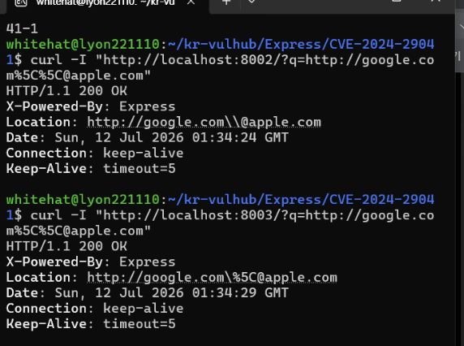

CVE-2024-29041(Open Redirect) 취약점 분석 및 재현 보고서

화이트햇 스쿨 24반 이영언

1. 실습 목표

이번 실습에서는 CVE-2024-29041(Open Redirect) 취약점을 Docker 환경에서 직접 구축하고 재현하였다.

취약 버전과 패치 버전의 동작을 비교하여 취약점이 발생하는 원인과 대응 방법을 확인하는 것을 목표로 하였다.

2. 취약점 요약

CVE-2024-29041은 Express 프레임워크에서 발생하는 Open Redirect 취약점이다.

취약한 Express 버전에서는 사용자가 입력한 URL을 처리하는 과정에서 URL 검증이 제대로 이루어지지 않아 공격자가 조작한 URL로 사용자를 이동시킬 수 있다.

이 취약점은 피싱 사이트 유도, 악성 사이트 이동, 개인정보 탈취 등의 공격에 악용될 수 있다.

영향 버전

- Express 4.19.2 미만
- Express 5.0.0-alpha.1 이상, 5.0.0-beta.3 미만

3. 실습 환경

운영체제

- Windows 11
- Ubuntu 24.04(WSL2)

사용 프로그램

- Docker 29.1.3
- Docker Compose 2.40.3
- Git
- curl

실습 저장소

https://github.com/gunh0/kr-vulhub

실습 경로

Express/CVE-2024-29041

4. 취약 조건

취약점이 발생하기 위한 조건은 다음과 같다.

- 취약한 Express 버전을 사용해야 한다.
- 사용자가 입력한 URL을 충분히 검증하지 않고 Location Header에 사용해야 한다.
- 백슬래시와 @ 문자가 포함된 조작된 URL을 처리해야 한다.
- 리다이렉트할 외부 도메인을 화이트리스트로 제한하지 않아야 한다.

5. 실습 과정

① 저장소 다운로드

git clone https://github.com/gunh0/kr-vulhub.git

② 실습 폴더 이동

cd kr-vulhub/Express/CVE-2024-29041

③ Docker 환경 실행

sudo docker compose up -d

④ 실행 중인 컨테이너 확인

sudo docker ps

⑤ 취약 서버 확인

취약한 Express 서버는 localhost의 8002번 포트에서 실행된다.

http://localhost:8002

⑥ 패치 서버 확인

패치된 Express 서버는 localhost의 8003번 포트에서 실행된다.

http://localhost:8003

6. Docker 실행 결과

Docker Compose 명령을 실행하여 취약 서버와 패치 서버 컨테이너를 동시에 실행하였다.

docker ps 명령을 통해 다음 두 개의 컨테이너가 Up 상태인 것을 확인하였다.

- cve-2024-29041-express-vuln-app
- cve-2024-29041-express-normal-app

**그림 1. Docker Compose 실행 후 취약 서버와 패치 서버 컨테이너 실행 화면**

7. PoC 코드

취약 서버 테스트 명령어

curl -I "http://localhost:8002/?q=http://google.com%5C%5C@apple.com"

패치 서버 테스트 명령어

curl -I "http://localhost:8003/?q=http://google.com%5C%5C@apple.com"

8. 실행 결과

취약 서버(8002)에서는 다음과 같은 Location Header가 반환되었다.

Location: http://google.com\\@apple.com

패치 서버(8003)에서는 다음과 같은 Location Header가 반환되었다.

Location: http://google.com%5C@apple.com

취약 서버에서는 백슬래시가 그대로 남아 있었으며, 브라우저나 URL 파서에 따라 @ 앞부분이 사용자 정보로 해석되고 실제 목적지 도메인이 apple.com으로 처리될 가능성이 있다.

반면 패치 서버에서는 백슬래시가 %5C로 인코딩되어 취약 버전과 다른 결과가 반환되었다.

이를 통해 취약 버전과 패치 버전의 URL 처리 방식에 차이가 있음을 확인하였다.

**그림 2. 취약 서버(8002)와 패치 서버(8003)의 curl 실행 결과 비교 화면**

9. 결과 분석

CVE-2024-29041은 Express가 리다이렉트 URL을 처리할 때 특수문자와 백슬래시를 안전하게 인코딩하지 못해 발생하는 Open Redirect 취약점이다.

공격자는 신뢰할 수 있는 사이트 주소처럼 보이는 조작된 URL을 사용자에게 전달할 수 있다.

사용자가 해당 링크를 클릭하면 공격자가 지정한 외부 도메인으로 이동할 가능성이 있으며, 피싱이나 개인정보 탈취 공격으로 이어질 수 있다.

이번 실습에서는 취약 서버와 패치 서버에 동일한 PoC 요청을 전송하여 Location Header의 차이를 확인하였다.

10. 대응 방안

- Express를 4.19.2 이상의 안전한 버전으로 업데이트한다.
- Express 5 버전을 사용하는 경우 5.0.0-beta.3 이상의 버전을 사용한다.
- 사용자 입력 URL을 Location Header에 직접 사용하지 않는다.
- 리다이렉트가 허용되는 도메인을 화이트리스트로 관리한다.
- URL을 표준 URL 파서로 분석한 후 프로토콜과 호스트를 검증한다.
- 백슬래시, @, 이중 인코딩 등의 우회 문자를 검사한다.
- 외부 리다이렉트가 필요하지 않은 경우 상대경로만 허용한다.
- 최신 보안 패치를 지속적으로 적용한다.

11. Reproducibility

재현 가능성: 100%

Docker Compose 하나로 취약 서버와 패치 서버가 동시에 구성되며, 보고서에 작성한 명령어를 그대로 수행하면 동일한 결과를 확인할 수 있었다.

별도의 외부 서버나 수동 설정 없이 docker compose up -d 명령으로 환경을 실행할 수 있었다.

취약 서버와 패치 서버에 동일한 curl 요청을 전송하면 Location Header의 차이를 반복해서 확인할 수 있다.

12. Risk Score

CVSS v3.1 Base Score: 6.1점(Medium)

평가 이유

- 공격 경로: Network
- 공격 복잡도: Low
- 필요한 권한: None
- 사용자 상호작용: Required
- 영향 범위: Changed
- 기밀성 영향: Low
- 무결성 영향: Low
- 가용성 영향: None

인증 없이 원격에서 조작된 URL을 전달할 수 있지만, 실제 공격 성공을 위해서는 사용자가 해당 링크를 클릭해야 한다.

공격에 성공하면 사용자를 피싱 사이트나 악성 사이트로 이동시킬 수 있으며, 개인정보 탈취와 서비스 신뢰도 저하로 이어질 수 있다.

13. 실습 결과 및 느낀점

이번 실습을 통해 Docker Compose를 이용하여 취약한 Express 환경과 패치된 Express 환경을 직접 구축하였다.

curl 명령을 이용하여 취약 서버와 패치 서버에 동일한 요청을 전송하고 Location Header의 차이를 비교함으로써 Open Redirect 취약점을 재현할 수 있었다.

또한 사용자 입력값을 검증하지 않고 리다이렉트에 사용하는 것이 위험하다는 점을 확인하였다.

최신 버전으로 업데이트하는 것과 URL 화이트리스트 및 입력값 검증을 적용하는 것이 웹 서비스 보안에서 중요하다는 것을 알게 되었다.ㅋ

