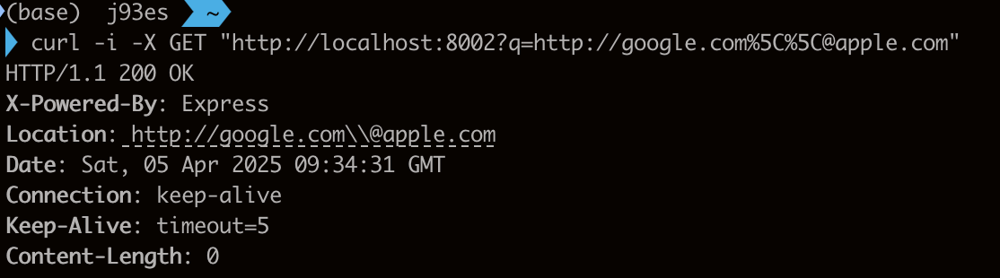

# CVE-2024-29041

> [Github (@j93es)](https://github.com/j93es)

> [Blog](https://j93.es)

<br/>

## 요약

아래 Express 버전에서 `req.location()` 혹은 내부적으로 `req.location()`을 이용하는 `req.redirect()`에서는 헤더의 `Location`에 값을 넣기 전, encodeurl()이라는 함수를 이용하여 인코딩합니다. 이러한 과정에서 리디렉션 화이트리스트를 우회할 수 있는 가능성이 발생합니다.

- \< 4.19.2
- \>= 5.0.0-alpha.1, \< 5.0.0-beta.3

<br/>

## PoC 구성

먼저 normal-app, vuln-app 2개의 express 서비스를 제작하였습니다. 두 서비스는 모두 query의 q에 있는 url을 파싱한 후, `Location` 헤더에 넣어 응답을 반환합니다.

```js
// index.js
const express = require("express");
const app = express();
const port = 3000;

app.use(function (req, res) {
  res.location(req.query.q).end();
});

app.listen(port, () => {
  console.log(`Example app listening at http://localhost:${port}`);
});
```

각 app의 package.json에 express 버전을 명시하였습니다. vuln-app은 4.19.0, normal-app은 패치가 완료된 4.19.2로 구동됩니다.

<br/>

## 환경 구성 및 실행

8002에는 취약한 버전의 Express가, 8003 포트에는 안전한 버전의 Express가 구동됩니다.

```sh
# 이미지 빌드
make build

# 컨테이너 실행
make up

# 종료
make down

# 로그 보기
make logs

# 컨테이너 재시작
make restart

# 컨테이너 및 이미지 제거 가능
make clean

# 이미지 제거 후 재빌드
make rebuild
```

<br/>

## 결과

### 요청

[패치 내역1](https://github.com/expressjs/express/commit/0b746953c4bd8e377123527db11f9cd866e39f94)과 [패치 내역2](https://github.com/expressjs/express/commit/0867302ddbde0e9463d0564fea5861feb708c2dd)의 테스트 코드를 참고하여 요청 URL을 선정하였습니다.

```sh
curl -i -X GET "http://localhost:8003?q=http://google.com%5C%5C@apple.com"
```

### 안전한 Express 서버(8003 포트)


### 취약한 Express 서버(8002 포트)



<br/>

## 정리

`http://localhost:8003?q=http://google.com%5C%5C@apple.com` 요청 시 `Location` 헤더에, 취약한 Express 버전에서는 `http://google.com\\@apple.com`가 추가되지만, 안전한 Express 버전에서는 `http://google.com\%5C@apple.com`이 추가됩니다. 이처럼 버전에 따라 인코딩된 문자열을 처리하는 방식이 상이함을 알 수 있습니다. 이를통해 취약한 Express 버전에서는 google.com이 아닌 apple.com으로 이동할 수 있는 가능성이 있습니다. 따라서 최신버전의 Express로 업데이트하는 것이 필요합니다.
