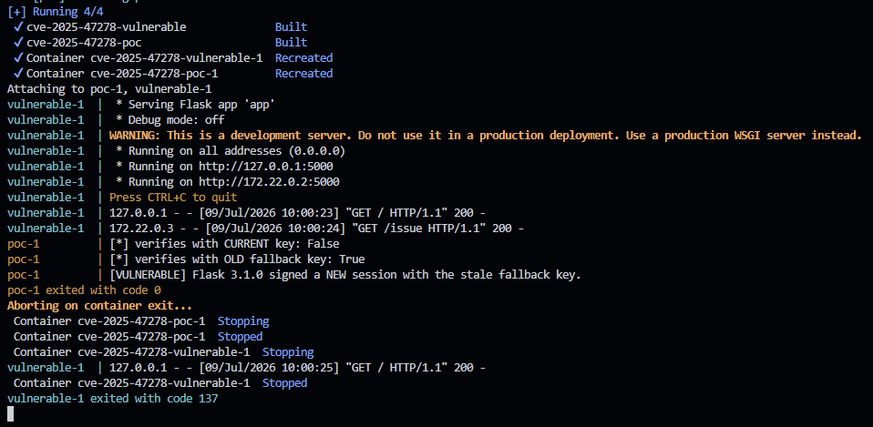

# CVE-2025-47278 - Flask fallback key signing 오류

> 이 환경은 교육 및 허가된 로컬 실습 전용입니다. 호스트의 루프백 주소에만 포트를 공개합니다.

## 취약점 요약

CVE-2025-47278은 Flask 3.1.0에서 `SECRET_KEY_FALLBACKS`를 이용한 세션 서명 키 교체가 잘못 동작하는 취약점이다. Flask는 이전 키로 기존 쿠키를 검증하되 새 쿠키는 현재 `SECRET_KEY`로 서명해야 한다. 그러나 3.1.0은 키 목록을 반대로 구성하여 **새 세션도 마지막 fallback 키(구 키)로 서명**한다. 따라서 구 키를 폐기하려는 키 교체가 지연되고, 구 키가 노출된 상황의 위험 기간이 늘어난다.

- 영향 버전: Flask 3.1.0
- 수정 버전: Flask 3.1.1 이상
- CWE: CWE-683 (Function Call With Incorrect Order of Arguments)
- 공식 CVSS v4.0: **1.8 Low** (`CVSS:4.0/AV:L/AC:L/AT:P/PR:H/UI:N/VC:N/VI:N/VA:L/SC:N/SI:N/SA:N`)
- 공식 공지: [GHSA-4grg-w6v8-c28g](https://github.com/pallets/flask/security/advisories/GHSA-4grg-w6v8-c28g)
- 수정 커밋: [73d6504](https://github.com/pallets/flask/commit/73d6504063bfa00666a92b07a28aaf906c532f09)

이 결함 자체가 세션 무결성을 직접 깨거나 원격 인증 우회를 제공하는 것은 아니다. PoC는 구 키를 이미 안다는 제한된 가정에서 공격을 수행하는 대신, 새 쿠키에 사용된 서명 키를 판별하여 공식 공지에 명시된 결함을 직접 증명한다.

## 환경 구성

- Docker 및 Docker Compose v2
- digest까지 고정한 공식 Python 3.13.5 기반 이미지
- Flask 3.1.0 및 정확한 버전으로 고정된 전체 Python 의존성
- `vulnerable`: 키 교체가 설정된 Flask 애플리케이션
- `poc`: 발급된 쿠키를 현재 키와 구 키로 각각 검증하는 자동 PoC

호스트에는 `127.0.0.1:5000`만 공개되며, 애플리케이션과 PoC 사이 통신은 Compose 내부 네트워크를 사용한다.

## 취약 조건

다음 조건을 모두 만족해야 한다.

1. 애플리케이션이 Flask **3.1.0**을 사용한다.
2. 현재 키가 `SECRET_KEY`에 설정되어 있다.
3. 하나 이상의 이전 키가 `SECRET_KEY_FALLBACKS`에 설정되어 키 교체 기능이 활성화되어 있다.
4. 애플리케이션이 새 세션 쿠키를 발급한다.

본 환경은 현재 키 `current-key-2025`와 구 키 `old-key-2024`를 사용한다. 이 값은 로컬 재현 결과를 결정적으로 만들기 위한 실습용 값이며 실제 서비스에 사용하면 안 된다.

## 재현 절차

디렉터리에서 아래 명령을 그대로 실행한다.

```bash
docker compose up --build --abort-on-container-exit --exit-code-from poc
```

PoC가 `[VULNERABLE]`을 출력하고 종료 코드 `0`을 반환하면 재현 성공이다. 실습 후 컨테이너와 네트워크를 제거한다.

```bash
docker compose down --volumes --remove-orphans
```

## 수동 재현
수동으로 애플리케이션 상태와 쿠키 발급을 확인하려면 취약 서버만 백그라운드로 실행한다.

```bash
docker compose up --build --wait -d vulnerable
curl -i http://127.0.0.1:5000/issue
docker compose down --volumes --remove-orphans
```

Windows PowerShell에서 `curl`이 `Invoke-WebRequest` 별칭으로 동작하는 환경은 `curl.exe`를 사용한다.

```powershell
curl.exe -i http://127.0.0.1:5000/issue
```

만일 `poc.py`의 실행흐름까지 수동으로 확인하고 싶을 시 PoC 컨테이너를 직접 실행한다.

```bash
docker compose up --build --wait -d vulnerable
docker compose run --rm poc
docker compose down --volumes --remove-orphans
```

## PoC 코드

전체 코드는 [`poc.py`](./poc.py)에 있다. 핵심 로직은 새로 발급된 동일한 쿠키를 현재 키와 구 키로 각각 검증하는 것이다.

```python
cookie = get_cookie()
current_accepts = verifies(cookie, CURRENT_KEY)
old_accepts = verifies(cookie, OLD_KEY)

if not current_accepts and old_accepts:
    print("[VULNERABLE] Flask 3.1.0 signed a NEW session with the stale fallback key.")
```

정상 구현에서는 `current_accepts=True`, `old_accepts=False`여야 한다. 취약한 3.1.0에서는 그 반대 결과가 나온다.

## 실행 결과

```text
[+] issued session cookie: <실행마다 달라지는 서명된 쿠키>
[*] verifies with CURRENT key: False
[*] verifies with OLD fallback key: True
[VULNERABLE] Flask 3.1.0 signed a NEW session with the stale fallback key.
```

아래 이미지는 `docker compose run --rm poc` 실행 결과를 캡처한 것이다.



## 대응 방안

1. Flask를 3.1.1 이상으로 업그레이드한다.
2. 업그레이드가 즉시 어렵다면 `SECRET_KEY_FALLBACKS`를 제거하고 현재 키만 사용한다. 단, 기존 세션이 무효화될 수 있다.
3. 구 키가 노출되었거나 노출이 의심되면 fallback 목록에서 즉시 제거하고 관련 세션을 무효화한다.
4. 구 키는 필요한 전환 기간 동안만 유지하고, 키 목록 및 세션 발급 동작을 테스트한다.

수정 버전은 fallback 키들을 먼저 넣고 현재 `SECRET_KEY`를 마지막에 추가한다. `itsdangerous`는 마지막 키를 새 서명에 사용하므로 새 쿠키가 현재 키로 서명된다.

## 평가 지표

- **Reproducibility: 100% 목표** — Compose 단일 명령, 전체 의존성 버전 고정, healthcheck, 자동 판정 및 종료 코드 제공
- **Risk Score: 1.8/10.0** — 공식 GitHub Advisory의 CVSS v4.0 점수. 원격 직접 악용이 아니며, 키 교체 설정과 높은 사전 권한/구 키 접근이라는 전제 조건이 있고, 공식 설명상 세션 무결성 손실은 없다.

## 참고 자료

- [GitHub Security Advisory GHSA-4grg-w6v8-c28g](https://github.com/pallets/flask/security/advisories/GHSA-4grg-w6v8-c28g)
- [Flask 3.1.1 수정 커밋](https://github.com/pallets/flask/commit/73d6504063bfa00666a92b07a28aaf906c532f09)
- [Flask 3.1.1 릴리스](https://github.com/pallets/flask/releases/tag/3.1.1)
- [NVD CVE-2025-47278](https://nvd.nist.gov/vuln/detail/CVE-2025-47278)
