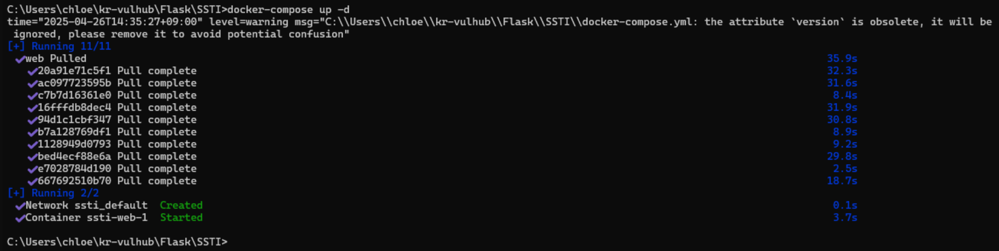
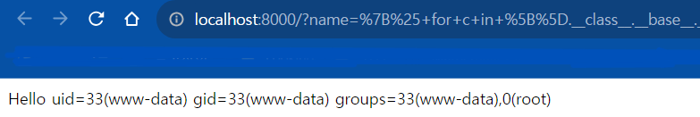
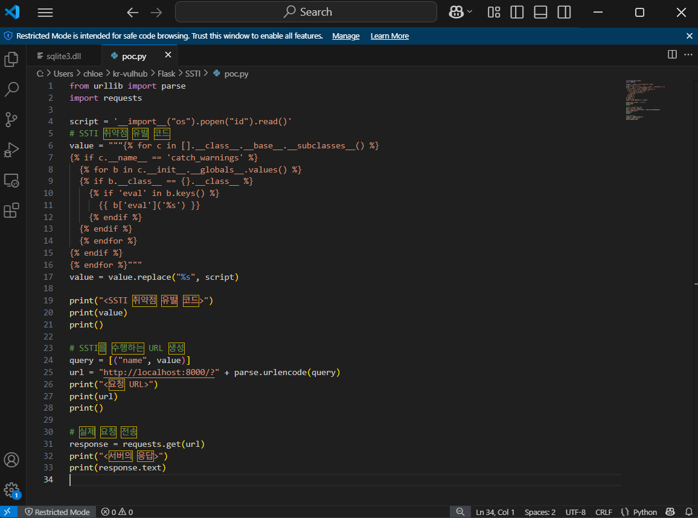
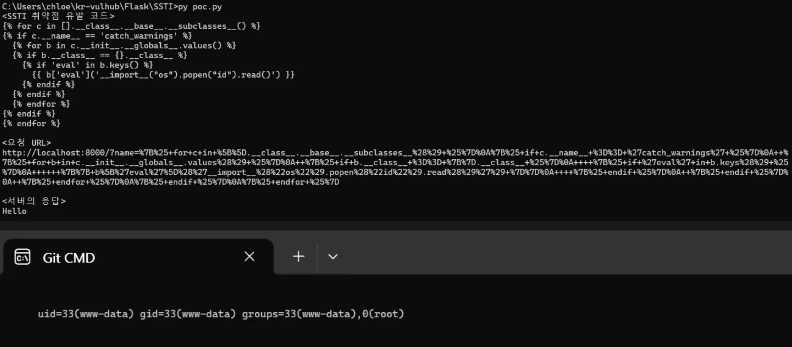

# Flask (Jinja2) SSTI 취약점 보고서

## 작성자
### WHS3_38반_양지민(5582)
### GitHub: yjm080821

# 요약
Flask/Jinja2의 서버 측 템플릿 인젝션(SSTI) 취약점은 사용자가 제공한 입력이 템플릿 엔진에 삽입될 때 발생합니다. 이를 통해 공격자는 임의의 Python 코드를 실행할 수 있습니다.

# 환경 설정

kr-vulhub 저장소를 클론합니다:
```
git clone --depth 1 https://github.com/gunh0/kr-vulhub.git
cd kr-vulhub/Flask/SSTI
```

Docker Compose로 환경을 시작합니다
```
docker compose up -d
```

브라우저에서 http://localhost:8000/?name={{233*233}}에 접속하여 SSTI를 확인합니다. 결과는 54289여야 합니다.

PoC 스크립트를 실행합니다
```
python poc.py
```

PoC에서 생성된 URL에 접속하여 서버 프로세스 ID를 확인합니다.

## PoC 세부 정보
poc.py 스크립트는 임의의 Python 코드를 실행하도록 수정할 수 있습니다. 기본적으로 서버의 프로세스 ID를 출력합니다.

# 결과

## Docker 실행

## 취약점 확인
### SSTI

### poc.py 실행

### PoC 실행


# 완화 방법

사용자 입력을 필터링하여 템플릿 코드로 처리되지 않도록 합니다.
템플릿 엔진에서 샌드박스 환경을 사용합니다.

## 포크한 저장소

### URL: https://github.com/yjm080821/kr-vulhub/

## 풀 리퀘스트

URL:

