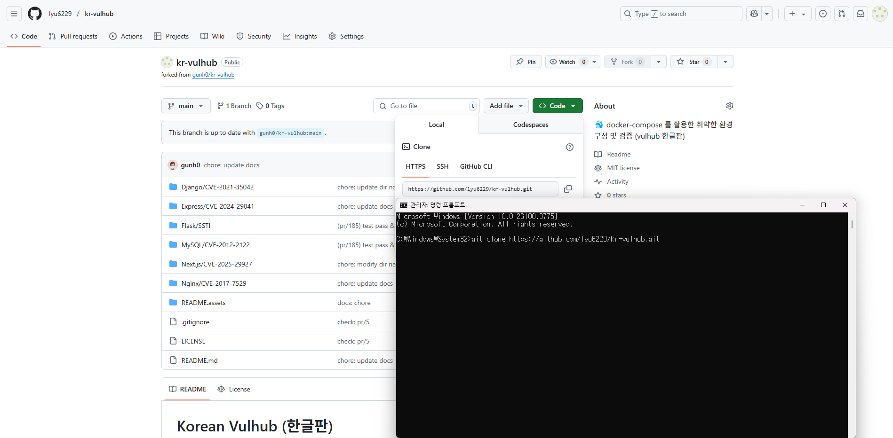
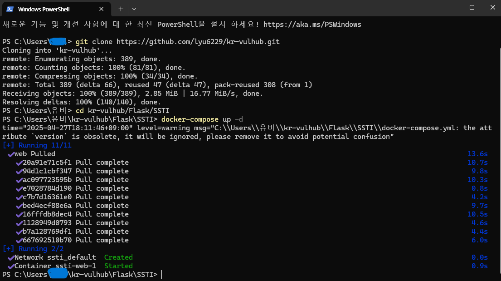
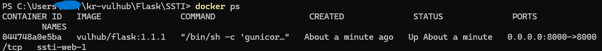
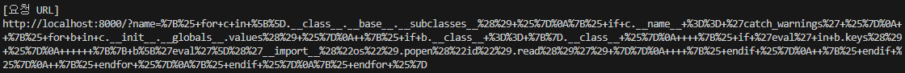
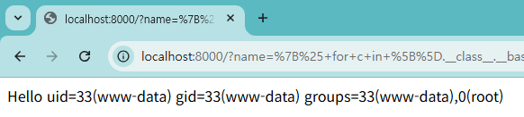

# Flask SSTI 취약점 검증 (poc) 보고서서

> 화이트햇 스쿨 3기 - [이용운 (@positiveWand)](https://github.com/lyu6229/kr-vulhub.git)

 

## 요약

- 서버 템플릿 엔진은 사용자로부터 요청이 들어올 때마다 템플릿 파일을 렌더링하여 결과를 반환한다.
- 템플릿 렌더링 과정에서 사용자 입력이 안전하게 처리되지 않으면, 공격자가 서버 측 코드 실행(예: Python 코드 실행)을 유발할 수 있다.
- Flask 프레임워크와 Jinja2 템플릿 엔진 조합에서 이러한 Server-Side Template Injection(SSTI) 취약점이 발생할 수 있다.

 

## 환경 구성 및 실행

1. [Fork한 레포지토리 링크](https://github.com/gunh0/kr-vulhub.git)

2. `cd kr-vulhub/Flask/SSTI`로 이동 후 `docker-compose up -d` 명령어를 실행하여 테스트 환경을 실행

3. `docker ps`로 도커 실행 확인

4. Flask 서버 접속

5. PoC 코드 실행 및 요청 URL 생성

6. 생성된 요청 URL 확인

 

## 결과

7. 공격 성공 장면
- URL을 브라우저에 입력하여 SSTI 공격 성공
- 시스템 명령어 실행 결과 출력 확인

 

## 정리

- 이 취약점은 사용자가 서버에서 임의의 코드를 실행하도록 할 수 있게 만들어 매우 위험하다.
- 안전한 웹 서비스 운영을 위해서는 서버 개발자가 사용자 입력을 필터링하거나, 템플릿 엔진에 직접적인 입력을 넣지 않도록 주의해야 한다.

