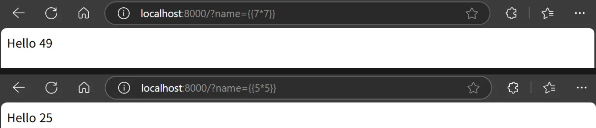

# Flask (Jinja2) SSTI 취약점 검증 및 PoC 실습 보고서
> 화이트햇 스쿨 3기 - 최아현(5975)

 

# 1. SSTI 개념 증명 해보기 (poc코드 수정 전)

위의 깃허브링크에서 **Flask (Jinja2) SSTI (Server Side Template Injection) 취약점**을 선택하였고, 해당 깃허브 링크를 fork해서 내 github에 복사하였다.

## 1.1 실습 환경 구축

- docker desktop 설치
- Git-2.49.0-64-bit 설치
- python 3.13.3 도 설치
  
 

## 프로젝트 clone 및 실행

1. `docker compose up -d` 를 실행하여 테스트 환경을 실행.
2. `http://your-ip:8000/?name={{233*233}}`에 접속하여 54289가 출력되는지 확인하여 SSTI 취약점이 존재함을 확인합니다.
3. `python poc.py`를 실행하여 공격을 수행하는 URL을 확인.
4. 해당 URL에 접속하면 삽입한 코드가 실행되어 서버 프로세스의 id가 출력되는 것을 확인할 수 있음.

+) `poc.py`의 `script` 변수의 값을 원하는 Python 코드로 바꾸면 해당 코드가 서버에서 실행된다.
(기본 코드는 서버 프로세스의 id를 출력하는 코드)

 

## 결과

 

## 정리

- 이 취약점은 사용자가 서버에서 임의의 코드를 실행하도록 할 수 있게 만들기 때문에 위험하다. 안전한 웹 서비스 운영을 위해서는 서버 개발자가 혹은 라이브러리, 프레임워크에서 사용자가 전달한 데이터가 템플릿 코드인지 확인하여 필터링하거나 사용자 입력 데이터가 실행으로 이어지지 않도록 해야한다.
