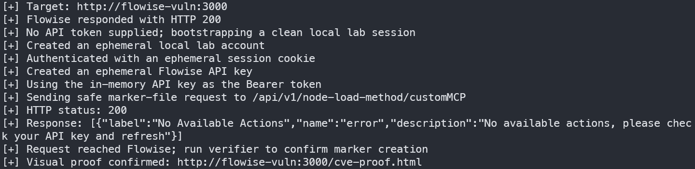
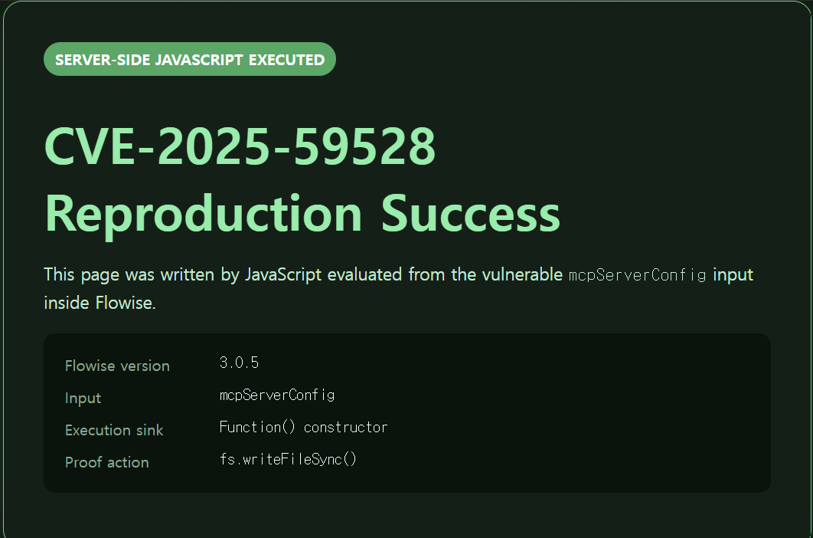
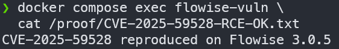

# Flowise CustomMCP 코드 인젝션 (CVE-2025-59528)

**Contributors**

- [박현태(@aoistar-kr)](https://github.com/aoistar-kr)

<br/>

Flowise는 LLM 및 AI Agent 워크플로를 구성할 수 있는 오픈소스 플랫폼이다.
Flowise 3.0.5의 CustomMCP 노드는 MCP 서버 설정값인 `mcpServerConfig`를
처리할 때 사용자 입력을 JavaScript의 `Function()` 생성자로 평가한다.

공격자가 설정값 안에 JavaScript 표현식을 넣으면 해당 코드가 Flowise 서버
권한으로 실행될 수 있다. 이 실습에서는 외부 연결이나 셸 명령을 사용하지 않고,
서버 내부에 TXT 파일과 브라우저용 HTML 파일을 생성하여 코드 실행을 확인한다.

```text
mcpServerConfig 입력
    ↓
convertToValidJSONString()
    ↓
Function('return ' + inputString)()
    ↓
공격자가 전달한 JavaScript 실행
```

참고 자료:

- <https://github.com/FlowiseAI/Flowise/security/advisories/GHSA-3gcm-f6qx-ff7p>
- <https://nvd.nist.gov/vuln/detail/CVE-2025-59528>

## 환경 설정

Docker와 Docker Compose가 설치된 환경에서 CVE 디렉터리로 이동한다.

동일한 환경에서 재현할 수 있도록 Flowise 3.0.5와 PoC용 Python 이미지의
버전 및 digest를 `docker-compose.yml`에 고정하였다.

```bash
cd Flowise/CVE-2025-59528
```

다음 명령어로 취약한 Flowise 3.0.5 서버를 시작한다. 처음 실행할 때는 이미지
다운로드로 시간이 걸릴 수 있다.

```bash
docker compose up -d
```

서버는 <http://127.0.0.1:3000>에서 확인할 수 있다.

## 취약점 재현

다음 명령어로 공격자 컨테이너에서 PoC를 실행한다. 실습에 필요한 계정과 API
Key는 PoC가 자동으로 준비하며, 공격자 컨테이너는 실행 후 삭제된다.

```bash
docker compose --profile tools run --rm poc \
  --target http://flowise-vuln:3000
```

재현에 성공하면 터미널에서 HTTP 200과 시각적 증명 주소를 확인할 수 있다.

```text
[+] HTTP status: 200
[+] Visual proof confirmed: http://flowise-vuln:3000/cve-proof.html
```


브라우저에서 다음 주소에 접속하면 JavaScript 실행 결과를 확인할 수 있다.

<http://127.0.0.1:3000/cve-proof.html>

취약점으로 실행된 JavaScript가 Flowise의 정적 웹 디렉터리에 HTML 파일을 직접
생성하며, 성공 화면에는 다음 문구가 표시된다.

```text
SERVER-SIDE JAVASCRIPT EXECUTED
CVE-2025-59528 Reproduction Success
```

TXT 증명 파일도 다음 명령으로 확인할 수 있다.

```bash
docker compose exec flowise-vuln \
  cat /proof/CVE-2025-59528-RCE-OK.txt
```

```text
CVE-2025-59528 reproduced on Flowise 3.0.5
```


## 영향

이 취약점을 악용하면 Flowise 프로세스 권한으로 JavaScript 코드를 실행할 수
있다. Node.js의 파일 시스템 및 프로세스 관련 기능에 접근할 수 있으므로 파일
읽기·쓰기, 명령 실행, 민감 정보 유출로 이어질 수 있다. 특히 Docker socket이나
호스트 디렉터리가 마운트된 환경에서는 피해가 호스트까지 확대될 수 있다.

실제 Flowise 3.0.5 환경에서는 유효한 API Key가 필요했으며, API Key 없이 보낸
요청은 HTTP 401로 차단되었다. PoC는 임시 API Key 생성 과정을 자동화하며
해당 값을 출력하거나 파일에 저장하지 않는다.

## 환경 종료

다음 명령으로 컨테이너와 실습 볼륨을 제거한다.

```bash
docker compose --profile tools down -v --remove-orphans
```

`-v` 옵션은 실습 계정과 API Key가 저장된 Flowise 데이터 볼륨 및 증명 파일
볼륨을 함께 삭제한다. 취약점을 처음부터 다시 재현하려면 환경 종료 명령을 실행한
뒤 `docker compose up -d`부터 다시 진행한다.

## 대응 방안

Flowise 3.0.5 사용자는 문제가 된 JSON 문자열 처리 방식이 수정된 3.0.6 이상
버전으로 업데이트해야 한다. 업데이트 후에는 실행 중인 Flowise 버전과 컨테이너
이미지 태그를 확인하여 취약한 3.0.5 이미지가 다시 사용되지 않도록 한다.

즉시 업데이트하기 어려운 경우에는 리버스 프록시나 접근 제어를 이용해
`/api/v1/node-load-method/customMCP` 엔드포인트를 외부에서 호출하지 못하도록
제한하고, Flowise 관리 화면과 API를 신뢰할 수 있는 내부 네트워크에서만 사용한다.
이는 임시 완화책이므로 패치를 대체할 수 없다.

취약점 악용이 의심되는 경우에는 Flowise 로그와 비정상적인 파일 생성 여부를
확인하고, 사용 중인 API Key를 폐기한 뒤 새 Key로 교체해야 한다.
