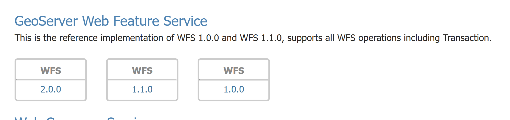
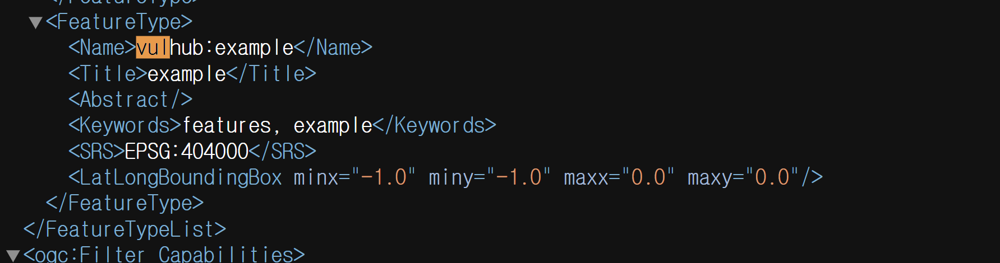
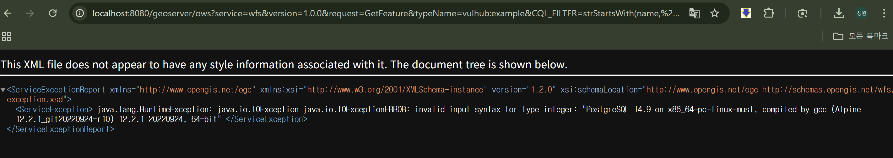

# GeoServer SQL Injection 취약점 (CVE-2023-25157)


### Github repository

- 31반 조성원 github 레포:  [/legendwon/kr-vulhub/tree/main/GeoServer%20OGC%20%ED%95%84%ED%84%B0%20SQL%20%EC%A3%BC%EC%9E%85(CVE-2023-25157)](https://github.com/legendwon/kr-vulhub/tree/main/GeoServer%20OGC%20%ED%95%84%ED%84%B0%20SQL%20%EC%A3%BC%EC%9E%85(CVE-2023-25157))
- 31반 조성원 Pull Request 링크 : https://github.com/gunh0/kr-vulhub/pull/289

## 1. 개요

**GeoServer**는 지리공간 데이터를 웹에서 서비스하는 오픈소스 서버입니다. GeoServer는 OGC(국제 지리공간 표준 기구) 표준을 따르며, CQL 필터(Query Language Filter)를 사용할 수 있습니다. 그러나 필터 입력값을 제대로 검증하지 않아 악의적인 SQL 코드를 삽입할 수 있는 취약점이 존재합니다.

### References:
- [CVE-2023-25157 on GitHub](https://github.com/vulhub/vulhub/tree/master/geoserver/CVE-2023-25157)

## 2. 환경 구축

다음 명령어를 통해 GeoServer와 PostgreSQL을 실행합니다.

```bash
docker compose up -d
```

서버가 시작된 후, [http://localhost:8080/geoserver/web/?1](http://localhost:8080/geoserver/web/?1) 에 접속합니다.


## 3. 취약점 설명

**GeoServer** 2.22.1 및 2.21.4 이전 버전에서 OGC 표준에 정의된 CQL 필터에서 **SQL 주입** 취약점이 발견되었습니다. 이를 통해 악의적인 사용자는 GeoServer의 요청을 조작하여 **PostGIS 데이터베이스**에 대한 SQL 주입 공격을 수행할 수 있습니다.

### SQL 주입 원리

GeoServer는 WFS(Web Feature Service) 요청에서 **CQL (Common Query Language)** 필터를 사용해 데이터를 검색하는 기능이 있습니다. 그러나 이 필터 처리 과정에서 SQL 쿼리가 적절하게 필터링되지 않아 공격자가 SQL 주입을 통해 Postgres 데이터베이스에 접근할 수 있습니다.

```python
http://localhost:8080/geoserver/ows?service=wfs&version=1.0.0&request=GetFeature&typeName=vulhub:example&CQL_FILTER=strStartsWith%28name%2C%27x%27%27%29+%3D+true+and+1%3D%28SELECT+CAST+%28%28SELECT+version()%29+AS+integer%29%29+--+%27%29+%3D+true
```

### WFS 서비스



GeoServer는 WFS 1.0.0 버전에서 `vulhub:example` 피쳐를 확인할 수 있습니다.



이 SQL Injection을 통해 PostgreSQL의 버전 정보를 확인할 수 있습니다.



**URL 설명:**
- **geoserver/ows**: GeoServer의 OWS (Open Web Services) 엔드포인트를 통해 다양한 서비스 요청을 할 수 있습니다.
- **service=wfs**: Web Feature Service(WFS)를 호출하는 매개변수입니다.
- **version=1.0.0**: 요청하는 WFS 서비스의 버전입니다.
- **request=GetFeature**: GetFeature 요청을 통해 지정된 피처를 가져옵니다.
- **typeName=vulhub:example**: 요청할 피처의 유형을 지정합니다.
- **CQL_FILTER=strStartsWith(name, 'x') = true**: CQL에서 name 필드 값이 'x'로 시작하는지 확인합니다.
- **and 1 = (SELECT CAST((SELECT version()) AS integer)) -- ‘**: SQL Injection을 통해 PostgreSQL 버전 정보를 조회할 수 있습니다.

### SQL Injection을 통한 PostgreSQL 버전 정보 확인

위 URL을 통해 SQL 주입 공격을 성공시키면 PostgreSQL 버전 정보가 반환됩니다.

## 4. 대응 방안

1. **업데이트 및 패치 적용**
    - 취약한 버전(GeoServer 2.22.1 및 2.21.4 이전 버전)을 사용하는 경우, **최신 버전으로 즉시 업데이트** 해야 합니다. GeoServer는 해당 취약점에 대한 보안 패치를 이미 제공하고 있으며, 이를 적용함으로써 취약점을 해결할 수 있습니다.
    
    [GeoServer](https://geoserver.org/)
    
2. **입력 검증 및 필터링 강화**
    - GeoServer는 **CQL_FILTER** 매개변수에 대한 입력 검증을 강화해야 합니다. SQL 주입을 방지하려면 사용자 입력을 **철저히 검증**하고, Prepared Statements를 사용하여 SQL 인젝션을 차단해야 합니다.
