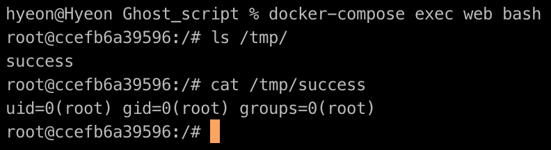
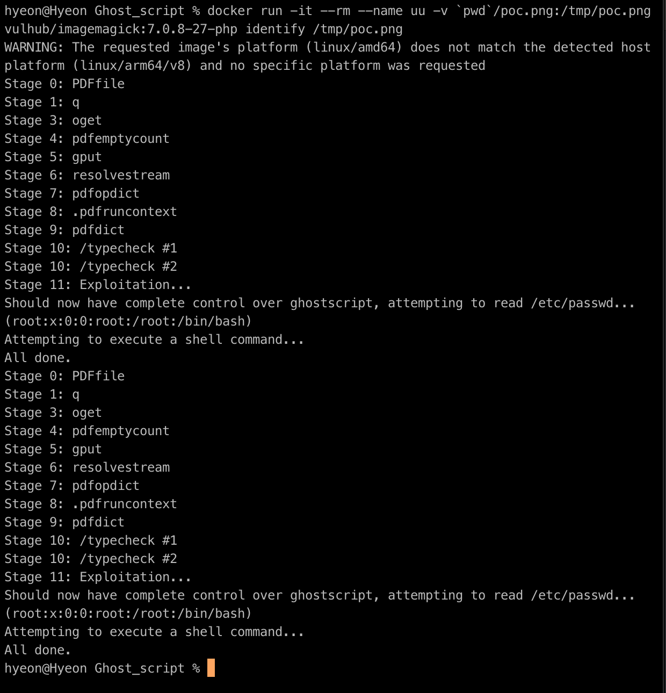

GhostScript 샌드박스 우회 (Command Execution) 취약점 (CVE-2019-6116)

2019년 1월 23일 저녁, Artifex 공식 저장소에서는 GhostScript의 master 브랜치에 최대 6개의 수정 사항을 병합했습니다. 이러한 수정은 CVE-2019-6116 취약점을 해결하기 위한 것이었으며, 이 취약점은 구글 보안 연구원 Tavis에 의해 2018년 12월 3일에 제출되었습니다. 이 취약점은 GhostScript의 보안 샌드박스를 우회하여 공격자가 임의의 명령을 실행하거나 임의의 파일을 읽을 수 있게 합니다.

GhostScript는 ImageMagick, Python PIL 등 여러 이미지 처리 라이브러리에서 사용되며, 기본적으로 이러한 라이브러리는 이미지의 내용에 따라 다양한 처리 방법으로 분배됩니다. 그 중 하나가 GhostScript입니다.

참고 링크:

https://bugs.chromium.org/p/project-zero/issues/detail?id=1729&desc=2
https://www.anquanke.com/post/id/170255
취약점 환경

다음 명령을 실행하여 취약점 환경을 시작합니다(최신 버전의 GhostScript 9.26 및 ImageMagick 7.0.8-27 포함):

Copy code
docker-compose up -d
환경이 시작되면 http://your-ip:8080을 방문하여 업로드 구성 요소를 확인할 수 있습니다.

취약점 재현

작성자가 제공한 POC 파일을 업로드하면 id > /tmp/success 명령을 실행할 수 있습니다:

또는 다음 명령을 사용하여 직접 POC를 테스트할 수도 있습니다:

bash
Copy code
docker run -it --rm --name uu -v `pwd`/poc.png:/tmp/poc.png vulhub/imagemagick:7.0.8-27-php identify /tmp/poc.png
결과는 다음과 같습니다:

기술 문서

취약점 개요

해당 취약점은 GhostScript의 보안 샌드박스를 우회하여 악의적인 사용자가 임의의 명령을 실행하거나 임의의 파일을 읽을 수 있는 보안 문제를 초래합니다.

영향 받는 버전

해당 취약점은 GhostScript 9.26 및 이전 버전에서 발생합니다.

취약점 해결 방법

최신 버전의 GhostScript를 설치하거나, Artifex의 패치가 포함된 GhostScript 버전을 사용하여 취약점을 해결할 수 있습니다. Artifex의 최신 공식 릴리스 노트를 참조하여 올바른 버전을 선택하십시오.

취약점 재현 방법

환경을 설정하고 취약한 버전의 GhostScript 및 ImageMagick를 설치합니다.
제공된 POC 파일을 업로드하여 명령 실행을 확인합니다.
참고 링크

GhostScript 취약점 정보
Anquanke 보고서