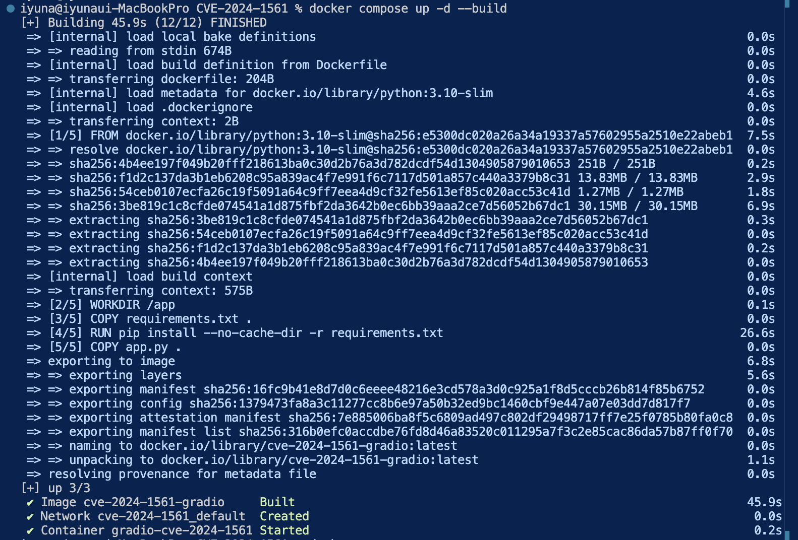
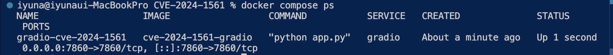
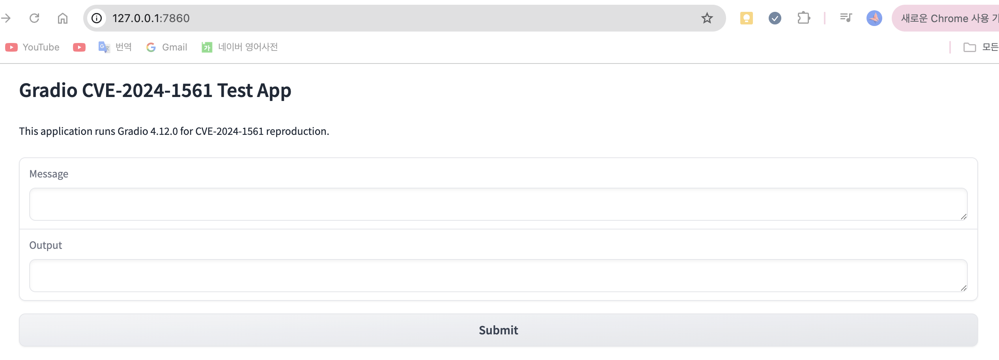
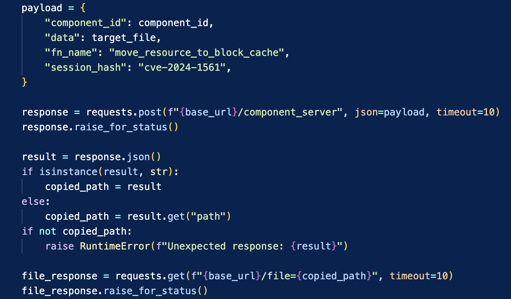
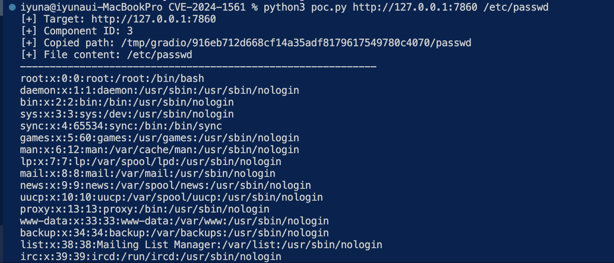

# CVE-2024-1561

**Contributors**

-   [@una7620](https://github.com/una7620)

<br/>

# Gradio component_server 임의 파일 읽기 취약점 (CVE-2024-1561)

## 취약점 요약

Gradio는 Python 기반으로 머신러닝 모델이나 Python 함수를 웹 인터페이스로 쉽게 배포할 수 있게 해주는 오픈소스 라이브러리이다.

CVE-2024-1561은 Gradio의 `/component_server` 엔드포인트에서 발생하는 임의 파일 읽기 취약점이다. 취약한 버전에서는 공격자가 `Component` 또는 `Block` 클래스의 메서드를 조작된 인자로 호출할 수 있으며, 이 중 `move_resource_to_block_cache()` 메서드를 악용하면 서버 파일 시스템의 임의 파일을 Gradio 임시 디렉터리로 복사한 뒤 `/file` 엔드포인트를 통해 읽을 수 있다.

- CVE ID: CVE-2024-1561
- 영향 제품: gradio-app/gradio
- 영향 버전: Gradio 4.12.0 이상 4.13.0 미만
- 취약 유형: Path Traversal / Arbitrary File Read
- CWE: CWE-29
- 공식 CVE 근거: https://nvd.nist.gov/vuln/detail/CVE-2024-1561

## 환경 구성

본 실습 환경은 Docker Compose를 사용하여 Gradio 4.12.0 기반 애플리케이션을 실행한다. 외부 개인 취약 이미지에 의존하지 않고, 현재 디렉터리의 `Dockerfile`과 `requirements.txt`를 사용해 이미지를 직접 빌드한다.

```bash
docker compose up -d --build
```

컨테이너가 실행되면 Gradio 웹 애플리케이션은 다음 주소에서 접근할 수 있다.

```text
http://127.0.0.1:7860
```

Docker 이미지 빌드 및 컨테이너 실행 결과는 다음과 같다.



`docker compose ps` 명령으로 컨테이너가 실행 중이고, 호스트의 7860 포트가 컨테이너의 7860 포트로 매핑된 것을 확인할 수 있다.



브라우저에서 Gradio 애플리케이션에 접속한 화면이다.



## 취약 조건

다음 조건에서 취약점이 재현된다.

- Gradio 4.12.0 이상 4.13.0 미만 버전을 사용한다.
- 외부 사용자가 Gradio 애플리케이션의 HTTP 엔드포인트에 접근할 수 있다.
- `/component_server` 엔드포인트가 공격자가 전달한 인자를 기반으로 내부 메서드를 호출할 수 있다.
- 공격자가 읽고자 하는 서버 파일 경로를 알고 있다.

본 실습에서는 Docker 컨테이너 내부의 `/etc/passwd` 파일을 읽어 취약점을 재현한다.

## 취약점 분석

Gradio는 애플리케이션 구성 정보를 `/config` 엔드포인트를 통해 제공한다. 이 응답에는 화면에 배치된 컴포넌트의 ID와 속성 정보가 포함된다. 공격자는 이 정보를 이용해 공격 대상 컴포넌트 ID를 확인할 수 있다.

취약한 Gradio 버전에서는 `/component_server` 엔드포인트가 외부 요청에서 전달된 `fn_name` 값을 기반으로 특정 컴포넌트 또는 블록 메서드를 호출할 수 있다. 이때 `move_resource_to_block_cache` 메서드는 전달받은 파일 경로를 Gradio의 임시 캐시 디렉터리로 이동 또는 복사하는 용도로 사용된다.

공격자는 이 동작을 악용하여 `/etc/passwd`와 같은 서버 내부 파일 경로를 전달할 수 있다. 서버는 해당 파일을 `/tmp/gradio/...` 아래로 복사하고, 이후 `/file=<복사된_경로>` 요청을 통해 복사된 파일을 응답한다. 결과적으로 인증 없이 서버 내부 파일을 읽을 수 있다.

공격 흐름은 다음과 같다.

```text
1. GET /config
   -> Gradio 컴포넌트 ID 확인

2. POST /component_server
   -> fn_name=move_resource_to_block_cache
   -> data=/etc/passwd

3. GET /file=/tmp/gradio/.../passwd
   -> 복사된 파일 내용 조회
```

## 재현 절차

먼저 취약한 Gradio 환경을 실행한다.

```bash
docker compose up -d --build
```

컨테이너 상태를 확인한다.

```bash
docker compose ps
```

PoC 실행에 필요한 Python 패키지를 설치한다.

```bash
python3 -m pip install requests
```

PoC 스크립트를 실행하여 컨테이너 내부의 `/etc/passwd` 파일을 읽는다.

```bash
python3 poc.py http://127.0.0.1:7860 /etc/passwd
```

실습이 끝나면 다음 명령으로 환경을 종료한다.

```bash
docker compose down
```

### 빠른 검증 명령

아래 명령을 그대로 실행하면 환경 실행부터 PoC 재현, 환경 종료까지 확인할 수 있다.

```bash
docker compose up -d --build
docker compose ps
python3 -m pip install requests
python3 poc.py http://127.0.0.1:7860 /etc/passwd
docker compose down
```

## POC(Proof of Concept)

`poc.py`는 다음 순서로 취약점을 재현한다.

1. `/config` 엔드포인트에 접근하여 Gradio 컴포넌트 ID를 확인한다.
2. `/component_server` 엔드포인트에 `move_resource_to_block_cache` 호출을 유도하는 JSON 요청을 전송한다.
3. 서버가 대상 파일을 `/tmp/gradio/...` 경로로 복사하면, 반환된 경로를 확인한다.
4. `/file=<복사된_경로>` 요청으로 복사된 파일 내용을 읽는다.

아래 코드는 `/component_server`에 파일 경로를 전달하고, 반환된 Gradio 임시 경로를 `/file` 엔드포인트로 다시 요청하는 부분이다.



### 사용법

```bash
python3 poc.py <target-url> <file-path>
```

### 명령어 실행 예

```bash
python3 poc.py http://127.0.0.1:7860 /etc/passwd
```

## 실행 결과

PoC 실행 결과, `/etc/passwd` 파일이 Gradio 임시 디렉터리로 복사된 뒤 `/file` 엔드포인트를 통해 조회되는 것을 확인하였다.

### macOS(VS Code)



출력에서 `Copied path`는 Gradio가 `/etc/passwd`를 복사한 임시 경로를 의미한다. 이후 출력되는 `root:x:0:0:root:/root:/bin/bash` 등의 내용은 컨테이너 내부 `/etc/passwd` 파일의 실제 내용이다.

## 대응 방안

- Gradio를 4.13.0 이상 버전으로 업그레이드한다.
- Gradio 애플리케이션을 인터넷에 직접 노출하지 않고, 방화벽 또는 리버스 프록시를 통해 접근 가능한 IP를 제한한다.
- 민감한 API 키, 토큰, 인증 정보가 서버 파일이나 환경 변수에 평문으로 노출되지 않도록 관리한다.
- Gradio와 같은 웹 인터페이스를 배포할 때 인증을 적용하고, 불필요한 파일 제공 엔드포인트 접근을 제한한다.
- 컨테이너 실행 시 최소 권한 원칙을 적용하고, 민감 파일이 포함된 호스트 경로를 불필요하게 마운트하지 않는다.
