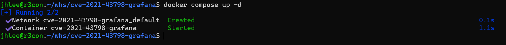
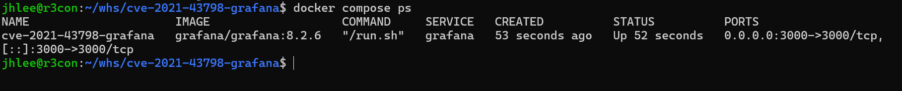
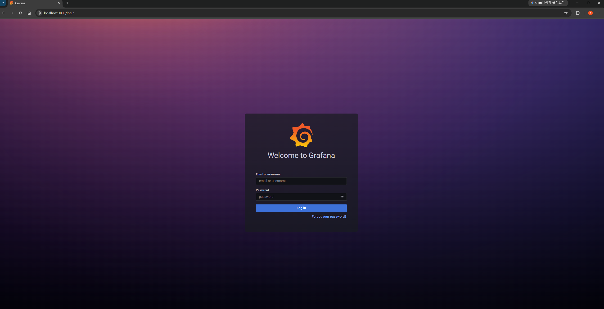
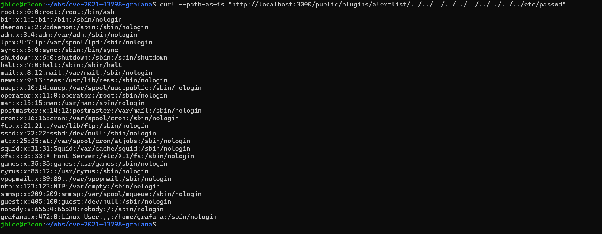

# Grafana Path Traversal (CVE-2021-43798)

## 1. 개요

CVE-2021-43798은 Grafana의 플러그인 정적 파일 제공 기능에서 발생한 Path Traversal 취약점입니다. 취약한 Grafana 서버에 대해 인증 없이 특수하게 조작된 URL을 요청하면, 공격자는 Grafana 프로세스 권한으로 읽을 수 있는 서버 내부 파일을 HTTP 응답으로 획득할 수 있습니다.

본 실습은 취약 버전인 Grafana 8.2.6을 Docker Compose로 실행한 뒤, 플러그인 경로에 디렉터리 이동 문자열(`../`)을 포함한 요청을 보내 `/etc/passwd` 파일이 노출되는지 확인하는 방식으로 진행하였습니다.

## 2. Grafana란?
- Grafana란 오픈소스 모니터링 및 데이터 시각화 플랫폼입니다. 
- Grafana는 시간에 따라 변화하는 데이터를 분석하고 시각화하는데 유용하며, 시스템 자원 상태, 서버 성능, 네트워크 트래픽, 애플리케이션 동작 등을 시각화하여 실시간으로 모니터링하고 중요한 metric을 추적하는데 사용합니다.


## 3. 환경 구성 및 실행

실행 명령은 다음과 같습니다.

```bash
docker compose up -d
```

정상 실행 후 Grafana 웹 서비스는 다음 주소에서 접근 가능합니다.

```text
http://localhost:3000
```

## 4. 취약 조건

이 취약점이 재현되기 위한 조건은 다음과 같습니다.

- Grafana가 CVE-2021-43798에 취약한 버전이어야 한다.
- 이번 재현에서 사용한 이미지는 `grafana/grafana:8.2.6`이다.
- 외부에서 Grafana의 HTTP 서비스에 접근할 수 있어야 한다.
- 요청 URL에 포함된 `../` 경로가 클라이언트나 프록시에서 정규화되어 제거되지 않아야 한다.
- 읽으려는 파일은 Grafana 프로세스 권한으로 읽을 수 있어야 한다.

중요한 점은 Docker 환경에서 `/etc/passwd`를 읽는 경우, 이는 호스트 운영체제의 파일이 아니라 Grafana 컨테이너 내부의 `/etc/passwd` 파일이라는 점입니다. 단, 민감한 설정 파일이나 볼륨으로 마운트된 파일이 Grafana 프로세스에서 읽을 수 있다면 추가적인 정보 노출로 이어질 수 있습니다.

## 5. 취약점이 발생하는 원리

Grafana는 플러그인의 정적 리소스를 제공하기 위해 다음과 같은 형태의 URL을 사용합니다.

```text
/public/plugins/<plugin-id>/<asset-path>
```

취약한 버전에서는 플러그인 리소스 경로를 처리하는 과정에서 요청 경로가 실제 플러그인 디렉터리 내부에 머무르는지 충분히 검증하지 못했습니다. 이 때문에 `<asset-path>` 위치에 `../../../../`와 같은 상위 디렉터리 이동 문자열을 삽입하면, 플러그인 디렉터리 밖의 파일까지 접근할 수 있습니다.

예를 들어 아래와 같은 요청은 `alertlist` 플러그인 리소스를 요청하는 것처럼 보이지만, 실제로는 여러 번 상위 디렉터리로 이동한 뒤 `/etc/passwd` 파일을 읽도록 구성되어 있습니다.

```text
/public/plugins/alertlist/../../../../../../../../../../etc/passwd
```


## 6. 재현 절차

1. `docker-compose.yml` 파일을 작성한다.
2. 다음 명령으로 Grafana 8.2.6 컨테이너를 백그라운드에서 실행한다.

```bash
docker compose up -d
```

3. Grafana 서비스가 `localhost:3000`에서 실행 중인지 확인한다.
4. 다음 PoC 요청을 실행한다.

```bash
curl --path-as-is "http://localhost:3000/public/plugins/alertlist/../../../../../../../../../../etc/passwd"
```

5. 응답 본문에 `/etc/passwd` 내용이 포함되는지 확인한다.

## 7. PoC 코드

```bash
curl --path-as-is "http://localhost:3000/public/plugins/alertlist/../../../../../../../../../../etc/passwd"
```

요청 구조를 분해하면 다음과 같습니다.

- `http://localhost:3000`: Docker Compose로 실행한 Grafana 서비스 주소
- `/public/plugins/alertlist/`: Grafana 플러그인 정적 리소스 경로
- `../../../../../../../../../../`: 플러그인 디렉터리 밖으로 벗어나기 위한 Path Traversal 구간
- `/etc/passwd`: 읽기를 시도한 대상 파일

PoC에서 `curl --path-as-is` 옵션을 사용하는 이유는 curl이 URL의 `../` 구간을 자동으로 정규화하지 않고, 요청 경로를 입력한 그대로 서버에 전달하게 하기 위해서입니다.

## 8. 실행 결과

PoC 실행 결과, HTTP 응답으로 컨테이너 내부의 `/etc/passwd` 내용이 반환됩니다. 이는 인증 없이 서버 내부 파일을 읽을 수 있음을 의미합니다.

응답 예시는 다음과 같은 형태입니다.

### docker compose 실행 결과

<p align="center">
  
  
</p>

### Grafana 접속 화면



### PoC 실행 결과




정상적인 정적 파일 요청이라면 플러그인 디렉터리 내부 파일만 반환되어야 합니다. 그러나 위 결과에서는 플러그인 경로 밖에 있는 시스템 파일이 반환되었으므로, Path Traversal 취약점이 재현되었다고 판단할 수 있습니다.

## 9. 대응 방안

- Grafana를 취약점이 패치된 버전으로 업그레이드한다.
- Grafana 8.0.x, 8.1.x, 8.2.x, 8.3.x 계열을 사용하는 경우 보안 패치가 포함된 버전 이상으로 업데이트한다.
- 인터넷에 직접 Grafana 관리 화면을 노출하지 않고, VPN 또는 내부망을 통해서만 접근하도록 제한한다.
- 리버스 프록시나 WAF에서 `/public/plugins/` 경로에 포함된 `../`, URL 인코딩된 traversal 패턴 등을 탐지하고 차단한다.
- Grafana 컨테이너 또는 프로세스 권한을 최소화하여, 취약점이 발생하더라도 읽을 수 있는 파일 범위를 줄인다.
- 민감한 설정 파일, 토큰, 인증 정보가 Grafana 컨테이너 내부 또는 읽기 가능한 볼륨에 불필요하게 존재하지 않도록 관리한다.
- 접근 로그에서 `/public/plugins/` 경로와 다수의 `../` 패턴이 포함된 요청이 있었는지 점검한다.


## 참고자료
- https://github.com/jas502n/Grafana-CVE-2021-43798
- https://nvd.nist.gov/vuln/detail/cve-2021-43798